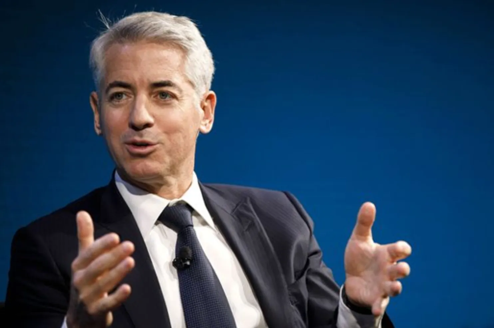
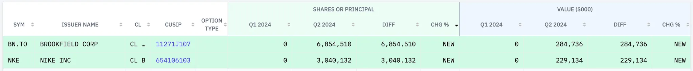
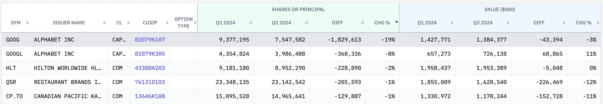
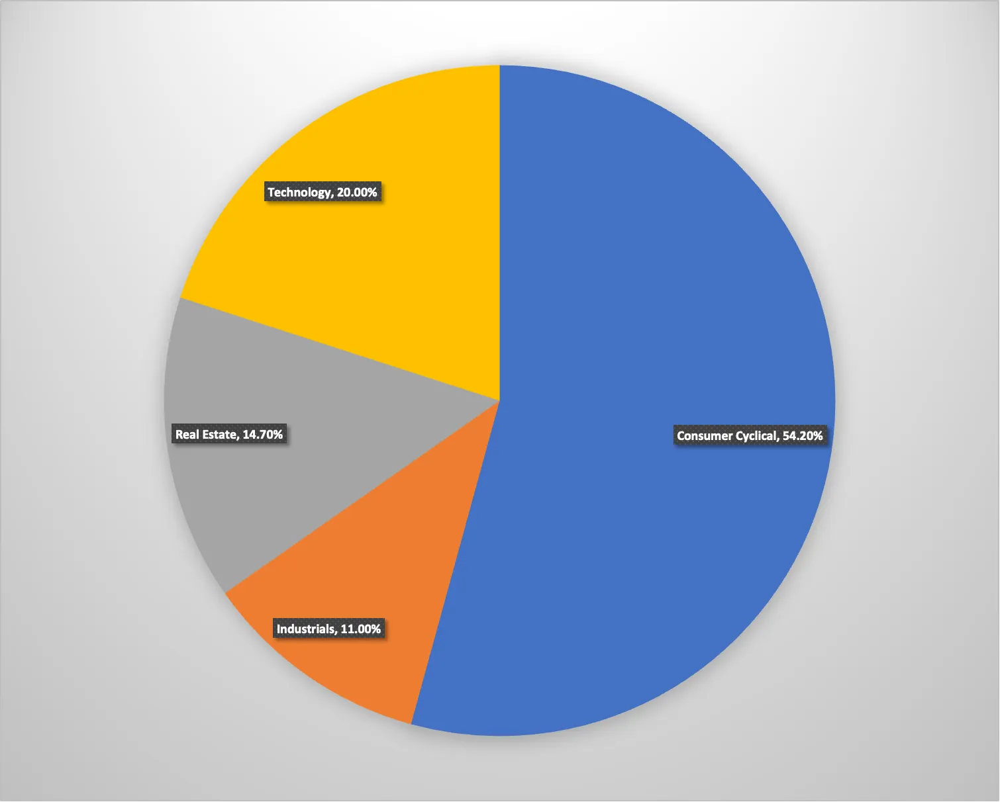

## 1. 개요

> 빌 애크먼(Bill Ackman)은 미국의 유명한 헤지펀드 매니저로, Pershing Square Capital Management의 설립자이자 CEO이다 그는 주주 활동주의 투자 전략을 사용하는 것으로 잘 알려져 있으며, 기업 경영에 적극적으로 개입해 기업 가치를 높이는 방식으로 유명하다. 대표적인 성공 사례로는 Canadian Pacific Railway와 Chipotle에 대한 투자가 있다. 하지만, Valeant Pharmaceuticals에 대한 투자 실패 등 논란이 된 투자도 있었다

## 2. 2024년 2분기 빌 애크먼 포트폴리오

공개된 2024년 2분기 빌 애크먼 포트폴리오에 대해서 알아보자.

### 2.1 1Q 2024 vs 2Q 2024 변경사항

2024년 2분기에 빌 애크먼은 포트폴리오에 몇 가지 중요한 변화를 주었다.

- 새로 추가한 종목
  - 올해 2분기에 새로 추가된 종목은 BN.TO와 NKE 두 종목이다.
  - `BN.TO`(Brookfield Corporation): 글로벌 자산 관리 및 투자 회사로, 인프라, 부동산, 재생 가능 에너지 등 다양한 자산에 투자하며 운영하는 기업이다

- 비중을 줄인 종목
  - 포트폴리오에서 비중을 많이 종목은 `GOOG`, `GOOGL`(Google) 기술주이고 나머지 종목, `HLT`(Hilton Worldwide Holdings Inc), `QSR`(Restaurant Brands International Inc), `CP.TO`(Canadian Pacific Kansas City Ltd)은 1~2% 정도로 비중을 줄였다

- 추가로 매수한 종목
  - 추가로 매수한 종목은 없다
- 청산한 종목
  - 완전히 매도한 종목은 없다

### 2.2 포트폴리오 섹터별 비중 분석 (상위 30종목)

빌 아크만은 다른 대가들보다 적수의 종목을 보유하고 있다. 포트폴리오에서 가장 큰 비중을 차지하는 섹터는 Consumer Cyclical, Technology, Real Estate 순대로 차지를 하고 있다.

| 섹터              | 비중   | 개수 |
| ----------------- | ------ | ---- |
| Consumer Cyclical          | 54.20% | 4    |
| Industrials       | 11.00% | 1    |
| Real Estate       | 14.70% | 2    |
| Technology        | 20.00% | 2    |

### 2.3 전체 포트폴리오 목록

|      | 티커                  | 회사명                       | 섹터              | 비중  | 보유 총금액 | 보유 주식  | 비고                                                         |
| ---- | --------------------- | ---------------------------- | ----------------- | ----- | ----------- | ---------- | ------------------------------------------------------------ |
| 1    | `HLT`                 | HILTON WORLDWIDE HLDGS INC   | Consumer Cyclical | 19%   | 1,953,389   | 8,952,290  | 글로벌 호텔 체인인 힐튼 브랜드의 운영사                      |
| 2    | `CMG`                 | CHIPOTLE MEXICAN GRILL INC   | Consumer Cyclical | 17%   | 1,805,270   | 28,815,165 | 미국의 멕시칸 음식 체인점                                    |
| 3    | `QSR`                 | RESTAURANT BRANDS INTL INC   | Consumer Cyclical | 16%   | 1,628,540   | 23,142,542 | 버거킹(Burger King), 팀 호튼스(Tim Hortons), 파파이스(Popeyes) 등의 글로벌 패스트푸드 브랜드를 소유하고 운영하는 회사 |
| 4    | `GOOG`                | ALPHABET INC                 | Technology        | 13%   | 1,384,377   | 7,547,582  |                                                              |
| 5    | `HHH`                 | HOWARD HUGHES HOLDINGS INC   | Real Estate       | 12%   | 1,221,990   | 18,852,064 | 부동산 개발 및 관리에 중점을 둔 미국의 부동산 기업           |
| 6    | `CP.TO` | CANADIAN PACIFIC KANSAS CITY | Industrials       | 11%   | 1,178,244   | 14,965,641 | 캐나다와 미국 간 철도 운영사로, 북미의 중요한 물류 연결망을 제공 |
| 7    | `GOOGL`               | ALPHABET INC                 | Technology        | 7.00% | 726,138     | 3,986,488  |                                                              |
| 8    |`BN.TO` | BROOKFIELD CORP              | Real Estate       | 2.70% | 284,736     | 6,854,510  | 글로벌 자산 관리 및 투자 회사로, 인프라, 부동산, 재생 가능 에너지 등 다양한 자산에 투자하며 운영하는 기업 |
| 9    | `NKE`                 | NIKE INC                     | Consumer Cyclical | 2.20% | 229,134     | 3,040,132  |                                                              |

## 3. 마무리

빌 애크먼은 주로 자산을 유지하면서 몇몇 주요 종목에서 비중을 줄이는 방식으로 포트폴리오를 조정했다. 눈에 띄는 변화는 기술주를 많이 매각한 점으로, 이는 AI로 인해 급등한 주식을 처분한 것으로 보인다. 또한 19% 하락한 나이키 종목을 6년 만에 다시 매수한 것을 보면, 나이키를 저가 매수 기회로 판단한 것으로 보인다.

## 4. 참고

- ['리틀 버핏' 빌 애크먼, 분산투자는 없다…소매주 대거 매도](https://www.hankyung.com/article/202402181125i)
- [애플·구글 던지고 실탄 마련하더니…요즘 이 주식에 꽂힌 월가 큰손들](https://www.mk.co.kr/news/stock/11100398)
