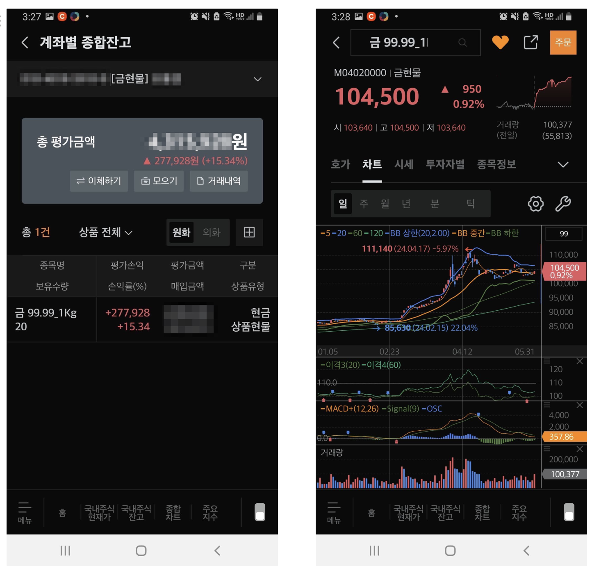

## 개요

리스크 관리를 위해 안전자산으로 금 투자는 거의? 필수 항목이 아닌가 싶다. 개인 포트폴리오에도 항상 금은 필수로 매매한다.

## 금 투자하는 방법

금 투자는 크게 2가지 방식으로 투자할 수 있다.

- 골드바를 사는 금 현물 투자
- 금 관련 ETF를 매수해서 하는 금 투자

### 1. 금 현물에 직접 투자하는 방법

골드바를 사려면, 금 현물 계좌를 만들어야 한다. 다른 증권사도 비슷하겠지만, 미래에셋 기준으로 설명하면, MTS, HTS로 금 현물 계좌를 바로 만들 수가 없다. 미래에셋 영업점을 방문해서 계좌를 개설한다.

> 미래에셋 사이트 설명에는 유선으로도 계좌개설이 가능하다고 되어 있는데, 저는 증권사가 가까워서 직접 영업점 방문해서 개설했다.
>

- 매매차익에 대해서는 비과세 적용이 된다
- 부가세가 없다. (실물 인출하기 전까지)
  - 금 실물 보관기관인 한국예탁결제원에 혼합보관 중인 골드바를 인출하고자 하는 경우에는 10%를 부가가치세로 납부를 해야 한다
- 금은 현물을 가지고 있다고 해서 배당이나 이자가 나오지 않는다
- 매매 수수료
  - 오프라인: 0.45%
  - 온라인: 0.15% (HTS)
  - 수수료에 관한 자세한 상황은 [여기](https://securities.miraeasset.com/hki/hki3032/n02.do)를 참고해주세요

### 2. 금 ETF에 투자하는 방법

금 ETF 투자는 별도 계좌(ex. 금 현물)을 개설할 필요 없이 손쉽게 투자 가능하고 현물을 따로 보관해야 할 필요도 없다. 금 ETF도 세금이 붙는다. 금 ETF는 수익의 15.4%가 배당소득세로 부과된다. 연금저축, IRP, ISA 계좌를 활용하면 과세 부담 또한 최소화 할 수 있다.

- 국내주식
  - `132030` KODEX 골드선물(H)
  - `319640` TIGER 골드선물(H) ← 제가 매매하는 종목
  - `225130` KINDEX 골드선물 레버리지
  - `280940` KODEX 골드선물 인버스
    - 골드 하락에 투자하고 싶은 경우
- 해외 주식
  - 유의사항은 달러로 환전을 해서 투자를 해야 해서 환율에 따라 수익률이 달라질 수 있다
  - 해외주식으로 포함되기 때문에 연 수익 250만원 초과하는 수익이 발생하면 22% 양도소득세를 내야 한다
  - `GLD`
  - `IAU` ← 제가 매매하는 종목
    - 주당 가격이 GLD에 비해서 낮아서 접근하기 쉽고 운용수수료도 GLD보다 더 저렴하다

### 3. 금 투자 세금에 대한 정리

- 금 현물
  - 금 현물은 매매차익에 대한 양도소득세와 배당소득세가 면제가 된다
  - 골드바를 인출할 때는 10%의 부가가치세가 붙는다. 또 개당 2만원 정도의 인출 비용이 든다
- 금 ETF
  - 매매차익에 대해서는 15.4%의 배당소득세를 부과한다
  - 그래서, 세금 해택을 받는 계좌(ex. 연금저축, IRP, ISA)를 이용하는 게 좋다

### 4. 미래에셋에서 금현물 계좌에서 매매하는 방법

금현물 계좌가 개설이 되면 `계좌` > `금현물` 선택하고 종목 목록에서 금을 선택하면 기존 주식 매매하는 것처럼 동일하게 확인할 수 있다.

## 마무리

안전자산으로 금은 필수 항목으로 포트폴리오에 들어간다. 개인적으로 아래 종목을 선택해서 매매매를 하고 있다.

- `금현물`
- `319640` TIGER 골드선물(H)
- `IAU`

## 참고

- [금에 투자해야 할까?](https://brunch.co.kr/@code-investor/7)
- [금현물투자](https://securities.miraeasset.com/imf/300/imf701.do)
- [금현물 시장 매매거래](https://securities.miraeasset.com/hki/hki3032/n02.do)
- [근, 현물 ETF로 투자하세요](https://www.frism.io/geum/)
- [금 투자했다 세금·수수료에 놀랐다고?…그렇다면 여기서 사세요 [신화!머니?]](https://www.mk.co.kr/news/stock/10649867)