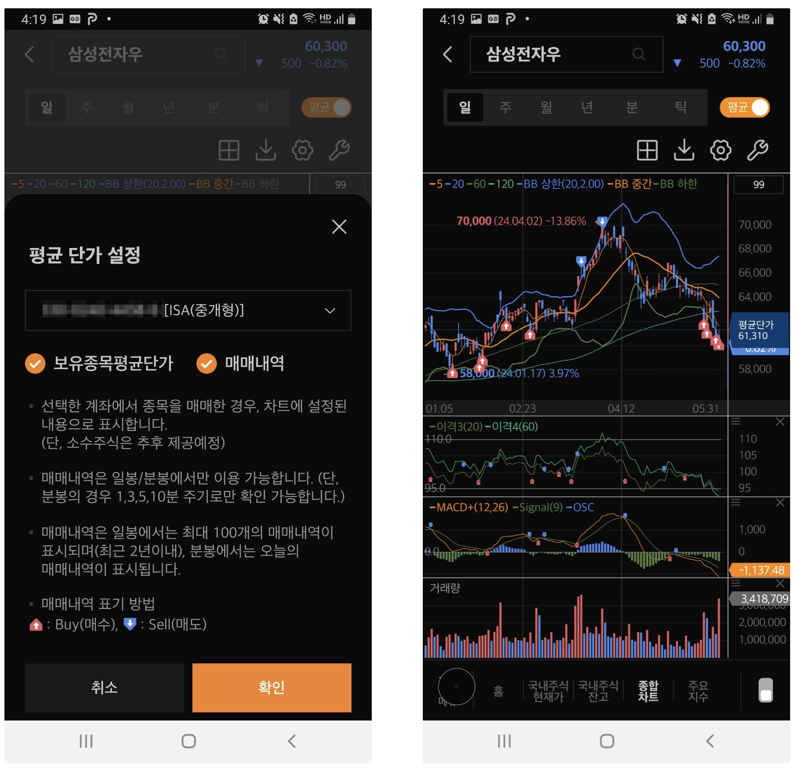
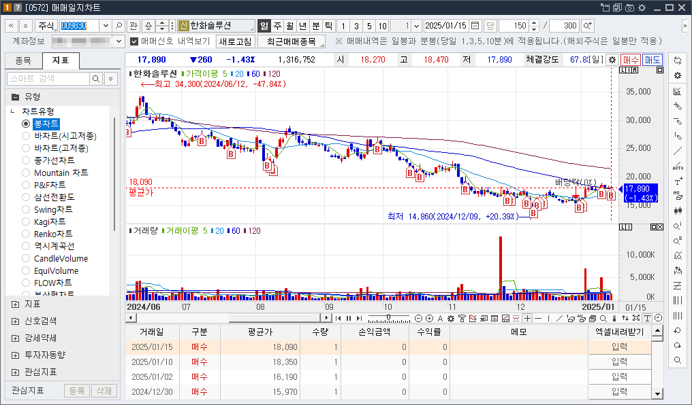

## 1. 개요

차트에서 실제로 내가 매수하고 매도한 부분을 표시해주고 싶을 경우 어떻게 설정할 수 있는 지 알아보자. 개인적으로 주 거래로 사용중인 미래에셋 MTS 기준으로 설명한다.

## 2. 차트에서 매매내역 표시하기

### 2.1 MTS에서 매매내역 확인하는 방법

1. MTS 실행하고 표시해주고 싶은 주식 종목을 선택한다.
2. 차트를 크게 확대할 수 있는 버튼을 클릭 > `평균` 옵션을 선택한다

3. 보고 싶은 `매매내역`, `보유종목평균단가` 옵션을 클릭호 확인 버튼을 클릭한다

보시는 것처럼 차트에서 언제 팔고 샀는지 볼 수 있다.

### 2.2 HTS에서 매매내역 확인하는 방법

HTS에서 차트에서 매매내역 표시는 `0572` 매매일지차트에서 쉽게 확인할 수 있다. 

## 3. 참고

- [주식차트 주식매수 매도 매매내역 표시하는 방법](https://blog.naver.com/sdedy/223032300014)

