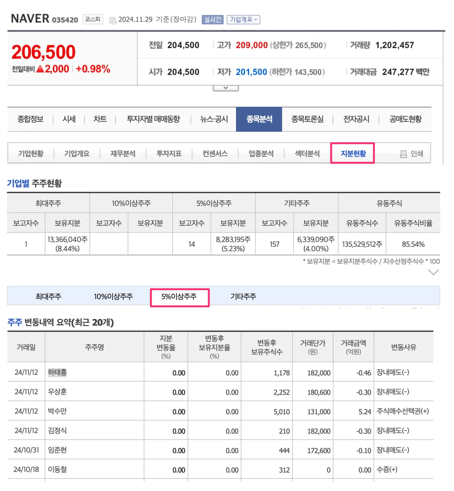
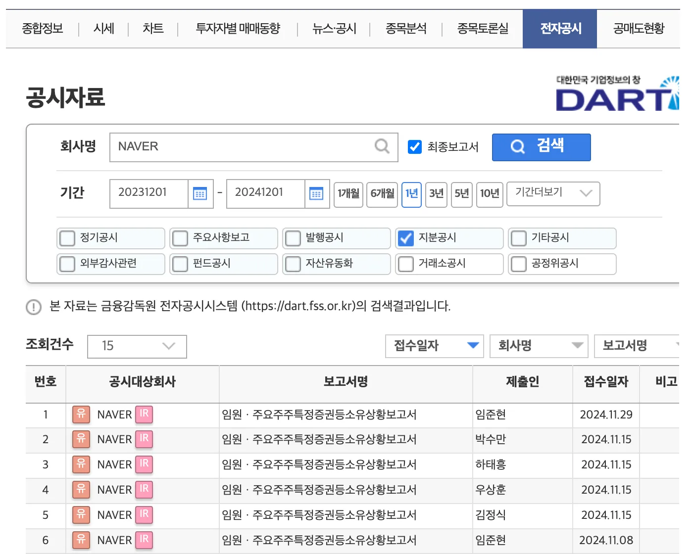

## 1. 개요

일반 투자자가 주식을 매수하거나 매도하면 그 사실을 공시하거나 다른 사람에게 알릴 의무는 없다. 하지만 특정한 주주들, 특히 기업의 경영에 영향을 미칠 수 있는 중요한 주주들은 이 매매 사실을 반드시 공시해야 한다. 어떤 주주들이 매매 사실을 반드시 알려야 하고 왜 그런지 알아보자.

## 2. 매매사실을 꼭 알려야 하는 투자자들은 누구?

### 2.1 5% 이상 지분 보유자

특정 기업의 주식을 5% 이상 보유한 투자자(개인 또는 법인)는 대주주로 간주되어 매매 사실을 금융감독원의 전자공시([DART](https://dart.fss.or.kr/))를 통해 알려야 한다.

[네이버 금융](https://finance.naver.com/item/coinfo.naver?code=035420) 사이트에서 `종목분석` > `지분현황` 에서 주주 변동 내역을 쉽게 확인할 수 있다.

### 2.2 임원 및 주요 주주

회사의 임원, 감사, CEO, CFO와 같은 경영진 임원들도 매매 사실을 공시해야 한다. 임원 및 주요 주주(일정 비율 이상 지분을 보유한 투자자)이 제출한 보고서는 전자공시에서 확인할 수 있다.

### 2.3 공시해야 하는 이유

임원 및 주요 주주는 기업 내부 정보를 접할 가능성이 크고 내부 정보에 근거해 거래가 이루어질 가능성을 방지하기 위해 공시 의무가 부여되었다. 매매 규모와 시점을 시장에 알리게 함으로써 일반 투자자들이 참고하여 투자할 수 있게 한 것이다. 1주라도 사고 팔았을 경우 5영업일 이내에 공시를 해야 한다.

## 3. 마무리

일반 투자자들에게 내부자 거래 정보는 매우 중요한 참고 자료가 될 수 있다. 주요 주주나 임원의 매매 내역은 해당 기업의 미래 전망에 대해 중요한 힌트를 제공할 가능성이 높기 때문에 전자공시에 의무적으로 매매내역을 제출해야 한다.
