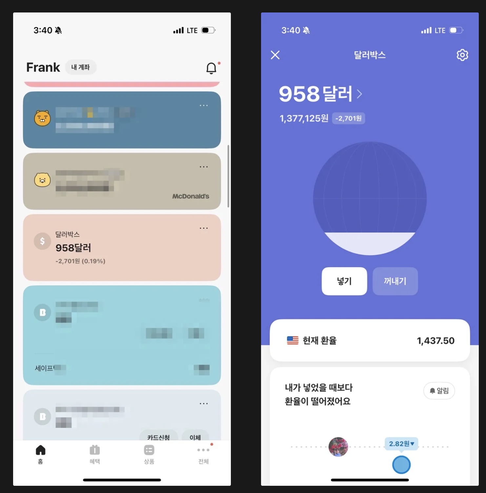
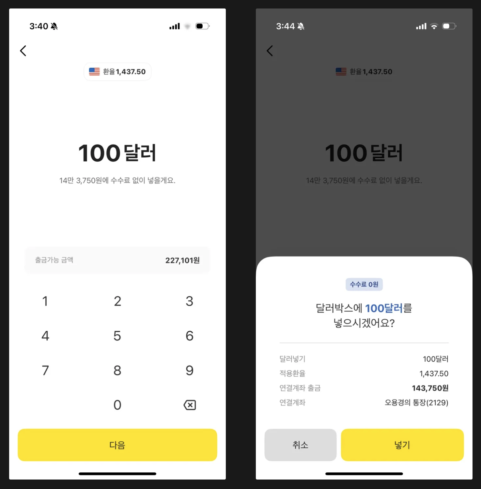
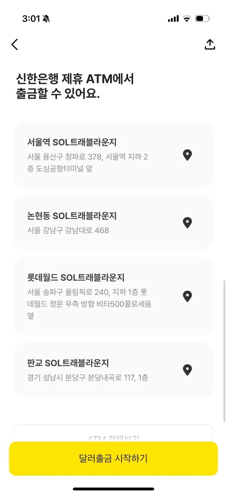
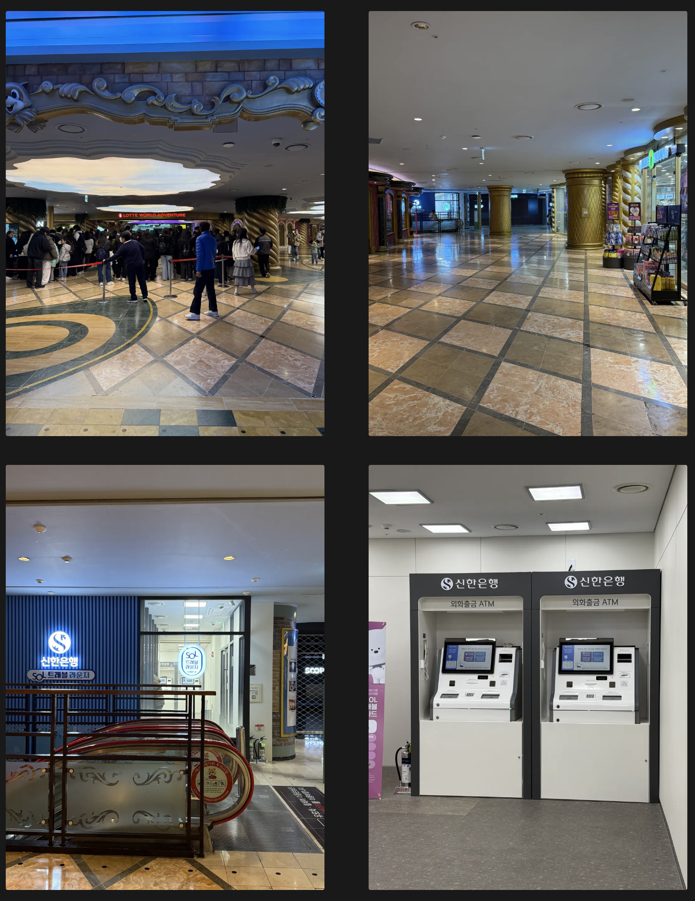
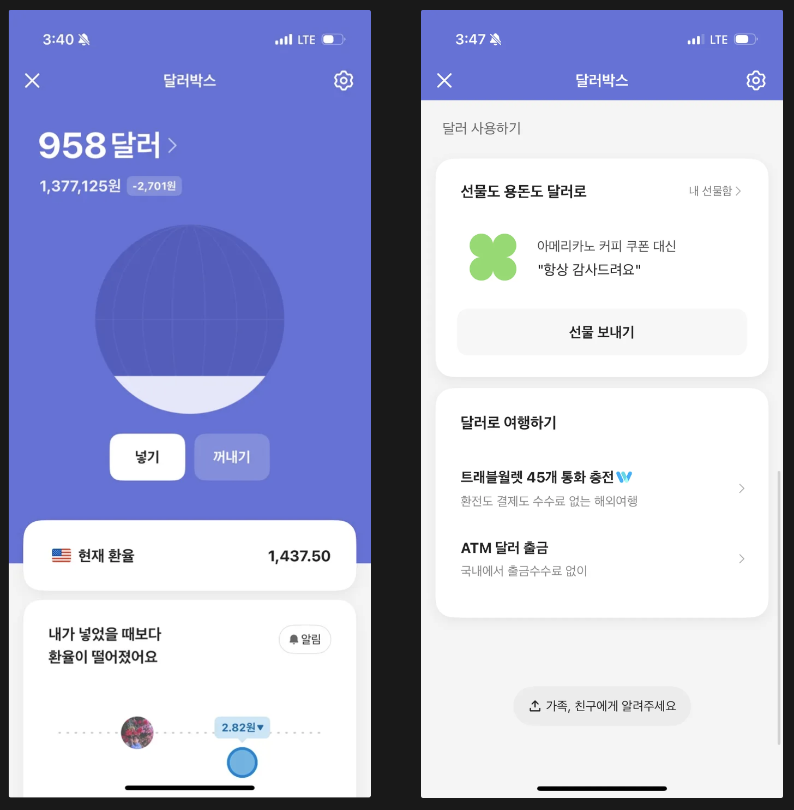
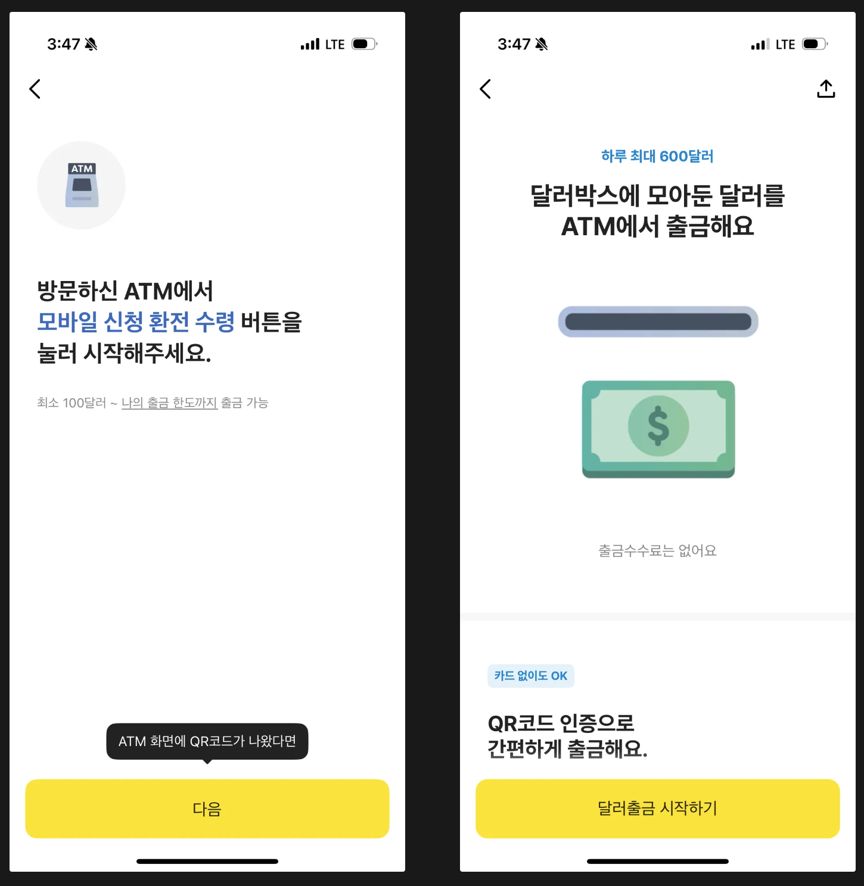
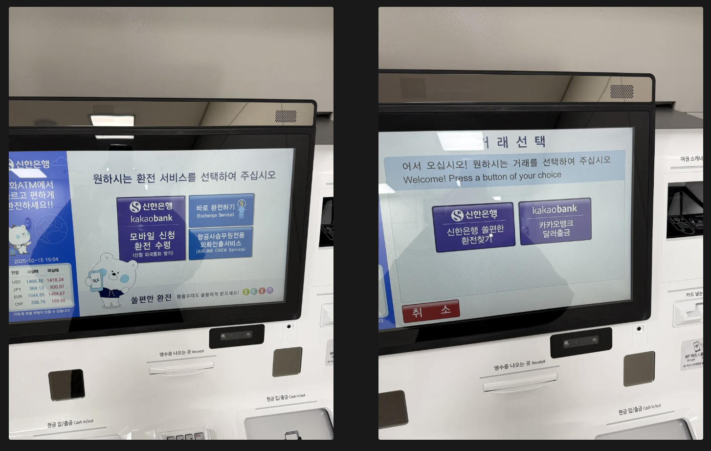
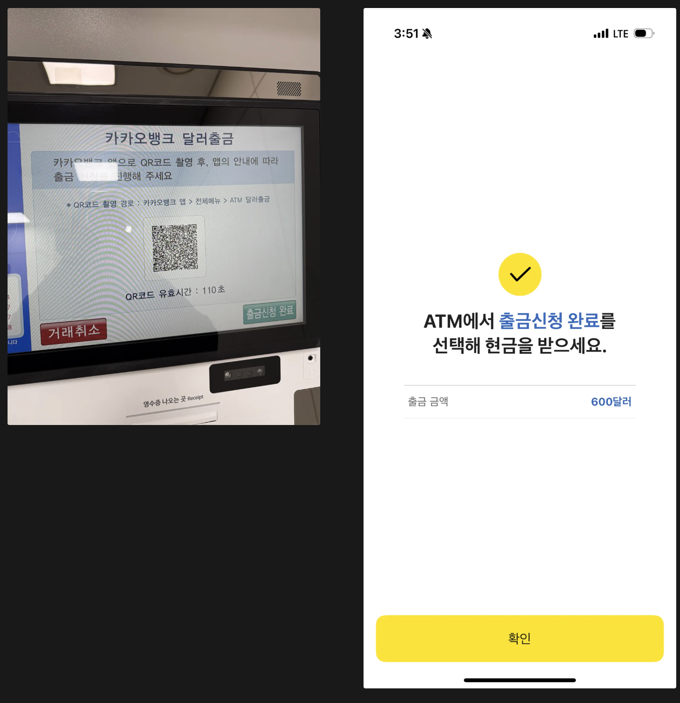
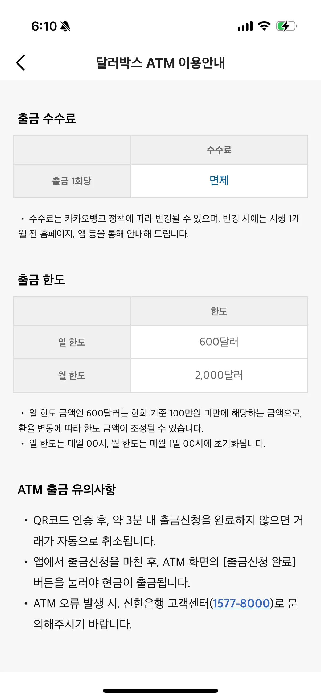

## 1. 개요

카카오뱅크의 달러박스 서비스는 해외 주식을 거래하거나 달러를 직접 인출할 때 매우 유용한 기능이다. 특히 환전 수수료가 무료이기 때문에 달러를 환전할 때 부담이 적고, 적절한 시기에 미리 달러를 확보해둘 수도 있다. 이 글에서는 카카오뱅크 달러박스를 활용해 달러를 환전하고, ATM에서 직접 출금하는 방법까지 자세히 알아본다.

## 2. 달러 ATM에서 인출하기

### 2.1 달러박스에 넣기

카카오뱅크의 달러박스는 쉽게 달러가 내려갔는지도 알수 있고 알람으로도 환율변동에 대해서 놓지 않게 도와주어 미리 달러를 사두기 좋은 기능을 제공한다. 그래서 개인적으로 여유돈이 생기면 조금씩 50, 100 달러 단위로 매입을 하고 있다.

달러 사는 방법은 다음과 같다.

> 달러박스가 없는 경우에는 전체 메뉴에서 달러박스 클릭하고 달러박스 만들기 버튼을 클릭해서 진행하면 된다.

`달러박스` > `넣기` 버튼 클릭하고 환전할 달러를 입력한다.

최종적으로 `넣기` 버튼을 클릭하면 달러를 매입하게 된다.

### 2.2 가까운 ATM 찾아가기

카카오뱅크의 달러 인출이 가능한 ATM은 서울과 경기도 일부 지역에서만 이용 가능하다. 따라서 출금이 필요할 경우 가까운 ATM을 미리 확인하고 방문하는 것이 좋다.

> 처음 방문하는 경우 ATM의 위치를 찾기 어려울 수 있으므로, 카카오뱅크 앱에서 제공하는 지도를 활용하면 편리하다. 달러 출금할 수 있는 전체 ATM는 카카오뱅크 앱에서 확인할 수 있다.

### 롯데월드 SOL 트래블라운지

> 집과 가까운 롯데월드 SOL 트래블 라운지에서 달러를 인출해보았다. 롯데월드 내부에 있어서 처음 방문하면 길을 헤맬 수도 있어 기록 차원에서 남겨둔다.
>
> 롯데월드 입구에서 사진과 같이 오른쪽으로 빠지면 올리브 영을 가게를 볼 수 있고 더 들어가면 아이스링크 장으로 내려가는 에스켈레이터를 찾으면 쉽게 신한은행 ATM도 찾을 수 있을 것이다.

### 2.3 ATM에서 인출하기

달러박스에 매입한 달러는 ATM 에서 인출을 해보자.

#### (1) 카카오뱅크 앱에서 출금 시작하기

먼저 카카오뱅크 앱을 실행하고 다음 순서대로 진행하면 된다.

`달러박스` 메뉴 선택 > 아래로 스크로하고 `ATM 달러 출금` 클릭을 한다.

`다음` 버튼 클릭 > `달러출금 시작하기` 버튼을 클릭해서 QR 코드 스캔 준비를 한다.

#### (2) ATM 화면에서 이어서 진행

ATM 화면에서 `모바일 신청 환전 수령` 클릭 > 거래 선택에서 `카카오뱅크 달러출금`을 선택한다

ATM에서 생성된 QR 코드를 핸드폰에서 스캔하고 `출금신청 완료`를 클릭하면 ATM에서 달러를 출금하게 된다.

## 3. 마무리

카카오뱅크 달러박스를 이용하면 **환전 수수료 없이** 달러를 저렴하게 환전할 수 있으며, 필요한 경우 ATM에서 손쉽게 현금으로 인출할 수 있다. 다만, 출금 한도 및 수수료도 존재를 한다. 관련 내용도 카카오뱅크 앱에서 확인할 수 있다.

### 출금 한도 및 수수료

- 하루 출금 한도: `$600`
- 월 출금 한도: `$2,000`

카카오뱅크 달러박스를 적극적으로 활용하면 유리한 환율에 미리 환전하고, 필요할 때 현금으로도 사용할 수 있어 매우 편리한 금융 서비스이다. 해외 주식 투자나 여행을 준비하는 분들에게 추천한다.

## 4. 참고

- [카카오뱅크 달러박스 달러환전 수수료 무료 ATM 기기 직접 인출하기](https://blog.naver.com/heunggeuli/223499833456?trackingCode=rss)
- [카카오뱅크 달러박스](https://www.kakaobank.com/products/dollarbox)
