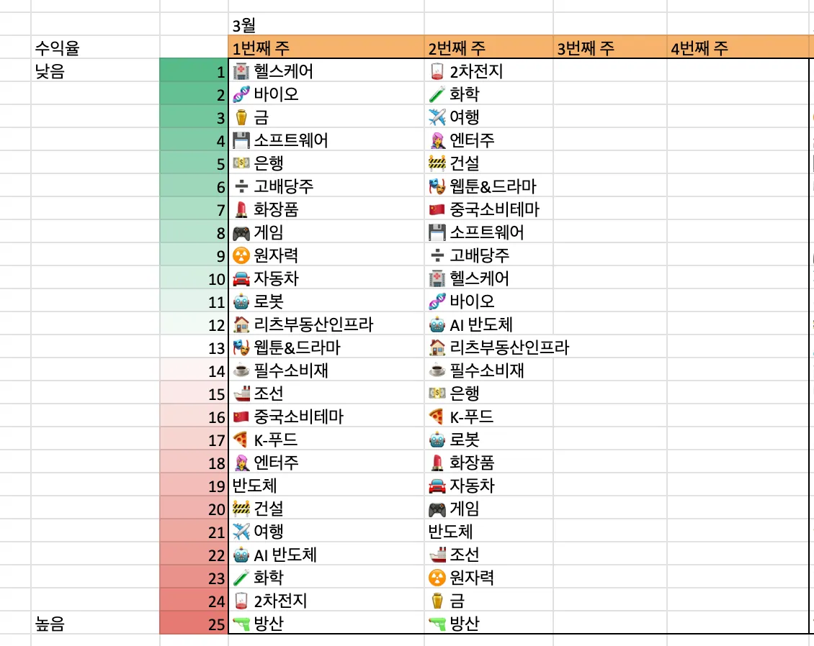
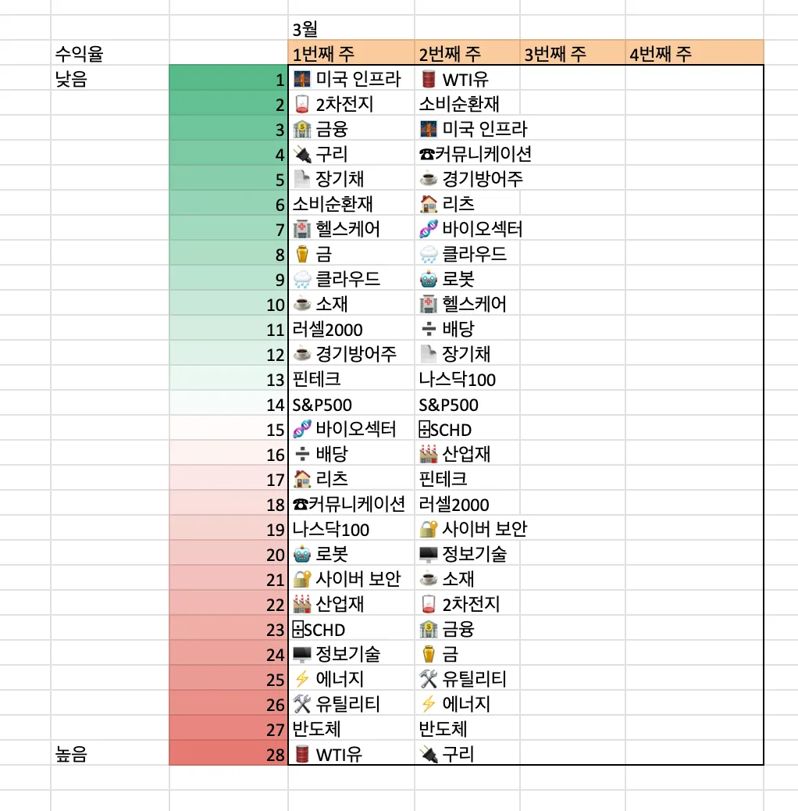
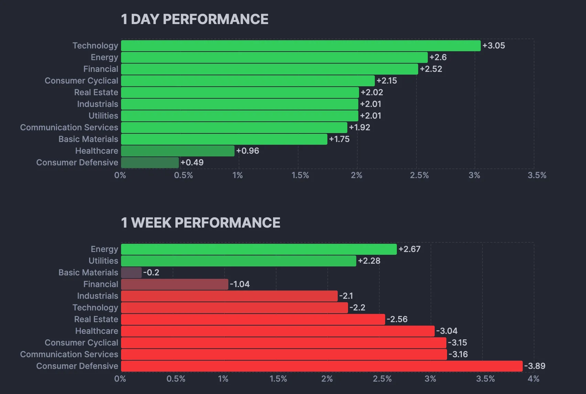
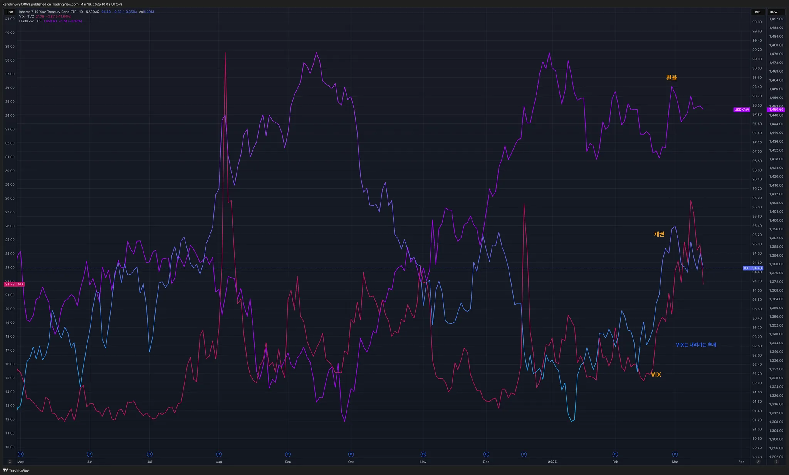
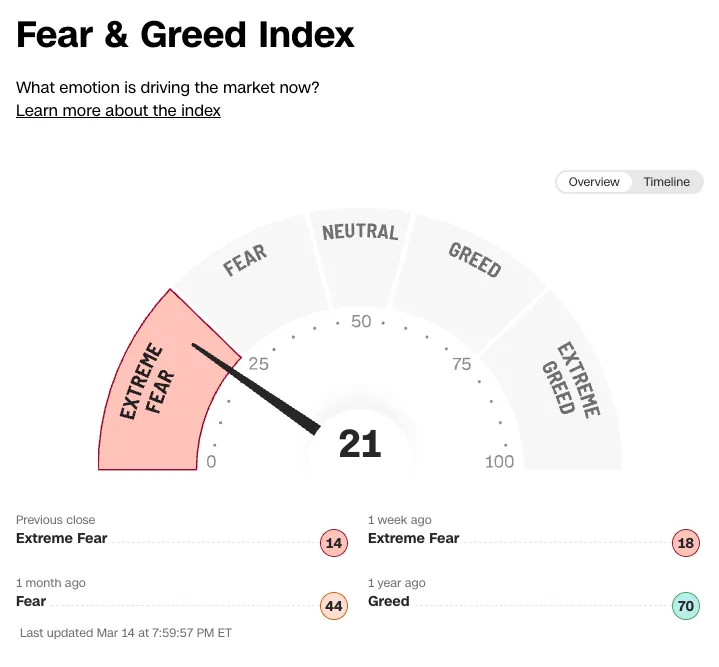
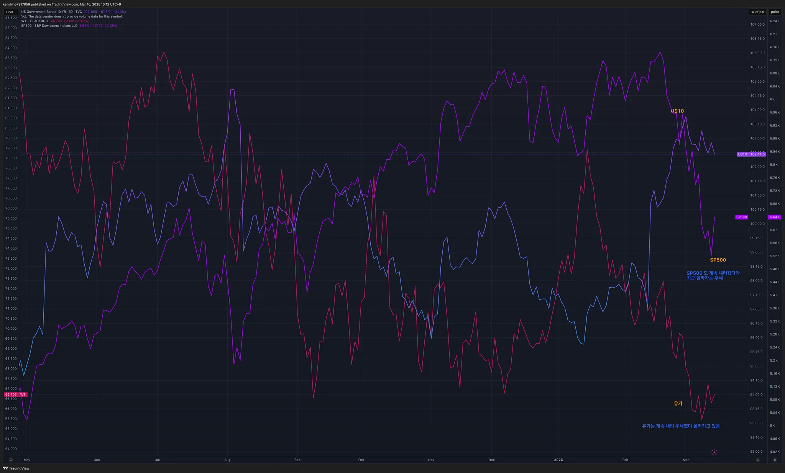
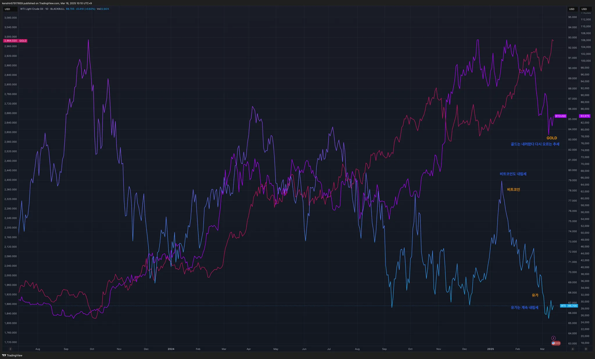

## 섹터별 수익률

> ETF 수익률을 기준으로 섹터별 수익률을 정렬하고 시간이 지남에 따라 현재 시장에서 주목받는 섹터가 무엇인지 파악하기 위해 아래와 같이 수익률을 정리해보았다.
>
> 단순히 수익률 기준으로 정렬을 하고 있어서 해당 섹터가 시장에서 가장 주목 받고 있다고 단정하기는 어렵지만, 투자하는 데 참고 지표로 사용하면 될 것 같다.

## 1. 국내 ETF

### 섹터별 ETF 종목

| **섹터** | **종목**               | **섹터**      | **종목**              |
| ---------- | ---------------------- | ----------------- | ---------------------- |
| 🔫방산      | PLUS K방산             | ☕️필수소비재       | KODEX 필수소비재       |
| ☢️원자력    | HANARO 원자력iSelect   | 🎮게임             | KBSTAR 게임테마        |
| ⚱️금        | ACE KRX금현물          | 🏠리츠부동산인프라 | TIGER 리츠부동산인프라 |
| 🏥헬스케어  | TIGER 헬스케어         | 💾소프트웨어       | TIGER 소프트웨어       |
| 🚢조선      | HANARO Fn조선해운      | 🍕K-푸드           | HANARO Fn K-푸드       |
| 🤖로봇      | KODEX K-로봇액티브     | ✈️여행             | TIGER 여행레저         |
| 👩‍🎤엔터주   | HANARO Fn K-POP&미디어 | 🇨🇳중국소비테마    | TIGER 중국소비테마     |
| ➗고배당주  | PLUS 고배당주          | 🚘자동차           | KODEX 자동차           |
| 💵은행      | KODEX 은행             | 반도체            | KODEX 반도체           |
| 🚧건설      | TIGER 200 건설         | 💄화장품           | TIGER 화장품           |
| 🧬바이오    | KODEX 바이오           | 🎭웹툰&드라마      | KODEX Fn웹툰&드라마    |
| 🪫2차전지   | TIGER 2차전지테마      | 🤖AI 반도체        | TIGER AI반도체핵심공정 |
|            |                        | 🧪화학             | KODEX 에너지화학       |

## 2. 미국 ETF

### 섹터별 ETF

| 섹터         | **티커** | **섹터**      | **티커** |
| ------------ | -------- | ------------- | -------- |
| 🤖로봇        | BOTZ     | 핀테크        | FINX     |
| 🌧️클라우드    | CLOU     | 소비순환재    | XLY      |
| 🏥헬스케어    | XLV      | 🧬바이오섹터   | IBB      |
| ⚱️금          | GLD      | ⌹SCHD         | SCHD     |
| 🏭산업재      | XLI      | 🏦금융         | XLF      |
| ⚡️에너지      | XLE      | S&P500        | VOO      |
| 러셀2000     | IWM      | ☕️경기방어주   | XLP      |
| 🔌구리        | COPX     | 🔐사이버 보안  | CIBR     |
| 🌉미국 인프라 | PAVE     | ☕️소재         | XLB      |
| 🏠리츠        | XLRE     | 반도체        | SOXX     |
| 🛢️WTI유       | CL       | 🖥️정보기술     | XLK      |
| 🛠️유틸리티    | XLU      | 나스닥100     | QQQ      |
| 📄장기채      | TLT      | ☎커뮤니케이션 | XLC      |
| ➗배당        | DIA      | 🪫2차전지      | LIT      |

## 3. 주요 지표

### 3.1 환율, 채권, VIX

- 이번주 내내 공포구간에 머무르고 있다. 언제까지 이어질지는 모르지만, 이 구간에서 매수를 하는게 중요하다
  - 더 길어질 수도 있지만, 트럼프 입장에서도 너무 길어지면 압박을 받지 않을 까도 싶다
  - 너무 많이 한번에 매수하지는 않더라도 조절하면서 꾸준히 매수를 필요한 구간이다

### 3.2 S&P500, US10, WTI유가

- 유가, S&P500은 계속 내림세를 유지하고 있다

### 3.3 BTC, GOLD, WTI

- 이번주에 있던 가상화폐 서밋 개최로 급등할 걸 기대했지만, 실망이 큰 나머지 비트코인은 내림세로 전환을 했다

## 4. 주요 트렌드 정리

### 주요 일정 (3/17 ~ 3/21)

|      | 월                                                           | 화                                       | 수   | 목                                                         | 금             |
| ---- | ------------------------------------------------------------ | ---------------------------------------- | ---- | ---------------------------------------------------------- | -------------- |
| 일정 | 🇺🇸 엔비디아 GTC 개회 (17~21) 🇺🇸 소매판매 🇰🇷 농심 가격인상 | 🇺🇸 산업생산 지표 🇺🇸 젠승황 기조연설 |      | 🇺🇸 Fed 금리결정일 (동결유력) 🇺🇸 필라델피아 제조업 지수 | 🇺🇸 투자 만기일 |
| 실적 |                                                              | 🇨🇳 샤오미                                |      | 🇺🇸 FDX 🇺🇸 NKE 🇺🇸 MU 🇺🇸 LEN                     |                |

- 🇰🇷 상법 개정안 국회 본회의로 통과가 됨
  - 단, 1년 이후에 적용된다고 함
- 🇰🇷 탄핵심판 선고 날짜는 아직 미정이지만,  이번주가 가장 유력할 것으로 기대됨
- 🇺🇸 3/21(금) 마녀의 날
  - 투자 만기일로 변동서이 클 수 있다
  - 한국 시간 기준으로는 그 다음 날 토요일이 된다
- 🇺🇸 이번주는 FOMC의 금기 발표가 예정되어 있고 금기는 동결로 마무리될 걸로 기대를 하고 있음
- 🇺🇸 엔비디아 GTC 컨퍼런스가 예정이 되어 있음
  - Nvidia의 차세대 AI 칩인 Rubin이 공개될 예정인데, 작년 Blackwell 공개 행사에서는 GTC가 AI HW 섹터의 Sell-on 이벤트로 마무리되었던 바 있었음

## 5. 참고

- [증시일정](https://securities.miraeasset.com/hkr/hkr1003/n13.do)
- [한국 결제캘린더](https://kr.investing.com/economic-calendar/)
- [증시일정](https://datamall.koscom.co.kr/kor/checkCalendar/view.do?menuNo=200085)
- [욕심과 탐욕, 투자할 때 반드시 구별해야 하는 2가지 입니다ㅣ김탁 밸류시스템자산운용 상무](https://www.youtube.com/watch?v=N5aUiQEd9Ig)
- [네 마녀의 날 언제?](https://contents.premium.naver.com/aware/media/contents/250204210158252ee)
- [연수르 해외주식](https://contents.premium.naver.com/yeonssour/investment)
