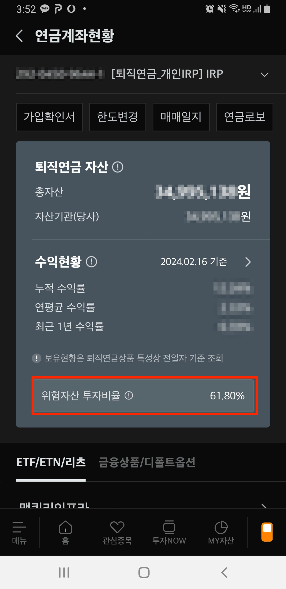
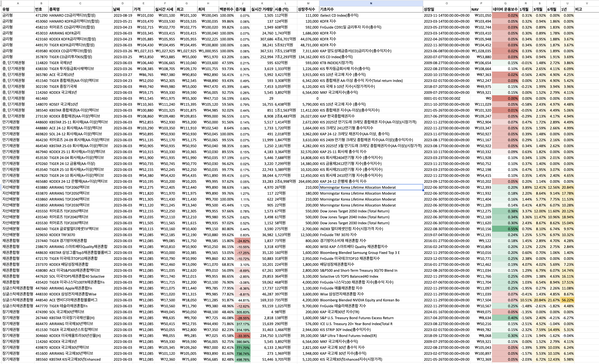

## 들어가며

IRP (Individual Retirement Pension) 개인형퇴직 연금제도는 근로자가 직장을 옮기거나 퇴직하면서 지급받은 퇴직급여를 한 계좌로 모아 퇴직이후에 사용할 수 있도록 하는 퇴직 연금 전용 계좌이다.

연금저축 펀드와 달리 IRP에서는 운용상품 구성에 제약사항이 걸려있다. 위험자산 (ex.주식형 자산)은 최대 70%만 투자가 가능해서 나머지 30%는 안전자산으로 채워야 한다. 즉 전체적으로 밸런스 있는 투자 포트폴리오를 구성하라는 취지가 담겨 있다.

미래에셋증권에서는 `MY 자산` > `계좌` > `퇴직연금_개인IRP` 선택을 하면 아래와 같이 현재 `위험자산 투자비율`을 확인할 수 있다. 70%가 넘는 경우에는 위험자산인 주식형 ETF를 매수할 수가 없게 된다.

## 안전자산 종류

IRP 계좌에서 어떤 종류의 안전자산을 채울 수 있는 알아보자. 종류가 여러 가지가 있어서 투자자 성향에 따라서 선택해야 한다. 안전자산도 높은 수익률을 얻기 위한 ETF도 있고 안정적으로 운용하고 싶은 경우에 맞는 ETF도 제공을 한다.

- 안정적으로 운용하고 싶은 경우
    - `금리형`
    - `중단기 채권형`
    - `만기채권형`
    - `자산배분형`
- 공격적으로 운용하고 싶은 경우
    - `채권혼합형`
    - `싱글스탁 채권혼합형`
    - `장기채권형`

## 1. 안정적으로 운용하고 싶은 경우

### 1.1 `금리형` (파깅형)

| 티커   | 종목명                      | 시가총액      | 편드보수  |
| ------ | --------------------------- | ------------- | --------- |
| 471290 | HANARO CD금리액티브(합성)   | 112억원       | 연 0.020% |
| 453060 | HANARO KOFR금리액티브(합성) | 124억원       | 연 0.050% |
| 458210 | 히어로즈 CD금리액티브(합성) | 608억원       | 연 0.030% |
| 453010 | ARIRANG KOFR금리            | 1,813억원     | 연 0.050% |
| 423160 | KODEX KOFR금리액티브(합성)  | 4조 6,050억원 | 연 0.050% |
| 449170 | TIGER KOFR금리액티브(합성)  | 5조 880억원   | 연 0.030% |
| 459580 | KODEX CD금리액티브(합성)    | 7조 65억원    | 연 0.020% |
| 357870 | TIGER CD금리투자KIS(합성)   | 7조 2,791거원 | 연 0.030% |

> 현재 상장된 금리형 ETF (2024.02.18 기준)

#### `금리형` ETF 특징

- 양도성예금증서(CD) 91일물, 한국무위험지표금리(KOFR) 등 초단기 채권의 금리를 일할 계산해 매일 복리로 반영하는 상품이다
    - CD 금리란? 은행이 단기자금 조달 시 발행하는 양도성예금증서(CD)의 수익률이다
        - 양도성예금증서란? 은행이 예금을 맡았다는 것을 인정하는 증서이며 누구에게나 양도가 가능한다 (은행이 돈을 빌리고 쓴 `차용증` 이라고 생각하면 이해하기 쉽다)
        - CD 만기는 통상 91일몰(3개월)이며 매우 안전하다고 여겨지지만 여전히 국채보다는 위험하기 때문에 통상적으로 국채보다는 높은 수준에 금리가 형성된다
    - 한국무위험지표금리(KOFR)란?
        - 기관들간의 환매조건부채권(RP) 실거래를 기반으로 한국예탁결제원에서 산출한 금리이다
        - 익일물 국채·통화안정채권(통안채)를 담보로 하는 만큼 이름 그대로 무위험 투자에서 기대할 수 있는 수익률을 제공한다
        - 하루짜리이기 때문에 만기가 91일인 CD금리보다 안정적이지만, 기대수익률은 낮다
- 금리가 마이너스로 가지 않는 한 손실 발생 가능성이 매우 적은 ETF로 적립금을 안정적으로 운용하고자 하는 투자자에게 적합하다

#### FAQ

1. 금리형 ETF는 모두 안전한가?
    - 현재 시장에 상장된 금리형ETF 펀드 가운데 `특별자산형ETF`와 `채권혼합형ETF` 있다
    - `채권혼합형 ETF` (안전자산): DC형, IRP에 100% 투자 가능
        - ex. TIGER 1년 은행양도성예금증서액티브(합성)
    - `특별자산형 ETF` (위험자산): DC형, IRP에 70% 투자 가능
        - ex. TIGER CD금리투자KIS(합성)
2. IRP에서 투자 가능한 예금 vs 금리형 ETF
    - 예금과 달리 중도 환매가 자유롭다
        - 예금은 만기 전 환매 수수료가 발생하지만, 금리형 ETF는 매도 후에 현금화를 하는 것이니 호가 스프레드 외에는 별도 수수료가 발생하지 않는다
    - 예금은 첫 거래, 급여연동, 공과금 연동, 카드 사용, 앱 사용 등으로 우대조건이 있지만, 금리형 ETF에는 우대조건은 없다
    - 예금은 금리가 높을 수록 한도가 작지만, 금리형 ETF는 한도가 없다

참고

- [불안한 증시에 …'안전띠' 금리형ETF 인기](https://www.mk.co.kr/news/stock/10929500)
- [새해부터 1兆 몰려…각양각색 파킹형 ETF, 어디 투자할까](https://www.sedaily.com/NewsView/2D465T8T4X)

### 1.2 `중단기 채권형`

| 티커   | 종목명                        | 시가총액      | 편드보수  |
| ------ | ----------------------------- | ------------- | --------- |
| 114820 | TIGER 국채3년                 | 591억원       | 연 0.150% |
| 438330 | TIGER 투자등급회사채액티브    | 1,314억원     | 연 0.100% |
| 365780 | ACE 국고채10년                | 2,058억원     | 연 0.020% |
| 451540 | TIGER 종합채권(AA-이상)액티브 | 3,037억원     | 연 0.030% |
| 302190 | TIGER 중장기국채              | 3,026억원     | 연 0.150% |
| 114260 | KODEX 국고채3년               | 3,870억원     | 연 0.150% |
| 461460 | ARIRANG 국고채10년액티브      | 5,007억원     | 연 0.045% |
| 148070 | KOSEF 국고채10년              | 4,992억원     | 연 0.050% |
| 385540 | KBSTAR 종합채권(A-이상)액티브 | 1조 2,154억원 | 연 0.012% |
| 273130 | KODEX 종합채권(AA-이상)액티브 | 2조 8,304억원 | 연 0.045% |

> 현재 상장된 금리형 ETF (2024.02.18 기준)

#### `중단기 채권형` ETF 특징

- 잔존 만기 10년 이하의 채권 편입하여 변동성이 낮아 안정적인 상품이다
- 금리 하락시 채권 가격이 올라가니 자본 수익을 기대할 수 있는 특징이 있다

참고

- [IRP에 30% 투자가능한 ETF 어떤 것? (1) 안전형 투자자라면](http://m.viva100.com/view.php?key=20240214010003588)

### 1.3 `만기채권형`

| 티커   | 종목명                               | 시가총액      | 편드보수  |
| ------ | ------------------------------------ | ------------- | --------- |
| 448600 | KBSTAR 25-11 회사채(AA-이상)액티브   | 1,412억원     | 연 0.070% |
| 448880 | ACE 24-12 회사채(AA-이상)액티브      | 1,691억원     | 연 0.050% |
| 469820 | SOL 24-12 회사채(AA-이상)액티브      | 2,029억원     | 연 0.050% |
| 464230 | 히어로즈 24-09 회사채(AA-이상)액티브 | 1,846억원     | 연 0.050% |
| 464540 | KBSTAR 25-03 회사채(AA-이상)액티브   | 2,072억원     | 연 0.050% |
| 467940 | KODEX 25-11 회사채(A+이상)액티브     | 3,370억원     | 연 0.090% |
| 453530 | TIGER 24-04 회사채(A+이상)액티브     | 7,690억원     | 연 0.100% |
| 470260 | TIGER 24-12 금융채(AA-이상)          | 6,025억원     | 연 0.100% |
| 453540 | TIGER 25-10 회사채(A+이상)액티브     | 5,197억원     | 연 0.100% |
| 447820 | TIGER 24-10 회사채(A+이상)액티브     | 6,809억원     | 연 0.100% |
| 465680 | KODEX 24-12 은행채(AA+이상)액티브    | 2조 6,995억원 | 연 0.050% |

> 현재 상장된 금리형 ETF (2024.02.18 기준)

#### `만기채권형` ETF 특징

- 만기가 지정된 채권형 ETF이다
- ETF 매수 후 만기까지 보유 시 개별 종목 채권에 투자한 것과 마찬가지로 투자 시점의 만기수익률과 근접한 수중의 수익률을 기대할 수 있다

### 1.4 자산배분형

| 티커   | 종목명                        | 시가총액  | 편드보수  |
| ------ | ----------------------------- | --------- | --------- |
| 433880 | ARIRANG TDF2060액티브         | 26억원    | 연 0.200% |
| 433870 | ARIRANG TDF2050액티브         | 21억원    | 연 0.180% |
| 433860 | ARIRANG TDF2040액티브         | 24억원    | 연 0.160% |
| 433850 | ARIRANG TDF2030액티브         | 22억원    | 연 0.140% |
| 435550 | 히어로즈 TDF2050액티브        | 67억원    | 연 0.380% |
| 435540 | 히어로즈 TDF2040액티브        | 61억원    | 연 0.340% |
| 435530 | 히어로즈 TDF2030액티브        | 58억원    | 연 0.300% |
| 440340 | TIGER 글로벌멀티에셋TIF액티브 | 273억원   | 연 0.550% |
| 329650 | KODEX TRF3070                 | 1,516억원 | 연 0.240% |

> 현재 상장된 금리형 ETF (2024.02.18 기준)

- 채권을 중심 (약 70%)으로 다양한 자산군을 혼합해 변동성을 낮춘 포트폴리오를 운영한다
- 시장 상승기에 안정적인 수익률 창출 목적으로 운용되는 상품이다

## 2. 공격적으로 운용하고 싶은 경우

### 2.1 `채권혼합형`

| 티커   | 종목명                              | 시가총액 | 편드보수  |
| ------ | ----------------------------------- | -------- | --------- |
| 238670 | ARIRANG 스마트베타Quality채권혼합   | 43억원   | 연 0.200% |
| 237440 | TIGER 경기방어채권혼합              | 73억원   | 연 0.180% |
| 251600 | ARIRANG 고배당주채권혼합            | 154억원  | 연 0.200% |
| 448630 | KBSTAR 삼성그룹Top3채권혼합블룸버그 | 160억원  | 연 0.200% |
| 472170 | TIGER 미국테크TOP10채권혼합         | 312억원  | 연 0.250% |
| 237370 | KODEX 배당성장채권혼합              | 226억원  | 연 0.190% |
| 438080 | ACE 미국S&P500채권혼합액티브        | 308억원  | 연 0.150% |
| 447620 | SOL 미국TOP5채권혼합40 Solactive    | 364억원  | 연 0.250% |
| 435420 | TIGER 미국나스닥100TR채권혼합Fn     | 469억원  | 연 0.250% |

> 현재 상장된 금리형 ETF (2024.02.18 기준)

#### `채권혼합형` ETF 특징

- 일반적으로 주식 비중 30~40%, 채권 비중 60~70% 정도의 비중으로 구성되어 있다
    - 2023년 11월부터 채권혼합형 ETF의 주식 편입 한도가 40 → 50%로 상향되었다
        - ex. TIGER 미국테크TOP10채권혼합 (재도 변경후 상장됨)
    - 현재 대부분의 채권혼합형 ETF는 한도 상향 전에 상장된 것들이라 주식 비중이 30% 내외다

참고

- [IRP에 30% 투자가능한 ETF 어떤 것? (2) 공격형 투자자라면](http://m.viva100.com/view.php?key=20240214010003973)

### 2.2 `싱글스탁 채권혼합형`

| 티커   | 종목명                       | 시가총액  | 편드보수  |
| ------ | ---------------------------- | --------- | --------- |
| 447660 | ARIRANG Apple채권혼합Fn      | 122억원   | 연 0.250% |
| 448330 | KODEX 삼성전자채권혼합Wise   | 397억원   | 연 0.070% |
| 448540 | ACE 엔비디아채권혼합블룸버그 | 744억원   | 연 0.070% |
| 447770 | TIGER 테슬라채권혼합Fn       | 1,032억원 | 연 0.250% |

> 현재 상장된 금리형 ETF (2024.02.18 기준)

#### `싱글스탁 채권혼합형` ETF 특징

- 1개의 주식 종목 (약 30%)과 국채등 우량 채권 (약 70%)으로 구성되어 있는 ETF이다

### 2.3 장기채권형

| 티커   | 종목명                        | 시가총액  | 편드보수  |
| ------ | ----------------------------- | --------- | --------- |
| 474390 | SOL 국고채30년액티브          | 97억원    | 연 0.050% |
| 267440 | KBSTAR 미국장기국채선물(H)    | 136억원   | 연 0.400% |
| 464470 | ARIRANG 미국채30년액티브      | 284억원   | 연 0.150% |
| 451530 | TIGER 국고채30년스트립액티브  | 1,454억원 | 연 0.150% |
| 304660 | KODEX 미국채울트라30년선물(H) | 3,081억원 | 연 0.300% |
| 114260 | KODEX 국고채3년               | 3,888억원 | 연 0.150% |
| 439870 | KODEX 국고채30년액티브        | 2,946억원 | 연 0.050% |
| 451600 | ARIRANG 국고채30년액티브      | 1,972억원 | 연 0.050% |
| 385560 | KBSTAR KIS국고채30년Enhanced  | 3,646억원 | 연 0.050% |
| 453850 | ACE 미국30년국채액티브(H)     | 8.210억원 | 연 0.050% |

> 현재 상장된 금리형 ETF (2024.02.18 기준)

#### 장기채권형 ETF 특징

- 잔존 만기 30년 물 채권을 편입해, 주식 수준으로 큰 변동성이 크다는 특징이 있다
    - 듀레이션(만기)이 길수록 채권 가격의 변동성이 커지므로 큰 변동성이 생긴다
- 금리 인하 시기에 높은 수익률을 기대할 수 있다

#### FAQ

1. 채권형 ETF은 모두 안전자산으로 봐도 되나?
    - 그렇지 않다. 채권형 ETF는 기본적으로 안전자산으로 분류되어 있지만, 증권사별로 기준이 조금씩 다르다.
    - ex. TIGER 미국채30년스크립엑티브 100%까지 편입할 수 있지만, 다른 증권사는 70%까지만 가능하다
2. 안전자산으로 분류되는 ETF는 원금보장이 되는 건가?
    - ETF는 금융상품이라서 원금 보장이 안될 수 있다

## 마무리

- 안정적인 투자 향
    - `금리형`
        - 금리가 높게 유지될 때 사면 좋다
    - `중단기 채권형`
        - 금리 하락시 채권 가격이 올라가서 금리가 내려가면 사는 게 좋다
    - `만기채권형`
        - 만기가 지정된 ETF이다
    - `자산배분형`
        - 자체적으로 이미 자산배분을 한 ETF이다. 아직 시가총액이 낮은 편이다
- 공격적인 투자 성향
    - `채권혼합형`
        - 주식/채권 비중이 30~40%, 60~70%으로 나눠져 있다
    - `싱글스탁 채권혼합형`
        - 하나의 주식 종목이랑 우량 채권으로 나눠져 있다
    - `장기채권형`
        - 금리 인하 시기에 높은 수익률 기대 가능하다

## FAQ

1. IRP의 안전자산 30%도 금리변동에 따라 리밸런싱이 필요한가?

- 기준 금리가 높게 유지되는 경우
    - 단기 금리를 추종하는 금리형 ETF를 편입하여 긴축통화정책에서 발생하는 높은 단기 수익률을 확보할 수 있다
- 기준 금리가 내려가는 경우
    - 주식형, 주식이 포함된 채권혼합형, 장기채권형 ETF에 대한 투자 비중을 높이면 좋다
        - 주식, 장기채권 가격이 크게 오룰 수 있기 때문에…

위에서 언급한 ETF는 유형별로 구글 드라이브에 정리해두었다.

- [IRP 안전자산 목록](https://docs.google.com/spreadsheets/d/1A2-XNLghNPU3IcBAMgBitV0nxQC5LMmRbzmbX_8GRwM/edit?usp=sharing)

### 나의 IRP 종목

> 현재 보유하고 있는 ETF (2024.02.18 기준)

나의 위험자산은 너무 다양한 ETF로 구성되어 있어서 정리가 필요할 듯하다. 일단 테마주는 수익이 나면 매도하고 미국관련 ETF의 비중을 늘리는 게 좋겠다. 안전자산은 거의 투자를 하지 않아서 오늘 스터디한 종목 중에서 시가총액이 높고 운용보수가 적은 것을 선택해서 추가 매매할 계획이다.

- 위험자산 (58%)
    - 맥쿼리인프라
    - ACE 미국S&P500
    - HANARO 글로벌럭셔리S&P(합성) ← 이건 수익이 어느 정도 나면 매도하자
    - KBSTAR 미국나스닥100
    - KBSTAR 미국S&P500
    - KODEX 미국반도체MV
    - KODEX 배당가치
    - KOSEF 200TR
    - SOL 미국배당다우존스
    - SOL 미국배당다우존스(H)
    - TIGER 2차전지테마 ← 테마주 형태의 ETF 대신에 미국 관련주를 사는게 낫을 듯하다
        - 줍줍은 조금씩 하되 나중에는 팔자
    - TIGER 리츠부동산인프라
    - TIGER 미국나스닥100TR(H)
    - TIGER 미국배당+7%프리미엄다우존스
    - TIGER 미국S&P500배당귀족
    - TIGER 미국S&P500TR(H)
    - TIGER 반도체
- 안전자산 (4%)
    - KODEX 단기채권
    - KODEX 단기채권PLUS
- 현금 자산 (39%)
    - 디폴트옵션으로 지정됨

## 참고

- **[개인형 퇴직연금 소개](https://investments.miraeasset.com/annuity/pension/knowInstitution/individual.do)**
- [IRP란 무엇인가? 개인형 퇴직연금 세액공제 전격 파악](https://m.blog.naver.com/hshmrno/221810699747)
- [[1부\] IRP 안전자산 30%, 예금 대신 ETF 고르다 보니 알게 된 놀라운 사실! 일 복리로 이자가 쌓이는 ETF가 있다?](https://youtube.com/watch?v=q5iTnfUaZs4&si=PegVbK17HP0T-hiG)
- [[2부\] IRP 안전자산 30%, ETF로 안정적이면서도 공격적으로 투자하고 싶다면?](https://youtube.com/watch?v=ml4Keb--DnE&si=ZaQez2VifBWVfHoC)
