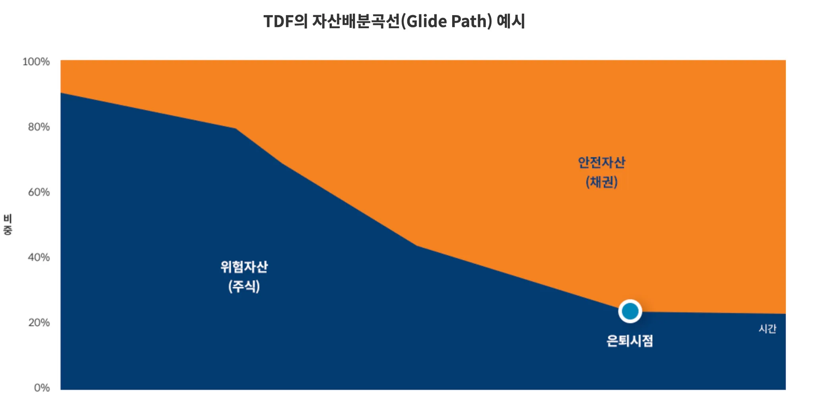

# 1. 개요

종종 연금 투자를 하다보면 `TDF`라는 용어를 듣게 되는데, `TDF` 투자는 어떤 것인지 같이 알아보자.

# 2. TDF에 대해서 알아보자

## 2.1 TDF란?

`TDF`는 `Target Date Fund`의 약자로 아래의 같은 의미를 가지고 있다. `TDF`는 목표 날짜(보통 은퇴 시점)에 맞춰 자산 배분 전략이 자동으로 조정되는 투자 펀드이다.

- `Target` : 타겟이 정해져 있는
- `Date`: 날짜가 정해여 있는
- `Fund`: 펀드

투자자의 은퇴 시점이나 특정 목표 날짜를 기준으로 설정되며, 시간이 지남에 따라 위험 자산의 비중이 줄어들고 안전 자산의 비중이 늘어나는 특징을 가지고 있다. `TDF`는 연금 투자를 타겟으로 하고 있어서 연금 계좌에서만 거래할 수 있다.

## 2.2 주요 특징

`TDF`는 다음과 같은 특징이 있다.

- 다양한 자산 클래스 배분으로 투자를 한다
  - 국내, 미국만이 아니라 전세계에 분산 투자를 해준다
  - 주식, 채권, 현금 등 다양한 자산에 투자를 해준다
- 자동 리밸런싱을 대신 해준다
- 나이별로 라인업이 존재를 한다
  - 나이에 맞게 `TDF`를 선택할 수 있게 라인업이 있다. 어떤 것을 선택할지 잘 모르면, 자기 나이에 +60(60세에 은퇴예정)을 던한 종목을 선택하면 된다.
  - ex. `TDF2030`, `TDF2040`, `TDF2050` (은퇴하는 연도를 의미한다)

| 생년     |      | 펀드 종목 | 비고                                                        |
| -------- | ---- | --------- | ----------------------------------------------------------- |
| 1965년생 | +60  | `TDF2025` | 숫자가 적을 수록 보수적으로 투자를 해서 채권 비중이 더 크다 |
| 1980년생 | +60  | `TDF2040` |                                                             |
| 1990년생 | +60  | `TDF2050` | 숫자가 클 수록 주식 비중이 더 많다                          |

### 2.2.1 개인으로 운용하는 연금 투자의 어려움

개인이 직접 ETF 종목을 선택하고 분산 투자를 실행하는 것은 생각보다 쉽지 않다. 투자하려면 먼저 각 종목을 분석하고, 적절한 타이밍에 매수와 매도를 결정해야 하며, 다양한 자산에 분산 투자하여 리스크를 관리하는 것도 필수적이다. 이러한 과정은 많은 시간과 스터디가 필요하기 때문에, 이런 부분을 신경 쓰지 않고 운용보수를 주고 그냥 사람을 쓰겠다라고 하면 `TDF`가 좋은 연금용 펀드가 될 수 있다.

### 2.2.2 장단점

### 장점

- 자동 자산 배분
  - 투자자는 복잡한 자산 배분 결정을 할 필요 없이, 목표 날짜만 설정하면 TDF가 알아서 자산 배분을 조정해준다
  - 적립식으로 투자를 하면 된다
- 리스크 관리
  - 시간이 지남에 따라 자연스럽게 리스크가 줄어드는 구조로 설계되어 있어, 투자자의 목표 시점에 맞춰 안정적인 수익을 기대할 수 있다.
- 편리성
  - 초보 투자자나 자산 관리에 시간을 많이 할애하기 어려운 투자자에게 적합한다. 자동화된 관리 덕분에 신경 쓸 일이 적다.

### 단점

- 비용
  - `TDF`는 자동화된 자산 배분과 관리 서비스 때문에 일반 펀드나 ETF보다 비용이 높을 수 있다.
- 맞춤형 투자 부족
  - 모든 투자자가 동일한 글라이드 패스를 따르기 때문에, 개인의 구체적인 재정 상황이나 투자 성향을 반영하기 어렵다.
- 리스크 오해 가능성
  - `TDF`의 구조를 잘 이해하지 못하면, 목표 날짜에 도달하면 모든 리스크가 사라진다고 오해할 수 있다. 여전히 시장 변동성에 노출될 수 있다.

## 2.3 `TDF`의 구조와 운용 방식

### `글라이드 패스` (Glide Path)

`글라이드 패스`는 `TDF`의 핵심 개념으로, 목표 날짜가 가까워질수록 위험 자산의 비중을 줄이고 안전 자산의 비중을 늘리는 자산 배분 전략을 의미한다. 초기에는 주식과 같은 고수익 고위험 자산에 많이 투자하고, 목표 날짜가 다가올수록 채권과 같은 저수익 저위험 자산으로 이동한다.

> `글라이드패스`: 비행기가 착륙할 때 그리는 경로를 의미하는 단어로 타깃데이트펀드(`TDF`)에서 사용하는 생애주기 별 자산 배분 곡선을 의미한다. 보통 은퇴 시점과 다양한 변수들을 바탕으로 안전하게 은퇴 자산으로 전환할 수 있도록 적극적 투자에서 보수적 투자로 자산 비중을 조정한다

### 

### 자산 배분

`TDF`는 주식, 채권, 부동산, 현금 등 다양한 자산에 분산 투자한다. 각 `TDF`마다 자산 배분 비율은 다를 수 있으며, 이는 펀드 운용사의 전략에 따라 결정된다.

# 3. 마무리

`TDF`는 목표 날짜에 맞춰 자동으로 자산 배분을 조정해주는 편리한 투자 상품이다. 투자자들은 `TDF`의 장점과 단점을 이해하고, 자신에게 맞는 `TDF`를 선택하여 장기적인 투자 전략을 수립할 수 있다.

연금저축에서 개인적으로 스터디하는 것도 좋지만, 직장인에게는 시간을 내서 각 ETF 종목 스터디하고 매매하는 것이 쉽지 않아서 마음 편하게 `TDF`로 매달 적립식으로 매수하는 게 더 편하기도 하고 실제 내가 하는 것보다 수익률이 좋아서 `TDF`도 적립식으로 매수하고 있다.

# 4. 참고

- [연금 대표 미래에셋 TDF](https://investments.miraeasset.com/annuity/tdf/miraeasset.do)
- [Target Date Fund란](https://www.fundguide.net/Fund/TDF)
- [TDF란 무엇일까? TDF의 개념과 장점, 단점](https://toalmotexit.com/concepts/tdf/)
- [[현명한 ETF투자:위험/안전자산 배분전략\] 닮은꼴 아버지와 아들도 다르게 구성하는 ETF](https://www.kcie.or.kr/mobile/guide/3/18/web_view?series_idx=&content_idx=623)
