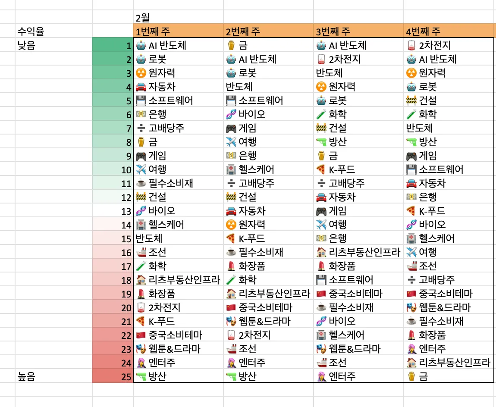
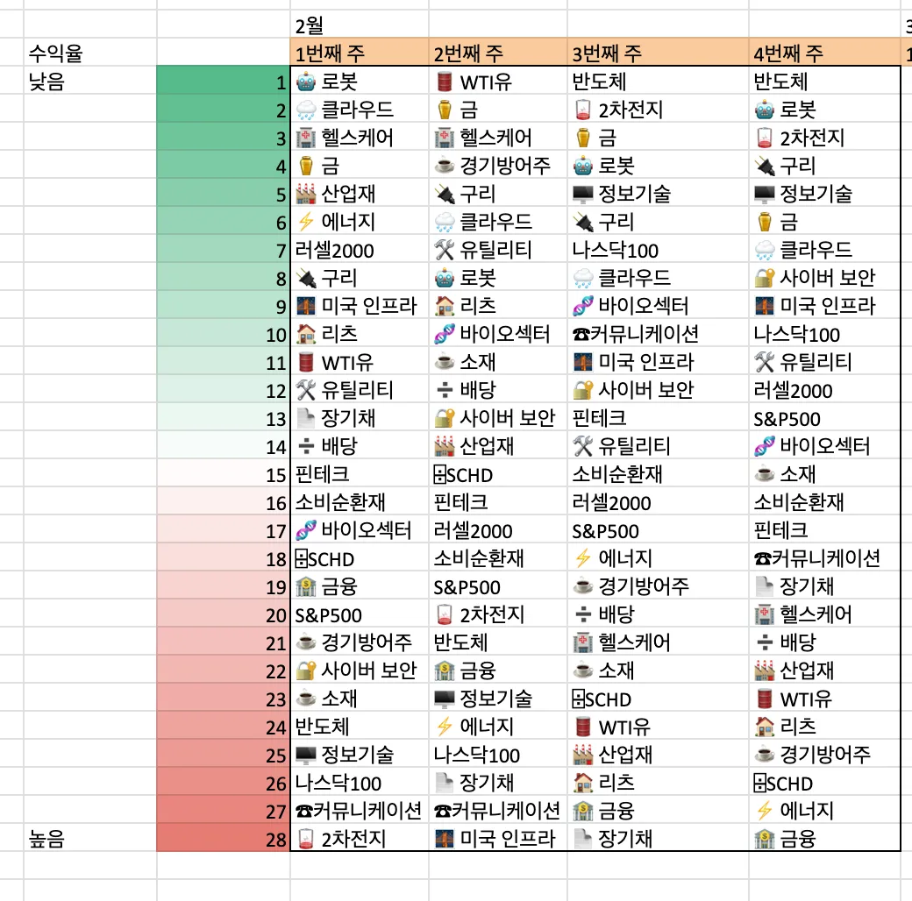
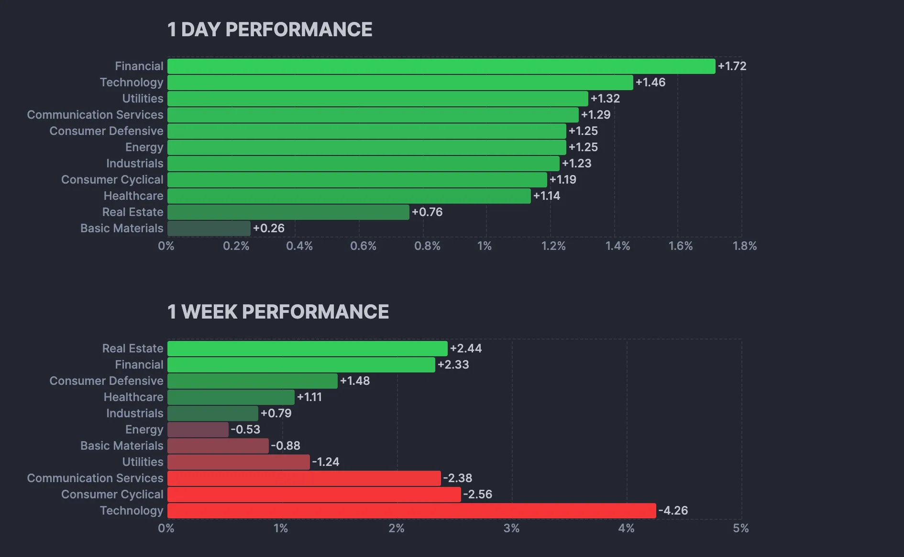
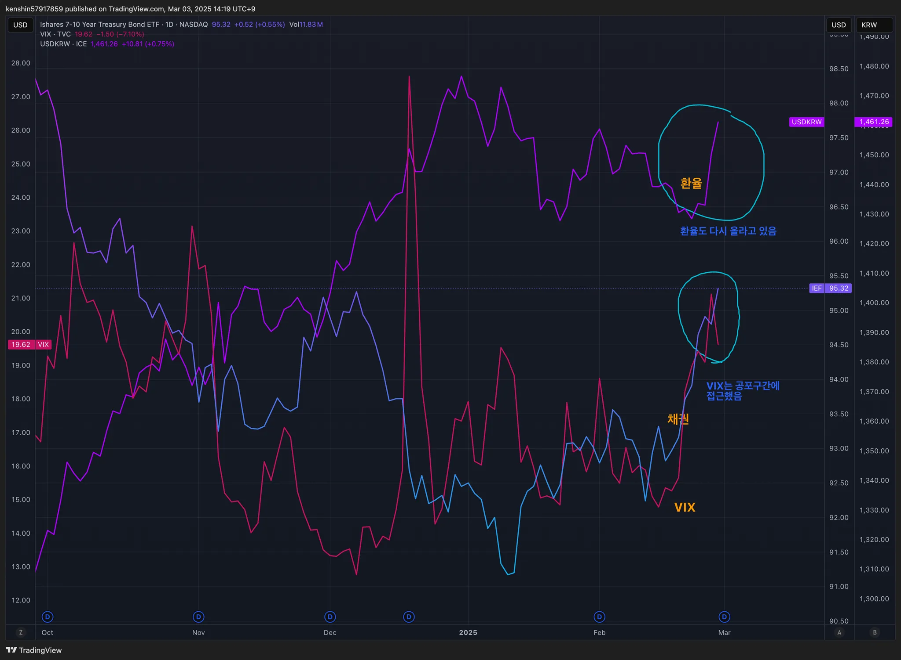
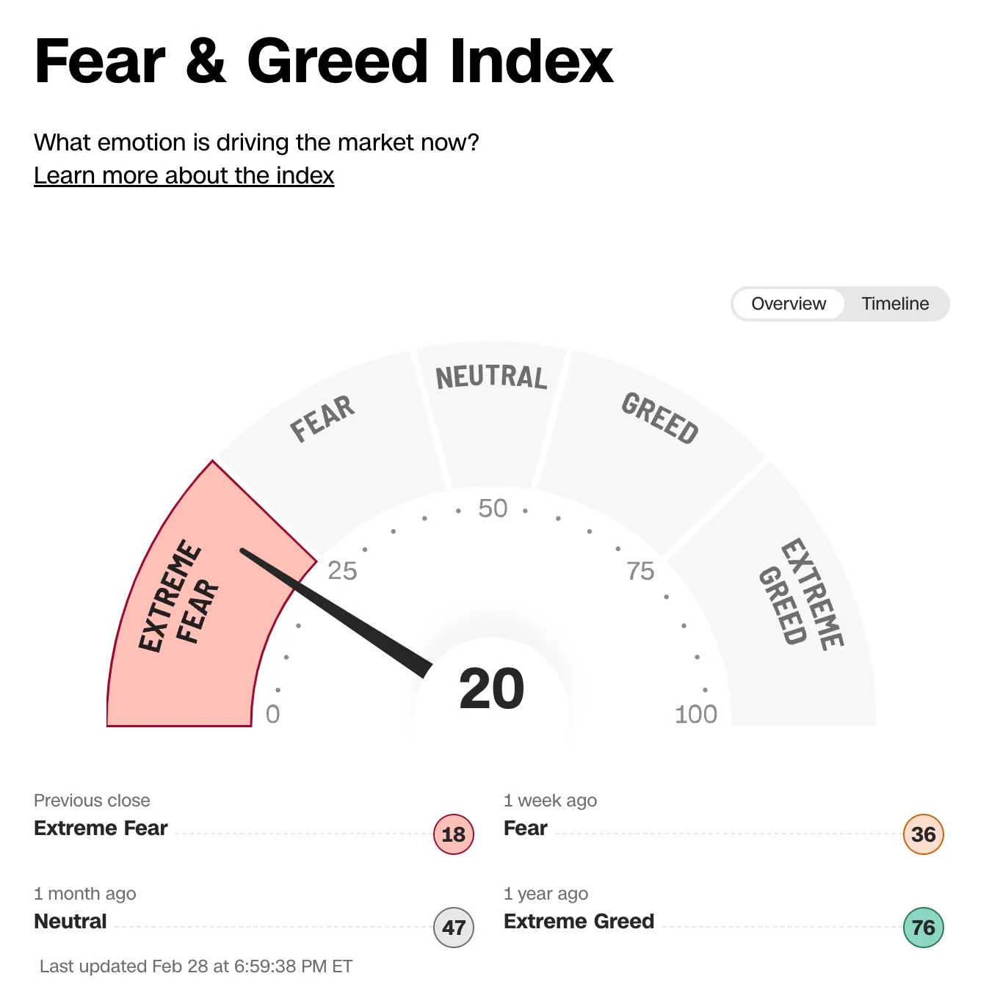
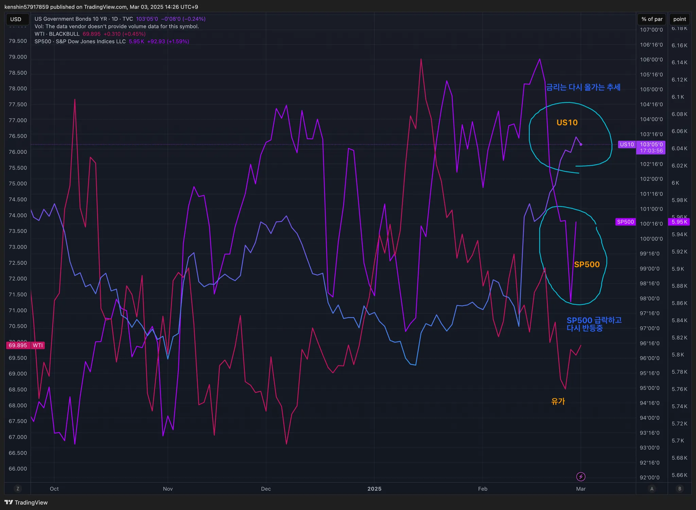
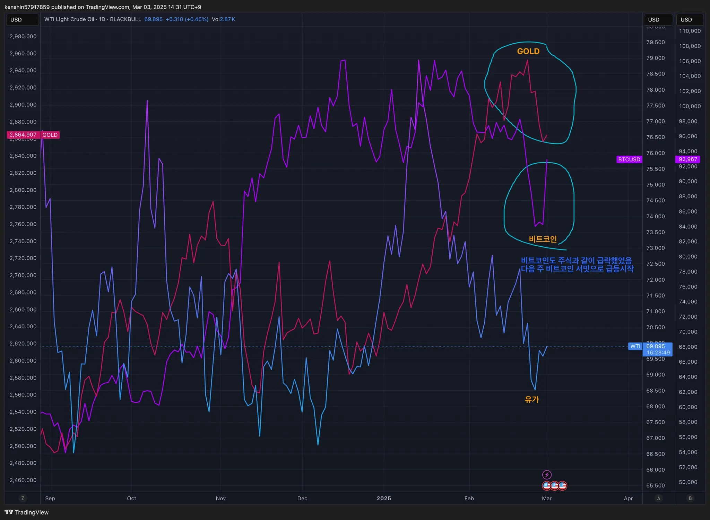

## 섹터별 수익률

> ETF 수익률을 기준으로 섹터별 수익률을 정렬하고 시간이 지남에 따라 현재 시장에서 주목받는 섹터가 무엇인지 파악하기 위해 아래와 같이 수익률을 정리해보았다.
>
> 단순히 수익률 기준으로 정렬을 하고 있어서 해당 섹터가 시장에서 가장 주목 받고 있다고 단정하기는 어렵지만, 투자하는 데 참고 지표로 사용하면 될 것 같다.

## 1. 국내 ETF

### 섹터별 ETF 종목

| **섹터** | **종목**               | **섹터**      | **종목**              |
| ---------- | ---------------------- | ----------------- | ---------------------- |
| 🔫방산      | PLUS K방산             | ☕️필수소비재       | KODEX 필수소비재       |
| ☢️원자력    | HANARO 원자력iSelect   | 🎮게임             | KBSTAR 게임테마        |
| ⚱️금        | ACE KRX금현물          | 🏠리츠부동산인프라 | TIGER 리츠부동산인프라 |
| 🏥헬스케어  | TIGER 헬스케어         | 💾소프트웨어       | TIGER 소프트웨어       |
| 🚢조선      | HANARO Fn조선해운      | 🍕K-푸드           | HANARO Fn K-푸드       |
| 🤖로봇      | KODEX K-로봇액티브     | ✈️여행             | TIGER 여행레저         |
| 👩‍🎤엔터주   | HANARO Fn K-POP&미디어 | 🇨🇳중국소비테마    | TIGER 중국소비테마     |
| ➗고배당주  | PLUS 고배당주          | 🚘자동차           | KODEX 자동차           |
| 💵은행      | KODEX 은행             | 반도체            | KODEX 반도체           |
| 🚧건설      | TIGER 200 건설         | 💄화장품           | TIGER 화장품           |
| 🧬바이오    | KODEX 바이오           | 🎭웹툰&드라마      | KODEX Fn웹툰&드라마    |
| 🪫2차전지   | TIGER 2차전지테마      | 🤖AI 반도체        | TIGER AI반도체핵심공정 |
|            |                        | 🧪화학             | KODEX 에너지화학       |

## 2. 미국 ETF

### 섹터별 ETF

| 섹터         | **티커** | **섹터**      | **티커** |
| ------------ | -------- | ------------- | -------- |
| 🤖로봇        | BOTZ     | 핀테크        | FINX     |
| 🌧️클라우드    | CLOU     | 소비순환재    | XLY      |
| 🏥헬스케어    | XLV      | 🧬바이오섹터   | IBB      |
| ⚱️금          | GLD      | ⌹SCHD         | SCHD     |
| 🏭산업재      | XLI      | 🏦금융         | XLF      |
| ⚡️에너지      | XLE      | S&P500        | VOO      |
| 러셀2000     | IWM      | ☕️경기방어주   | XLP      |
| 🔌구리        | COPX     | 🔐사이버 보안  | CIBR     |
| 🌉미국 인프라 | PAVE     | ☕️소재         | XLB      |
| 🏠리츠        | XLRE     | 반도체        | SOXX     |
| 🛢️WTI유       | CL       | 🖥️정보기술     | XLK      |
| 🛠️유틸리티    | XLU      | 나스닥100     | QQQ      |
| 📄장기채      | TLT      | ☎커뮤니케이션 | XLC      |
| ➗배당        | DIA      | 🪫2차전지      | LIT      |

## 3. 주요 지표

### 3.1 환율, 채권, VIX

- 공포구간이라서 지수 위주로 매수를 하면서 추이를 볼 필요가 있다
  - 미국 주식을 매수하고 싶어도 공포 구간에서는 환율도 높아지는 경향이 있어서 달러는 미리 미리 매입해두고 RP로 두면 좋겠다는 생각이 든다

### 3.2 S&P500, US10, WTI유가

- 이번주는 급락을 많이 했지만, 다음주에 더 이어질지는 지켜봐야 할 듯하다

### 3.3 BTC, GOLD, WTI

- 비트코인은 다음 주 암호화폐 서밋 개최로 인해서 급등하기 시작했다

## 4. 주요 트렌드 정리

### 주요 일정 (3/1 ~ 3/7)

|      | 월                                                           | 화                                                           | 수                                                      | 목                                                 | 금                                                           |
| ---- | ------------------------------------------------------------ | ------------------------------------------------------------ | ------------------------------------------------------- | -------------------------------------------------- | ------------------------------------------------------------ |
| 일정 | 🇰🇷 대체공휴일(삼일절) 🇺🇸 ISM제조업PMI 🇨🇳 제조업 PMI MWC2025(~6) | 🇺🇸 제조업, 서비스 PMI 🇺🇸 캐나다/멕시코(25%),중국(10%) 관세 부과예고 | 🇺🇸 ISM서비스업 PMI 🇺🇸 ADP 민간고용보고서 🇰🇷 GDP |                                                    | 🇺🇸 실업률, 비농업 고용수 🇺🇸 첫 암호화폐 서밋 🇺🇸 파월 연설 🇨🇳 무역수지 |
| 실적 | 🇺🇸 DLTR 🇺🇸 OKTA                                          | 🇺🇸 DLTR 🇺🇸 TGT 🇺🇸 BBY                                | 🇺🇸 MRVL 🇺🇸 MDB                                      | 🇺🇸 AVGO 🇺🇸 COST 🇺🇸 KR 🇺🇸 HPE 🇨🇳 JD |                                                              |

- ### **금주**

  - 🇺🇸 트럼프의 관세 불확실성 (일관성 X)
  - 🇺🇸 연휴를 앞두고 지표 불확실성 (미 PCE, ISM 제조업 PMI)에 대한 부담
  - 🇺🇸 최근 투심을 악화시켰던 내러티브 중 하나가 스태그플레이션 우려였다는 점에서 경기 지표 발표에 따른 시장 변동성 확대에 유의할 필요
  - 🇺🇸 `엔비디아`: 가이던스 실망 등에 따른 미 기술주 폭락
  - 🇺🇸 `아이온큐`: 실적 켄센 상회에도 유증 소식에 급락(-17%)
  - 🇺🇸 암호화폐 써밋 다음주에 오픈하겠다고 백악관 공식 발표

  ### **다음 주**

  - 🇺🇸 각종 경기지표 및 고용지표 발표가 주중 내내 이어질 예정
  - 🇺🇸 멕시코 및 캐나다향 관세 부과가 예정되어있어, 전후로 관련 불확실성들이 한 번 더 불거질 수 있음
  - 🇺🇸 암호화폐 서밋 개최

  

  ## 5. 참고

  - [증시일정](https://securities.miraeasset.com/hkr/hkr1003/n13.do)
  - [한국 결제캘린더](https://kr.investing.com/economic-calendar/)
  - https://bbn.kiwoom.com/rfCA256
  - [주말브리핑 - 금리, 중국, 금](https://contents.premium.naver.com/hsacademy/hsacademy1/contents/250216155810859os)
