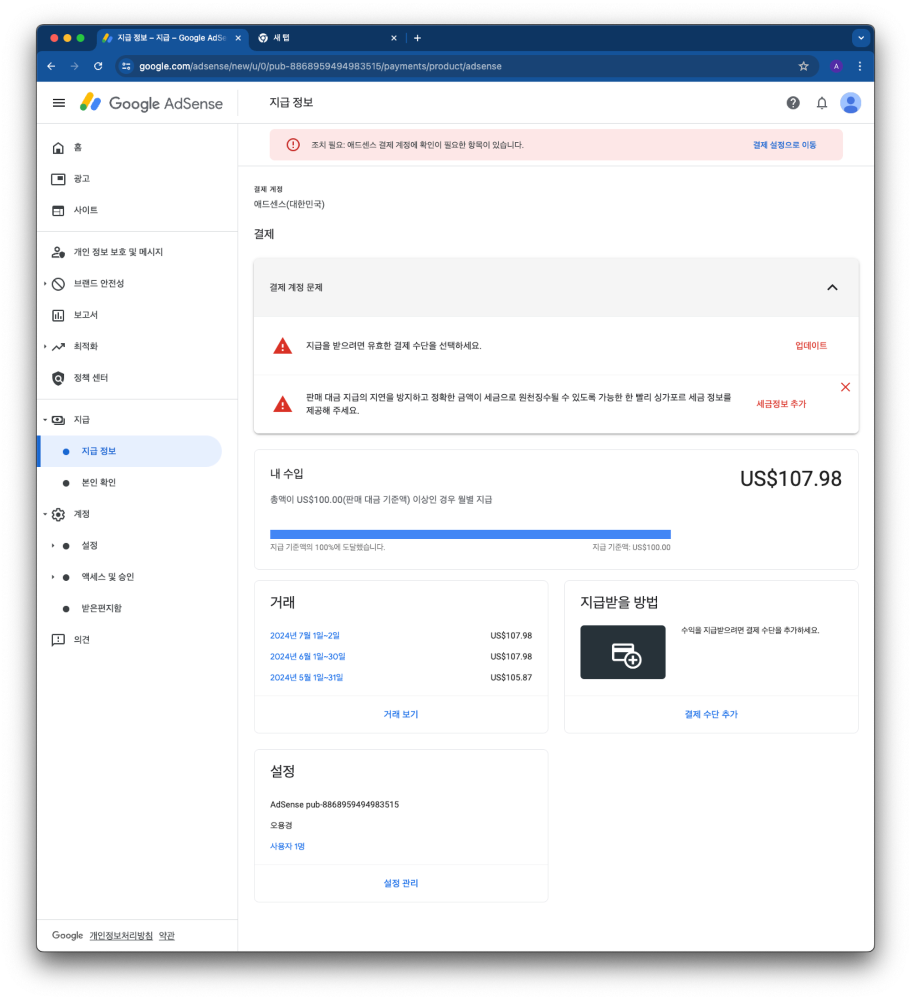
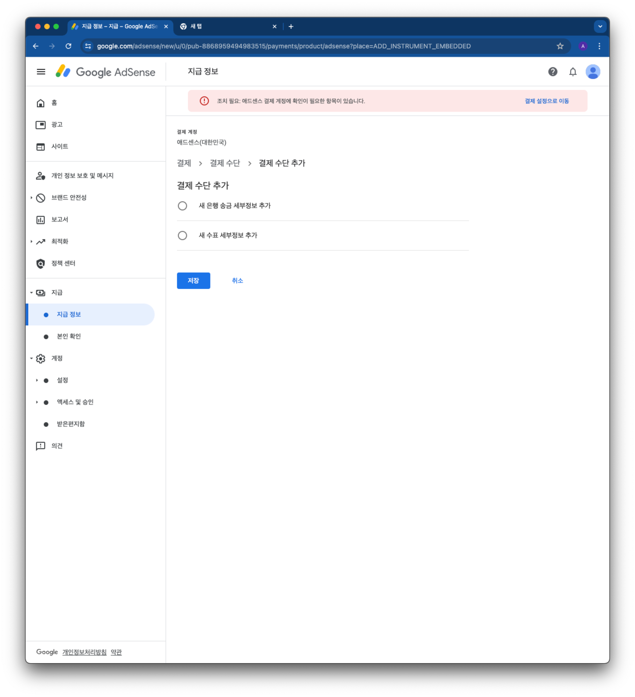
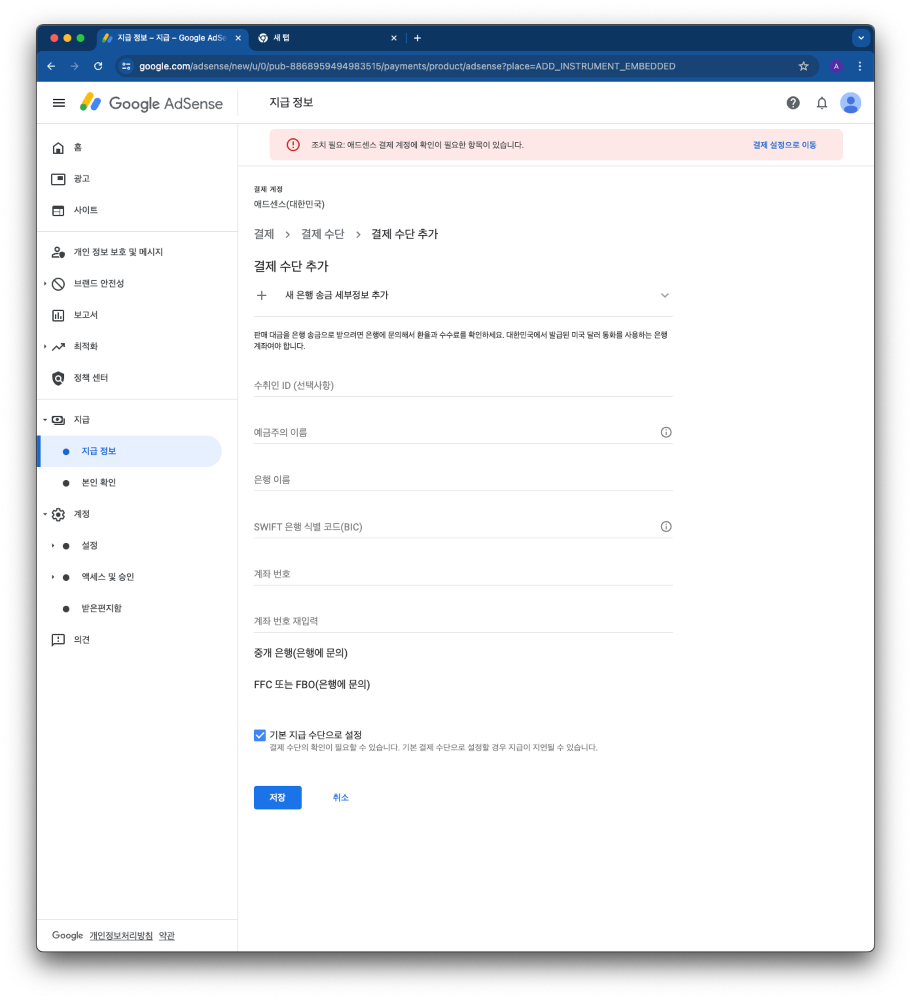

## 1. 개요

내 [IT 블로그](https://blog.advenoh.pe.kr/)에서 광고 수입 $100 달성을 해서 처음으로 구글로부터 수입을 받을 수 있게 되었다. 기록상 남기면 좋을 듯해서 어떻게 지급 받을 수 있는지 기록해둔다.

구글 Adsense에 로그인하면 아래와 같이 결제 설정하라고 표시가 나타난다.

## 2. 지급 받을 방법 설정하기

지급 방법 설정은 다음 단계로 진행하면 된다.

### 1. 결제 추단 추가 클릭 > 새 은행 송금 세부정보 추가 > `저장` 버튼 클릭한다

### 2. 은행 계좌 정보를 입력한다.

은행마다 `SWIFT CODE`가 달라서 각 은행 사이트에서 송금 가이드 등을 검색해서 찾으면 된다. 개인적으로 신한은행을 사용하고 있어서 여기에 나온 [송금가이드](https://bank.shinhan.com/index.jsp#020503010200)로 입력을 했다. 아니면 은행을 방문해서 물어볼 수도 있다.

- 수취인 ID : 입력하지 않아도 된다
- 예금주의 이름 : 영어 이름 (대문자로 입력하기)
  - 꼭 필요한 절차인지는 모르지만, 혹시나해서 구글 계정에 있는 이름도 동일하게 영어로 입력을 해두었다.
- 은행 이름: `SHINHAN BANK`
- `SWIFT` 은행 식별 코드 : `SHBKKRSE`
- 계좌 번호 : 은행 계좌 번호 대시 없이 입력을 하면 된다

`저장` 버튼을 클릭하면 끝난다.

## 3. 마무리

며칠이 지나면 은행에서 연락이 온다. 신한은행에서 당일날 자주 연락이 와서 광고인 줄 알고 전화를 무시했었다. 구글에서 돈이 들어왔다고 연락이 왔고 처리를 해드리겠다고 하는 연락이었다. 뭔가 자동으로 되지는 않고 연락을 취해서 확인하고 처리하게 되어 있는 듯하다.

## 4. 참고

- [구글 애드센스 계좌 연결 방법](https://winters-story.tistory.com/entry/%EA%B5%AC%EA%B8%80%EC%95%A0%EB%93%9C%EC%84%BC%EC%8A%A4-%EA%B3%84%EC%A2%8C%EC%97%B0%EA%B2%B0%EB%B0%A9%EB%B2%95#google_vignette)
- [애드센스 신한은행 외화계좌 연결, 지급금액 변경하기](https://juicy-story.com/entry/애드센스-신한은행-외화계좌-연결-지급금액-변경하기#google_vignette)
