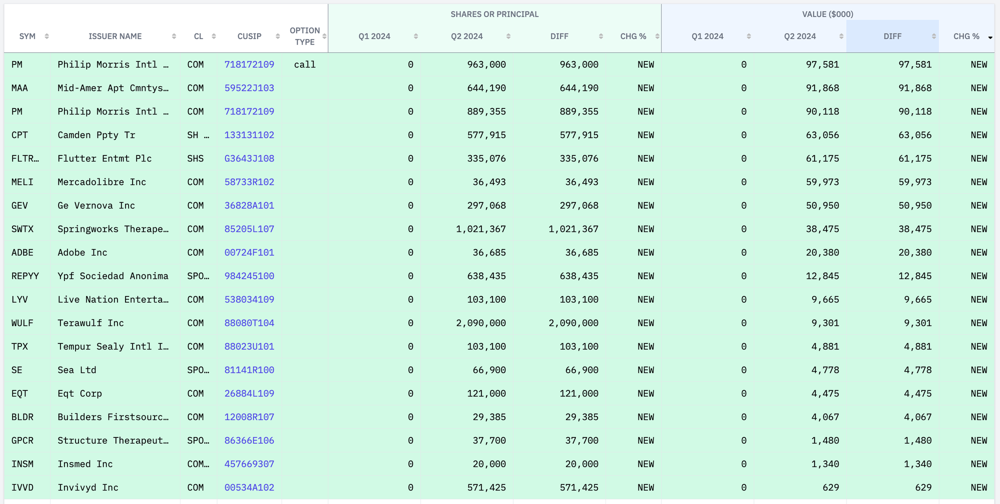
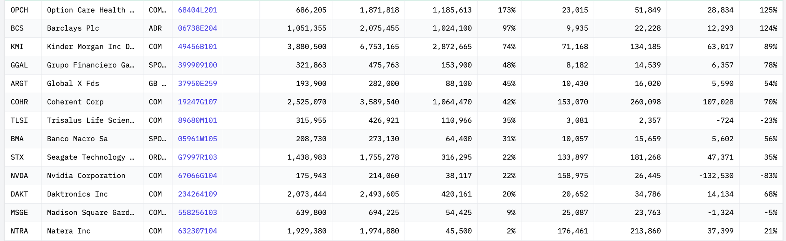
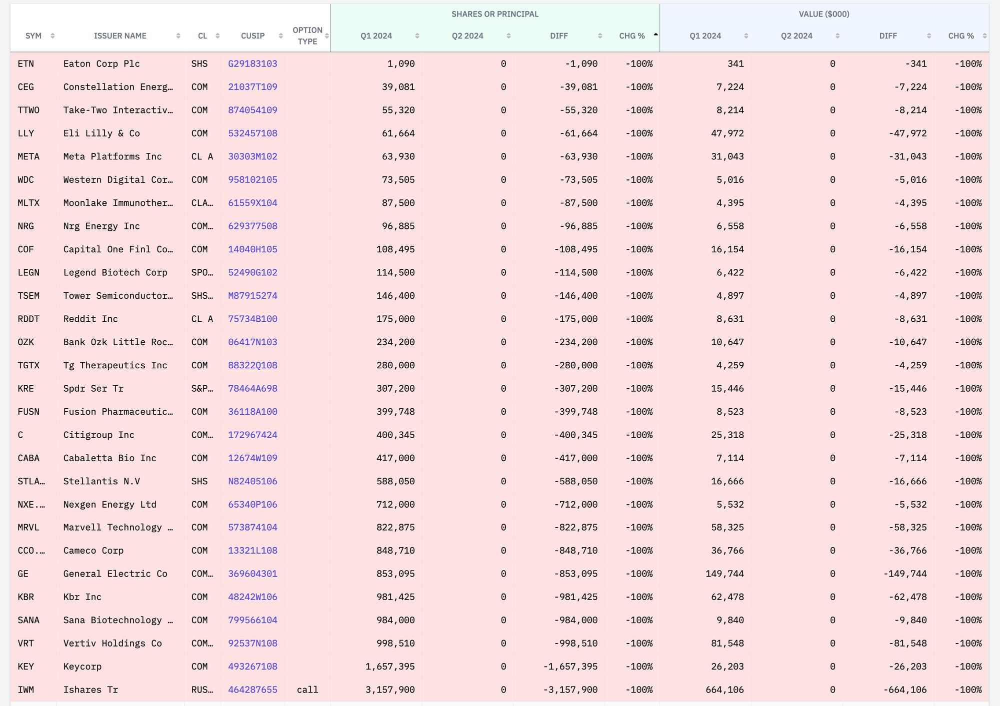
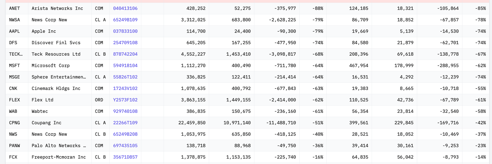
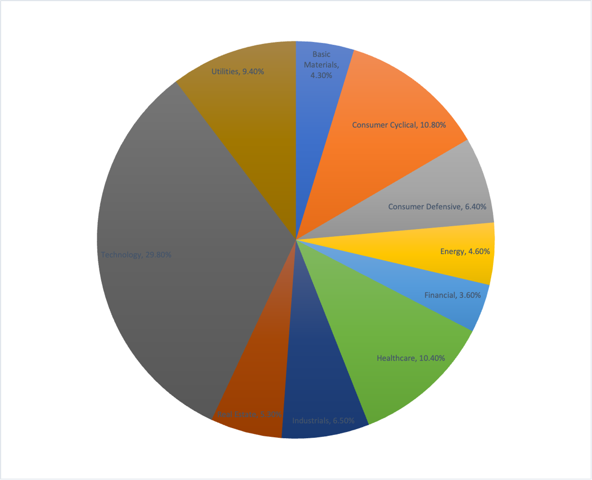

## 1. 개요

> 스탠리 드러켄밀러(Stanley Druckenmiller)는 미국의 유명한 투자자이자 헤지펀드 매니저이다. 그는 조지 소로스와 함께 일하며 1992년 영국 파운드화를 공략해 "블랙 웬즈데이"를 만들어낸 인물로 유명하다. 드러켄밀러는 자신의 투자 철학으로 "탑다운" 매크로 분석을 사용하며, 글로벌 경제 흐름을 예측해 투자 결정을 내린다. 또한 그는 듀케인 캐피털(Duquesne Capital)을 설립해 높은 수익을 거두었으며, 2010년 헤지펀드를 청산하고 개인 자산 관리에 집중하고 있다.

## 2. 2024년 2분기 스탠리 드러켄밀러 포트폴리오

2024년 8일 14일 공개된 2024년 2분기 스탠리 드러켄밀러 포트폴리오에 대해서 알아보자.

### 2.1 1Q 2024 vs 2Q 2024 변경사항

2024년 2분기에 스탠리 드러켄밀러는 포트폴리오에 몇 가지 중요한 변화를 주었다.

- 새로 추가한 종목
  - 새로 추가된 종목은 19개이고 비중이 좀 큰 것 위주로 확인해보면 리츠와 전통적인 배당주에 대한 새로운 투자를 시작했고 금리인하를 대비해서 투자를 한 게 아닌가 싶다
  - Mid-America Apartment Communities (MAA): 부동산 섹터에 대한 투자를 강화
  - Philip Morris International (PM): 소비재 분야에 새롭게 추가
  - Camden Property Trust (CPT): 주택 시장에 집중
  - Adobe (ADBE): 미디어, AI 산업의 성장 가능성에 베팅

- 추가로 매수한 종목
  - 추가로 매수한 종목 중에 비중이 큰 것 위주로 보면 Coherent Corp (COHR)와 Kinder Morgan (KMI)를 추가 매수했다. 킨더 모건은 북미 최대의 에너지 인프라 회사이고 코히런트 회사는 미국의 광학 재표 및 반도체 제조업체라서 AI 산업의 미래를 보고 투자한 게 아닌가 생각된다

- 청산한 종목
  - 총 27개 종목을 완전히 매도하며, 이는 전략 조정이나 이익 실현을 위한 결정으로 보인다

- 비중을 줄인 종목
  - 비중을 줄인 종목은 Apple(AAPL), Microsoft(MSFT), Amazon (AMZN) 등과 같은 기술 관련 주식을 축소했다

### 2.2 포트폴리오 섹터별 비중 분석 (상위 30종목)

포트폴리오에서 가장 큰 비중을 차지하는 섹터는 Technology, Consumer Cyclical,  Healthcare, Utilities 정도 있고 나머지 섹터는 서로 비슷 비중을 차지하고 있다.

| 섹터               | 비중   | 개수 |
| ------------------ | ------ | ---- |
| Technology         | 29.80% | 10   |
| Consumer Cyclical  | 10.80% | 3    |
| Healthcare         | 10.40% | 3    |
| Utilities          | 9.40%  | 2    |
| Industrials        | 6.50%  | 2    |
| Consumer Defensive | 6.40%  | 2    |
| Real Estate        | 5.30%  | 2    |
| Energy             | 4.60%  | 1    |
| Basic Materials    | 4.30%  | 2    |
| Financial          | 3.60%  | 3    |

### 2.3 분기별 Top 10 종목 비중 변화

|      | 2023 4Q                       | 비중 | 2024 1Q                       | 비중 | 2024 2Q | 비중 |
| ---- | ----------------------------- | ---- | ----------------------------- | ---- | ------- | ---- |
| 1    | MSFT                          | 12%  | IWM                           | 15%  | COHR    | 8.9% |
| 2    | CPNG                          | 11%  | MSFT                          | 11%  | CPNG    | 7.9% |
| 3    | NVDA                          | 9.1% | CPNG                          | 9.1% | VST     | 7.7% |
| 4    | NVDA call                     | 7.2% | [TECK-B.TO](http://TECK-B.TO) | 4.7% | NTRA    | 7.3% |
| 5    | LLY                           | 7.0% | NTRA                          | 4.2% | STX     | 6.2% |
| 6    | [TECK-B.TO](http://TECK-B.TO) | 7.0% | NVDA                          | 4.0% | MSFT    | 6.1% |
| 7    | STX                           | 5.4% | COHR                          | 3.6% | WWD     | 5.7% |
| 8    | VRT                           | 3.3% | GE                            | 3.5% | MI      | 4.6% |
| 9    | NWSA                          | 3.0% | WWD                           | 3.4% | PM      | 3.3% |
| 10   | GE                            | 2.8% | STX                           | 3.4% | MAA     | 3.1% |

### 2.4 전체 포트폴리오 목록

|      | 티커                          | 회사명                       | 섹터               | 비중  | 보유 총금액 | 보유 주식수 | 비고                                                         |
| ---- | ----------------------------- | ---------------------------- | ------------------ | ----- | ----------- | ----------- | ------------------------------------------------------------ |
| 1    | COHR                          | Coherent Corp                | Technology         | 8.90% | 260,098     | 3,589,540   | 레이저, 광학 부품, 및 관련 제품을 제조하는 회사              |
| 2    | CPNG                          | Coupang Inc                  | Consumer Cyclical  | 7.90% | 229,845     | 10,971,140  |                                                              |
| 3    | VST                           | Vistra Corp                  | Utilities          | 7.70% | 225,717     | 2,625,231   | 미국의 전력 및 에너지 제공 업체로, 발전 및 소매 전력 판매    |
| 4    | NTRA                          | Natera Inc                   | Healthcare         | 7.30% | 213,860     | 1,974,880   | 유전자 검사 및 분자 진단 솔루션을 제공하는 회사              |
| 5    | STX                           | Seagate Technology Hldngs Pl | Technology         | 6.20% | 181,268     | 1,755,278   | 하드 디스크 드라이브(HDD) 및 스토리지 솔루션을 제조하는 글로벌 기업 |
| 6    | MSFT                          | Microsoft Corp               | Technology         | 6.10% | 178,999     | 400,490     |                                                              |
| 7    | WWD                           | Woodward Inc                 | Industrials        | 5.70% | 166,399     | 954,230     | 항공우주 및 에너지 부문을 위한 제어 시스템 및 구성품을 제조하는 회사 |
| 8    | KMI                           | Kinder Morgan Inc Del        | Energy             | 4.60% | 134,185     | 6,753,165   | 미국의 주요 에너지 인프라 회사                               |
| 9    | PM call 옵션                  | Philip Morris Intl Inc       | Consumer Defensive | 3.30% | 97,581      | 963,000     |                                                              |
| 10   | MAA                           | Mid-Amer Apt Cmntys Inc      | Real Estate        | 3.10% | 91,868      | 644,190     | 미국의 주택 리츠(REIT) 회사로, 주거용 아파트 단지를 소유하고 운영 |
| 11   | PM                            | Philip Morris Intl Inc       | Consumer Defensive | 3.10% | 90,118      | 889,355     |                                                              |
| 12   | ZI                            | Zoominfo Technologies Inc    | Technology         | 2.60% | 75,112      | 5,881,906   |                                                              |
| 13   | [TECK-B.TO](http://TECK-B.TO) | Teck Resources Ltd           | Basic Materials    | 2.40% | 69,618      | 1,453,410   |                                                              |
| 14   | CPT                           | Camden Ppty Tr               | Real Estate        | 2.20% | 63,056      | 577,915     | 미국의 주거용 리츠(REIT) 회사로, 주요 도시에 아파트 단지를 소유 및 관리 |
| 15   | FLTR.L                        | Flutter Entmt Plc            | Financial          | 2.10% | 61,175      | 335,076     | 스포츠 베팅 및 온라인 도박 서비스를 제공하는 글로벌 엔터테인먼트 회사 |
| 16   | MELI                          | Mercadolibre Inc             | Consumer Cyclical  | 2.10% | 59,973      | 36,493      | 라틴 아메리카 최대의 전자 상거래 및 온라인 결제 플랫폼을 운영하는 회사 |
| 17   | FCX                           | Freeport-Mcmoran Inc         | Basic Materials    | 1.90% | 56,042      | 1,153,135   | 금속과 광물, 특히 구리와 금을 채굴 및 생산하는 주요 글로벌 자원 기업 |
| 18   | OPCH                          | Option Care Health Inc       | Healthcare         | 1.80% | 51,849      | 1,871,818   | 가정용 및 대체 요양 시설에서 의료 서비스를 제공하는 회사     |
| 19   | GEV                           | Ge Vernova Inc               | Utilities          | 1.70% | 50,950      | 297,068     | 미국의 석유 및 가스 파이프라인, 저장 및 해양 운송을 제공하는 에너지 인프라 회사 |
| 20   | FLEX                          | Flex Ltd                     | Technology         | 1.50% | 42,736      | 1,449,155   | 전자 제품 디자인 및 제조 서비스를 제공하는 글로벌 기업       |
| 21   | SWTX                          | Springworks Therapeutics Inc | Healthcare         | 1.30% | 38,475      | 1,021,367   | 희귀 암 및 기타 질병을 치료하기 위한 혁신적인 약물을 개발하는 생명공학 회사 |
| 22   | DAKT                          | Daktronics Inc               | Technology         | 1.20% | 34,786      | 2,493,605   | 전광판, 디지털 표시 및 관련 시스템을 설계 및 제조하는 회사   |
| 23   | PANW                          | Palo Alto Networks Inc       | Technology         | 1.00% | 30,161      | 88,968      | 사이버 보안 솔루션을 제공하는 글로벌 회사                    |
| 24   | NVDA                          | Nvidia Corporation           | Technology         | 0.90% | 26,445      | 214,060     |                                                              |
| 27   | BCS                           | Barclays Plc                 | Financial          | 0.80% | 22,228      | 2,075,455   | 영국에 본사를 둔 글로벌 금융 서비스 회사로, 투자은행, 자산관리, 리테일 은행업 등을 제공 |
| 26   | MSGE                          | Madison Square Garden Entmt  | Consumer Cyclical  | 0.80% | 23,763      | 694,225     | 뉴욕에 위치한 Madison Square Garden과 같은 엔터테인먼트 및 스포츠 장소를 운영하는 회사 |
| 25   | WAB                           | Wabtec                       | Industrials        | 0.80% | 23,814      | 150,675     | 철도와 운송 산업을 위한 기술 솔루션을 제공하는 글로벌 기업   |
| 29   | ADBE                          | Adobe Inc                    | Technology         | 0.70% | 20,380      | 36,685      |                                                              |
| 28   | DFS                           | Discover Finl Svcs           | Financial          | 0.70% | 21,879      | 167,255     | 신용카드 발급, 대출, 예금 서비스를 제공하는 금융 서비스 회사 |
| 30   | PLTR                          | Palantir Technologies Inc    | Technology         | 0.70% | 19,503      | 769,965     | 빅데이터 분석 플랫폼을 개발 및 운영하는 기술 회사            |
| 32   | ANET                          | Arista Networks Inc          | Technology         | 0.60% | 18,321      | 52,275      | 클라우드 컴퓨팅 및 데이터 센터를 위한 네트워킹 솔루션을 제공하는 기술 |
| 33   | NWS                           | News Corp New                | Communication      | 0.60% | 18,052      | 635,850     | 뉴스 코퍼레이션의 클래스 B 주식으로, 뉴스 미디어, 출판 및 케이블 방송 서비스를 제공 |
| 31   | NWSA                          | News Corp New                | Communication      | 0.60% | 18,852      | 683,800     | NWS와 같은 회사이지만, 클래스 A 주식으로 의결권이 더 많다    |
| 34   | ARGT                          | Global X Fds                 | Financial          | 0.50% | 16,020      | 282,000     | 아르헨티나 주식시장에 투자하는 상장지수펀드(ETF)             |
| 35   | BMA                           | Banco Macro Sa               | Financial          | 0.50% | 15,659      | 273,130     | 아르헨티나에서 활동하는 주요 상업은행                        |
| 37   | CRNX                          | Crinetics Pharmaceuticals In | Healthcare         | 0.50% | 13,840      | 309,000     | 내분비 장애를 치료하기 위한 혁신적인 약물 개발에 중점을 둔 바이오제약 회사 |
| 36   | GGAL                          | Grupo Financiero Galicia S.A | Financial          | 0.50% | 14,539      | 475,763     | 아르헨티나의 대형 금융 그룹으로, 은행, 보험, 투자 서비스 등을 제공 |
| 38   | BAH                           | Booz Allen Hamilton Hldg Cor | Industrials        | 0.40% | 12,903      | 83,841      | 정보 기술, 컨설팅, 분석 서비스를 제공하는 미국의 전문 서비스 회사 |
| 40   | IQV                           | Iqvia Hldgs Inc              | Healthcare         | 0.40% | 12,763      | 60,360      | 제약, 생명과학, 헬스케어 산업을 대상으로 데이터 분석 및 임상시험 서비스를 제공하는 글로벌 기업 |
| 39   | REPYY                         | Ypf Sociedad Anonima         | Energy             | 0.40% | 12,845      | 638,435     | 스페인의 종합 에너지 회사로, 석유, 가스, 전기 생산 및 판매   |
| 43   | CNK                           | Cinemark Hldgs Inc           | Communication      | 0.30% | 8,665       | 400,792     | 북미와 남미 전역에 영화 극장을 운영하는 세계적인 영화관 체인 |
| 41   | LYV                           | Live Nation Entertainment In | Communication      | 0.30% | 9,665       | 103,100     | 세계적인 라이브 엔터테인먼트 회사로, 콘서트 및 공연 이벤트를 주최 |
| 44   | SLN                           | Silence Therapeutics Plc     | Healthcare         | 0.30% | 7,361       | 387,400     | RNA 간섭(RNAi) 기술을 이용해 질병을 치료하는 신약을 개발하는 회사 |
| 42   | WULF                          | Terawulf Inc                 | Financial          | 0.30% | 9,301       | 2,090,000   | 친환경 비트코인 채굴 회사                                    |
| 47   | AAPL                          | Apple Inc                    | Technology         | 0.20% | 5,139       | 24,400      |                                                              |
| 46   | AES                           | Aes Corp                     | Utilities          | 0.20% | 5,530       | 314,750     | 전 세계적으로 전력과 에너지 솔루션을 제공하는 글로벌 에너지 기업 |
| 52   | EQT                           | Eqt Corp                     | Energy             | 0.20% | 4,475       | 121,000     | 미국의 천연가스 생산 및 개발 회사로, 주요 셰일 가스 자원을 보유 |
| 49   | LBTYA                         | Liberty Global Ltd           | Communication      | 0.20% | 4,798       | 275,275     | 유럽과 라틴아메리카에서 케이블, 브로드밴드 및 이동통신 서비스를 제공하는 대형 통신사 |
| 51   | LBTYK                         | Liberty Global Ltd           | Communication      | 0.20% | 4,674       | 261,875     | LBTYA와 같은 회사이지만, 의결권이 없는 클래스 C 주식         |
| 50   | SE                            | Sea Ltd                      | Consumer Cyclical  | 0.20% | 4,778       | 66,900      | 싱가포르에 본사를 둔 인터넷 및 모바일 플랫폼 회사로, 전자 상거래, 디지털 결제 및 게임 서비스를 제공 |
| 48   | TPX                           | Tempur Sealy Intl Inc        | Consumer Cyclical  | 0.20% | 4,881       | 103,100     | 매트리스 및 베개와 같은 침구류를 제조하는 글로벌 회사        |
| 45   | VCYT                          | Veracyte Inc                 | Healthcare         | 0.20% | 5,633       | 259,944     | 유전자 검사 및 분자 진단 서비스를 제공하여 암 진단을 지원하는 회사 |
| 54   | ACLX                          | Arcellx Inc                  | Healthcare         | 0.10% | 4,090       | 74,100      | 종양학 치료제 개발에 중점을 둔 임상 단계의 바이오제약 회사   |
| 56   | BCYC                          | Bicycle Therapeutics Plc     | Healthcare         | 0.10% | 3,850       | 190,200     | 새로운 약물 개발을 목표로 하는 임상 단계의 생명공학 회사     |
| 55   | BLDR                          | Builders Firstsource Inc     | Industrials        | 0.10% | 4,067       | 29,385      | 주택 건설 자재 및 서비스 제공업체로, 미국 전역에서 활동      |
| 59   | GPCR                          | Structure Therapeutics Inc   | Healthcare         | 0.10% | 1,480       | 37,700      | GPCR 기반 약물 개발에 중점을 둔 생명공학 회사                |
| 57   | IHS                           | Ihs Holding Limited          | Communication      | 0.10% | 2,465       | 770,310     | 아프리카와 라틴아메리카 지역에 전기통신 인프라를 제공하는 회사 |
| 53   | SPHR                          | Sphere Entertainment Co      | Communication      | 0.10% | 4,292       | 122,411     | 데이터 관리 및 가상화 솔루션을 제공하는 기술 회사            |
| 58   | TLSI                          | Trisalus Life Sciences Inc   | Healthcare         | 0.10% | 2,357       | 426,921     | 생명공학 연구 및 개발을 위한 자동화 플랫폼을 제공하는 회사   |
| 60   | INSM                          | Insmed Inc                   | Healthcare         | 0.00% | 1,340       | 20,000      | 희귀 질환을 치료하기 위한 혁신적인 의약품을 개발하는 바이오제약 회사 |
| 63   | IVVD                          | Invivyd Inc                  | Healthcare         | 0.00% | 629         | 571,425     | 감염병 예방을 위한 항체 치료제를 개발하는 생명공학 회사      |
| 64   | JOBY                          | Joby Aviation Inc            | Industrials        | 0.00% | 115         | 22,492      | 전기 항공 택시를 개발하는 미국의 항공우주 스타트업           |
| 62   | NRIX                          | Nurix Therapeutics Inc       | Healthcare         | 0.00% | 922         | 44,200      | 세포 내 단백질 분해를 기반으로 한 신약 개발을 진행하는 바이오제약 회사 |
| 61   | TEO                           | Telecom Argentina Sa         | Communication      | 0.00% | 1,034       | 143,051     | 아르헨티나의 주요 통신 서비스 제공업체                       |

## 3. 마무리

스탠리 드러켄밀러는 2분기의 변화를 보면 기술 관려 주식의 비중을 축소했고 리츠와 전통적인 배당주, 에너지 섹터에 투자 비중을 상대적으로 강화한 전략을 취했다. 이러한 움직임은 거시경제 환경과 금리인하를 대비해서 조정된 것으로 분석된다.

## 4. 참고

- [DUQUESNE FAMILY OFFICE LLC](https://marketinsights.co.kr/드러켄밀러-포트폴리오-듀케인-패밀리-13f/)
- [드러켄밀러, 1Q에 엔비디아 지분 72% 줄여…소형주·구리 투자](https://news.einfomax.co.kr/news/articleView.html?idxno=4309843)
