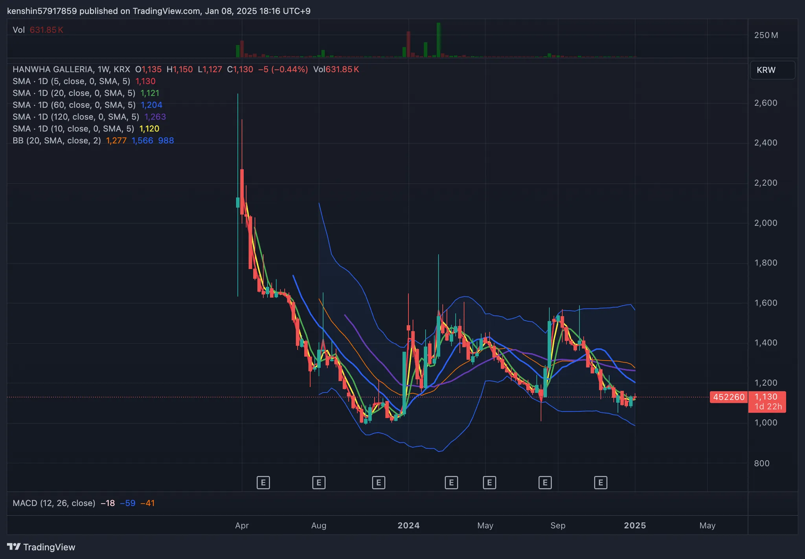

## 1. 개요

한화솔루션은 2023년 3월 한화갤러리아를 신규 상장하며 `인적분할`을 진행했었다. 당시 분할에 대한 이해가 부족해 매도를 하지 않고 주식을 보유했었고, 이후 한화갤러리아 주가는 -75.43% 하락했다.

좀 늦은 감이 있지만, 기업 분할에 대해서 스터디하고 기업 분할은 주가에 어떤 영향을 주는지 알아보자.

## 2. 기업 분할

기업 분할이란, 회사의 여러 사업부를 떼어내 독립된 새로운 회사로 만드는 것이다. 분할 방식은 크게 두 가지로 나뉘며, 그중 기업들이 주로 활용하는 `인적분할` 방식에 대해 먼저 살펴본다.

### 2.1 분할의 2가지 방식

#### 2.1.1 `인적분할`

`인적분할`은 기업이 특정 사업 부문을 분리하여 새로운 회사로 설립하면서, 기존 회사의 주주들이 분할된 회사의 지분도 동일하게 소유하는 방식이다. 이는 기존 주주들의 권리가 새로운 회사에도 그대로 이어진다는 점이 특징이 있다. 주주의 지분이 나눠지고 분할 후에는 별개의 기업으로 시장에 상장되고 거래가 된다.

#### `인적분할` 사례

한화솔루션은 2023년 2월에 `인적분할`을 9:1 비율로 나눠서 한화갤러리아 설립했다. 참고로 2년 전에는 갤러리아가 한화솔루션으로 합병되기도 했었다.

예. 만약 한화솔루션 주식을 100주 가지고 있는데, 9:1 `인적분할`을 한다면 한화솔루션은 90주, 한화갤러리아 10주를 보유하게 된다. 별개의 기업으로 분리되고 주주들은 그 비율만큼 각각의 기업을 소유하게 된다.

#### `인적분할` 하는 이유

1. 경영 효율화

- 서로 다른 사업 부문을 독립적으로 관리하면 경영 효율성을 높일 수 있다
- 독립된 기업으로 있는 것이 사업을 하는 데 유리하는 경우가 많고 기업의 가치를 평가하는 것도 쉬워진다

1. 지주사 전환

- 지주사 전환분할을 통해 지주회사 체제로 전환하면, 지배구조를 더 명확히 하고 주주 가치를 제고할 수 있다
- 지주사 체제로 전환하면 각 사업부문의 독립 경영이 가능해지고, 기업 지배구조를 명확히 할 수 있습니다. 이는 주주들에게 더 투명한 기업 구조를 제공한다

> 지주사? 다른 회사(자회사) 주식을 보유하면서 그 회사를 관리 감독하는 회사를 의미한다

#### 주가에 미치는 영향

어떤 회사가 어떤 사업을 `인적분할`하느냐에 따라 주가의 영향을 줄 수밖에 없다. 분리된 사업의 전문성이 부각되고 투자자들에게 긍정적인 기대감을 줄 수 있다면 기업 가치가 상승하면서 주가 상승으로 이어질 가능성이 크다. 반면, 분리된 사업의 매력도가 낮거나 시장에서 부정적으로 평가되는 경우, 분리된 기업의 주가는 하락할 가능성이 높다. 한화갤러리아의 사례처럼 `인적분할` 이후 주가가 -74% 하락한 경우도 이에 해당한다.

#### 2.1.2 `물적분할`

`물적분할`은 기업이 특정 사업 부문을 분리하여 새로운 회사로 설립하지만, 기존 회사가 분할된 회사의 지분 100%를 보유하게 되는 방식이다. 즉, 새로운 회사는 모회사의 완전 자회사로 설립되며, 주주들이 분할된 회사의 지분을 직접 소유하지는 않는다.

#### 물리분할 사례

한화솔루션은 2022년 12월에 첨단소재 부문을 `물적분할`하고 한화첨단소재는 한화솔루션의 100% 비상장 자회사가 되었다.

예. 한화솔루션 100주를 가지고 있다면, `물적분할`로 한화첨단소재 자회사가 생겨도 한화솔루션 100주는 그대로 보유하게 된다. `물적분할`로 새로운 회사는 한화솔루션이 100% 지분을 보유하는 구조가 된다. 따라서 기업 가치에는 큰 영향이 없다.

#### `물적분할` 하는 이유

1. 사업 전문성 강화

- 특정 사업부에 독립적 투자를 유치하거나, 핵심 사업에 집중하기 위한 목적으로 `물적분할`을 한다
- `물적분할`된 회사가 상장될 경우 기존 주주의 주식 가치가 희석될 가능성이 있다

#### 주가에 미치는 영향

`물적분할`은 자산을 그대로 두고 지배구조만 나누기 때문에 기업 가치에는 큰 영향을 주지 않는 경우가 많ㄷ다. 하지만, 분할된 회사가 추후 상장되면 기존 주주들의 가치를 희석할 수 있다는 우려가 있다.

## 3. 마무리

기업 분할은 인적분할과 `물적분할` 각각의 장단점이 존재하며, 어느 방식이 더 유리하다고 단정 짓기는 어렵다. 기업의 상황에 따라 적절한 방법을 선택해야 하며, 이를 통해 숨겨진 사업 가치가 드러나고 기업 가치가 재평가된다면 주가에도 긍정적인 영향을 미칠 수 있다.

따라서 투자자들은 분할 이벤트 발생 시 주의 깊게 살펴볼 필요가 있으며, 기업의 재편 전략이 어떤 결과를 가져올지 분석하는 것이 중요하다.

## 4. 참고

- [기업분할은 왜 하는 걸까? 주가에 미치는 영향은?](https://www.kcie.or.kr/mobile/yeouitv/actualReport/web_view?type=3&series_idx=&content_idx=1793)
- [주린이가 가장 알고 싶은 최다질문 TOP77](https://ridibooks.com/books/236000504?_s=search&_q=주린이가&_rdt_sid=SearchBookList)
