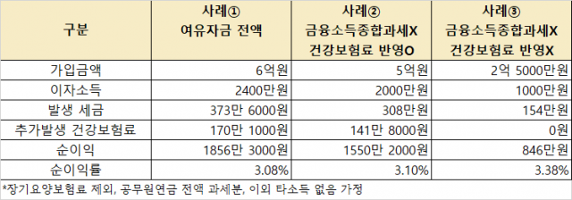
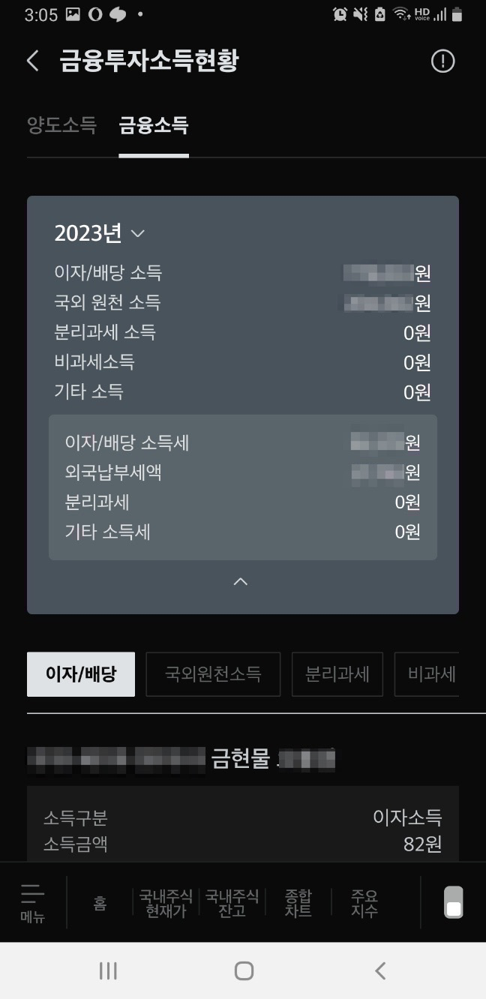
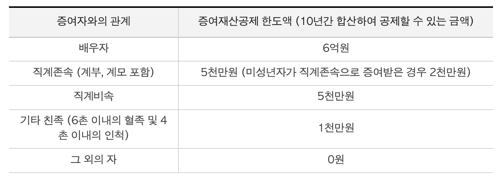

## 1. 개요

### 1.1 금융소득 종합과세란?
 
금융소득종합과세란 다양한 금융 소득(ex. 이자와 배당 등)을 합산해서 세금을 부과하는 제도이다. 금융소득 종합과세는 각종 금융 수익을 따로따로 세금을 부과하는 것이 아니라 모든 금융 수익을 종합하여 하나의 소득으로 취급하여 세액을 계산한다. 통합하여 세액을 계산하기 때문에 공정하고 효율적인 세금 부과가 가능해진다.

### 1.2 금융소득 종합과세의 대상은 누구인가?
 
모든 사람이 다 해당하는 건 아니라 개인의 종합과세 대상 금융 소득이 2천만 원(직장인)을 초과하는 경우에만 해당한다. 금융소득 종합과세 대상자가 되면 근로 소득 등 다른 소득과 합산해 다음 연도 5월에 종합소득세를 신고해야 한다.

- 가입자 별로 대상 기준이 다르다
  - `직장인`: 2,000만원
  - `지역가입자`: 1,000만원
    - 프리랜서, 자영업자

#### 1.2.1 금융 소득이 연간 2천만 원 이하인 경우

 

- 2천만 원 이하 금액에 대해서는 원천징수세율(15.4%)로 분리과세되고 종합대상 과세에서는 제외된다

#### 1.2.2 금융 소득이 연간 2천만 원 초과하는 경우

 

- 2천 만원 초과하는 금액에 대해서는 종합소득세율이 적용된다. 종합소득세율(ex. 2023년 기준)이 6 ~ 45% 이면 추가 세금이 발생하게 된다
- 2천만 원 초과분에 대해서 건강보험료도 추가로 부과될 수 있다

#### 1.2.3 참고

- [금융소득종합과세](https://www.standardchartered.co.kr/np/kr/cms/pl/se/SynthesisTaxation.jsp)
- [나무위키: 금융소득종합과세](https://namu.wiki/w/금융소득종합과세)
- [2023년 종합소득세 세율](https://www.nts.go.kr/nts/cm/cntnts/cntntsView.do?mi=2227&cntntsId=7667)
- [2023년이 가기 전에 꼭 챙겨야 할 TAX 이슈 금융소득 종합과세](https://magazine.securities.miraeasset.com/contents.php?idx=1003)
- [최우선 과제는 배당소득 분리과세…상속세율 인하는 쉽지 않을 듯 자본시장 밸류업, 머니 대이동](https://www.sedaily.com/NewsView/2D917HHJAB/GA0604?utm_source=dable)

## 2. 금융소득 종합과세 대상자인지 확인하는 방법
 

금융소득 종합과세 대상자인지 확인하는 방법은 3가지가 있다.

1. 각 금융기관에서 보내준 금융소득 명세서로 확인하는 방법

- ex. 미래에셋 기준
- `M-STOCK` > `관리하기` > `금융투자소득` > `금융투자소득현환` > `금융소득`

2. [홈택스 사이트](https://www.hometax.go.kr/)를 통해서 확인하기

- 검색 `금융소득`

3. 직접 관할 세무서를 방문하여 대상자인지 확인할 수도 있다고 한다

참고

- **[금융소득 명세 조회](https://www.hometax.go.kr/websquare/websquare.wq?w2xPath=/ui/pp/index_pp.xml&tmIdx=&tm2lIdx=&tm3lIdx=)**
- [고금리 시대, 미리 준비하는 금융소득 절세 방안](https://www.wfri.re.kr/ko/web/lounge/lounge.php?idx=1074&page_type=view&mode=view)

## 3. 소득 종합과세를 피하는 방법
 

세금은 내야 하지만, 폭탄 세금을 피하고자 스마트하게 절세하는 방법을 알아보자.

### 3.1 절세상품 우선적으로 활용하기 (ex. ISA, 연금저축, IRP)
 

- ISA (개인 종합자산 관리 계좌) 이용하기
    - 비과세, 분리과세 등 다양한 세제혜택을 받을 수 있다
    - 투자로 얻은 순이익 중 200만 원까지는 세금을 매지지 않고 그 이상의 수익은 9.9% 세율로 분리과세를 적용한다. 또한 ISA 계좌 안에 있는 상품들끼리는 손실과 이익을 합쳐서 계산해서 과세 대상 금액을 줄일 수 있다
- 연금 저축, IRP 계좌를 활용하는 방법도 고려해 보면 좋다
    - 연금 계좌에서 발생하는 소득은 연금으로 받으면 연금소득, 일시금으로 받으면 기타소득으로 과세 되므로 금융소득으로 분류되지 않는다. 인출 하기 전까지는 과세 되지 않으므로 과세이연의 효과도 얻을 수 있다.

### 3.2 배우자 또는 자녀에 자금을 분산시켜 투자하기
 

가족 내에서 한 사람에게 높은 소득이 몰리는 것보다는 여러 사람의 명의로 소득을 분산시키는 방법으로 금융소득 종합과세를 피할 수 있다. 일정 금액까지는 증여하는 경우에도 증여세를 내지 않아도 되기 때문에 이를 활용하여 세금을 줄일 수 있다.

### 3.3 배당금을 받지 않고 매도를 하자
 

금융소득이 2천만 원에 다다르기 전에 미리 금융소득을 확인해서 초과하면 미리 주식을 매도하는 것도 방법이 된다.

참고

- [주식 세금 줄이는 방법이 있다고? ISA 계좌 활용법](https://www.tossbank.com/articles/isa2)
- [고금리 시대, 미리 준비하는 금융소득 절세 방안](https://www.wfri.re.kr/ko/web/lounge/lounge.php?idx=1074&page_type=view&mode=view)
- [증여재산공제](https://www.nts.go.kr/nts/cm/cntnts/cntntsView.do?mi=6533&cntntsId=7960)

### 3.4 금융소득이 들어오는 시기를 연도별로 나누자

예금의 만기일을 한 해에 몰리지 않도록 관리하는 것도 하나의 방법이 될 수 있다.

## 4. 마무리

 

이자와 배당 소득 등으로 인해서 2천만 원 초과 시 금융소득 종합과세 대상자가 된다. 2천만 원 초과 금액에 대해서는 세금을 더 내야 하고 건강보험료도 추가로 내야 해서 주식 투자 시 꼭 이런 부분을 숙지하고 있어야 세금/건보료 폭탄을 피할 수 있다.

## 참고
- [직장인이 투자로 돈 벌었더니, 건강보험료가 올랐다...](https://blog.naver.com/e_adventure/223431929142)