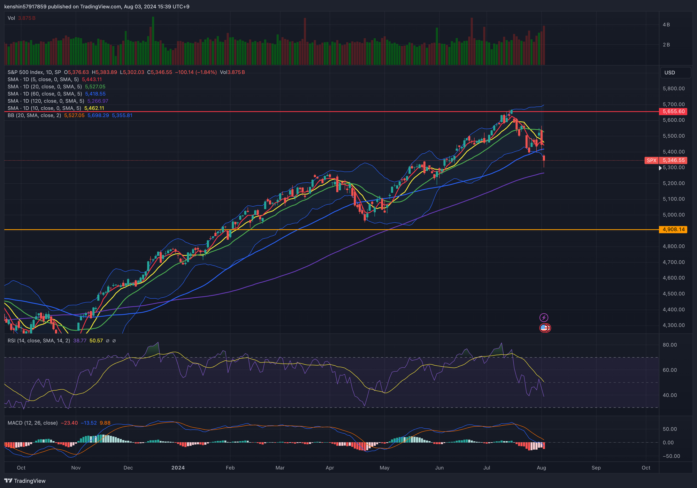
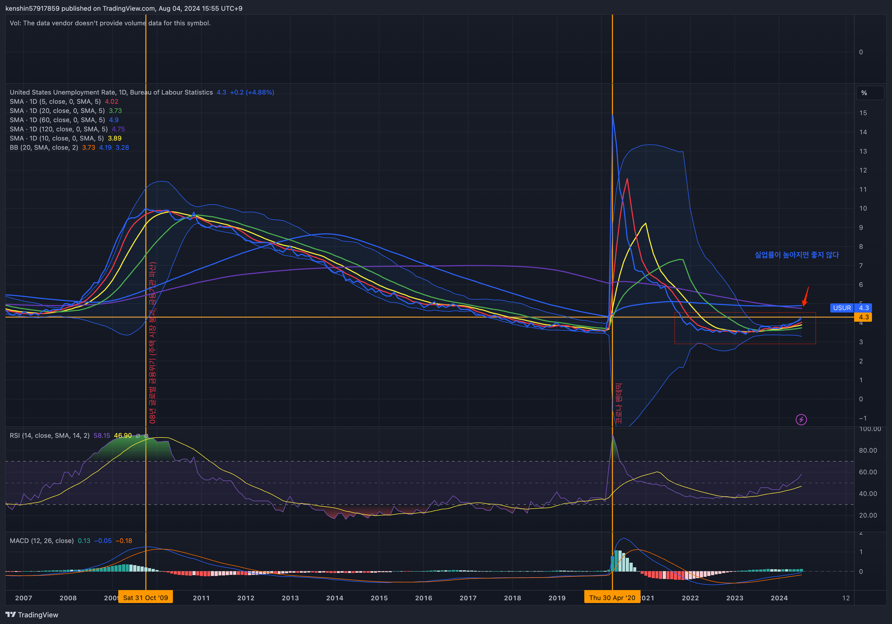
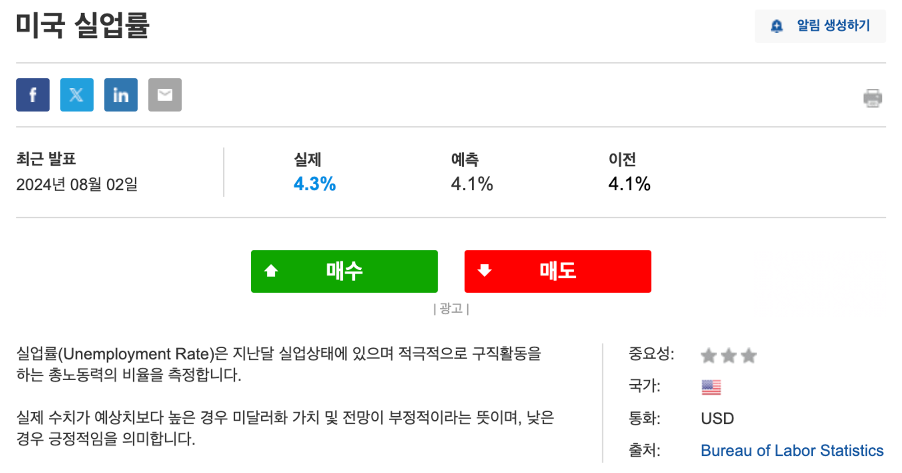
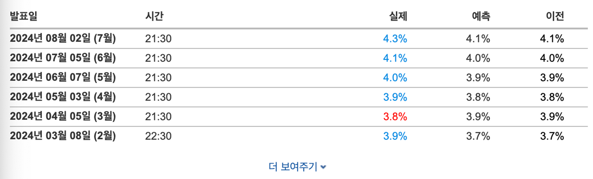
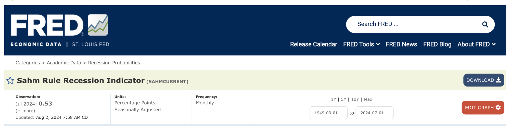
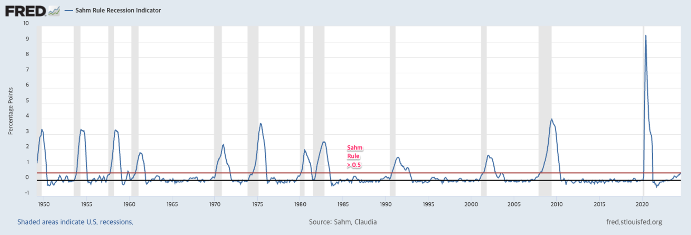
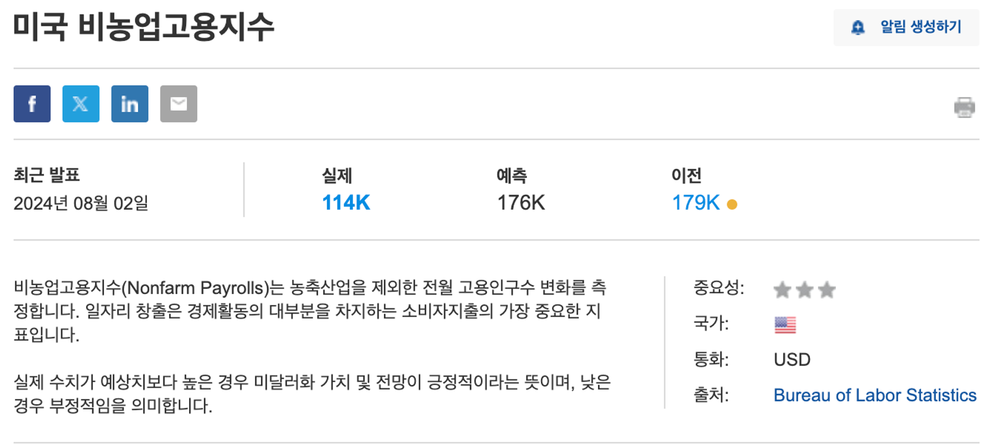
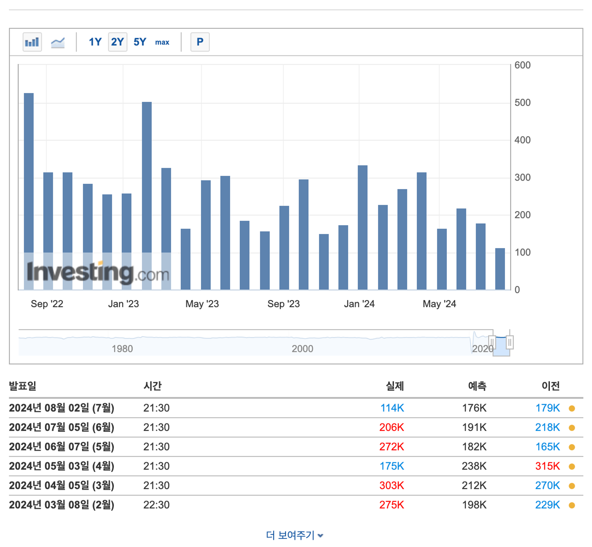
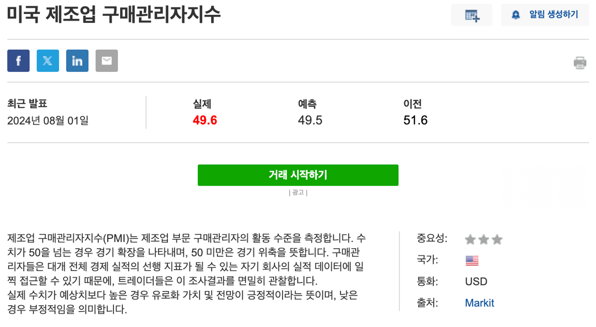
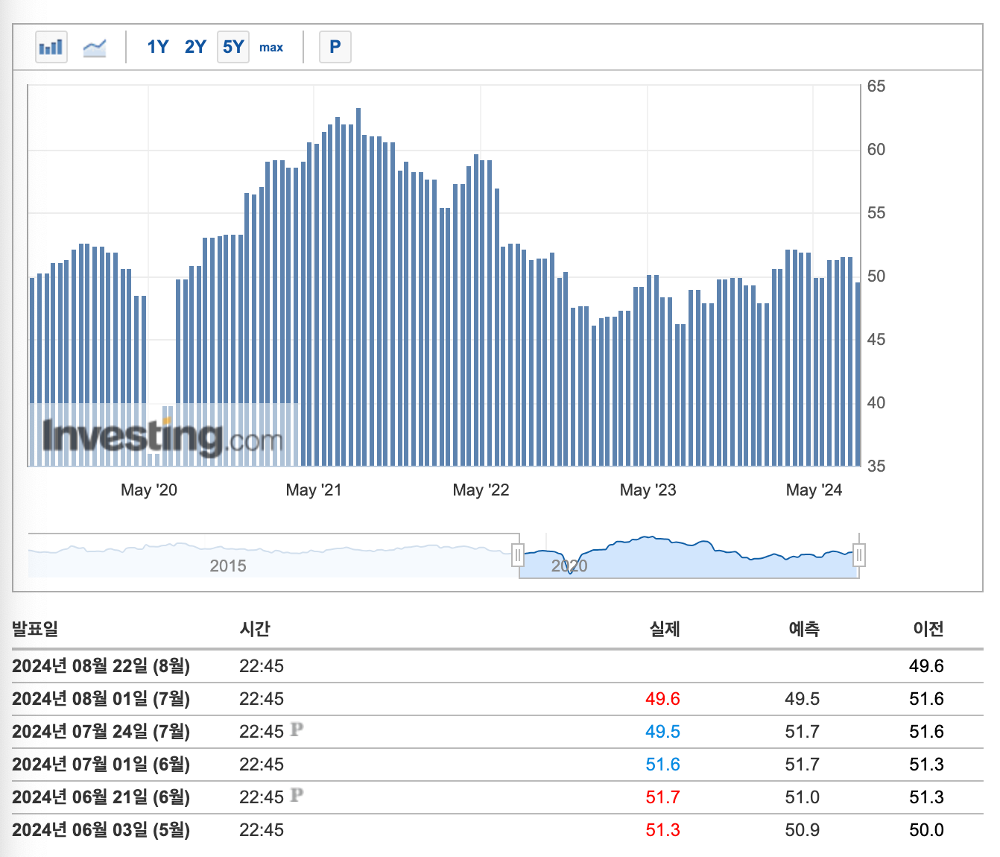

## 1. 개요

최근 나스닥(KASDAQ), S&P500이 급락하고 경제 지표(ex. 실업률)도 좋지 않아서 경제 침체 우려에 대한 얘기도 최근에 나오고 있어 경제 침체 판단은 어떻게 하고 FOMC에서는 어떻게 대응하는지 알아보도록 한다.

> 침체(recession)이란?
>
> 경제 침체는 경제 활동이 감소하고, 실업률이 상승하며, 기업의 수익이 감소하는 등 전반적인 경제 성장이 둔화하는 시기를 의미한다. 경기 침체를 진단하는 방법에는 여러 가지가 있다. 대체로 2분기 연속으로 국내총생산(GDP)이 마이너스일 때 경기 침체라고 한다. 생산이 줄고 실업률이 증가하는 게 특징이다.

## 2. 침체징조는 어떻게 판단하나?

경제 침체를 판단하기는 쉽지 않다. 경기는 매우 복잡한 구성으로 인해 한눈에 쉽게 관찰할 수 없으며, 하나의 그래프로 묘사하기 어렵기 때문이다. 그래서 한국과 미국 등 여러 나라는 경기 판단을 전문가 집단에 맡기고 있다. 한국은 통계청의 국가 통계위원회, 미국은 전미경제연구소(NBER)가 이를 담당한다. 또한, 경기 판단은 실시간이 아닌 사후적으로 이루어지는 특징이 있다. 그렇다면 우리는 어떤 지표들을 통해 경제 침체의 징조를 판단할 수 있는지 알아보자.

### 2.1 미국 실업률

실업률은 경제 상태를 평가하는 중요한 지표 중 하나이다. 실업률이 상승하는 것은 기업들이 고용을 줄이거나 해고를 늘리고 있음을 나타내며, 이는 경제 활동의 감소를 의미한다. 통상적으로 실업률이 상승하면 소비 지출이 감소하고, 이는 경제 침체로 이어질 수 있다.

과거 미국 실업률이 높았던 주요 시기를 보면, 경제적 충격이 있었던 시기나 경기 침체가 있었던 때이다.

- 글로벌 금융위기 (2007-2009)
  - 2008년의 글로벌 금융 위기는 주택 시장 붕괴와 금융 기관들의 대규모 파산으로 촉발되었다. 이로 인해 실업률이 급격히 상승했고, 2009년 10월에는 10%에 도달했다
- 코로나19 팬테믹 (2020)
  - 코로나19 팬데믹은 전 세계적으로 경제에 큰 충격을 주었고, 미국에서도 경제 활동이 급격히 중단되었다. 2020년 4월의 실업률은 대공황 이후 가장 높은 수준으로 기록되었다.

8/2 발표된 미국 실업률을 보면 예측했던 것보다 더 높게 나와서 미국 경기침체 가능성에 대한 불안으로 미국 증시가 하락세를 보였다. 7월 실업률이 4.3%를 기록했는데, 이 수치는 지난 2021년 10월 이후 2년 9개월 만에 가장 높은 수준으로 튀어 올랐다. 실업률은 넉 달 연속 상승했다.

### 2.2 삼의 법칙 (`Sahm Rule`)

삼의 법칙은 경제학자 클라우디 샴 (Claudia Sahm)이 개발한 경기침체 판단 지표이다. 삼의 법칙에 따르면 미국 실업률의 3개월 이동 평균이 최근 12개월 최저점보다 0.5% 이상 상승하면 경기침체가 매우 임박했다는 신호로 본다.

- `최근 3개월 평균 실업률` - `최근 12개월 실업률 최저점` > 0.5%

8/2 기준으로 보면 0.53으로 0.5%를 넘게 나와서 경치 침체가 임박했다고 보고 있다. 이 규칙은 1970년 이후 모든 미국 경기 침체를 예측했고 단 두 번의 오류(1959년, 1969년)가 있었지만, 이는 실제 경기 침체보다 몇 개월 일찍 신호를 보낸 것으로 보고 있다.

### 2.3 미국 비농업부문 고용 지표 (Non-Farm Payrolls)

비농업부문 고용지표는 미국 노동 시장의 건강 상태를 평가하는 데 사용되는 중요한 지표이다. 이 지표는 농업을 제외한 모든 산업에서의 고용 변화를 측정한다. 비농업부문 고용지표가 감소하면 이는 경제 활동이 축소되고 있음을 의미하며, 경기 침체의 징조로 간주될 수 있다.

8/2 발표된 미국 비농업부문 고용 지표를 보면, 예측했던 것보다 고용지표가 낮게 나왔다.

고용이 많이 되어야 경제 활동이 활성화되는데, 고용 지표가 예측한 것 외에도 점점 줄고 있어서 경기 침체의 징조로 보게 되면서 최근 미국 주식 시장이 급락한 것으로 보고 있다.

### 2.4 미국 제조업 구매관리자지수 (Purchasing Manager’s Index)

제조업 구매관리자지수(PMI)는 제조업 부문의 활동 수준을 나타내는 지표로, 경제 상태를 평가하는 중요한 요소이다. 제조업 지수가 50 이하이면 생산 활동이 감소하고 경제 침체의 징조로 해석될 수 있다.

8/1 발표된 실제 수치를 보면 예상치보다 엄청 큰 차이를 보이는 건 아니지만, 수치가 여전히 50을 밑돌아 제조업 경기가 위축세로 보고 있다.

## 3. 경기 침체에 대한 FOMC의 대응

경기 침체 징조가 보일 때 FOMC는 경제 활동을 촉진하고 침체를 방지하기 위해 금리를 인하할 수 있다. 금리 인하를 하는 이유는 다음과 같다.

- 소비와 투자 촉진
  - 금리가 낮아지면 대출 비용이 줄어들어 소비자와 기업이 더 많은 대출을 받아 소비와 투자를 증가시킬 수 있다.
- 비용 절감
  - 기업의 차입 비용이 낮아져 생산 비용이 줄어들고, 이는 고용 유지나 확대에 도움이 될 수 있다.
- 주택 시장 활성화
  - 금리가 낮아지면 주택 담보 대출 금리가 하락하여 주택 구매가 늘어나고, 이는 주택 시장을 활성화시킬 수 있다.
- 자산 가격 상승
  - 낮은 금리는 주식과 같은 자산의 가격을 높이는 경향이 있으며, 이는 소비자와 기업의 재정 상태를 개선할 수 있다.

인플레이션이 어느 정도 잡힌다고 판단해서 이미 FOMC는 올해 9월에 금리 인하 가능성을 시사했다. 하지만, 경기침체 징조가 조금씩 보여서 9월보다 더 일찍 할 수도 있지 않을까 싶다.

## 4. 마무리

경제 침체 징조는 어떤 지표를 보고 판단하는지 같이 알아보았다. 현재 실업률, 삼의 법칙, PMI 지표에서 나와 있는 것처럼 경제 침체 징조를 보이면서 미국 주식 시장이 요동을 치고 있다.

- 반도체 기업 실적 부진
  - 인텔 일자리 수천개 감축, 비용절감
  - 반도체 설계회사 `ARM` 로열티 매축액 부진
- AI 과잉 투자 우려
- 일본 금리 인상 (유동성 축소 우려)
- 대선 후보 지지율 접전 (불확실성)

미국 지표 쇼크 외에도 위와 같은 여러 가지를 요소로 요동을 치고 있는데, 어떻게 대응해야 하는지 고민이 필요하다. FOMC는 결국 금리 인하를 할 것이고 또 주식 시장이 불안하므로 투자자들이 안전자산의 비중을 더 늘릴 것으로 판단되고 그래서 아래와 같이 접근해 보려 한다.

- 안전자산 늘리기
  - 금 (`IAU`) : 주식 시장이 불해지고 있어서 금현물, ETF가 늘어날 것으로 본다
  - 배당주: 이건 금리인하 효과로 인해서 이기도 하다
  - 단장채권 (`IEF`, `TLT`)
- 부동산 (`VNQ`)
  - 금리 인하를 하게 되면 대출 금리가 낮아지기 때문에 부동산쪽이 더 활성화 될 것으로 본다
- 기술주 (`M7`)
  - 최근 기술주가 많이 요동을 치고 있는데, 조심스럽게 고려해보는 것도 괜찮지 않을 까 싶다
  - 정찰병을 보내보고 많이 내려갈 수도 있어서 손절 라인도 잘 정해서 들어가면 괜찮지 않을 까 싶다
- 현금 달러 비중을 늘릴 필요가 있다

## 5. 참고

- [경치침체, 어떻게 판단하나?](https://www.notion.so/c84ab70102c64d6fb41c73890e230cb2?pvs=21)
- [미국 7월 실업률 4.3%로 급증…거의 3년만 최고](https://news.einfomax.co.kr/news/articleView.html?idxno=4319841)
- [샴 리세션 지표](https://news.einfomax.co.kr/news/articleView.html?idxno=4066870)
- [연준 “이르면 9월 기준금리 인하 논의”…9월 인하 가능성 공식화](https://www.hani.co.kr/arti/international/america/1151686.html)
- [소몽데일리 -  나스닥 올해 첫 조정장 진입(고점대비 하락률/낙폭 기준표/연금계좌ETF 참고](https://cafe.naver.com/sosumonkey/17598)
