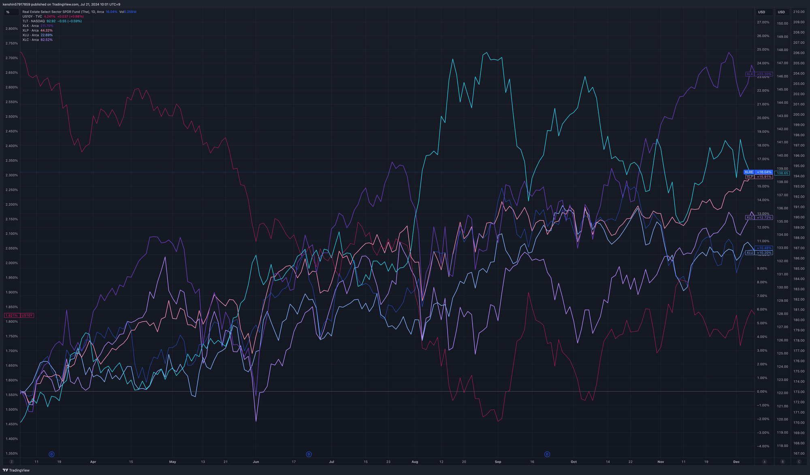

## 1. 개요

금리 인하는 중앙은행이 경제를 부양하기 위해 기준 금리를 낮추는 것을 의미한다. 이는 경제 활동을 촉진하고 소비를 증가시키기 위해 자금 조달 비용을 줄이는 역할을 한다. 미국에서는 연방준비제도(Federal Reserve) 산하의 연방공개시장위원회(FOMC)가 금리 인하 여부를 결정한다. 2024년 5월 FOMC 회의에서도 올해 하반기에 금리를 세 번 인하할 가능성을 내비쳤다. 인플레이션을 모니터링하는 지표에 따라 금리 인하의 시기와 횟수는 달라질 수 있지만, 결국 금리 인하는 이루어질 것으로 보인다. 금리 인하 시기에 우리가 주목해야 할 주식과 ETF에 대해 알아보자.

## 2. 금리인하시 오르는 주식 및 ETF

2019년 금리 인하때 어떤 섹터들이 올라갔는지 XL 시리즈 ETF로 확인해 본 그래프이다. 대표적으로 장기채권(`TLT`), 기술주(`XLK`), 통신(`XLC`), 유틸리티(`XLU`) 등이 올라간 것을 볼 수 있다.

금리 인하 시 특정 섹터와 종목들이 상대적으로 더 나은 성과를 보일 가능성이 크기 때문에 금리 인하 시기에 어떤 수혜주가 있는지 살펴보자.

### 2.1 배당주

#### 2.1.1 리츠 (REITs)

금리 하락은 부동산 투자 신탁(REITs)의 자금 조달 비용을 줄여주어 더 높은 수익을 창출할 수 있게 한다. 또한, 낮은 금리는 부동산 가격 상승을 유도할 수 있다.

- 개별주식
  - Realty Income Corporation (`O`) : 월간 배당금을 지급하는 것으로 유명한 리츠이다
  - American Tower Corporation (`AMT`) : 글로벌 무선 및 방송 커뮤니케이션 인프라 회사
  - Equinix, Inc. (`EQIX`) : 글로벌 데이터 센터이다
  - Simon Property Group, Inc. (`SPG`) : 미국에서 가장 큰 쇼핑몰 및 소매 부동산 리츠 중 하나이다
  - Prologis, Inc. (`PLD`) : 글로벌 물류 부동산 리츠이다
- 대표 ETF
  - Vanguard Real Estate ETF (`VNQ`)
  - iShares U.S. Real Estate ETF (`IYR`)

#### 2.1.2 통신주

금리 하락은 높은 배당 수익률을 제공하는 통신 서비스 회사들에 긍정적 영향을 미칠 수 있다. 또한, 자본 지출에 필요한 자금을 저렴하게 조달할 수 있다.

- 개별주식
  - Verizon Communications Inc. (`VZ`) : 미국의 주요 통신 서비스 제공업체 중이다
  - AT&T Inc. (`T`) : 미국의 대표적인 통신 및 미디어 기업이다
- ETF
  - Communication Services Select Sector SPDR Fund (`XLC`)
  - Vanguard Communication Services ETF (`VOX`)

#### 2.1.3 필수 소비재 (Consumer Staples)

금리 하락 시 경기 방어적인 성격을 가진 필수 소비재 섹터는 안정적인 수익을 제공할 가능성이 높다. 저금리 환경에서 안전한 배당을 선호하는 투자자들에게 인기가 있다.

- 개별주식
  - The Procter & Gamble Company (`PG`) : 글로벌 소비재 기업으로, 다양한 가정용 및 개인용 제품을 제조하고 판매한다
  - The Coca-Cola Company (`KO`) : 전 세계적으로 가장 유명한 음료 회사 중 하나이다
  - PepsiCo, Inc. (`PEP`) : 글로벌 식음료 기업으로, 다양한 음료와 스낵 제품을 제조하고 판매한다
  - Starbucks Corporation (`SBUX`) : 전 세계적으로 유명한 커피 체인점이다
  - McDonald's Corporation (`MCD`) : 전 세계에서 가장 큰 패스트푸드 체인 중 하나이다
- ETF
  - Consumer Staples Select Sector SPDR Fund (`XLP`)
  - Vanguard Consumer Staples ETF (`VDC`)

### 2.2 건설

금리 인하는 주택 대출 금리를 낮춰 주택 수요를 촉진할 수 있고 이는 건설업체들에게 긍정적인 영향을 미친다.

- 개별주식
  - D.R. Horton, Inc. (`DHI`) : 미국 최대의 주택 건설 회사 중 하나로, 다양한 가격대의 주택을 건설하고 판매한다
  - Lennar Corporation (`LEN`) : 미국의 주요 주택 건설 회사 중 하나이다
- ETF
  - iShares U.S. Home Construction ETF (`ITB`)

### 2.3 바이오

바이오테크 기업은 연구개발(R&D)에 많은 자본이 필요하고 금리 인하는 이들 기업의 자금 조달 비용을 낮추어 성장을 촉진한다.

- 개별주식
  - Amgen Inc. (`AMGN`) : 글로벌 바이오테크놀로지 기업으로, 혁신적인 치료제 개발에 주력하고 있다
  - Gilead Sciences, Inc. (`GILD`) : 주로 항바이러스제 연구 및 개발로 유명한 바이오테크놀로지 기업이다
- ETF
  - SPDR S&P Biotech ETF (`XBI`)
  - ARK Genomic Revolution ETF (`ARKG`)

### 2.4 유틸리티

유틸리티 섹터는 금리 하락 시 자본 지출 비용이 감소하며, 안정적인 현금 흐름과 배당을 제공하여 투자자들에게 매력적이다.

- 개별주식
  - NextEra Energy, Inc. (`NEE`) : 미국에서 가장 큰 유틸리티 회사 중 하나로, 주로 재생 가능 에너지 프로젝트에 집중하고 있다
  - Duke Energy Corporation (`DUK`) : 미국의 주요 유틸리티 회사로, 전력 및 천연가스를 생산하고 공급한다
  - Dominion Energy, Inc. (`D`) : 미국의 유틸리티 회사로, 전력 및 천연가스를 생산하고 공급한다
- ETF
  - Utilities Select Sector SPDR Fund (`XLU`)
  - Vanguard Utilities ETF (`VPU`)

### 2.5 금

금은 금리 인하 시 기회 비용이 감소하고 인플레이션 헤지 수단으로 매력적이다.

- 개별주식
  - Barrick Gold Corporation (`GOLD`) : 세계에서 가장 큰 금광업 회사 중 하나로, 금과 구리를 주로 채굴한다
  - Newmont Corporation (`NEM`) : 세계 최대의 금광업 회사 중 하나로, 금과 구리, 은 등을 채굴한다
- ETF
  - VanEck Vectors Gold Miners ETF (`GDX`)
  - SPDR Gold Shares (`GLD`)
  - iShares Gold Trust (`IAU`)
  - iShares Silver Trust (`SLV`)

### 2.6 유망주/소형주

금리 인하는 자금 조달을 용이하게 하여 소형주와 유망주의 성장을 촉진할 수 있다.

- 개별주식
  - Tesla, Inc. (`TSLA`) : 전기차, 에너지 저장 솔루션, 로봇 제품을 설계, 제조 및 판매하는 글로벌 리더이다
- ETF
  - ARK Innovation ETF (`ARKK`) : 혁신적인 기술과 기업에 투자하는 ETF로, 인공지능, 로보틱스, 유전자 편집, 에너지 저장, 블록체인 기술 등 다양한 혁신 분야에 투자한다
  - iShares Global Clean Energy ETF (`ICLN`) : 전 세계 클린 에너지 기업들에 투자하는 ETF이다
  - First Trust NASDAQ Cybersecurity ETF (`CIBR`) : 사이버 보안 기업들에 투자하는 ETF이다
  - iShares Russell 2000 ETF (`IWM`) :  iShares가 운용하는 상장지수펀드(ETF)로, Russell 2000 지수를 추종한다

수익도 좋을 수 있지만, 하락폭도 크기 때문에 주의가 필요하다

### 2.7 기술 / 빅테크

기술주는 성장 잠재력이 높고, 금리 인하는 미래 수익의 현재 가치를 증가시켜 이들 주식에 유리하게 작용한다.

- 개별주식
  - Apple Inc. (`AAPL`) : iPhone, iPad, Mac, Apple Watch, Apple TV 등 혁신적인 전자 기기와 함께 iOS, macOS, watchOS, tvOS와 같은 소프트웨어를 개발하는 글로벌 기술 기업이다
  - Microsoft Corporation (`MSFT`) : 전 세계적으로 사용되는 소프트웨어, 서비스, 디바이스 및 솔루션을 개발하는 글로벌 기술 기업이다
  - Adobe Inc. (`ADBE`) : 디지털 미디어 및 마케팅 솔루션을 제공하는 글로벌 소프트웨어 기업이다
  - NVIDIA Corporation (`NVDA`) : 그래픽 처리 장치(GPU)와 AI 컴퓨팅 기술의 선도적인 개발자 회사이다
  - Alphabet Inc. (`GOOGL`) : Google의 모회사로, 검색 엔진, 광고, 클라우드 컴퓨팅, YouTube, Android 운영 체제 등을 포함한 다양한 기술 및 인터넷 서비스를 제공한다
- ETF
  - Invesco QQQ Trust (`QQQ`)
  - iShares Expanded Tech-Software Sector ETF (`IGV`)
  - Technology Select Sector SPDR Fund (`XLK`)
  - Magnificent Seven ETF (`MAGS`)

## 3. 금리인하시 포트폴리오 구성

개인마다 차이가 있겠지만, 금리인하시 투자 포트폴리오를 어떻게 구성하면 좋은지 같이 고민해 보면 좋을 듯하다. 금리인하이기 때문에 모든 비중을 금리인하 수혜주로 구성하기보다는 아래와 같이 다른 투자자산의 비중을 줄이고 수혜주를 큰 리스크 없는 한에서 구성하는 게 좋을 수 있다.

| 분류                             | 전   | 후   |
| -------------------------------- | ---- | ---- |
| 시장지수                         | 30%  | 20%  |
| 빅테크/우량 성장주               | 40%  | 40%  |
| 채권                             | 20%  | 20%  |
| 금                               | 10%  | 10%  |
| 금리인하 수혜주 (배당주, 소형주) | 0%   | 10%  |

## 4. 마무리

이번 포스팅에서는 금리 인하 시 주목해야 하는 섹터에 대해서 알아보았다. 투자 포트폴리오 구성은 이러한 수혜주들을 적절히 배분하여 리스크를 관리하고 수익성을 극대화하는 것이 중요할 것 같다. 다들 성투 하세요

## 5. 참고

- [금리인하 전 막차타라? 소외주들의 반격시작될까?](https://www.youtube.com/watch?v=4g-r73Hcd3g&t=471s)
