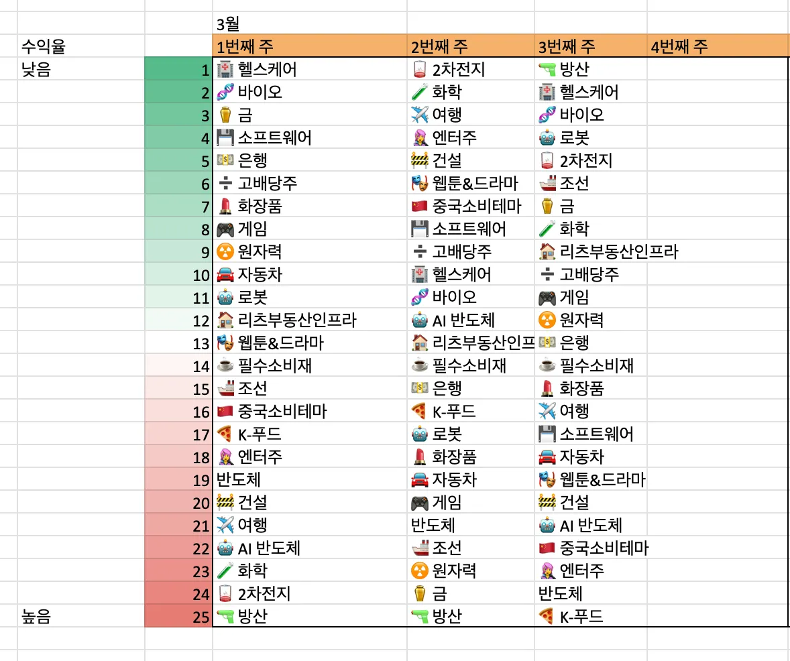
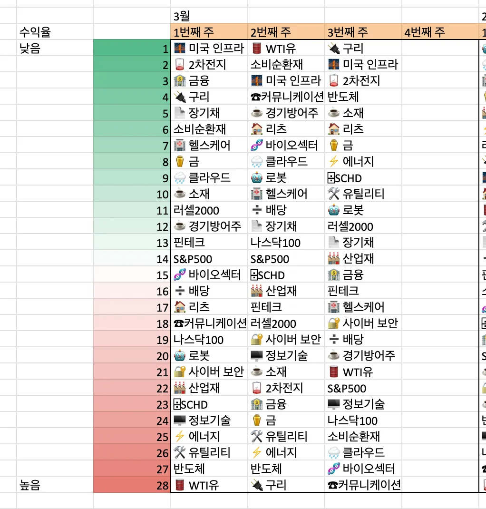
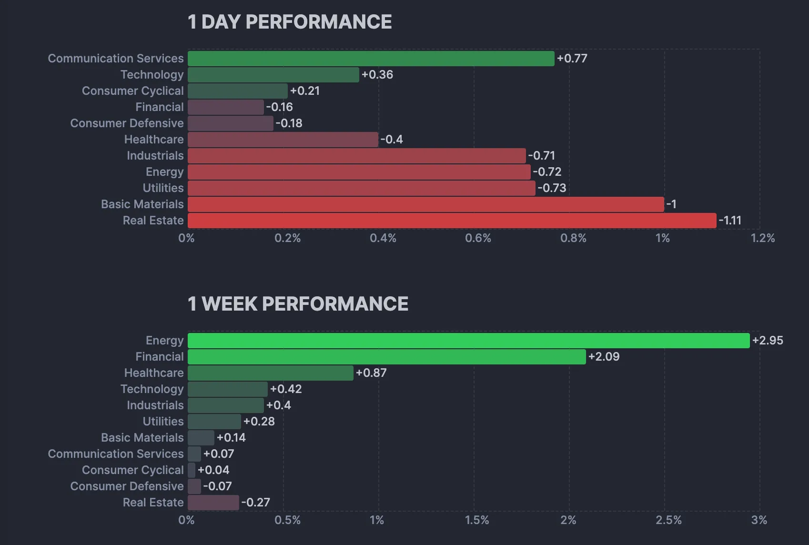
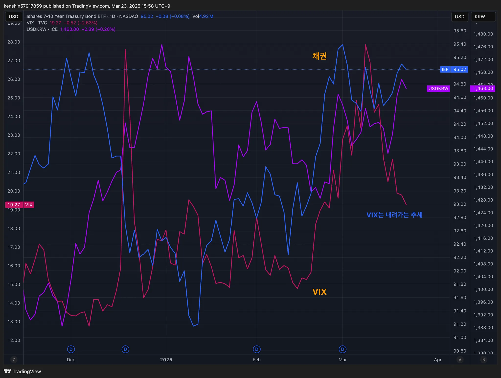
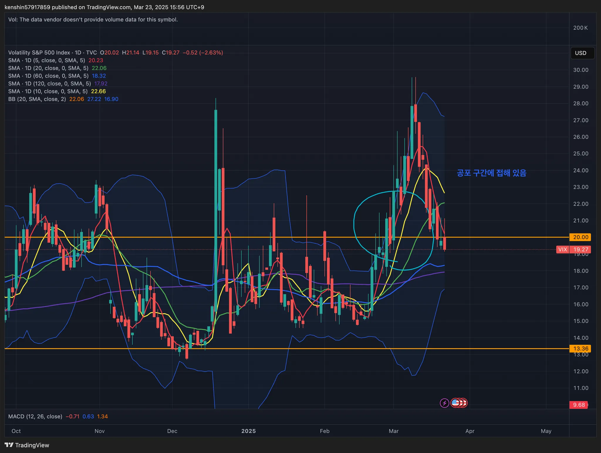
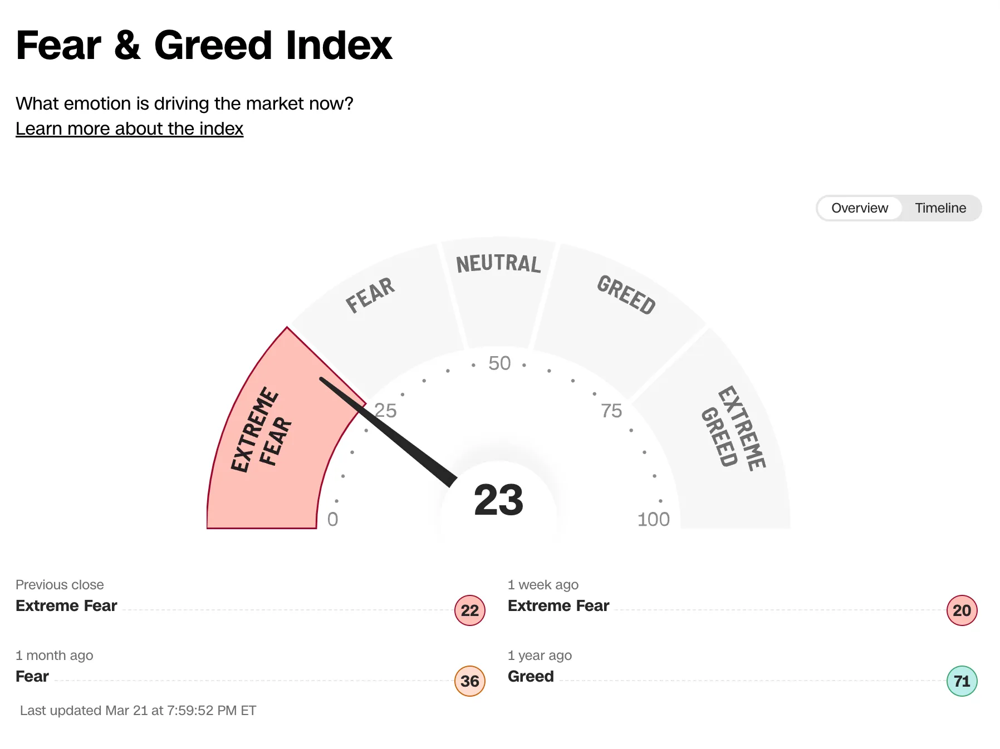
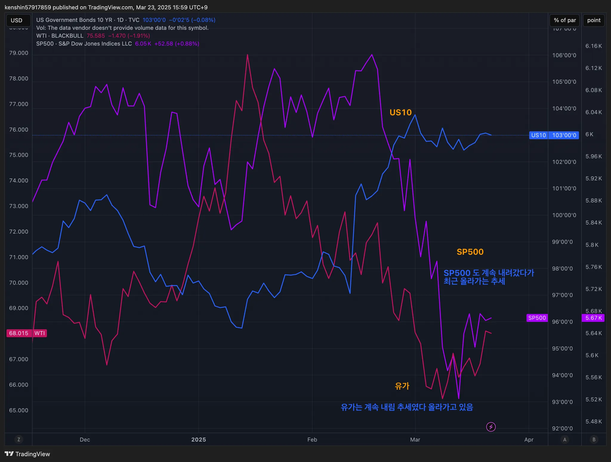
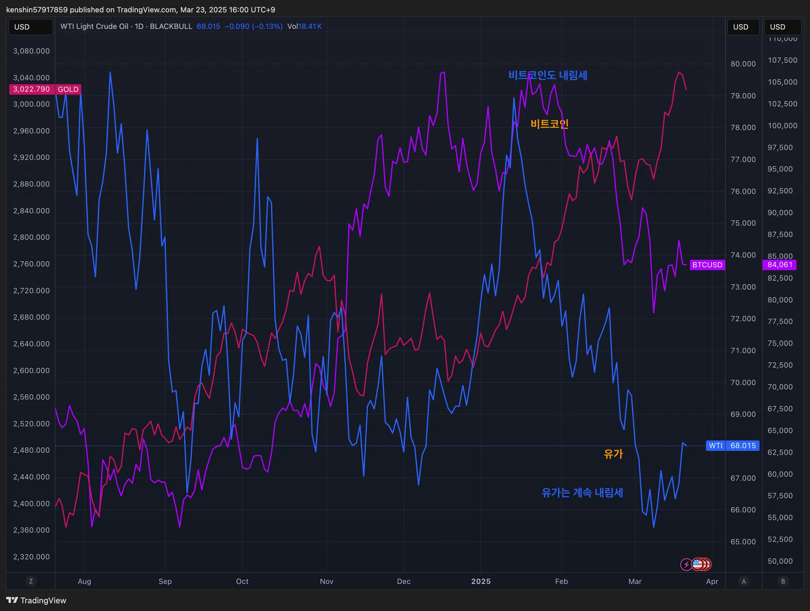

## 섹터별 수익률

> ETF 수익률을 기준으로 섹터별 수익률을 정렬하고 시간이 지남에 따라 현재 시장에서 주목받는 섹터가 무엇인지 파악하기 위해 아래와 같이 수익률을 정리해보았다.
>
> 단순히 수익률 기준으로 정렬을 하고 있어서 해당 섹터가 시장에서 가장 주목 받고 있다고 단정하기는 어렵지만, 투자하는 데 참고 지표로 사용하면 될 것 같다.

## 1. 국내 ETF

### 섹터별 ETF 종목

| **섹터** | **종목**               | **섹터**      | **종목**              |
| ---------- | ---------------------- | ----------------- | ---------------------- |
| 🔫방산      | PLUS K방산             | ☕️필수소비재       | KODEX 필수소비재       |
| ☢️원자력    | HANARO 원자력iSelect   | 🎮게임             | KBSTAR 게임테마        |
| ⚱️금        | ACE KRX금현물          | 🏠리츠부동산인프라 | TIGER 리츠부동산인프라 |
| 🏥헬스케어  | TIGER 헬스케어         | 💾소프트웨어       | TIGER 소프트웨어       |
| 🚢조선      | HANARO Fn조선해운      | 🍕K-푸드           | HANARO Fn K-푸드       |
| 🤖로봇      | KODEX K-로봇액티브     | ✈️여행             | TIGER 여행레저         |
| 👩‍🎤엔터주   | HANARO Fn K-POP&미디어 | 🇨🇳중국소비테마    | TIGER 중국소비테마     |
| ➗고배당주  | PLUS 고배당주          | 🚘자동차           | KODEX 자동차           |
| 💵은행      | KODEX 은행             | 반도체            | KODEX 반도체           |
| 🚧건설      | TIGER 200 건설         | 💄화장품           | TIGER 화장품           |
| 🧬바이오    | KODEX 바이오           | 🎭웹툰&드라마      | KODEX Fn웹툰&드라마    |
| 🪫2차전지   | TIGER 2차전지테마      | 🤖AI 반도체        | TIGER AI반도체핵심공정 |
|            |                        | 🧪화학             | KODEX 에너지화학       |

## 2. 미국 ETF

### 섹터별 ETF

| 섹터         | **티커** | **섹터**      | **티커** |
| ------------ | -------- | ------------- | -------- |
| 🤖로봇        | BOTZ     | 핀테크        | FINX     |
| 🌧️클라우드    | CLOU     | 소비순환재    | XLY      |
| 🏥헬스케어    | XLV      | 🧬바이오섹터   | IBB      |
| ⚱️금          | GLD      | ⌹SCHD         | SCHD     |
| 🏭산업재      | XLI      | 🏦금융         | XLF      |
| ⚡️에너지      | XLE      | S&P500        | VOO      |
| 러셀2000     | IWM      | ☕️경기방어주   | XLP      |
| 🔌구리        | COPX     | 🔐사이버 보안  | CIBR     |
| 🌉미국 인프라 | PAVE     | ☕️소재         | XLB      |
| 🏠리츠        | XLRE     | 반도체        | SOXX     |
| 🛢️WTI유       | CL       | 🖥️정보기술     | XLK      |
| 🛠️유틸리티    | XLU      | 나스닥100     | QQQ      |
| 📄장기채      | TLT      | ☎커뮤니케이션 | XLC      |
| ➗배당        | DIA      | 🪫2차전지      | LIT      |

## 3. 주요 지표

### 3.1 환율, 채권, VIX

- 공포구간이지만, VIX도 내려가는 추세인 듯하다
  - 미국 회사 내부자들도 조금씩 매수하고 있다고 언급되기도 했음

### 3.2 S&P500, US10, WTI유가

- S&P500은 조금씩 올라가는 추세가 아닌 가 싶다

### 3.3 BTC, GOLD, WTI

- 골드는 계속 올라가는 추세에 있다
- 비트코인, 유가는 주가와 비슷하게 조금씩 회복하는 추세이다

## 4. 주요 트렌드 정리

### 주요 일정 (3/24 ~ 3/28)

|      | 월                      | 화                                                           | 수                                                           | 목                                                           | 금                                                           |
| ---- | ----------------------- | ------------------------------------------------------------ | ------------------------------------------------------------ | ------------------------------------------------------------ | ------------------------------------------------------------ |
| 일정 | 🇰🇷 한덕수 탄핵사건 선고 | 🇺🇸 소비자신뢰지수 🇺🇸 알래스카 주지사 방한 🇨🇳 보아오 포럼 개회 (~28) | 유럽폐암학회(ELCC) 개최 (~29) 🇰🇷 이재명 선거법 위반 2심 선고 | 🇺🇸 4분기 경제상장률 GDP 🇺🇸 신규 실업수당 청구건수 🇺🇸 미 할리우드 AI 영화제 개최 | 🇺🇸 개인소비지출(PCE) 물가지수 🇺🇸 경영진 시진핑 만남(예정) |
| 실적 |                         | 🇨🇳 BYD                                                       | 🇺🇸 DLTR                                                      | 🇺🇸 LULU                                                      |                                                              |

Upcoming 이벤트: 🇰🇷 공매도 재개(3/31), 🇰🇷 3월 수출입(4/1), 🇺🇸 🇰🇷 상호관세(4/2), 🇺🇸 3월 CPI(4/10)

- 🇰🇷 한덕수 탄핵사건 선고
- 🇰🇷 이재명 선거법 위반 2심 선고
- 3/24일 미국과 러시아, 우크라이나가 사우디아라비아에 모인 뒤 미국, 러시아, 미국, 우크라이나 회담이 각각 개최될 예정
- 🇰🇷 넥스트레이드 3/24일부터 350개 종목으로 확대할 예정

## 5. 참고

- [증시일정](https://securities.miraeasset.com/hkr/hkr1003/n13.do)
- [한국 결제캘린더](https://kr.investing.com/economic-calendar/)
- [주말브리핑 - 금리, 중국, 금](https://contents.premium.naver.com/hsacademy/hsacademy1/contents/250216155810859os)
- [기화가거 주간일정 정리](https://contents.premium.naver.com/vrally/vrally55/contents/250324032004130ec)
- [수익의 신 채널 주간 정리](https://contents.premium.naver.com/season/god/contents/250323151121298wg)
