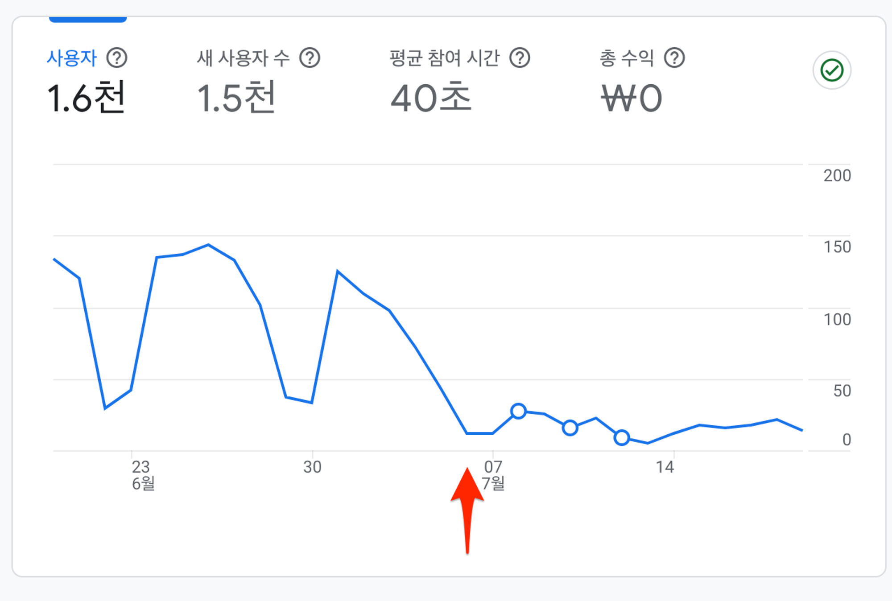
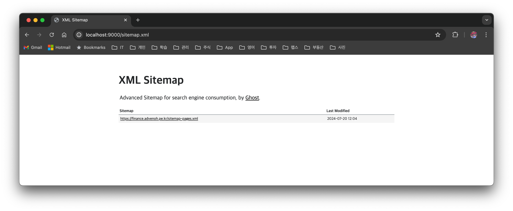
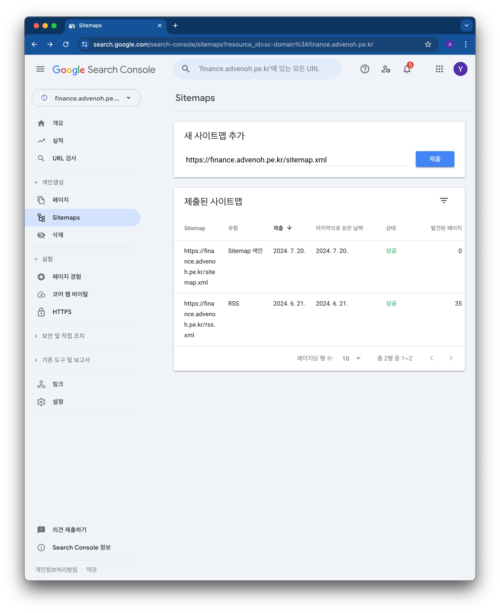

## 1. 개요

기존 [IT 블로그](https://blog.advenoh.pe.kr/)의 Gatsby 테마를 변경한 이후부터 검색 노출이 확 줄게 되어서 구글 검색에 더 많이 노출하려면 어떻게 하는지 알아보았다.

엔진에 많이 노출하기 위해서는 검색 엔진이 크롤링을 잘할 수 있도록 도와주어야 한다. 그러기 위해서 다음 2가지 작업을 하면 된다.

1. 내 웹사이트에 대한 `sitemap.xml` 제공
2. `robots.txt`



## 2. Gatsby GEO 최적화하기

### 2.1 Gatsby 블로그에 sitemap 생성하기

`sitemap.xml`은 검색엔진이 사이트의 구조를 이해하고 크롤링할 수 있도록 도와주는 파일이다. Gatsby에서 `sitemap.xml` 을 생성하는 방법은 다음과 같다.

`gatsby-plugin-advanced-sitemap`를 설치한다

```bash
> npm install gatsby-plugin-advanced-sitemap --save --force
```

`gatsby-config.js` 파일에 플러그인을 추가한다.

```jsx
plugins: [
    `gatsby-plugin-advanced-sitemap`
]
```

### 2.2 robots. 설정하기

`robots.txt` 파일은 검색엔진 봇이 어떤 페이지를 크롤링하고 어떤 페이지를 크롤링하지 말아야 할지를 지정하는 파일이다. Gatsby에서 `robots.txt`를 설정하는 방법은 다음과 같다.

`gatsby-plugin-robots-txt`를 설치한다.

```bash
> npm install gatsby-plugin-robots-txt --save --force
```

`gatsby-config.js` 파일에 플러그인을 추가하고 `host`와 `sitemap`에 대한 설정도 추가한다.

```jsx
plugins: [
    {
      resolve: 'gatsby-plugin-robots-txt',
      options: {
        host: '<https://stock.advenoh.pe.kr/>',
        sitemap: '<https://stock.advenoh.pe.kr/sitemap.xml>',
        policy: [{ userAgent: '*', allow: '/' }],
      },
    }
]
```

### 2.3 로컬환경에서 확인해보기

실제 production에 배포하는 것처럼 로컬환경에서 배포한다.

```bash
> gatsby build && gatsby serve
```

`sitemap.xml`, `robots.txt` 둘다 public 아래 생성된 것을 확인할 수 있다.



## 3. 구글 Search Console에 sitemap 등록하기

`sitemap.xml`, `robots.txt` 를 생성한 후, 이를 Google Search Console에 등록하여 구글이 블로그의 구조를 이해하고 크롤링하도록 한다. 등록하는 절차는 다음과 같다.

1. Google Search Console에 로그인한다.
2. 대시보드 > Sitemaps 메뉴를 클릭한다
3. 새 사이트맵 추가에 sitemap.xml를 찾을 수 있는 URL 경로를 입력한다
4. 제출 버튼 클릭한다.



조금 더 구글 검색에서 내 블로그가 더 많이 노출되기를 기대해 본다.

## 4. 참고

- [Gatsby 블로그에 advanced-sitemap 플러그인 추가하는 법](https://janeljs.github.io/blog/gatsby-advanced/)
- [Gatsby 블로그 SEO 설정하기](https://chamdom.blog/gatsby-blog-seo-1/)
