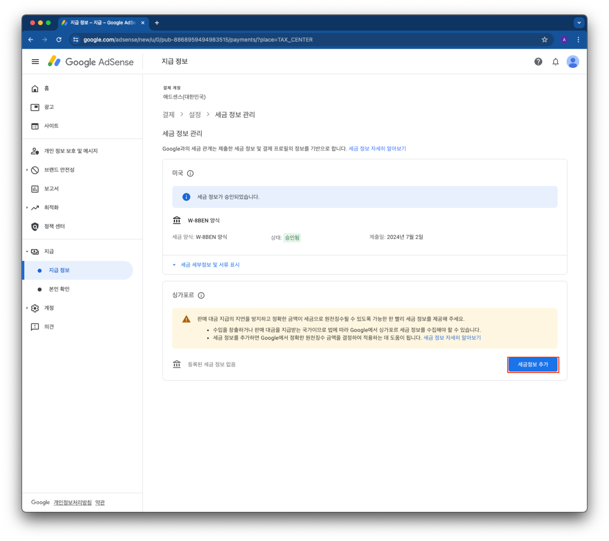
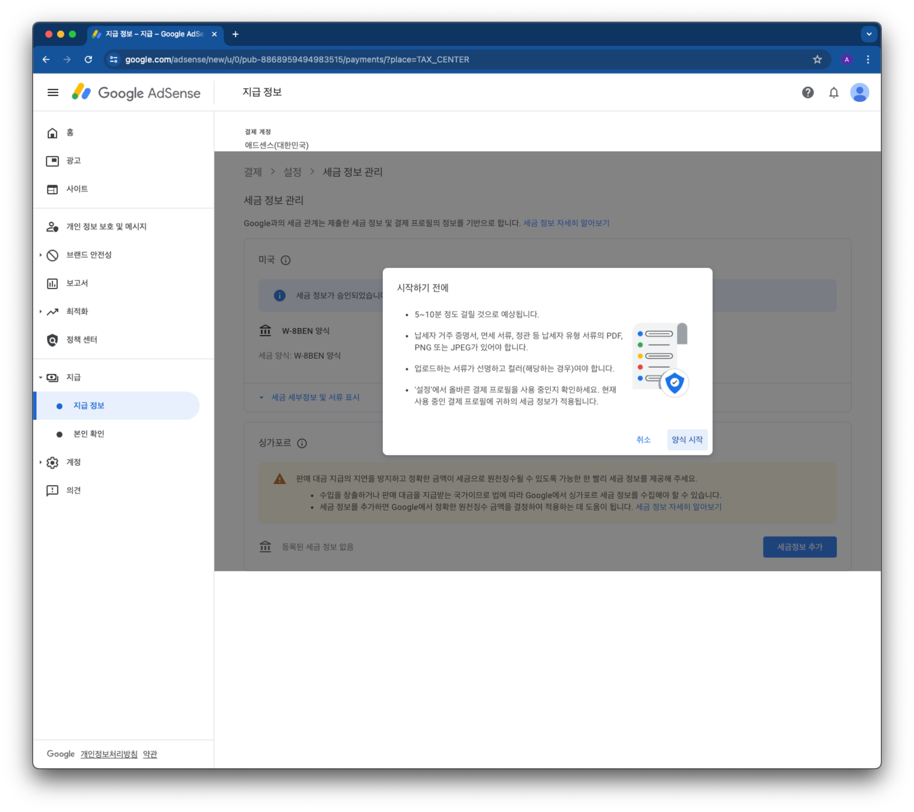
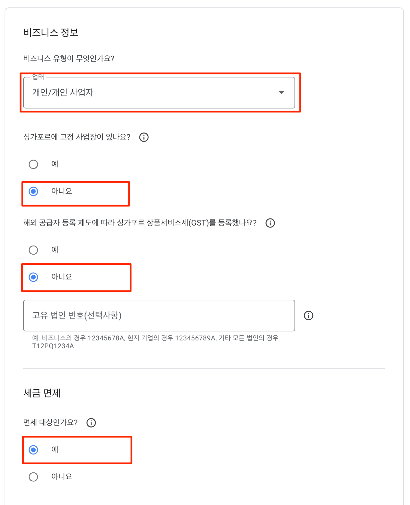
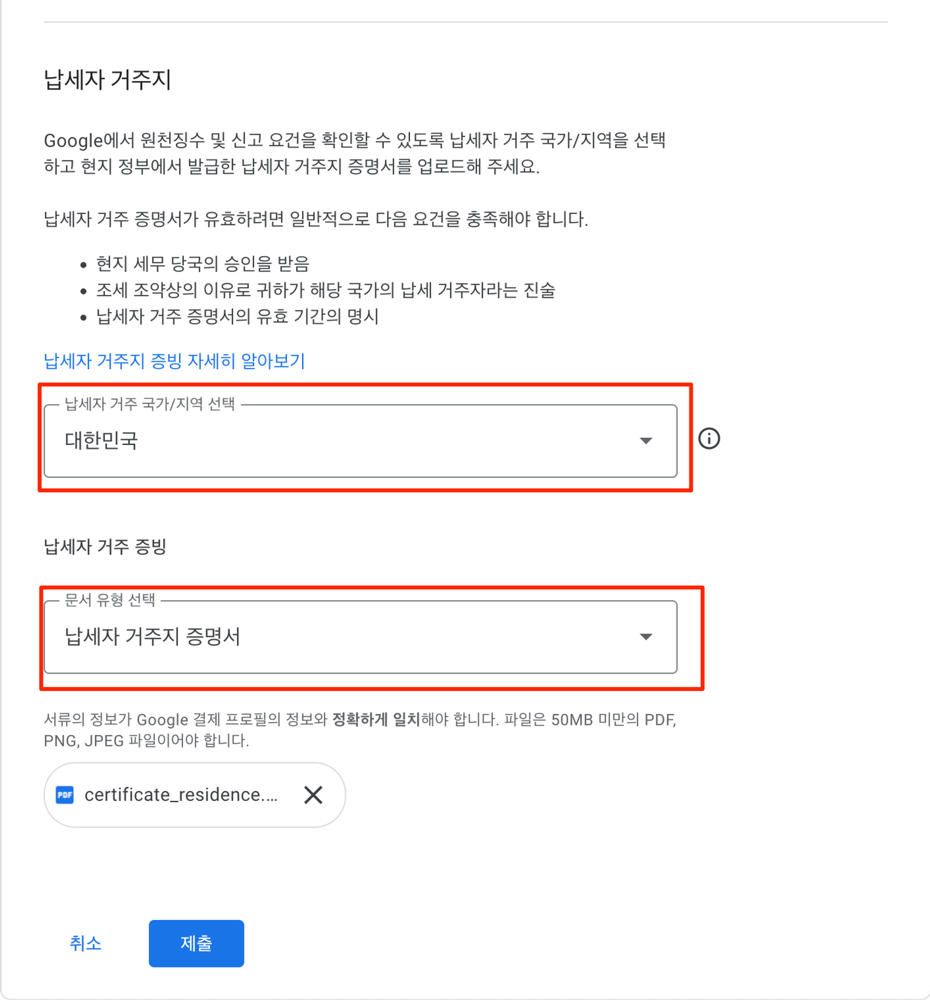
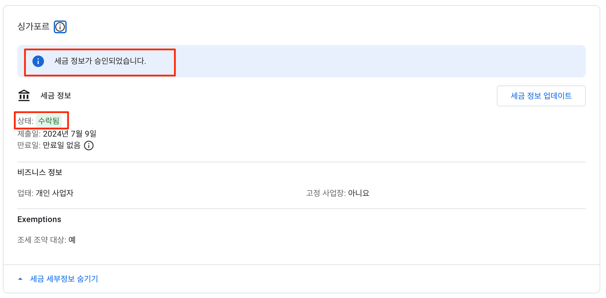
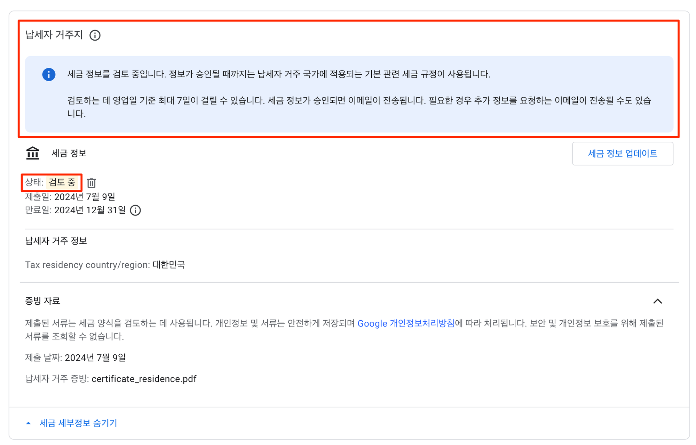
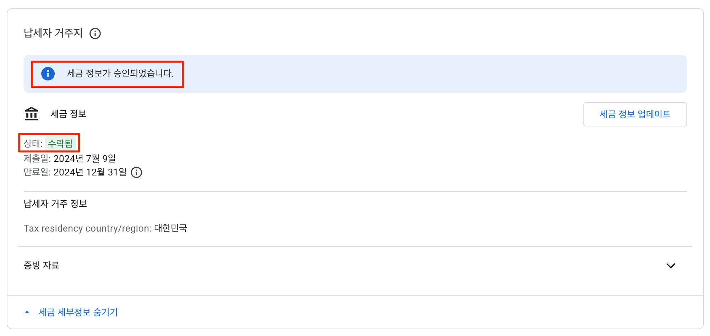

## 1. 개요

[미국 세금 정보 제출](https://stock.advenoh.pe.kr/구글-adsense-미국-세금-정보-입력하는-방법/)에 이어서 싱가포르 세금 정보도 입력한다. 싱가포르 세무 정보 입력시 반드시 사전에 해야 하는 건 `거주자증명서` 를 미리 발급 받아야 한다. `거주자증명서` 발급은 국세청 홈택스 홈페이지에서 인터넷으로 발급 가능하고 자세한 신청 방법은 아래 링크를 참고해주세요.

- [구글 Adsense에 필요한 거주자증명서 발급 신청하는 방법](https://stock.advenoh.pe.kr/구글-adsense에-필요한-거주자증명서-발급-신청하는-방법/)

싱가포르 세금 정보는 어떻게 제출하는지 같이 알아보자.

**`지급`** > **`지급 정보`** > **`세금 정보 관리` 목록 중에 싱가포르 `세금정보 추가` 버튼을 클릭한다.**

## 2. 싱가포르 세금 정보 입력하기

`시작하기 전에` 창에서 `양식 시작` 버튼을 클릭하여 세금 정보 입력을 시작한다.

### 2.1 비즈니스 정보

- 비즈니스 유형: 사업자가 아니라서 `개인/개인 사업자`를 선택한다
- 싱가포르에 고정 사업장이 있나요?
  - 싱가포르에 사업장이 없으므로 `아니요` 를 선택한다
- 해외 공급자 등록 제도에 따라 싱가포르 상품서비스를 등록했나요?
  - 싱가포르에서 사업을 하는 것이 아니라서 `아니요` 를 선택한다
- 세금 면제 대상인가요?
  - 싱가프르에 거주하며 사업을 하고 수익을 내는 것이 아니므로 `예`를 선택한다.

### 2.2 납세자 거주자

- 납세자 거주 국가/지역 선택
  - `대한민국`을 선택한다
- 납세자 거주 증빙 문서 유형
  - `납세자 거주지 증명서`를 선택하다
  - `업로드` 버튼을 클릭하여 국세청에서 발급 받은 `거주자증명서`를 첨부한다

`제출` 버튼을 클릭해서 최종적으로 세금 정보를 제출을 한다.

## 3. 마무리

세금 정보를 제출하면 위와 같이 `세금 정보가 승인되었습니다`라고 표시된다.

> 세금 정보가 승인되었다고 해서 다 승인 된 건 아니고 제출한 납세자 거주지 증명서까지 승인이 되어야 최종 완료된 것이다.

납세가 거주지도 승인이 되면 이메일로도 메시지를 받게 되고 `지급` > `지급 정보` > `세금 정보 관리` 목록에서 확인할 수 있다.

## 4. 참고

- [구글 애드센스 싱가포르 세금정보 제출방법, 승인 완료까지](https://orangeyoung-37.tistory.com/98)
- [구글 애드센스 <싱가포르 세금 정보 제공> 추가 설정 절차](https://e-rs.tistory.com/entry/구글-애드센스-싱가포르-세금-정보-제공-추가-설정-절차)
