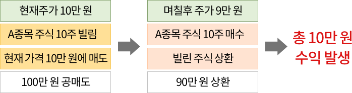
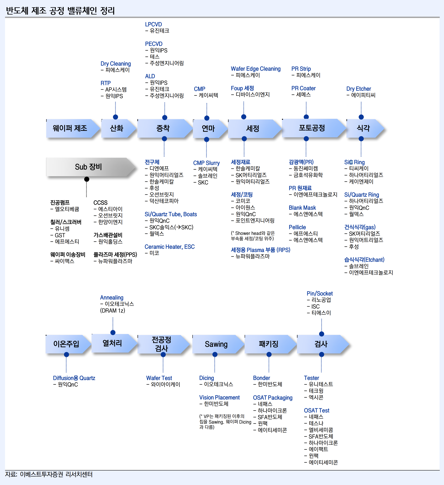
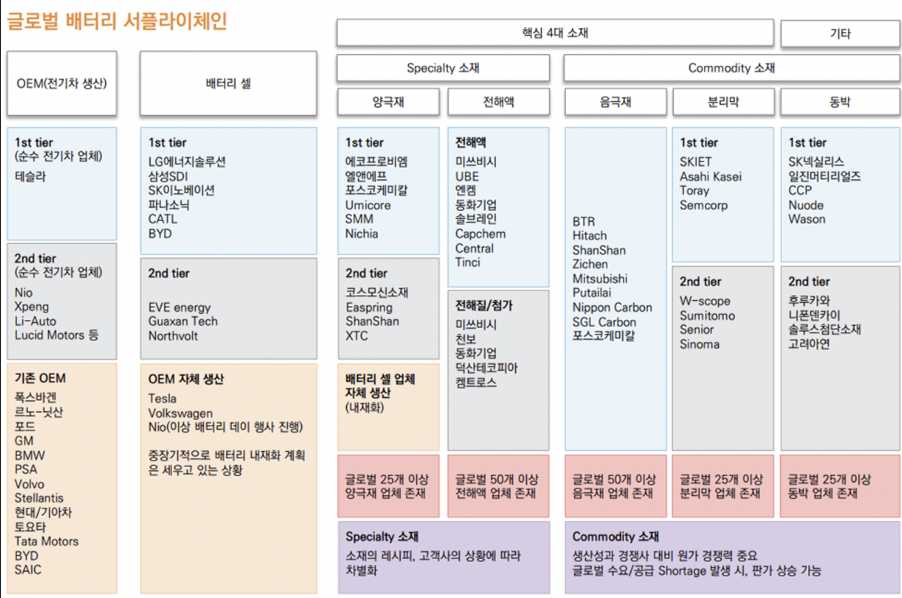
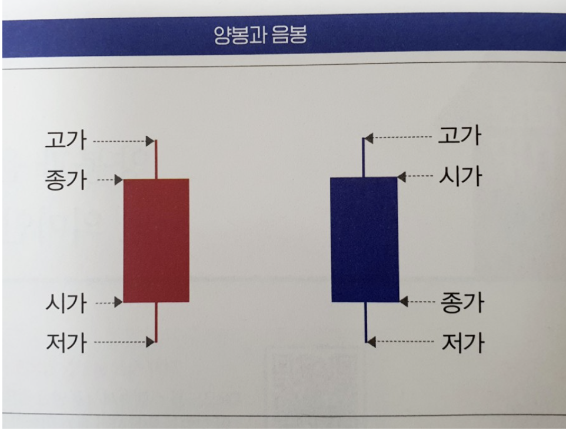
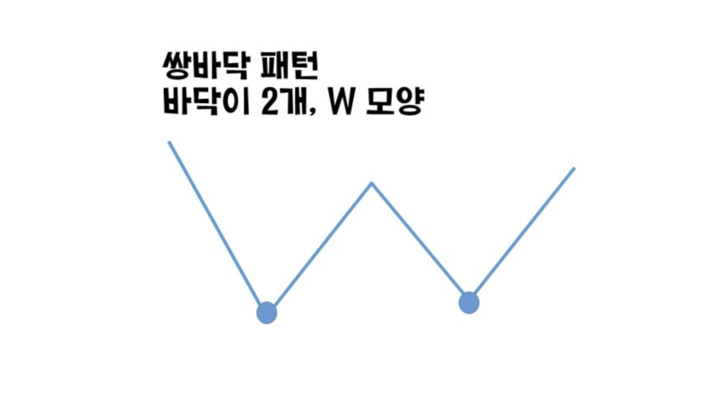
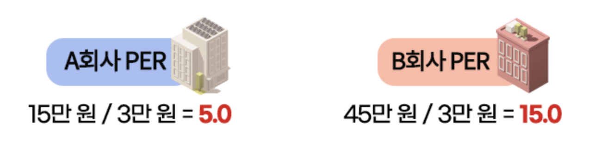

스스로 이해력을 높이기 위해서 투자 관련 용어를 정리해둔다.

## ㄱ
- ### `가치주`
    - 저평가된 기업의 주식
    - 주식 시장에서 가장 많이 사용되고 있는 투자 스타일이고 본래 가치보다 낮은 가격에 거래되는 주식을 사는 것이다
    - 4개 지표 (매출액, 매출총이익, 영업이익, 순이익)가 시가총액 대비 높으면 그 기업은 저평가된 가치주로 볼 수 있다
- ### `가치투자`
    - 주가가 기업의 가치보다 낮은 곳, 즉 '저평가되어 있는 곳'에 투자하는 걸 말한다
- ### `기술주`
    - 기술을 기반으로 만들어져 미래에 성장할 만한 기업의 주식을 의미한다
- ### `공매도` (`Short selling`)
    - **A종목의 하락을 예상**하고 미리 주식을 빌려 현재 가격에 매도를 한 뒤 주가가 하락하게 되면 매수하여 빌린 주식을 갚아 수익을 실현하게 되는 구조이다
    - 
    - 공매도에는 두가지 유형이 있다 (`무차입 공매도`, `차입 공매도`)
    - 공매도를 진행하기 위해선 `대주(대차)` 거리가 함께 활용된다
    - https://ecodemy.cafe24.com/nosell.html
    - https://www.kcie.or.kr/mobile/guide/24/31/web_view?series_idx=&content_idx=1234
- ### `고PER주`
    - PER이 높은 기업
    - 그 회사에서 벌어들이는 수익에 비해 주가가 높게 거래되고 있는 기업의 주식
- ### `골디락스` (Goldilocks)
    - 경제 용어로, 높은 성장률과 낮은 인플레이션이 조화를 이루는 이상적인 경제 상태를 의미한다
    - 이 용어는 영국의 동화 《골디락스와 세 마리 곰》(Goldilocks and the Three Bears)에서 유래되었다
    - 동화에서 골디락스가 너무 뜨겁지도, 차갑지도 않은 '딱 적당한' 죽을 발견하는 것처럼, 경제에서도 과열되지 않으면서도 침체되지 않은 상태를 골디락스 경제라고 부른다
- ### `경기방어주`
    - 경기의 상승이나 하락과 상관없이 일정한 이익을 유지하는 기업을 의미한다
    - 대표적인 산업으로는 통신, 음식료, 유틸리티, 게임, 제약산업등이 있다
- ### `기저효과`
    - 작년 혹은 직전 분기 실적이 좋지 않아서 이번 분기의 조그마한 실적호전에도 상대적으로 실적이 좋아 보이는 효과를 의미한다

## ㄴ

- ### `나스닥` (`Nasdaq`)
    - 시가총액 기준 뉴욕증권거래소(NYSE)에 이은 세계 2위 증권거래소이다
    - 미국의 벤처기업들이 자금 조달을 쉽게 할 수 있도록 시스템을 갖추었고 1971년 설립 당시부터 컴퓨터를 이용한 자동 거래 시스템을 구축했다.
- ### `난폭 과대주`
    - 합리적인 이유 없이 하락폭이 매우 큰 주식
- ### `눌림목`
    - 상승 추세에 있던 주가가 다양한 요인으로 인해서 일시적으로 하락하는 현상을 말한다. 즉 흔히 말하는 조정 받는 시점을 의미한다
    - `눌림목 매매`란, 이 주가가 조정받는 시점에서 주식을 거래해 수익을 창출하는 기법을 말한다
    - 
- ### `뇌동매매`
    - 투자자의 독자적이고 확실한 시세 예측에 의한 매매거래가 아닌 남을 따라하는 매매를 말한다
    - 즉, 투자자 자신이 확실한 예측을 갖지 못하고 시장전체의 인기나 다른 투자자의 움직임에 편승하여 매매에 나서는 것으로 노이즈트레이더의 투자행태를 나타내는 용어로도 쓰인다

## ㄷ

- ### `다이렉트 계좌`
    - 다이렉트 계좌는 온라인 전용계좌로 수수료가 지점계좌보다 낮다
    - 지점에서 온라인 주문을 넣을수 없고 관리도 받을 수도 없다
    - 현재 증권 계좌가 다이렉트인지 지점인지는 앱으로 확인하기 어려워 증권사에 전화로 문의하면 쉽게 안내를 받을 수 있다
- ### `대주거래`
    - 주식을 빌려주는 행위 그 자체를 의미한다
    - 증권사를 통해 주식을 빌릴 때, 대차거래는 주식차입자와 대여자가 장외에서 별도 계약에 따라 주식을 주고받는 거래를 말하다
    - 개인투자자는 `대주거래`만 가능하고 `대차거래`는 기관투자자에게만 열려있다는 차이가 있다

## ㄹ

- ### `랠리` (`Rally`)
    - 증시가 약세에서 강세로 전환하는 현상을 말한다
    - 일반적으로 투자자들이 낙관적인 전망을 가지고 있거나 긍정적인 뉴스나 이벤트가 시장에 영향을 미치는 경우에 나타난다
- ### `롱` (`Long`)
    - 투자자 또는 트레이더가 특정 주식에 대한 포지션을 나타내는 두 가지 기본적인 투자 전략을 가리키는 용어로 롱 포지션은 주식을 보유하고 가격이 오르면 수익을 얻는 전략이다
    - 일반적으로 투자자들은 주식을 장기 보유하거나 투자하는 것을 롱 포지션으로 간주한다
- ### `롤오버`
    - 일반적으로 기존 계약이나 계약의 만기일이 도래했을 때, 새로운 계약으로 교체하거나 연장하는 것을 가리킨다
    - ex. IRP와 같은 연금 계좌에서 자금을 다른 연금 계좌로 이체하는 것을 연금 `롤오버`라고 한다

## ㅂ
- ### `방어주`
    - 경기 침체 또는 불황 기간에 다른 주식들에 비해 안정적이고 안전한 투자 옵션으로 간주되는 주식을 가리킨다
    - ex. 통신, IT, 헬스케어, 식품 및 음료, 게임
- ### `밸류체인` (Value chain)
    - 가치사슬 이라는 의미로, 제품생산을 위해 제조공정을 세분화해 체인(사슬)처럼 엮어서 밸류(가치)를 창출한다는 것을 의미한다
    - 한국은 제조업이 기반인 국가이다
    - 
    - 
- ### `배당성향`
    - 기업의 연간 순이익에서 배당으로 주는 배율을 나타낸다
    - ex. 배당성향이 30%이면 100억 원의 이익을 내는 기업이 30억 원을 배당으로 지급하고 있다는 의미이다
- ### `배당수익률`
    - 계산법 : 배당 / 시가총액
- ### `배타` (`Beta`)
    - 베타 계수는 시장 전체 지수와 비교하여 변동성 정도를 측정하는 값으로 주가지수에 대한 개별종목의 민감도 나타낸다. 주가지수가 1 만큼 상승할 때 개별주식의 주가가 얼마큼 반응하느냐를 나타내는 지수라고 이해하면 된다.
    - 만약 주가지수가 1.0% 상승할 때, 개별 종목의 주가도 1.0%만큼 상승한다면 베타 값은 1.0입니다. 주가지수가 1.0% 하락할 때 개별주식의 주가가 0.8% 하락하면 베타 값은 0.8 입니다.
    - 일반적으로 성장주의 베타값이 높은 편이며, 가치주의 베타 값은 성장주보다 낮은 편입니다.
    - http://dic.mk.co.kr/cp/goodi/today_test.php?dic_key=6378
    - https://scribblinganything.tistory.com/281

| 표현식   | 설명                                                         |
| -------- | ------------------------------------------------------------ |
| Beta < 1 | 안정적 투자, 큰 수익을 기대하기 어려움                       |
| Beta = 1 | 시장과 함께 변동하는 주가                                    |
| Beta > 1 | 예를 들어 2일 경우 시장의 2배 변동성을 가짐, 위험적 투자, 큰 수익/손실 가능 |
| Beta < 0 | 마이너스 베터는 시장과 반대로 가는 Put 옵션, Inverse ETF가 가지는 수치임 |

- ### `베어마켓` (Bull Market)
  - 주요 주가 지수가 최근 고점 대비 10% 이상 하락했을 때 베어 마켓으로 간주된다
  - 곰이 발톱을 아래로 휘두르는 모습에서 유래되었으며, 이는 주가가 하락하는 모습을 상징한다 
  - 10 ~ 20 년마다 베어 마켓이 발생한다
- ### `불마켓` (Bear Market)
  - 장기간에 걸친 상승장이라는 의미이다
- ### `비둘기파`
  - 경기침체로 물라가 하락하면 금리인하를 통해 경기를 부양시키려는 세력을 의미한다

## ㅁ
- ### `매출총이익`
    - 매출액 - 매출총비용 (ex. 노동력, 재료비용)
- ### `매파`
    - 경기과열로 물가가 상승하면 금리인상을 통해 경기과열을 막으려는 세력을 의미한다
- ### `매파적`
    - 이 표현은 금리인상을 선호하는 입장을 말한다. 금리인상과 경기 통제를 통해 다소 강압적이라도 물가를 바로 잡아야 한다는 강한 입장이다
- ### `무상증자`
    - 글자 그대로 주식대금, 돈을 받지 않고 무상으러 주주에게 주식을 나누어주는 것을 말한다
    - 이러한 주식 배분은 주로 회사의 이익이나 자본 잉여금에서 주식으로 환원되어 주주들에게 분배된다
- ### `무차입 공매도` (`Naked short selling`)
    - 없는 주식을 미리 파는 것을 무차입 공매도라고 한다
    - 보유하고 있지 않은 주식을 먼저 판 다음 결제일이 오기 전 시장에서 다시 매수해 대여자에게 반환하는 과정에서 차익을 얻게된다
    - `무차입 공매도`의 경우 시장 혼란이 커질 수 있다는 우려 속에 우리나라에서는 금지되어 있다
- ### `모멘텀` (`momentum`)
    - 주가의 상승과 하락에 가속도를 붙여주는 자극 또는 계기를 의미한다
    - 주식 시장에서 `모멘텀`은 주로 하락보단 상승 흐름에 **더 탄력을 가해주는 재료라는 의미**로 쓰인다
    - 주가가 상승하더라도 `모멘텀`이 부족하면 상승추세가 꺾여 하락할 확률이 높고, 반대로 주가가 하락하더라도 `모멘텀`이 충분하면 주가가 다시 반등할 가능성이 큽니다. 단기 투자에서는 이런 `모멘텀`이 주가 움직임을 예측하는 기준이 되죠
- ### `미수` (`Accounts Receivable`)
    - 3일간의 단기투자를 목적으로 증권사의 자본을 통해 주식 거래를 하는 행위를 말한다
    - `미수금` 또는 `미수금자산`으로 불릴 때도 있다
- ### `민감주`
    - 경기 침체나 불황 시기에 다른 주식들에 비해 민감하게 반응하는 주식을 가리킨다
    - ex. 철강, 반도체, 자동차, 항공, 에너지, 건설
- ### `미스터 미켓`
    - 주식시장은 살아 있는 생명체와 같아서 미스터 마켓이라고 불린다

## ㅇ

- ### `엔 캐리 거래` (Yen Carry Trade)
    - 일본 엔화를 저금리로 빌려서 금리가 높은 다른 통화나 자산에 투자하여 이자율 차익을 얻는 금융 거래 전략을 의미한다

- ### `엔 캐리 거래 청산` (Carry Trade Unwind)
    - 투자자들이 캐리 거래를 청산하는 과정, 즉 빌린 엔화를 갚기 위해 해당 자산을 매도하는 것을 말한다
    - 이런 매도가 발생하는 경우는 여러 경우이지만, 최근 대표적으로 일본의 금리가 인상되어서 캐리 트레이드의 수익성이 감소하기 때문에 거래 청산을 투자자들이 하게 된다

- ### `연준`
    - 연준(聯準) 미국의 연방준비제도이사회(聯邦準備制度理事會)의 준말이다
    - 영어명: Federal Reserve Board of Governors (FRB)

- ### `영업이익`
    - 매출액 - 판매관리비(ex. 알바생, 마케팅, 판매장소)까지 다 뺀 이익

- ### `영업할동현금`
    - 기업 영업을 통해서 들어오거나 나가는 현금
    - 좋은 기업 : 기업은 영업을 통해서 돈을 벌어야 하니 정상적인 기업의 영업활동현금 흐름 양(+)
    - 나쁜 기업 : 장기적으로 음(-)인 경우 매우 안좋음
    
- ### `역기저효과`
    - 작년 혹은 직전 분기 실적이 너무 좋아서 이번 분기 실적이 조금만 감소해도 실적이 나빠보이는 효과를 의미한다
    
- ### `양봉`
    - `양봉`(Bullish Candlestick)은 주가 차트 분석에서 사용되는 캔들스틱 패턴 중 하나로, 주식 또는 자산 가격이 일정 기간 동안 상승했음을 나타낸다
    - 

- ### `오버나잇`
    - 이 용어는 어떤 자산(예: 주식, 채권, 외환)을 하루 동안 유지하고 그 다음 거래일에 그 자산을 팔거나 보유하는 것이다

    - 즉, 거래일의 종료 시점부터 다음 거래일의 시작 시점까지 해당 자산을 보유하거나 포지션을 유지하는 것을 말한다

- ### `인간지표`
    - 인간들의 특이한 행동변화를 투자의 지표로 삼는것이다
    - ex. 갑자기 사람들이 주식에 대해 적극적으로 이야기 하거나, 모두가 주식시장에 관심도 없다거나 하는 인간의 반응과 행동을 보고 매수, 매도 타이밍을 잡는 것을 의미힌다

- ### `임의소비재`
    - 가계의 재정 상태에 따라 소비패턴의 변동이 심한 소비재이다
    - 이렇게 경기에 민감하게 반응하기 때문에 임의소비재 섹터를 '경기소비재'라고도 부른다
    - ex. XLY ETF, 아마존, 테슬라, 홈디포, 맥도날드, 로우스, TJX, 부킹 홀딩스, 스타벅스, 나이키, 치폴레
    
- ### `익절`

    - 주시을 매수한 가격보다 높은 가격에 파는 것으로 수익을 얻어 이익을 보고 팔았다는 것이다

- ### `약세장`
    - 시세가 하락하고 있는 주식 시장

- ### `잉여현금흐름`
    - 영업활동현금흐름 - 설비투자

- ### `위탁계좌`
    - 주식 계좌

- ### `우선주`
    - 우선주는 주주권 행사(경영권 참여)가 어려운 주식이다
    - 보통주보다 30% 정도 할인되어 거래되는 것이 일반적이고 보통주보다 많은 배당을 준다

- ### `유동성`
    - 자산을 현금으로 빠르게 젼환할 수 있는 정도를 의미한다

- ### `유동성장세`
    - 중앙은행이나 정부의 통화정책으로 인해 시장에 유동성이 크게 증가하면서 주식 가격이 상승하는 현상을 의미한다
    - ex. 코로나19 팬데믹으로 기업들의 이익도 좋지 않았지만, 저금리와 글보벌 각국의 돈풀기로 인해 시중에 자금은 넘쳐났고, 이 돈들은 위험자산인 주식시장으로 유입되어 강력한 상승자이 펼져지게 되었다.

- ### `옵션` (`Options`)
    - 미래의 특정 시점과 가격에 매수(콜옵션), 매도(풋옵션)을 할 수 있는 권리이다
    - 콜옵션 : 미리 정한 가격으로 살 수 있는 권리. 즉 옵션거래에서 특정한 기초자산을 만기일이나 민기일 이전에 미리 정한 행사가격으로 할 수 있는 권리
    - 풋옵션: 미리 정한 가격으로 팔 수 있는 권리. 즉 특정한 기초자산을 장래의 특정 시기에 미리 정한 가격으로 팔 수 있는 권리
    - 옵션 거래 4가지
      - 매수 포지션에 있는 사람은 콜 매수, 풋 매수는 권리행사 포기가 가능하다
      - 매도 포지션에 있는 사람은 위 사람의 의도대로 해줘야 한다. 행사 한대로 받아주거나 아니면 권리금을 받으면 된다

| 거래 종류   | 설명                                 |
| ----------- |------------------------------------|
| 콜옵션 매수 | 상승에 베팅                             |
| 콜옵션 매도 | 저항 (어떤 가격이 올라가야 하는데, 돌파를 못하도록 막아둠) |
| 풋옵션 매수 | 하락에 베팅                             |
| 풋옵션 매도 | 지지 (내려오는 것을 지지시키는 )                |

> - ex. 외국인이 콜옵션을 막 매수 -> 지수 상승에 베팅하는 구나
>   - 콜옵션을 매도 -> 하락이 아니라 위로 못가게  막아버린다
> - 외국인이 풋 옵션을 매수 -> 하락쪽에 실었구나
>   - 폿옵션을 매도 -> 더 안내려가도록 지지하는 구나로 이해하면 된다

## ㅅ

- ### `상따`
    - 상한가 따라잡기 줄인말로 상한가 종목을 추격 매수해서 차익을 얻는 매매법이다
- ### `설거지`
    - 작전을 하는 세력들이 원하는 주가까지 상승시키면서 수익을 먼저 내고 그러고도 남은 물량들을 털어내기 위해서 개인 투자들을 살랑살랑 꼬셔서 고점에서 전부 매도하는 행위를 뜻한다
- ### `성장주`
    - 지금은 불확실해도 미래가 기대되면 성장주이다
    - 성장주는 현재가 아닌 미래를 보고 투자하는 것이다
    - 더 많은 물건을 팔아서 더 많은 돈을 버는 기업이 훌륭한 기업이다
    - 4지표 (매출액, 매출총이익, 영업이익, 순이익)가 과거보다 성장하는 기업이 성장주이다
    - 주당순이익 (EPS, Earnings Per Share)이 낮아 PER이 높게 형성된다
    - 베타값이 높음
- ### `성장가치주`
    - 성장이 좋은데 아직 저 평가된 기업의 주식
- ### `설비투자`
    - 건물, 기계, 설비와 같은 고정 자산 자본에 대한 기업의 투자
- ### `세컨더리 시장` (Secondary Market)
    - 금융 시장에서 이미 발행된 금융 자산이 거래되는 시장을 의미한다. 
    - `프라이머리 시장` (Primary Market)에서는 새로운 증권이나 자산(ex. ETF)이 최초로 발행되고 세컨더리 시장에서는 이 발행된 자산들이 투자자들 간에 매매되는 것이다

- ### 선물 (Futures)
    - 어떤 상품이나 금융자산을 미리 결정된 가격으로 미래의 어느 시점에 매수 혹은 매도할 것을 약속하는 거래이다
    - 주식시장에서는 기초자산은 코스피 200 선물지수를 매수, 매도할 수 있다. 
    - 주식과 달리 선물은 보유기간이 정해져 있는 시한부 상품이다. 코스피 200 선물은 3개월에 한 번씩 만기가 돌아돈다

- ### `손절매`
    - 가지고 있는 주식의 현재 시세가 주식을 매입할 때 가겨보다 낮은 상태라도 향후 가격 상승의 희망이 전혀 보이지 않고 주가가 더욱 하락할 것으로 에상될 경우 손해를 감수하고 파는 것을 뜻한다
- ### `손익계산서`
    - 판매를 해서 벌어온 돈(매출)과 판매를 위해 쓴 돈(비용)과 매출과 비용 차이(이익)을 기간 단위로 정리한 재무제표
- ### `숏`
    - 숏 포지션을 가지면 주식을 보유하지 않고, 대신 주식을 판 후 나중에 주식을 더 낮은 가격에 사서 상환하는 방식으로 이루어진다
- ### `시가`
    - 시장에서 상품이 매매되는 가격
- ### `시가총액` (`market capitalization`)
    - 가총액(時價總額)은 주가와 발행 주식수를 곱한 것으로 상장회사 혹은 기업 가치를 평가하는 지표이다
    - 시가총액이 크다는 것은 실적뿐. 아니라 미래의 성장에 대한 기대도 크다는 것을 의미한다
- ### `시클리컬` (cyclical)
    - 주가가 주기를 두고 순환하는 주식을 의미한다. 통상적으로 경기와 같이 움직여서 경기민감주라고도 한다
    - 경기가 좋아지면 같이 올라가고 경기가 나빠지면 같이 내려가는 주식이다
    - ex. 정유, 화학, 철강, 해운, 건설 등의 산업이 시클리컬 산업에 속한다
- ### `스탑로스`
    - `스톱 로스`(Stop Loss)는 스톱 로스 주문은 주식이나 다른 자산의 가격이 지정된 수준에 도달하면 자동으로 해당 자산을 팔도록 하는 주문이다
- ### `슬리피지` (`splippage`)
    - 매매 주문 시 발생하는 체결오차 현상으로 원하는 가격에 주식을 매수 또는 매도할 수 없을 때 발생하는 비용
    - 거래량이 작은 소형주는 물량이 별로 없어서 최근 체결가보다 더 높은 가격에 매수, 더 낮은 가격에 매도할 수 밖에 없는 상황이 종종 발생한다
- ### `실적장세`
    - 실적 장세란 주식시장에서 기업들의 실적이 개선되면서 주가가 상승하는 시장 상황을 의미한다
    - 이 시기에는 기업들의 수익성과 매출이 증가하며, 그 결과로 주식 가격이 상승하게 된다. 실적 장세는 경제 회복기나 성장이 본격화되는 시점에서 나타나는 경향이 있으며, 주로 경기 호황기나 확장기와 연결된다
- ### `쌍바닥`
    - 2개의 바닥이 있는 모약으로 주가가 하락 추세였다가 바닥을 두번 찍으면 상승추세로 전환될 가능성이 높다는 것을 기본 가정하는 패턴이다
    - `쌍바닥`, `이중바닥`, W 패턴으로도 불리며 바닥이 한번 더 있는 경우에는 `삼중바닥`, `쓰리바닥`으로 부른다
    - 

## ㅈ
- ### `자산매입`
    - 채권은 중앙은행의 주요 자산이기 때문에 채권을 매입하는 것을 자산매입이라고 한다
- ### `자산성장률`
    - 자산증가율이 낮은 기업의 수익이 더 높다
    - 4지표 와 다르게 자산이 많이 증가하는 기업은 보통 나쁜 기업으로 본다
- ### `자산`
    - 재산 = 자산 = 부채(빚) + 자본 (순자산)
- ### `조정` (Correction)
    - 주가가 10%이상 하락할 떄 사용되는 용어이다
    - 조정은 시장의 자연스러운 조정 과정으로 간주되며, 투자자들이 리스크를 재평가하고 차익 실현을 하는 시기로 볼 수 있다
- ### `제무제표`
    - 기업이 회계 연도가 끝나는 때에 결산 보고를 하기 위하여 작성하는 여러 가지 종류의 회계 보고서
    - 기업 회계 원칙에 따라 작성되며, 기업의 경영 성적 및 재정 상태를 외부에 공개할 때 쓴다
    - 재무상태표, 손익계산서, 현금흐름표등으로 구성으로 되어 있다
- ### `종목장세` (`실적장세`)
    - 주식시장에서 기업들의 실적이 UP! 주가가 오르는 시장상황을 뜻하는 말이다
- ### `종배`
    - 종가 + 배팅의 약자로 종가 시간 (ex. 3:20 ~ 3:30)에 배팅을 걸겠다는 의미이다
- ### `좀비 기업`
    - 영업활동을 통해 벌어들인 이익(영업이익)으로 이자도 갚지 못하는 부실기업을 의미한다
    - 좀비라는 단어를 넣은 것은 회생할 가능성이 크지 않음에도 정부 또는 채권단의 지원을 받아 연명하는 기업을 영어에서 '되살아난 시체'를 뜻하는 '좀비(zombie)'에 빗대어 부르기 때문이다
- ### `주도주`
    - 주도주는 그 시대를 대표하는 산업에 속해 있으면서 매출, 이익, 및 주가상승률이 시장평균을 크게 뛰어 넘는 기업을 의미한다
    - 주도주는 시장보다 월등히 강하고, 시장이 하락해도 급락하지 않는다
- ### `주주시익률`
    - 계산법 : (배당+자사주매입) / 시가총액
- ### `줍줍`
    - 줍고 줍는다의 줄임말이다
- ### `저PER주`
    - 그 회사에서 벌어들이는 수익에 비해 주가가 낮게 거래되고 있는 기업의 주식이다
    - 순이익의 15배나 주면서 B회사 주식을 사지 말고, 순이익의 5배만 주면 살 수 있는 A회사의 주식을 매수하는 것이 유리하다’는 것이 저PER주에 투자하는 일반적인 원칙이다
    - 투자할 때에는 반드시 업종의 PER 값을 확인하고 동일 업종 내에서의 비교를 해야만 합리적인 의사결정을 할 수 있다
    - https://download.kiwoom.com/hero4_help_new/0171.htm
    - https://www.kcie.or.kr/mobile/guide/24/31/web_view?series_idx=&content_idx=1216
- 
- ### `증자`
    - 주식을 발생해 회사의 자본금을 증가시키는 것이다

## ㅊ
- ### `차입 공매도` (`Covered short selling`)
    - 빌려온 주식을 매도하는 차입 공매도로, 보관된 주식을 갖고 있는 한국예탁결제원이나 증권사 등에서 주식을 빌려 매도하는 형태이다
    -
- ### `채권자`
    - 돈이나 다른 가치 있는 물건을 대여해주고 `채무자`로부터 상환을 기대하는 측이다
    - 특정인에게 일정한 빚을 받아 낼 권리를 가진 사람이다

## ㅋ
- ### `퀀트투자`
    - 수치화된 지표를 통해 주가가 미래에 오를 확률이 높은, 즉 저평가된 기업을 찾아 투자한다

- ### `컨센서스`
    - 시장이 기대하는 실적 예상치이다. 즉 애널리스트들의 예상치이다
    - 가장 높은 것과 낮은 것을 뺸 후에 남은 것들로 평균를 낸다
    - 영업 이익이 컨센서스를 +10%이상 상회하는 것을 `어닝 서프라이즈`라고 한다

## ㅌ
- ### `턴어라운드` (Turn around)
    - 적자나 저성장으로 빠졌던 기업이 특정 일을 계기로 이익을 전환되는 것

- ### `통화긴축` (`tight money`)
    - 물가상승이 우려되어 중앙은행에서 통화량발행을 축소하거나 이자율을 인상하는 정책을 말한다
- ### `투자활동현금흐름`
    - 기업의 투자 행위로 들어오거나 나가는 현금 (설비투자가 가장 중요하고 이 외에는 투자부동산, 주식 매수/매도이 여기에 포함됨)
    - 좋은 기업 : 기업은 설비 투자에 돈을 쓰게 되어 있으므로 보통은 음(-) 인 기업이 좋음

## ㅍ
- ### `패권경쟁`
    - 국제 정치에서, 어떤 국가가 경제력이나 무력으로 다른 나라를 압박하여 자기의 세력을 넓히려는 권력을 뜻한다

- ### `필수소비재`
    - 대중이 소비하는 재화, 용역 중 소비자의 재정 상태에 덜 민감하면서 필수적으로 구매해야 하는 소비재를 뜻한다
    - ex. XLP ETF, P&G, 코스트코, 월마트, 코카콜라, 필립모리스, 펩시, 몬델리즈, 알트리아, 콜게이트, 타켓

## ㅎ
- ### `하따`
    - 하한가 따라잡기의 준말로 증시에서 전 거래일 대비 가격 제한 폭까지 내린 하한가 종목을 매수하는 기법이다
    - 하따는 통상적으로 데이트레이딩(day trading)에 일종인 스캘핑(scalping), 스윙트레이딩(swing trading) 등 단타 매매가 수반된다
- ### `한국은행`
    - 한국의 중앙은행
- ### `호가`
    - 시장에서 제품을 사거나 팔 때 거래하고자 하는 가격을 `호가`라고 한다
    - 시장에서 고객이 사고 싶은 가격을 `매수 호가`, 팔고 싶은 가격이 `매도 호가`라고 한다
    - 주식시장에서는 거래를 원하는 주식의 가격과 수량을 호가라고 하는데, 가장 낮은 매도 호가와 가장 높은 매수 호가가 일치할 때 가격이 형성되고 거래가 이루어진다.
- ### `횡보`
    - `횡보`(Bracketing 또는 Sideways Movement)는 주가나 자산 가격이 일정 기간 동안 상승 또는 하락하는 대신, 주로 일정한 가격 범위 안에서 움직이는 현상을 말한다
- ### `휩쏘` (`whipsaw`)
    - 거짓 속임수 신호라는 의미로 사용되고 시스템 트레이딩에서 마치 톱날처럼, 또는 톱니처럼 주가가 출렁거리는 현상 또는 잦은 매매신호 발생이 톰날처럼 발생하는 구간, 또는 기술적 지표의 속임수 현상등의 의미로 사용된다

------

## A

- ### `ADR` (American Depositary Receipts)
    - 미국 주식예탁증서의 줄임말로 미국 시장에서 발행된 주식대체증서이다
    - ADR = 상승 종목수 / 하락 종목수
    - ADR 차트 보는 방법
        - 100보다 높으면 상승 종목이 하락한 종목보다 많은 날
        - 100보다 낮으면 하락 종목이 더 많은날
- ### `Asset` (자산)
    - 기업이 **소유하고 있는 자산**을 나타낸다

## B

- ### `Balance Sheet` (자산총계표)
    - 기업의 자산(`Asset`), 부채(`Liabilities`), 자본(`Equity`) 구성과 현재 재무 상황을 보여주는 재무제표이다
    - 자산총계표를 통해 **기업의 재무 건정성과 안정성, 자금 조달 능력등을 파악**할 수 있다
- ### `BBIG` 
	
	- `바이오`, `배터리`, `인터넷`, `게임` 산업을 의미한다
	

## C

- ### `Cash Flow` (현금 흐름)
    - 기업이 일정 기간 동안 현금을 수입하고 지출한 내역을 보여주는 재무제표이다
    - 돈을 어디에 늘리고 줄이는지에 따라서 기업의 방향성이나 상태를 파악할 수 있다
- ### `CMO` (의약품 위탁생산 업체)
    - 신약개발업체로부터 위탁받아 약을 대신 생산해주는 기업을 의미한다
    - CMO는 약을 제조하기 때문에 일반적인 제조업체와 달리 고객사가 요구하는 조건이 매우 까다롭다
    - 대표적인 `CMO` 회사: `삼성바이오로직스`, `셀트리온`, `에스티팜`, `바이넥스` 
- ### `Cumulative Return` (누적 수익률)

    - 퍼센티지로 표현함
    - A cumulative return on an investment is the aggregate amount that the investment has gained or lost over time, independent of the amount of time involved
    - https://www.investopedia.com/terms/c/cumulativereturn.asp

## D

- ### `diviends yield`
    - `배당수익률`은 투자한 주식에 대한 연간 배당의 비율을 나타내는 지표로, 주식 투자의 수익성을 평가하고 비교하는 데 사용된다
    - 배당수익률 = 연간 배당 / 현재 주식 가격  x 100

## E

- ### `Earning` (수익)
    - `Earnings`는 기업의 수익이나 이익을 나타내는 용어이다. 이익은 기업이 특정 기간 동안 수익을 올리고 비용 및 지출을 차감한 후 남은 금액을 의미한다
- ### `ECB`
    - 유렵의 중앙은행
- ### `EPS`
    - Earnings Per Share
    - 주당순이익
- ### `Equity` (자본)
    - 회계 용어로, 기업 또는 개인의 소유권을 나타내는 것을 의미한다
    - 기업의 Equity는 주식으로 나타내며, 주주들이 주식을 보유하고 있는 만큼 해당 기업의 소유권을 가진다
    - Equity는 기업의 자산에서 부채를 뺀 남은 가치를 나타내며, 이를 기업의 순자산 또는 자기자본이라고도 한다

## F

- ### `Fed`
    - 미국의 중앙은행
- ### `Financial statement` (재무제표)
    - 재무제표 - 기업이나 조직의 **재무 상황**을 나타내는 문서이다
    - 일반적으로 이 문서는 기업의 경제적 성과와 자금 활용에 대한 정보를 제공한다
    - 주요한 재무제표에서는 손익계산서 (`income statement`), 자산총계표(`balance sheet`), 현금흐름표 (`cash flow`) 등이 있다

- ### `FOMC` (연방공개시장위원회)
    - Fed의 통화 정책은 FOMC에서 결정한다
    - 1년에 8번 정도 회의를 하는데, 1박2일 동안 토론하고 회의가 끝나면 내용을 공개함
- ### `FY` (Fiscal Year)
    - `재무 연도`/`회계 연도`는 기업, 정부, 기관 등이 회계 및 재무 보고를 위해 사용하는 일정한 기간을 가리킨다
    - FY는 달력 연도와 일치하지 않을 수 있으며, 다양한 경우에 다른 시작 및 종료 날짜를 가질 수 있다

## G

- ### `Gross Profit` (총매출총이익)
    - 매출액에서 매출원가를 차감한 금액을 나타낸다
    - 즉, 내가 팔아서 얻은 금액에서 내가 사용한 비용을 뺀 나머지 금액이다
- ### `Gross Margin` (매출 총이익률)
    - 기업이 제품이나 서비스를 판매함으로써 발생한 매출에서 직접적인 생산 비용을 차감한 나머지 이익의 비율을 나타내는 재무 지표이다
    - 총매출액 마진은 기업이 제품이나 서비스의 생산과 판매에서 얼마나 효율적으로 수익을 창출하는지를 보여주는 중요한 지표 중 하나이다
    - `Gross Margin` = (`Gross profit` / `Revenue`) x 100

## H

## I

- ### `Income Statement` (순익계산서)
    - 기업이 일정 기간 동안 창출한 **수익**과 이에 따른 **비용**을 보여주는 재무제표이다
    - 기업의 경영성과, 수익성, 비용 구성 등을 파악할 수 있다. 즉 얼마 벌었고 어디에 돈을 쓰는지 파악할 수 있다

## J

## K

## L

- ### `Liabilities` (부채)
    - 기업이 갚아야 하는 **부채**를 나타낸다
- ### `Liquidity` (유동성)
    - 얼마나 쉽게 자산이나 금융 상품으로 변환될 수 있는지를 나타내는 지표이다
    - 더 간단하게 말하면, 유동성은 자산을 현금으로 변환할 수 있는 능력을 의미한다

## M

- ### `Market Capitalization` (Market Cap, 시가 총액)
    - 한국어로 `시가 총액`이라고 표현되며, 특정 기업 또는 자산의 시장 가치를 나타내는 재무 지표이다
    - Market Cap = 현재 주식 가격 X 발행 주식 수

## N

- ### `Net Income` (순이익)
    - 기업의 재무 보고서에서 주로 사용되는 용어로, 기업이 특정 재무 기간 동안 얼마나 많은 이익을 올렸는지를 나타내는 지표이다
    - 세후 순이익, 즉 모든 비용과 지출을 고려하고 납부해야 할 세금을 차감한 기업의 순이익이다
    - `Net Income` = `Total Revenue` - `Total Expenses`

## O

- ### `ODM` (Original Development Manufacturing)
    - 주문자의 요구에 따라 `ODM` 업체가 주도적으로 제품을 생산하는 방식이다
    
- ### `OEM` (Original Equipment Manufacturing)

    - 생산만 대신해주는 업체이다
    - ex. 아디다스가 새로운 디자인, 소재가 들어간 운동화를 만들기로 하고 화승엔터프라이즈)에 주문을 하면, 화승엔터프라이즈는 아디다스가 요구한 대로 운동화를 만들어서 납품하게 되고 그 후의 유통, 판매 등은 아디다스가 맡아서 하게 된다

- ### `Operating Income` (영업 이익)

    - 총매출총이익에서 판매비와관리비를 차감한 금액을 나타낸다

- ### `Operating Margin` (영업 이익률)
    - `Operating Margin` = (`Operating Income` / `Revenue`) x 100

## P

- ### `Paper Trading`
    - 종이 거래는 투자자가 실제 돈을 위험에 빠뜨리지 않고 구매 및 판매를 실천할 수있는 시뮬레이션 거래이다
    
- ### `PAR` (Price-Asset Ratio)
    - 시가총액 대비 자산이 많은 기업은 저평가된 기업으로 볼 수 있다
    - 계산법 : `시가총액 / 자산`
    
- ### `PBR` (Price-Book Ratio)
    - 시가총액 대비 자본이 많은 기업은 저평가된 기업으로 볼 수 있다
    - 계산법 : `시가총액 / 자본`
    
- ### `PCR` (Price-Cashflow Ratio)
    - 계산법 : `시가총액 / 영업활동현금흐름`
    
- ### `PER` (Price-Earnings Ratio, 주가수익비율)
    - `PER`는 그 기업의 실적과 주가의 관계를 나타내는 지표로, '`주가수익비율`', '`순이익 증가율`'인 `Price Earnings Ratio`의 준말이다
    - 주가가 1주당 수익의 몇 배가 되는가를 나타낸다. 원금 회수기간이라고도 하며 `PER` 10배는 원금 회수시간이 10년이라는 의미이다
    - 계산법 : `시가총액 / 최근 분기 순이익` = `주가 / EPS(1주당 당기순이익)` = `주가 / (당기순이익 / 주식수)`
    
- ### `PFCR` (Price-Free Cash Flow Ratio)
    - 계산법 : 시가총액 / 잉여현금흐름
    
- ### `PGPR` (Price-Gross Profits Ratio)
    - 매출총이익 증가율
    - 계산법 : `시가총액 / 최근 분기 매출액이익`
        - `매출총이익 = 매출액 - 매출원가`
        - `PGPR`가 높은 기업은 고평가, PGPR가 낮은 기업은 저평가되었다고 추정한다
    
- ### `PLR` (Price-Labor Cost Ratio)
    - 인건비 증가율
    - 계산법 : `시가총액 / 인건비`
    - 이 지표가 작을 수록 시가총액 대비 인건비 지출이 높다는 의미이다
    
- ### `POR` (Price-Operating Earnings Ratio)
    - 영업이익 증가율
    - 계산법 : `시가총액 / 최근 분기 영엽이익`
    
- ### `Pretax Income` (세전 이익)
    - 세금을 고려하지 않은 순수한 이익이다
    - `Pretax Income` = `Net Income` + `Taxes`

- ### `PRR` (Price-R&D Ratio)
    - 연구개발비 증가율
    - 계산법: `시가총액  / 연구개발비`
    - 이 지표가 작을 수록 시가총액 대비 연구개발을 많이 한다는 의미이다
    
- ### `PSR` (Price-Sale Ratio)
    - 매출액 증가율
    - 계산법 : `시가총액 / 최근 분기 매출액`

## Q

## R

- ### `Revenue` (매출액)
    - 제품이나 서비스 판매로 발생하는 수익이다

## S

## T

- ### `Tax Expense` (세금)
    - 기업이 지불해야 할 세금을 나타낸다

- ### `TTM` (Trailing Twelve Months)
    - 지난 12개월 동안의 데이터를 나타낸다. TTM은 특정 지표나 재무 정보를 계산하거나 보고할 때 사용되며, 일반적으로 최근 12개월 동안의 데이터를 종합하여 현재 시점에서의 상황을 나타낸다

## U

## V

- ### `volume` (거래량)
    - 주식 시장에서 거래된 주식의 수 또는 거래 활동의 양을 나타내는 지표이다

## W

## X

## Y

## Z

## 참고

- http://xn--zf0b40z96d69a89eba509e.com/bbs/board.php?bo_table=reserch3&wr_id=45
- https://ridibooks.com/books/754036274?_rdt_sid=library_detail&_rdt_idx=0
