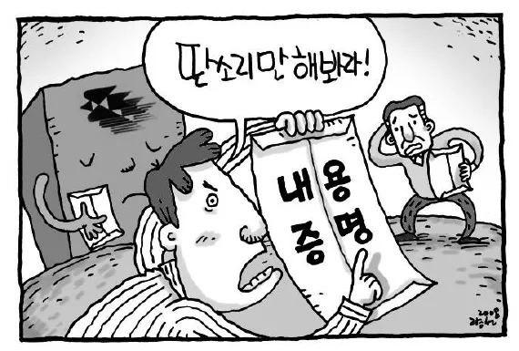
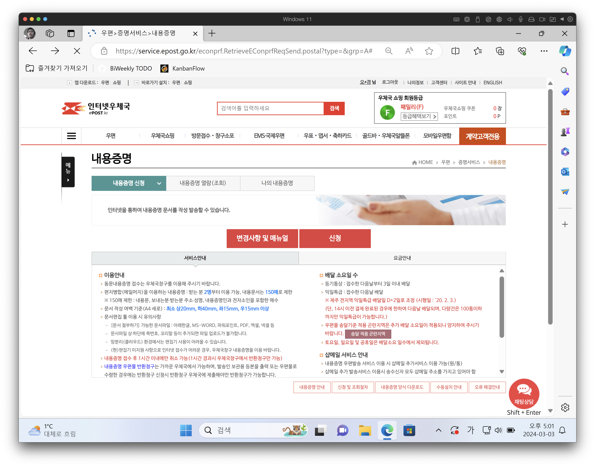
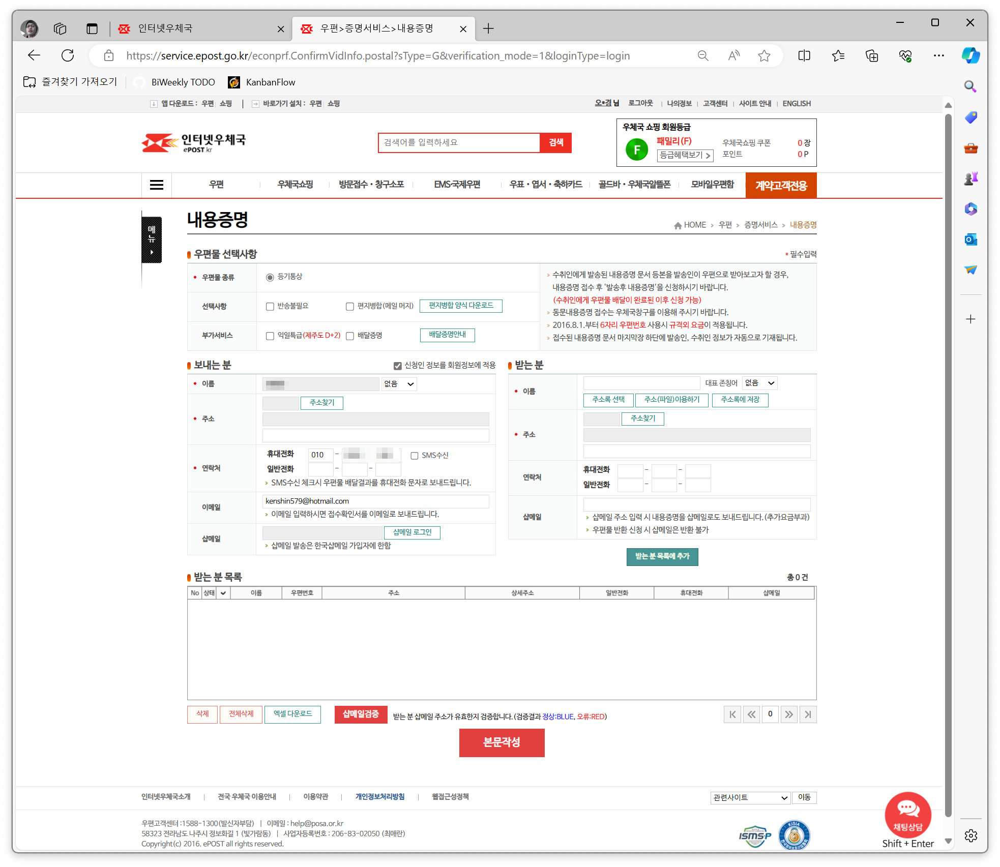
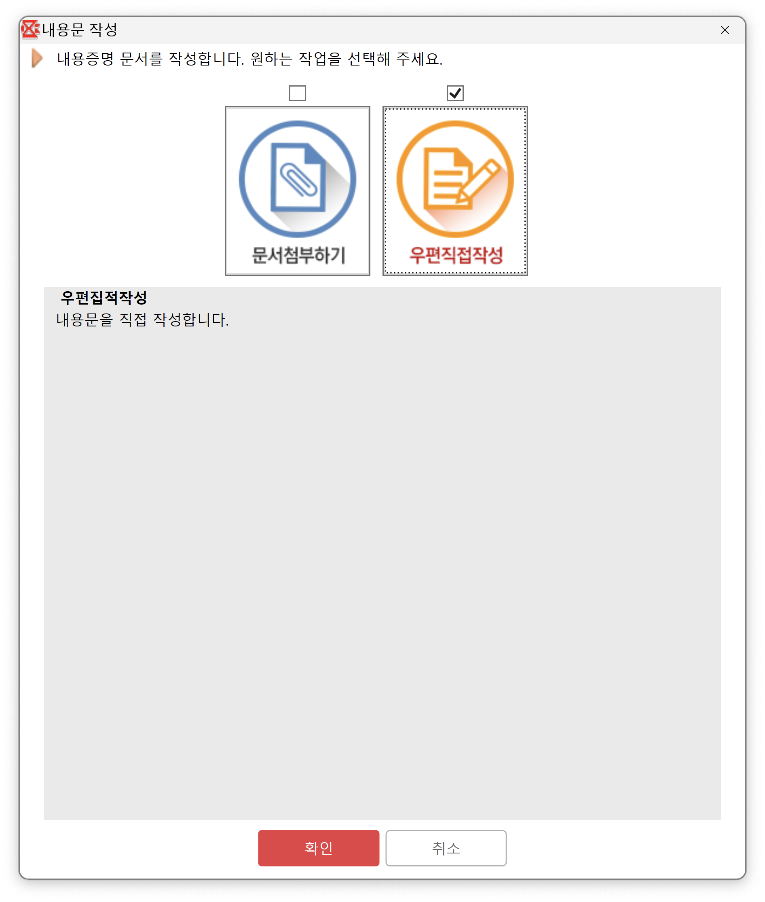
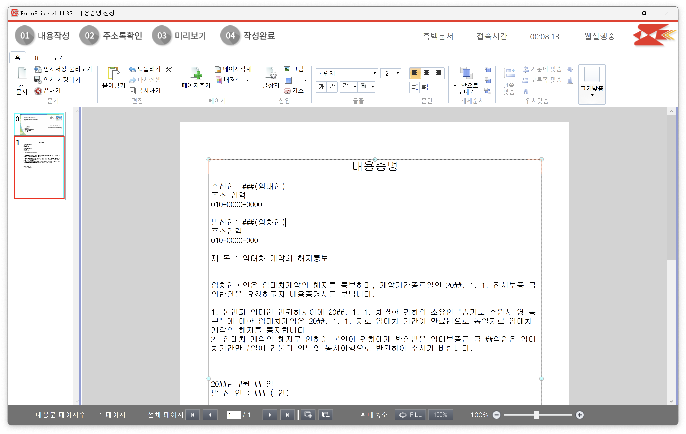
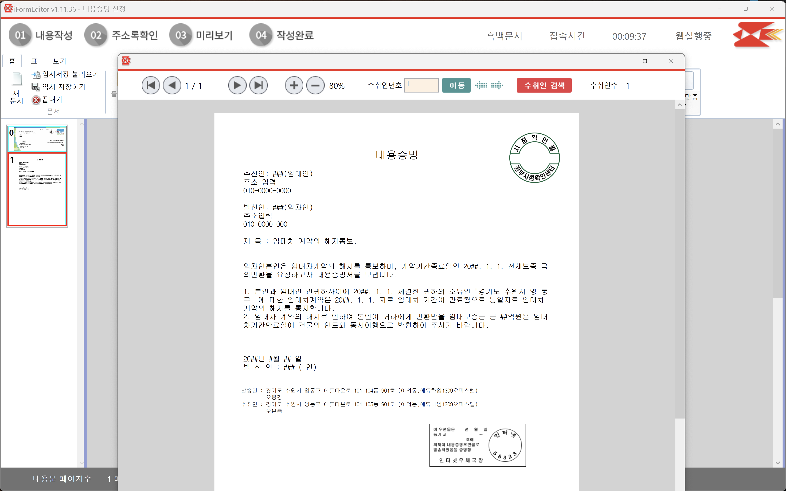
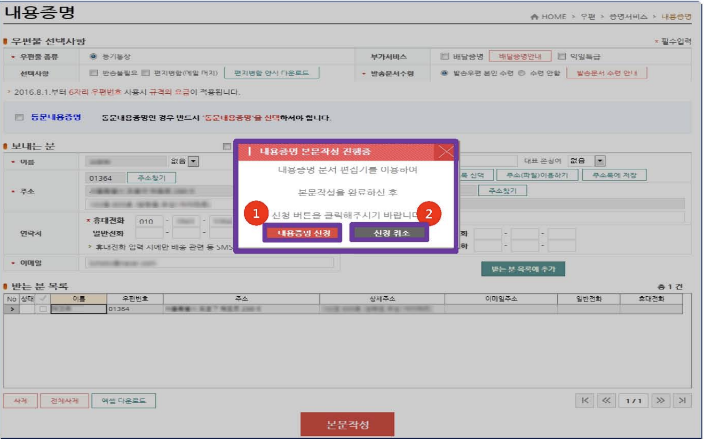
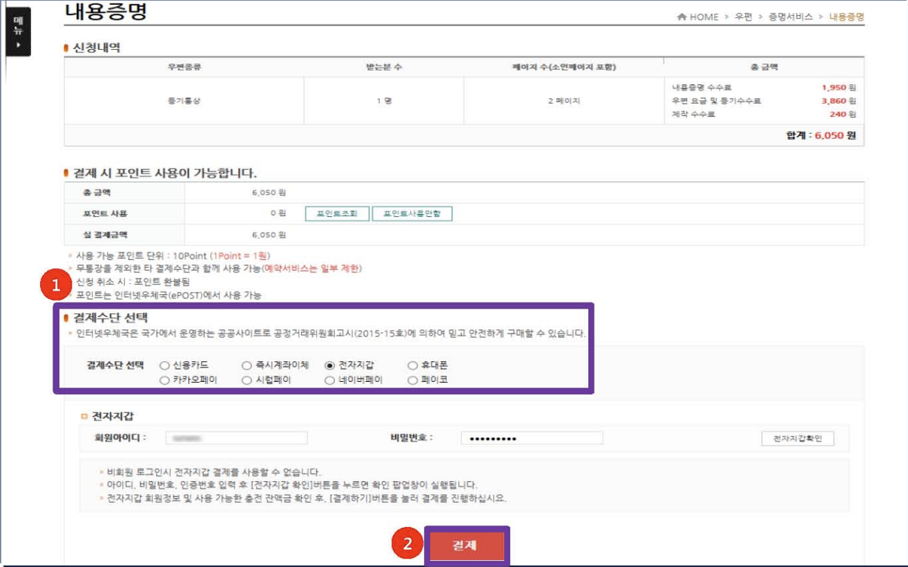
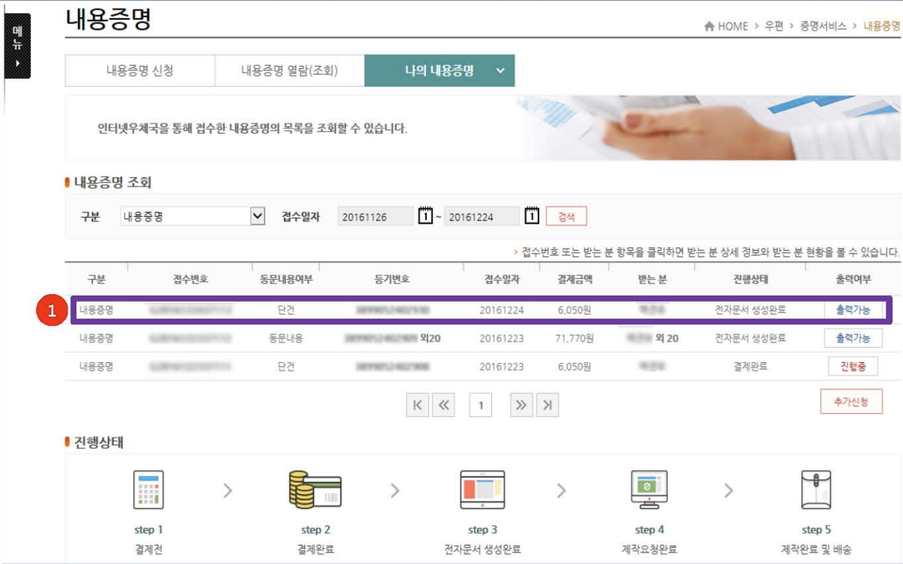
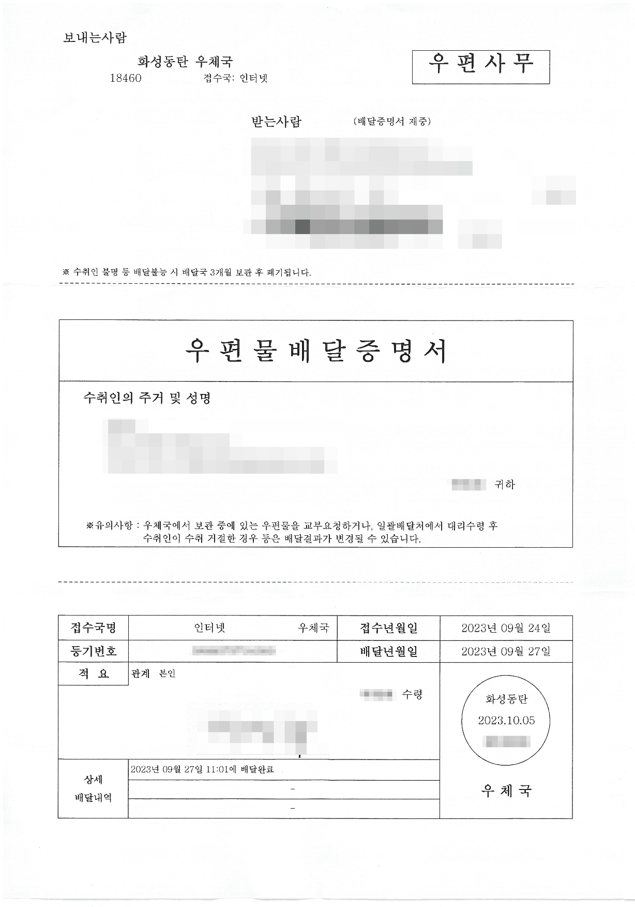

## 들어가며
 
살면서 내용증명을 써볼 줄을 몰랐다. 현재 사는 집이 역전세가 발생하면서 계약 종료 시점에 집주인은 전세금을 바로? 못 돌려준다고 했다. 집주인은 몇 개월 연장을 희망했지만, 연장하는 게 득인지 아닌지를 알아보니 내가 연장해서 득이 되는 건 없다는 결론에 이르렀다. 다행히 HUG 전세 보험에 가입을 해두어서 원활한 HUG 보험 보증이행 처리를 위해 내용증명서를 작성해서 집주인에게 연장 없이 이사를 하겠다는 의사를 전달했다.

 

> 전세 계약 해지 통보를 문자, 카카오톡으로도 할 수 있었지만, 전세 계약서에 대리인과 집주인의 전화번호가 같은 번호로 기재가 되어서 이런 경우에는 증빙으로 인정이 안 될 수 있다고 하여 내용증명을 보내는 걸로 HUG로부터 안내를 받았다. 다음 이사때는 계약서를 더 꼼꼼하게 확인 할 필요가 있다는 생각을 많이 하게 되었다.

 
내용증명 작성해서 우체국에 방문해서 보내는 방법도 있지만, 집에서도 인터넷으로 작성해서 내용증명서를 보낼 수 있다. 인터넷으로 어떻게 작성해서 보냈는지 알아보자.

## 내용증명 작성 및 신청 방법

  

> **내용증명이란?**
> 내용증명은 발송인이 수취인에게 어떤 내용의 문서를 언제, 누구에게 발송했는지를 우체국에서 증명해주시는 서비스이다.
> 법적효력이 있는 건 아니지만, 재판 등에서의 증거 자료 등으로 활용되고 임차인등기명령이나 HUG 전세보증반환시 추가로 제출해야 하는 서류이다. 내용증명서를 보내기 위해 같은 내용으로 3부가 작성이 되고 하나는 우체국이 3년동안 보관하고 각각 한 부씩 수신자, 발신자에게 보내진다.

### 1.인터넷으로 내용증명 작성 시작하기

`인터넷 우체국` > `우편` > `증명서비스` > `내용증명` 신청화면에서 신청 버튼을 클릭한다

보내는 사람, 받는 사람 이름, 주소, 연락처를 입력하고 `본문 작성` 버튼을 클릭해서 내용 증명서 작성을 시작한다.

본문 작성은 2가지 방식으로 내용을 작성할 수 있다. 문서 첨부하는 방식은 사용하는 윈도우에서 한글 애플리케이션이 설치되어 있어야 하고 실제로 해보면 좀 잘 안되기도 해서 개인적으로는 웹에서 본문을 작성하는 방식으로 진행했다.

오른쪽에 있는 `우편직접작성` 선택하고 확인 버튼을 클릭하고 본문 작성을 시작한다.

### 2. 문서편집기로 내용증명서 작성

아래와 같이 웹에서 한글 문서 편집기가 뜨고 이 곳에서 본문을 작성하면 된다. 맨 위 순서대로 `01 내용 작성` >  `02 주소록확인` > `03 미리보기` > `04 작성완료` 순으로 진행한다.

#### 2.1 내용증명에 작성할 내용

위 내용증명은 여러 사이트를 참고를 해서 실제로 제가 작성해서 보낸 내용이다. 내용증명에는 어떤 형식과 내용을 담아야 하는지 간단하게 언급한다.

- 발신인과 수신인의 이름, 정확한 주소, 연락처를 상단에 기재한다
- 수신인에게 전하고자 하는 내용을 `육하원칙` 에 따라 작성한다
- 작성된 서면의 하단에 기명날인(이름을 적고 도장을 찍음)을 한다
    - 도장 대신 사인을 이미지로 넣는다
- 육하원칙에 의해서 작성한다
    - `누가`: 임대인과 임차인의 신상 정보(이름, 주소, 연락처)
    - `언제`: 임대차계약일, 임대차보증금, 만료일, 내용증명을 보내는 날짜
    - `어디서`: 내용증명서를 발급한 기관 또는 단체의 정보
    - `무엇을`: 지금 사는 전세 집
    - `어떻게`: 계약 만료일에 전세금을 반환 요청
    - `왜`: 전세금 받고 이사할 예정이라는 목적에 대한 설명

#### 2.2 내용 증명서 예제 모음

전세 관련 내용증명서에 담아야 하는 내용은 검색하면 여러 예제가 나와서 아래 링크나 ChatGPT를 사용하는 걸 권장한다.

- [내용증명 처음 쓰는 사람도, 갑자기 받은 사람도 '이것'만 알면 된다](https://www.lawtalk.co.kr/post/20)
- [전세금 반환 내용증명서 양식, 내용, 작성방법](https://m.blog.naver.com/smspkkb/221698943599)
- [[민사분쟁\] [민사서식]-전세금반환 내용증명 양식](https://lawheart.kr/m/bbs/board.php?bo_table=B93&wr_id=404&vtype=m)

### 3. 내용증명 작성 완료후 비용 결제하면 신청 완료

`03 미리보기` 클릭해서 최종내용을 확인하고 맨 위 메뉴에서 `04 작성완료` 를 클릭하며 “전송하시겠습니까?”라는 메시지가 나오면 `전송` 버튼을 클릭한다.

> 실제로 제가 작성할 때는 스크린 화면을 캡처 하지 못해서 사용자 메뉴얼에 있는 걸로 대체합니다.

결제하는 프로세스는 `결제하기` 버튼 클릭하고 원하는 결제 수단 선택이후 결제 진행하면 된다.

### 4. 나의 내용 증명서 출력 및 발송

결제가 완료되면 `나의 내용 증명` 페이지에서 처리가 어떻게 진행되는지 `진행상태` 로 확인할 수 있다. 그리고, 작성한 내용증명도 다른 곳에 제출하기 위해 출력 기능도 제공한다. 단, 출력이 가능한 프린트가 있어야 한다. 대부분 네트워크 프린터는 출력이 가능하지 않아서 PC방이나 회사에서는 출력이 어렵고 로컬 프린터 케이블로 연결된 프린터에서 출력을 해야 한다. 저는 가까운 도서관을 추천합니다.

## FAQ

1. 신청후 발송은 어떻게 처리되나?
    - 우편물로 제작이 되어 수취인에게 발송된다
    - 우편물 발송 소요시간은 신청일로부터 1~3일 정도 소요된다
    - 임대인이 실제로 내용증명서를 받았는지도 아래와 같이 받게 된다

##정리
  

인터넷으로 내용증명서를 어떻게 작성하는지 같이 확인해 봤고 다음에는 임차인 등기 명령어는 어떻게 처리할 수 있는지 정리하도록 하겠습니다. 역전세로 힘들어하시는 분에게 조금이나마 도움이 되었으면 좋겠네요

## 참고

- https://m.blog.naver.com/assistors/220976822319
- https://blog.naver.com/korea_gov/222261729109
- https://namu.wiki/w/내용증명
- https://www.youtube.com/watch?v=NCHWCFaUJtE
