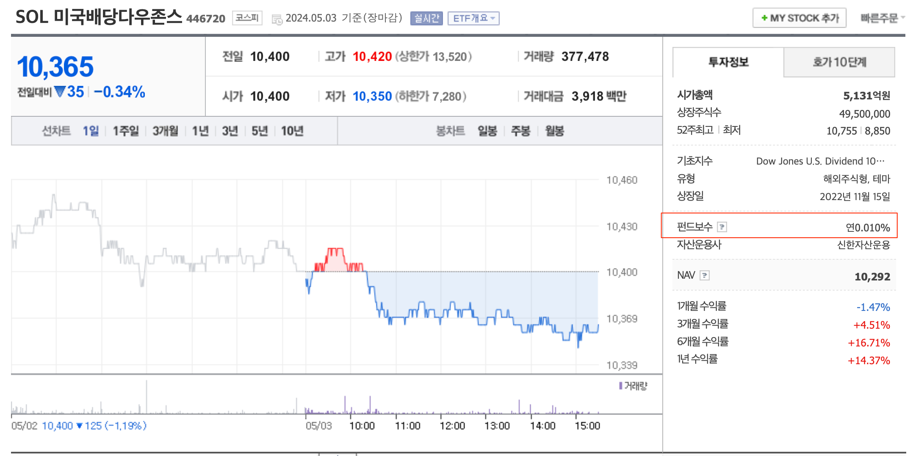
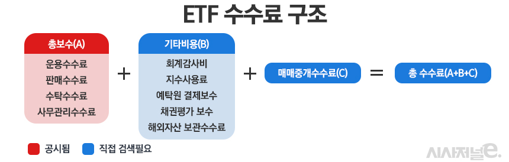
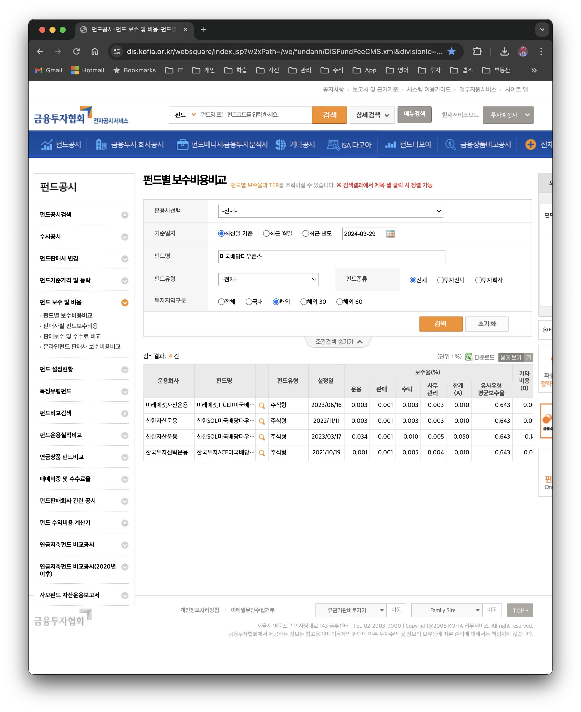
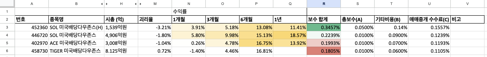

## 개요

미국의 다우존스 지수를 추종하는 국내 ETF는 아래와 같다. 여러 ETF 중에서 어떤 것을 선택하면 좋은지 같이 고민을 해보자.

- 452360	SOL 미국배당다우존스(H)
- 446720	SOL 미국배당다우존스
- 402970	ACE 미국배당다우존스
- 458730	TIGER 미국배당다우존스

## 국내 ETF 선택 기준

같은 지수를 추종하는 국내 ETF 중에서 나름대로 가장 괜찮은 ETF를 선택할 때는 개인적으로 아래 기준으로 선택한다.

- 시가총액
    - 최소 3,000억원 이상인 걸 선호하는 편이다
- 거래량
    - 거래량이 제일 많은 걸 선택한다
    - 구글 시트에서는 당일 거래량을 보여주고 있다. 원래 원했던 값은 최소 30,. 60일 정도의 거래량을 확인하고 싶었지만, 함수로 계산하는 방법은 아직 찾지를 못했다
- 괴리율
    - 괴리율, 추적오차 범위가 너무 높은 건 제외시킨다
- 수익률
    - 1, 3, 6개월, 1년의 꾸준히 수익률이 높은 걸 선택한다
- 운용 보수
    - 운용 보수에 대한 내용은 아래를 참고해주세요

### 운용 보수

대부분 운용 보수는 [네이버 금융](https://finance.naver.com/item/main.naver?code=446720)에서 확인한다. 네이버 금융 사이트에서 나와 있는 값은 공시된 `총 보수(A)`값이고 이 값 외에도 투자자들이 감당해야 하는 건  `기타비용(B)`과 `매매중개수수료(C)`가 더 있다. ETF의 `기타비용`과 `매매중개수수료`를 확인하려면, 투자 설명서나 금융투자협회 홈페이지에서 직접 들어가서 검색해서 찾아야 하는 번거로움이 있다.

- `총 보수`
    - 운용수수료, 판매수수료, 수탁수수료, 사무관리 수수료 등을 합한 비용이다
    - 홈페이지와 MTS, HTS, 한국거래소 및 코스콤을 통해 총보수를 명확히 공시한다
    - 이 값은 네이버 금융 사이트에서 확인할 수 있다

- `기타비용`
    - ETF 운용과정에서 지출되는 비용으로 회계 감사비와 지수 사용료, 해외자산 보관수수료, 예탁원 결제보수, 채권평가 보수 등이다

- `매매중개수수료`
    - ETF가 지수를 추종하기 위한 리밸런싱 과정에서 주식을 사고 팔면서 발생하는 거래수수료이다

#### 네이버 금융 - 총 보수만 표시한다

#### 투자자들이 실제 감당해야 하는 수수료 = 총보수 + 기타비용 + 매매중개수수료

#### 금융투자협회에서 ETF 검색하기

## 결론

국내 ETF를 선택할 때는 위에서 언급한 기준으로 선택하는데 운용 보수는 특히 3가지 비용을 꼭 체크 할 필요가 있다. 결론적으로 저는 아래 2가지 ETF를 선택해서 매매하고 있다.

- 452360	SOL 미국배당다우존스(H)
    - 달러가 높은 경우에는 환율 변동의 영향을 받지 않기 위해서 헤지 상품을 매매한다
- 458730	TIGER 미국배당다우존스
    - 운용 보수가 제일 낮고 거래량이 다른 증권사보다 많은 변이다

아래 내용은 [국내 미국배당다우존스 ETF 구글 시트](https://docs.google.com/spreadsheets/d/11kbUc6UClddhaStg6biPkQhFeC8ssGRITeYg1ZDxu8s/edit?usp=sharing)에서 확인할 수 있다

## 참고

- [네이버 금융](https://finance.naver.com/search/searchList.naver?query=%B9%CC%B1%B9%B9%E8%B4%E7%B4%D9%BF%EC%C1%B8%BD%BA)
- [금융투자협회 - 펀들별 보수비용비교](https://dis.kofia.or.kr/websquare/index.jsp?w2xPath=/wq/fundann/DISFundFeeCMS.xml&divisionId=MDIS01005001000000&serviceId=SDIS01005001000)
- [미국 ETF, 공시된 총보수와 실질비용 차이 커 ‘논란’](https://www.sisajournal-e.com/news/articleView.html?idxno=300302)
- [ETF 수수료 조회 방법 – 총보수 이외의 숨겨진 수수료](https://toalmotexit.com/etf/compare-etf-fees/)