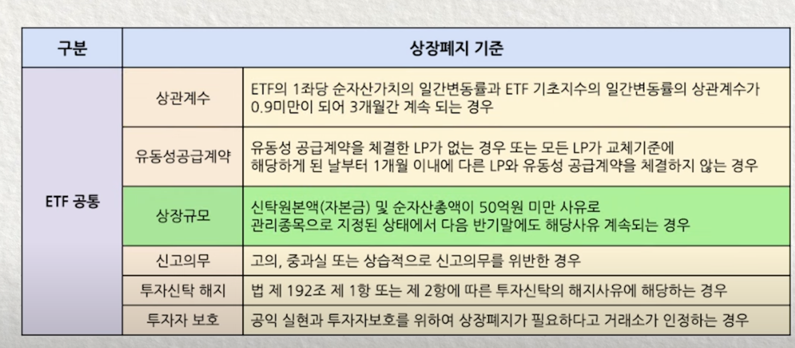
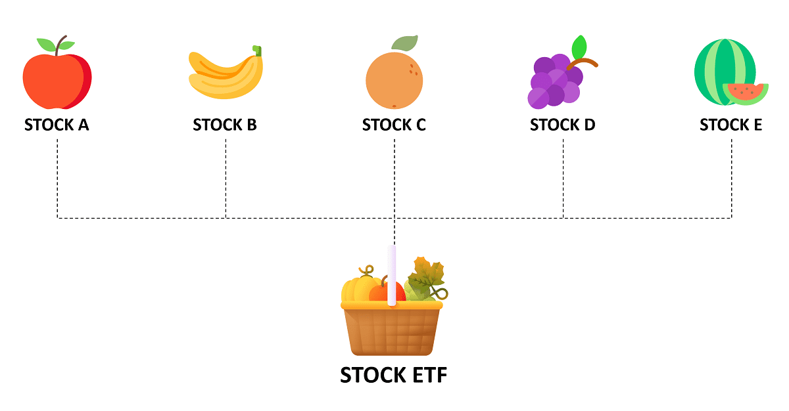

# 1. 개요

[주식으로 2주마다 월세 받는 방법](https://stock.advenoh.pe.kr/주식으로-2주마다-월세-받는-방법/) 포스팅을 하면서 ETF 규모가 400억원 때라 자연스럽게 ETF가 상장폐지가 되면 어떻게 되는지 궁금하게 되어 이 포스팅에서 다루게 되었다. ETF는 언제 상장폐지가 되고 투자자에게 어떤 영향을 주는지에 대해서 같이 알아보자.

# 2. ETF 상장폐지

## 2.1 상장폐지 조건

ETF가 상장 폐지되는 조건은 다음과 같다.

ETF 상장폐지의 가장 대표적인 이유는 자산규모가 50억 원 아래로 떨어진 채로 1개월 이상 유지되는 경우에 상장폐지가 될 수 있다.

개별 주식의 경우에는 회사의 실적이 매우 나쁘거나 사업보고서를 내지 않고 회사가 부도가 나면 상장폐지가 될 수 있다. ETF는 개별 주식을 담고 있는 버킷 역할을 하고 있어서 투자한 기업과는 별개로 ETF의 크기가 작고 거래가 활발하지 못할 때 상장폐지가 된다. 그래서, ETF 투자 시 규모가 큰 ETF(ex. 최소 1,000억 원 이상)에 투자하는 게 좋다.

## 2.3 ETF 상장폐지가 되면?

주식 상장폐지와 달리 ETF 상장폐지가 되어도 ETF가 담고 있는 자산 가치에는 영향을 주지 않는다. 그래서 ETF 상장폐지의 경우에는 큰 걱정을 할 필요까지는 없다.

상장폐지가 확정이 되면 투자자들은 상장폐지 시점 전날 까지 매도를 할 수 있다. 매도를 하지 못하는 경우에는 ETF 상장폐지일 기준으로 ETF의 순자산가치에서 운용 보수, 세금 등을 뺀 금액을 투자자에게 돌려준다.

ETF 상장폐지의 단점으로는 장기투자를 하고 있는 투자자에게 원하지 않는 시점에 손실 확정을 지워야 한다는 단점이 있다. ETF의 경우에는 장기적으로 투자하는 경우도 많아서 계속 가지고 있었으면 수익을 낼수도 있지만, 상장폐지로 반? 강제적으로 매도를 해야 한다는 단점이 생긴다.

# 3. 마무리

ETF 상장폐지에 대해서 알아보았다. 상장폐지가 된다고 해서 ETF가 담고 있는 개별 주식의 가치는 변하지 않기 때문에 주식 상장폐지보다는 안전하다고 볼 수 있다. 하지만, 원하는 시점에 ETF를 매도하는 것이 아니라서 손실을 감수하고 매도해야 한다. 어쨌든 상장폐지는 투자자들에게 좋은 소식은 아니라서 미리 매수하기 전에 거래량이 충분한지 규모가 큰 ETF 위주로 매수하는 것을 추천한다.

# 4. 참고

- [ETF 운용사가 망하면 내 돈은 어떻게 될까 😱 | 노미의 글로벌 ETF](https://www.youtube.com/watch?v=lUTWdZjtAd0)
- [ETF 상장폐지](https://m.samsungfund.com/etf/insight/guide/view06.do)
- [ETF가 만약 상장폐지 되면?ㅣETF베이직 l 리뉴얼2024](https://www.youtube.com/watch?v=IyQ6kltZQ0E)
- [ETF도 상장폐지 될까? 상장폐지 조건, 유동성공급자란? – 초보 탈출 ETF투자방법](https://samsungfundblog.com/archives/49878)
