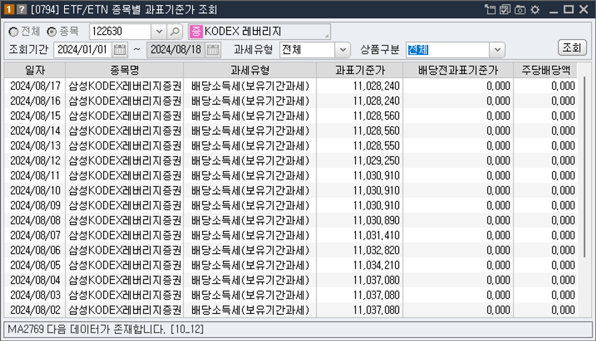
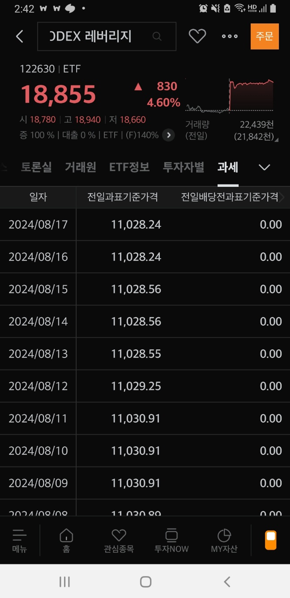

## 1. 개요

한국에서 ETF(상장지수펀드)에 투자할 때 발생할 수 있는 세금에 대해 알아보자.

## 2. ETF 세금

ETF에 투자할 때 발생하는 세금은 크게 2가지가 있다. 국내 ETF와 해외 ETF에 대한 세금은 다르기 때문에 그 부분에 대해서도 정리한다.

- ETF를 팔아 발생하는 매매차익에 대한 세금
- ETF를 보유함으로써 주기적으로 받게 되는 `분배금`에 대한 세금

### 2.1 국내에 상장된 ETF

#### 2.1.1 양도소득세 - 매매차익에 의한 세금

> 양도소득세는 주식을 매매하여 이익을 본 금액에 대한 세금이다

국내 주식형 ETF의 경우 매매차익에 대한 세금은 부과되지 않는다. 

- ex. TIGER 200, TIGER 반도체, RISE 고배당
- ETF는 증권거래세도 부과되지 않는다 (주식의 경우에는 매도를 하면 이익 여부와 관계 없이 증권거래세 0.18%를 내게 된다)

국내 주식형이 아닌 그 외 ETF의 경우 `보유기간과세`가 부과된다.

- ex. TIGER 레버리지, TIGER S&P500, TIGER 골드선물(H), TIGER 단기통안채 등

> `보유기간과세`는 ETF를 보유하고 있던 기간 중에 발생한 이익에 대해 과세한다는 의미한다.

ETF를 매도할 때, 매수 시점과 매도 시점의 가격 차이에 대해 15.4%의 세금이 부과된다. 특이한 점은 실제 매매 가격과 매매 당일의 과표기준가격 중 더 작은 금액을 기준으로 세금이 부과된다는 점이다.

| #    | 구분      | 매수     | 매도     | 차액                                |
| ---- | --------- | -------- | -------- | ----------------------------------- |
| 1    | 실제 매매 | 9,900원  | 10,500원 | 600원                               |
| 2    | 과표기준  | 10,100원 | 10,600원 | 500원 ← 작은 금액으로 세금이 부과됨 |

> `과표기준가`(과세표준기준가격)란?

`과표기준가`는 ETF의 수익 중 과세 대상이 되는 부분을 계산하기 위해 사용되는 가격이다. 이는 시장에서 실제로 거래되는 가격과 다를 수 있다. `과표기준가` 차액과 실제 매매가 차액 중 더 적은 금액에 대해서 과세함으로써 투자자에게 보다 유리하게 세금을 걷게 되어 있다.

위 예시에서는 `과표기준가` 차액이 실제 매매 가격보다 적기 때문에 과표기준가 기준으로 세금을 매기게 된다. 이 세금은 ETF 매도 시 자동으로 원천징수 되므로, 따로 세액을 계산할 필요는 없어서 굳이 개인 투자자가 신경을 쓸 필요는 없지만, 기본적으로 알아두면 좋을 듯하다.

보유 중이거나 관심 있는 ETF의 일별 `과표기준가`를 확인하고 싶다면, 사용하는 증권사의 HTS나 MTS에서 조회할 수 있다.

- HTS : [0794] ETF/ETN 종목별 과표기준가 조회

- MTS: 왼쪽하단 메뉴 > `주식` > `국내주식` > 주식 현재가 화면 마지막 탭 `과세`

#### 2.1.2 배당소득세 - 배당금에 대한 세금

> ETF `분배금`? 주식의 배당금과 같은 개념이다. ETF가 보유한 주식에서 발생한 배당금을 모아 투자자에게 돌려주는 것을 분배금이라 한다.

ETF에서 발생하는 `분배금`은 배당소득세 과세 대상이다. 분배금을 받게 되면 배당소득세 15.4%가 원천징수 된 후 입금이 된다.

### 2.2 해외 상장 ETF

해외 주식을 기초자산으로 하는 ETF에 투자할 경우, 매도 시 발생하는 양도소득에 대해 22% (지방소득세 포함)의 양도소득세가 부과된다. 기본공제는 연간 250만 원까지 가능하고 초과분에 대해서는 22% 세율이 적용된다.

- ex. QQQ, VOO

해외 상장 ETF 투자에서 발생된 `분배금`도 국내 ETF처럼 배당소득세 15.4%를 원천징수한다.

### 2.3 요약

| 구분                                     | 국내 주식형 ETF                | 국내 주식형 외 ETF                                          | 해외 상장 ETF                           |
| ---------------------------------------- | ------------------------------ | ----------------------------------------------------------- | --------------------------------------- |
| 투자자산                                 | 국내 주식                      | 레버리지/인버스, 해외주식, 실물자산, 국내외 채권, 혼합형 등 | S&P500, 나스닥                          |
| 예.                                      | TIGER 200                      | TIGER 레버리지, TIGER 금은선물, TIGER S&P500                | QQQ, VOO 등                             |
| 매매차익                                 | 비과세                         | *보유기간과세 적용 MIN(매매차익, 과표증분) x 15.4%          | 양도소득세 22%  (단, 250만원 공제) |
| 분배금                                   | 배당소득세 적용 분배금 x 15.4% | 배당소득세 적용 MIN(분배금, 과표 증분) x 15.4%              | 배당소득세 적용 분배금 x 15.4%          |
| 금융소득종합과세  (2천만원 초과 시) | 분배금만 포함                  | 매매차익, 분배금 모두 포함                                  | 매매차익, 분배금 모두 포함              |

## 3. 세금 줄이는 방법

세금은 피할 수 없지만, 세금 절세가 가능한 연금계좌를 이용하면 세금을 줄일 수 있다.

- 연금저축, IRP
- ISA(개인종합자산관리)

일반 계좌에서는 수익이 발생하면 바로 세금이 부과되지만, 연금 계좌는 수익을 찾을 때까지 과세를 유예한다. 즉, 세금을 나중에 낼 수 있도록 해주는 것이다. 만 55세 이후 연금으로 수령할 때는 분리과세 혜택을 받을 수 있으며, 배당소득세(15.4%) 대신 연금소득세(3.3~5.5%)만 내면 된다. 이는 장기 투자를 통해 노후를 대비할 수 있도록 설계된 절세 혜택이다.

## 4. 참고

- [ETF 세금 총정리!…비과세? 배당소득세? 양도소득세? 그때그때 달라요 | 대체, 투자란](https://www.notion.so/ETF-dd14077ea5c446a0b2bfd98d46306e50?pvs=21)
- [ETF 세금](https://m.samsungfund.com/etf/insight/guide/view05.do)
- [살 때보다 팔 때 알아야 할, ETF 세금의 모든 것](https://blog.toss.im/article/etf-and-tax)