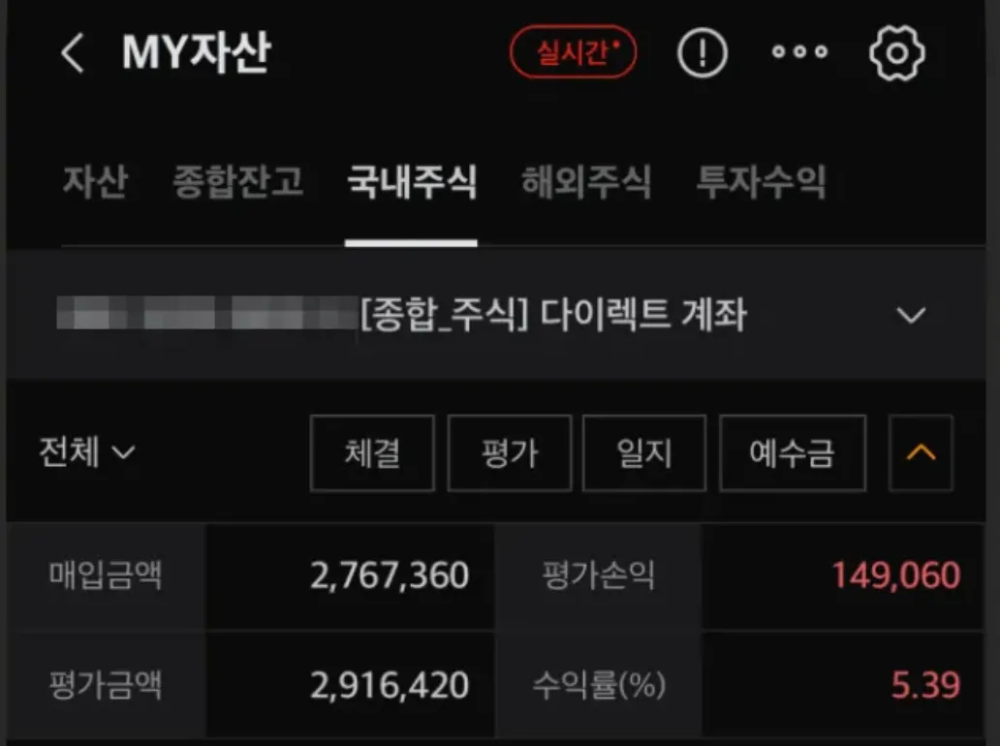
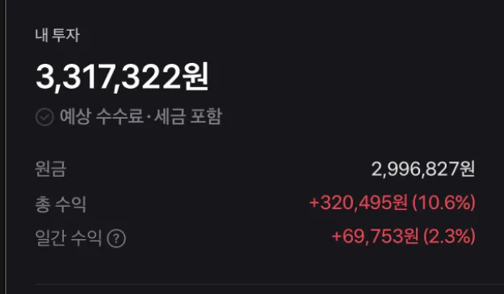

## 1. 개요

2024년을 마무리하며 한 해 동안의 주식 투자 결과를 점검해보는 시간을 개인적으로 가져보았다. 올해 10월부터 시작한 투자 프로젝트 중에 토스 주식 모으기를 처음 시작할 때 생각했던 아이디어이다.

- [ETF 주식 계좌 vs 토스 소수점 주식 모으기](https://stock.advenoh.pe.kr/토스-증권에서-주식-모으기/)

다른 두 가지 전략으로 투자했을 때 올해 수익률을 비교하면서 어떤 방식이 더 효율적인지 확인하고 재미삼에 하는 것도 없지 않아 있다. 이 결과를 보고 향후 투자 방향을 설정하는 데 참고가 될 것 같다.

## 2. ETF 주식 계좌 vs 토스 소수점 주식 모으기

### 2.1 ETF 주식 계좌

### 매매 전략

- ETF 선택 기준
  - 나스닥(Nasdaq) & S&P500 중심의 미국 ETF, 인도 시장을 포함한 해외 ETF 위주로 선택을 했다
- 매수 타이밍
  - 적립식으로 일정 금액을 꾸준히 투자하되, 시장이 하락했을 때 추가 매수하는 전략을 취했다
  - 한번에 많이 매수하지 않고 매일 1, 2씩만 걸어두었다. 매수가 될때도 있고 안될 때도 있었다
  - 매일 주식을 확인을 하다보니 매일 매수하는 경향이 있어서 이를 방지 하기 위해 무조건 채권을 먼저 매수를 걸어두고 시작했다. 현금이 필요한 경우에는 채권을 매도해서 매수도 할 수 있으니까. 실제로는 채권을 매도하지는 않았다. 그냥 월급에서 더 쓰지 않고 이 돈으로 매수를 했다

### 매수한 ETF 종류 및 섹터별 비중

내가 매수한 ETF 종목 목록이다.

| 티커   | 종목                               | 섹터       |
| ------ | ---------------------------------- | ---------- |
| 482730 | TIGER 미국S&P500타겟데일리커버드콜 | 미국성장   |
| 488500 | TIGER 미국S&P500동일가중           | 미국성장   |
| 379780 | RISE 미국S&P500                    | 미국성장   |
| 481109 | SOL 미국테크TOP10                  | 미국성장   |
| 390390 | KODEX 미국반도체MV                 | 반도체     |
| 368590 | RISE 미국나스닥100                 | 미국성장   |
| 453810 | KODEX 인도Nifty50                  | 인도성장   |
| 465680 | KODEX 24-12 은행채(AA+이상)액티브  | 채권       |
| 461270 | ACE 26-06 회사채(AA-이상)액태브    | 채권       |
| 385540 | RISE 종합채권(A-이상)액티브        | 채권       |
| 436140 | SOL 종합채권(AA-이상)액티브        | 채권       |
| 228790 | TIGER 화장품                       | 국내화장품 |

| *섹터*      | 투자비율 | 목표 비중 |
| ----------- | -------- | --------- |
| 미국성장    | 38.62%   | 45%       |
| 인도성장    | 23.27%   | 23%       |
| 채권        | 20.58%   | 15%       |
| 반도체      | 17.24%   | 17%       |
| 국내 화장품 | 0.29%    | 0%        |

미국 관련주 ETF를 주로 담았고 다른 섹터보다 더 매수하려고 했고 미국 시장외에도 핫한 인도 시장 관련 ETF도 담았다.

> 이 계정에서는 국내 시장보다는 해외 시장 위주로 하는 매수하는 전략이라서 국내 화장품은 실수로 담은 거라 이건 매도를 하고 다른 계좌에서 매수할 예정이다.

### 투자 현황

`2,767,360`원 정도 투입해서 평가손익은 `149,060`원으로 `5.39`% 수익률을 올해 냈다.

### 2.2 토스 소스점 수식 모우기

### 매매 전략

- 개별 종목 선택 기준
  - 1주당 가격인 높은 미국 주식(ex. `V` - `$314.91`) 위주로 선택을 했다
- 매수 타이밍
  - 처음 들어갈 타이밍은 장기적으로 관심을 두었던 종목중에서 급락하거나 120일 이동평균선 아래에 있는 종목을 선택했다
  - 최대한 다른 섹터에 있는 종목를 선택하려고 했다
  - 매일 `5,000`원씩 자동 매수하도록 설정했다

### 매수한 ETF 종류 및 섹터별 비중

내가 매수한 ETF 종목 목록이다. 총 16개의 종목으로 구성되어 있고 초기에 9개 정도 매수를 했었고 최근에 9개 종목을 추가했었다.

|      | 섹터     | 종목                | 총 금액    | 비중    |
| ---- | -------- | ------------------- | ---------- | ------- |
| 1    | 기술     | 아마존              | ₩423,975   | 12.78%  |
| 2    | 금융     | 뱅크오브아메리카    | ₩393,854   | 11.87%  |
| 3    | 원자재   | 옥시덴탈 페트롤리움 | ₩375,865   | 11.33%  |
| 4    | 기술     | 테슬라              | ₩372,210   | 11.22%  |
| 5    | 금융     | 비자                | ₩367,025   | 11.06%  |
| 6    | 기술     | 팔란티어            | ₩345,637   | 10.42%  |
| 7    | 기술     | 알파벳 A            | ₩339,586   | 10.24%  |
| 8    | 헬스케어 | 노보디스크          | ₩285,887   | 8.62%   |
| 9    | 기술     | 어도비              | ₩188,950   | 5.70%   |
| 10   | 기술     | 델 테크놀로지       | ₩76,612    | 2.31%   |
| 11   | 나스닥   | QQQM                | ₩24,854    | 0.75%   |
| 12   | S&P500   | SPLG                | ₩24,815    | 0.75%   |
| 13   | 헬스케어 | 에코랩              | ₩24,390    | 0.74%   |
| 14   | 서비스   | 웨이스트 매니지먼트 | ₩24,615    | 0.74%   |
| 15   | 방산     | 제너럴 다이내믹스   | ₩24,679    | 0.74%   |
| 16   | 금융     | 처브                | ₩24,359    | 0.73%   |
|      |          |                     | ₩3,317,313 | 100.00% |

| *섹터*   | 비율의 SUM  |
| -------- | ----------- |
| 기술     | 52.66%      |
| 금융     | 23.67%      |
| 원자재   | 11.33%      |
| 헬스케어 | 9.35%       |
| 나스닥   | 0.75%       |
| 방산     | 0.74%       |
| 서비스   | 0.74%       |
| S&P500   | 0.75%       |
| **총계** | **100.00%** |

기술 종목 비중이 가장 높은 편이라서 나중에 추가한 종목은 다른 섹터(ex. 금융, 원자재)로 담았다.

### 투자 현황

`2,996,827`원 투자를 해서 평가손익 `320,495`원으로 `10.6`% 수익률을 올해 냈다.

## 3. 마무리

토스 주식 모으기가 ETF 전용 계좌보다 수익률에서 우위를 점했다. 두 방식 모두 적금 이자율을 초과하는 성과를 보여 만족스럽고, 특히 개별 주식보다 안정적인 수익률을 나타냈다. 토스 주식 모으기의 우수한 수익률은 개별 주식의 변동성이 크다는 점과 전략적인 종목 선택이 긍정적으로 작용했기 때문으로 보인다.

결론적으로, 국내 개별 주식보다 미국 ETF가 더 효율적이며, 1주당 금액이 큰 주식 투자에는 소수점 모으기가 가장 적합한 방법으로 판단된다. 내년 2025년의 성과도 기대해본다.
