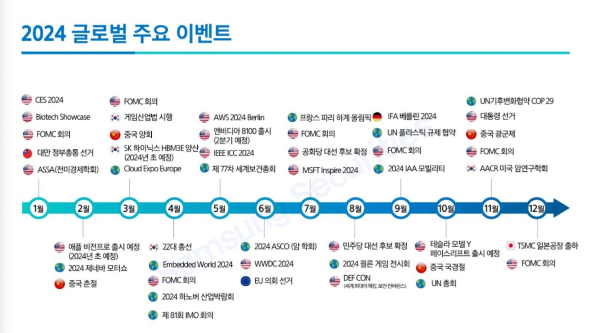

## 1. 개요

2023년 작년에는 내가 보유한 주식의 실적 일정이나 주요 이벤트에 거의 관심을 두지 않고 주식 투자를 했던 것 같다. 그러다 보니, 어떤 기준을 가지고 투자하기보다는 무지성으로 주식을 사고팔았던 것 같다. 각 회사의 컨퍼런스, 실적 발표, 배당 일정 등에 따라 주식이 크게 요동치는 것을 보고, 올해부터는 주요 일정을 잘 확인하며 투자하기 위해 올해 2024년 주요 일정을 정리해 본다.

2024년에 주목해야 할 주요 이벤트를 한눈에 볼 수 있도록 정리한 이미지이다.

## 2. 2024년 글로벌 시장 전망 및 주요 일정

2024년에는 금리인하를 기대해볼만 하고 11월에 있는 미국 대선에 따라서 미국 증시가 많이 불안정해 질 듯하다. 

- 글로벌 디스인플레이션 지속
- 중국 양회 이후, 경기 부양 기대감 강화
- CES, MWC, GTC 등 AI 및 테크 이번트 모멘텀
- 글로벌 중앙은행의 긴축 스탠스 완화
  - 미국 연중 금리 인하 가능성
- 미국 제조업 경기 회복세
- 해외 여행 및 관광 수요 회복세
- 미 연준의 기조 변화
- 글로벌 연말 소비 증가 기대
- 연준의 완화적 통화정책 지속
- 애플, 시가총액 4조 달러 돌파 기대
- 미국 대선에 따른 주식 불확실성

### 하락 요인

#### 1분기
- 중국 경기침체 우려
- 고금리 장기화 → 부채누적, 이자부담 증대
- 기업이익 둔화 우려

#### 2분기
- 중국 경기침체  우려
- 고금리 장기화 → 부채누적, 이자부담 증대
- 기업이익 둔화 우려

#### 3분기
- 대선 앞두고 정치적 불확실성 확대
  - 후보확정: 민주당 (8.19-22), 공화당 (7.15-18)
- 신규, 고융 축소 따른 고융시장 냉각
- 글로벌 경기 하방압력 가중 따른 수요부진

#### 4분기
- 대선결과에 따른 불확실성 증가
  - 민주당: 제정지출 확대, 정부부채 심화
  - 공화당: First America, Only America 심화

## 3. 마무리

분기별로 더 세분화해서 시리즈로 작성할 예정이다. 그리고 PC나 핸드폰에서도 쉽게 일정을 확인할 수 있어야 해서 주요 일정은 [구글 캘린더](https://calendar.google.com/calendar/u/0?cid=OGNjOTU3OWMwYmUyMDA0ODZjMWViZGQ4ODAxODcyMDc3OTRiMDdjMWU3NmRjMGIzNjYxOWZlMzA5ZjdjNTM4M0Bncm91cC5jYWxlbmRhci5nb29nbGUuY29t)에 입력해 두기 시작했다.

> 구글 캘린더에 올해 모든 주요 이벤트를 다 입력하지는 못했다. 내가 관심 있는 종목 위주로 정리를 해서 참고만 해주시면 좋을 듯합니다

## 4. 참고

- [2024년 글로벌 주요 경제 이벤트 정리](https://nomadsdream.tistory.com/426)
- [신년특집 2024 증시 캘린더ㅣFOMC부터 美 대선까지, 올해 증시 일정과 이에 따른 투자 전략을 알아보자!](https://www.youtube.com/watch?v=FtmeyJHV1lc)
- [2024 신년특집 핵심 유망주 | 쳥룡의 해! 반드시 챙겨야 할 증시 빅이슈](https://www.youtube.com/watch?v=6vWgm90l6zw)
- [하나증권 - 월별 증시 이슈캘런더](https://www.hanaw.com/main/research/research/list.cmd?pid=2&cid=4)
- [연간 증시캘런더](https://knowledge-lighthouse.co.kr/2024년-연간-증시캘린더증시스케쥴-증시휴장일-거래/)
- [2024년에 예정된 일들… 글로벌 주요 이벤트 타임스케줄](https://www.g-enews.com/article/Global-Biz/2024/01/20240102081650457837926aa152_1)
- [2024년 글로벌 주요 이벤트 타임 스케줄 총정리](https://nursing-school.net/daily-life/global-event-2024/)
