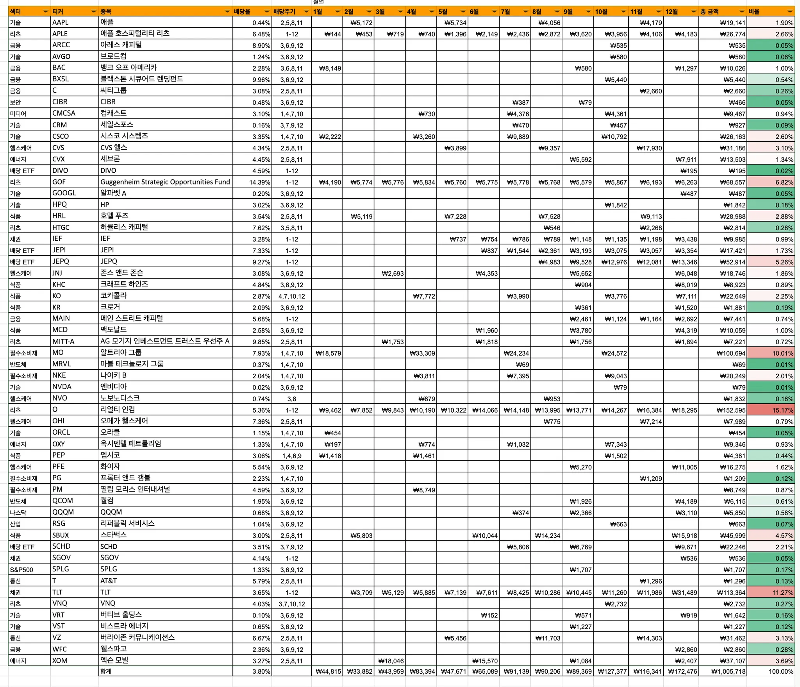
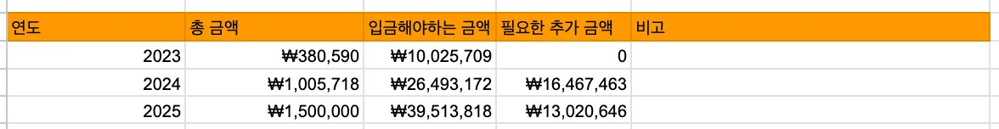
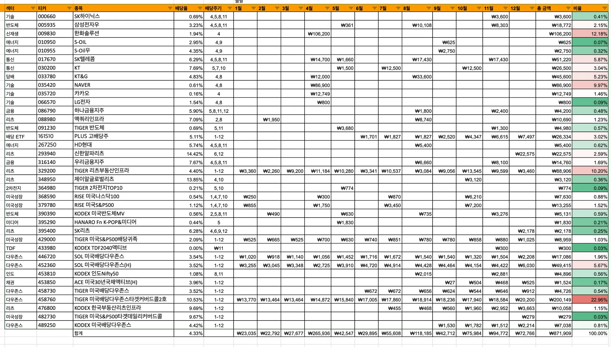
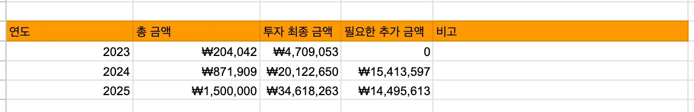

## 1. 개요

미국 투자를 시작하면서 국내 주식과 달리, 미국 기업들이 배당금을 꾸준히 지급한다는 점을 자연스럽게 알게 되었다. 특히 배당금 지급의 지속성에 따라 배당 귀족주, 배당 왕족주와 같은 그룹으로 분류될 만큼 미국 기업들은 매우 주주 친화적이라는 인상을 받았다.

올해 [3분기 미국 배당주 관심](https://stock.advenoh.pe.kr/3분기-미국-관심-배당주-정리/) 포스팅을 정리하면서, 2024년 최종 미국 배당금 목표금액을 `100만 원`으로 설정을 했었고 실제로 연말까지 목표금액을 달성했는지도 확인해보고 내년 2025년 목표 금액도 다시 설정해보려고 한다.

## 2. 2024년 연말 배당금 정리

### 2.1 미국 배당금

올해 2024년 미국 배당금을 받은 주식 목록은 다음과 같다.

#### 섹터별 배당금 비율

| *섹터*     | 비율        |
| ---------- | ----------- |
| 리츠       | 25.92%      |
| 필수소비재 | 13.02%      |
| 채권       | 12.32%      |
| 식품       | 12.22%      |
| 배당 ETF   | 9.22%       |
| 헬스케어   | 7.56%       |
| 에너지     | 5.96%       |
| 기술       | 5.22%       |
| 통신       | 3.26%       |
| 금융       | 2.88%       |
| 미디어     | 0.94%       |
| 나스닥     | 0.58%       |
| 반도체     | 0.61%       |
| S&P500     | 0.17%       |
| 산업       | 0.07%       |
| 보안       | 0.05%       |
| **총계**   | **100.00%** |

2024년 동안 가장 많은 배당금을 받은 섹터는 리츠, 필수 소비재, 채권, 식품으로 각각 `10%` 이상의 비중을 차지했다. 섹터별 주요 매수 종목은 다음과 같다.

- 리츠: `O`, `GOF`, `APLE`
- 필수 소비재: `MO`
- 채권: `TLT`
- 식품: `SBUX`, `KO`
- 배당 ETF: `SCHD`

2024년에는 주가가 하락한 주식을 중심으로 매수한 결과, 이러한 포트폴리오 구성이 되었고 상승한 주식은 일부 차익 실현을 했다. 배당은 꾸준함이 핵심이므로, 2025년에도 적립식 매수를 유지하려 한다.

#### 배당금 현황

2024년 목표했던 미국 배당금 `100만 원`을 정확히 달성하며 만족스러운 결과를 얻은 것 같다. 2025년 배당금 목표 금액을 `150만 원`으로 설정했지만, 추가 투자금이 좀 필요한 상황이라 목표 달성은 상반기 결과를 보고 조정해야 할 것 같다.

### 2.2 국내 배당금

국내 주식 배당금 받은 목록이다.

#### 섹터별 배당금 비율

| *섹터*   | 비율        |
| -------- | ----------- |
| 다우존스 | 31.93%      |
| 리츠     | 15.77%      |
| 신재생   | 12.18%      |
| 기술     | 11.93%      |
| 통신     | 8.91%       |
| 담배     | 5.23%       |
| 미국성장 | 3.45%       |
| 반도체   | 3.31%       |
| 배당 ETF | 3.02%       |
| 금융     | 2.17%       |
| 에너지   | 1.01%       |
| 인도     | 0.56%       |
| 미디어   | 0.21%       |
| 채권     | 0.17%       |
| 2차전지  | 0.09%       |
| TDF      | 0.03%       |
| **총계** | **100.00%** |

2024년 동안 가장 많은 국내 배당금을 받은 섹터는 다우존스, 리츠, 신재생, 기술으로 각각 `10%` 이상의 비중을 차지했다.

- 다우존스: `미국 배당 ETF`
- 리츠: `TIGER 리츠부동산인프라`
- 신재생: `한화솔루션`
- 기술: `NAVER`, `카카오`
- 통신: `SK텔레콤`
- 담배: `KT&G`

신재생과 기술 섹터는 배당보다는 주가 하락으로 물려있어 보유 중인 섹터이다. 국내 주식은 미국 주식과 달리 배당 주기가 불규칙하지만, 차익에 대한 세금이 없다는 점이 장점이다. 배당률이 높은 종목은 ISA 계좌를 활용해 절세 효과를 얻기 위해 적극적으로 활용하고 있다.

#### 배당금 현황

2025년 배당금 목표 금액을 `150만원`으로 설정했다. 추가로 투자해야 하는 금액이 많아 목표 달성이 쉽지 않을 수 있지만, 국내 주식에서 차익 수익률을 높여 가능성을 모색하려 한다. 목표는 크게 잡고 상반기 결과를 보고 조정할 예정이다.

## 4. 마무리

미국 주식을 시작하며 자연스럽게 배당주에 관심을 가지게 되었고, 나의 투자 성향에는 적립식 스타일이 가장 잘 맞는다는 것을 깨달았다. 배당주는 큰 수익을 기대하기는 어렵지만, 멘탈 관리를 도와주어 성장주와 함께 투자하면 안정적인 투자가 가능하다고 느꼈다.

이번에 포트폴리오를 정리하면서 미국 투자의 경우 배당주 비중이 다소 크다는 점을 확인했으며, 2025년에는 비중 조정을 통해 성장주 투자를 늘릴 계획이다.

현재 비중과 목표는 다음과 같다:

- 미국 성장주 비율: `42.94%` → 목표: `55%`
- 미국 배당주 비율: 57.06% → 목표: `45%`

배당주의 안정성과 성장주의 높은 수익률을 균형 있게 고려하며, 목표 배당금을 설정하고 포트폴리오를 꾸준히 운영할 계획이다. 이번 한 해를 돌아보며, 투자에서 가장 중요한 것은 꾸준함과 계획성이라는 점을 다시 한번 느끼게 되었다.
