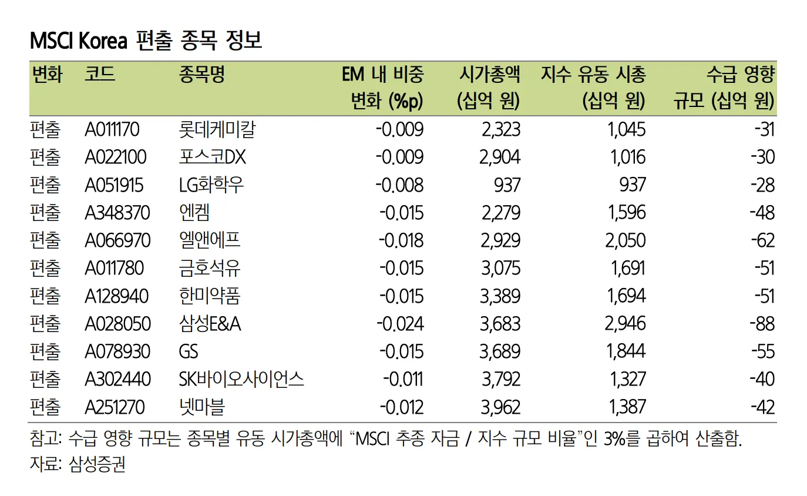
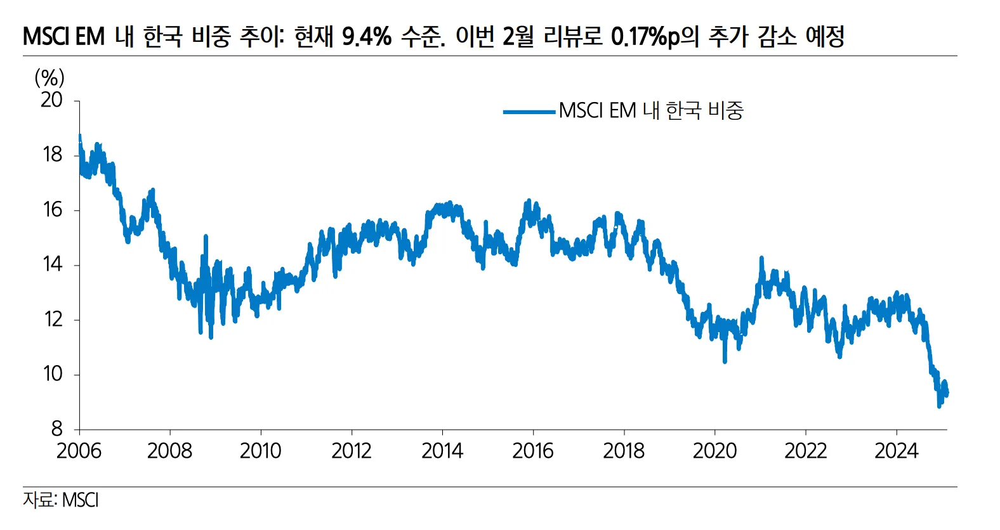
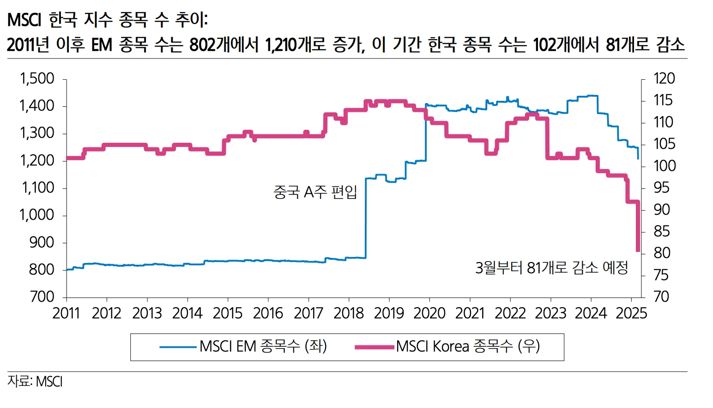

## `MSCI` 한국 지수 변경사항

- MSCI, 2월 12일 한국 지수 구성 종목서 11개 대량 편출 확정
  - 편출 종목 (11개): `롯데케미칼`, `포스코DX,` `LG화학우`, `엔켐`, `엘앤에프`, `금호석유`, `한미약품`, `삼성 E&A`, `GS`, `SK바이오사이언스`, `넷마블`
  - 편입 종목 없음
- 3월 3일 발효, 글로벌 패시브 추종 자금 리밸런싱은 오는 28일 진행 예정

모건스탠리캐피털인터내셔널(`MSCI`) 글로벌 스탠더드 지수 리뷰 결과, 예상대로 총 11종목의 대규모 편출이 확정됐고, **MSCI Korea Standard** 지수에 편입되는 종목은 없었다. 이들 종목에 대한 기존 정보 및 수급 영향 규모는 아래 표와 같다.

모건스탠리캐피털인터내셔널(`MSCI`)의 글로벌 스탠더드 지수 정기 리뷰 결과, 예상대로 한국 지수에서 총 11개 종목이 제외되었으며, 새롭게 편입된 종목은 없었다. 이에 따라 MSCI Korea Standard 지수의 구성 종목 수는 81개로 줄어들게 된다.

### MSCI EM 내 한국 비중 추이

한국 시장의 `MSCI` 신흥시장(EM) 내 비중은 과거 `10~18%` 범위에서 움직였으나, 최근에는 `9%` 수준까지 하락한 상황이다. 이는 한국 증시의 글로벌 위상 약화를 시사하는 부분이기도 하다.

현재 `GS`를 보유 중인데, 이번 편출 이슈로 인해 2월 28일 리밸런싱 시점에서 추가 하락이 예상된다. 현재 `-7.14%` 손실 중이라 손절해야 할지, 아니면 장기 투자로 가져갈지 신중하게 판단해야 할 것 같다. 🤔

## 참고

- [롯데케미칼,GS,넷마블 등 11개사 MSCI 한국 지수서 편출](https://news.nate.com/view/20250212n05939)
- [MSCI 지수](https://namu.wiki/w/MSCI 지수)
- [MSCI 2월 리뷰, 편입 종목 없고, 11종목 편출](https://m.joseilbo.com/news/view.htm?newsid=536604#_enliple)
- [MSCI Korea Index](https://www.msci.com/indexes/index/941000)
- [Kodex MSCI Korea](https://www.samsungfund.com/etf/product/view.do?id=2ETF36)
