# 1. 개요

투자 대가들은 올해 2분기에는 어떤 종목들을 사고 팔았을까? 월가 대표 투자자들의 최신 13F 보고서를 바탕으로 주요 운용사와 대가들의 매수/매도 종목과 투자 전략 변화를 핵심 위주로 분석하고 소개한다.

# 2. 주식 대가들의 포트폴리오 변화

## 2.1 워렌 버핏 (버크셔 해서웨이)

### 2.1.1 2025 Q1 vs Q2 포트폴리오 변경사항

- 새로 추가된 종목

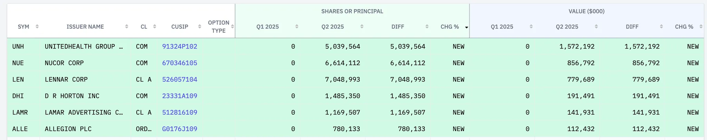

- 추가로 매수한 종목

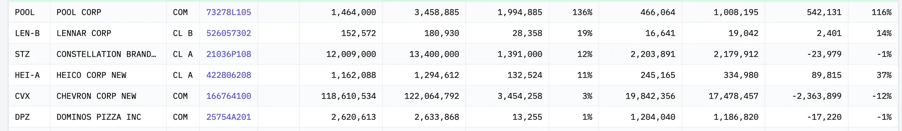

- 비중을 줄인 종목

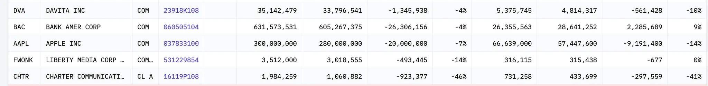

- 청산한 종목

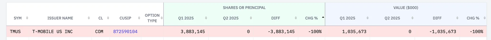

### 2.1.2 2025 Q1 vs Q2 보유 Top 10 주식

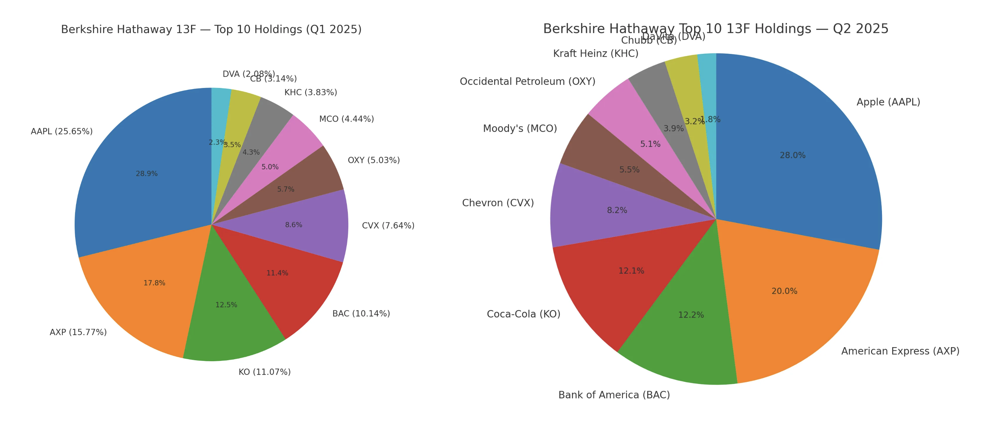

### 2.1.3 포트폴리오 섹터별 비중 분석

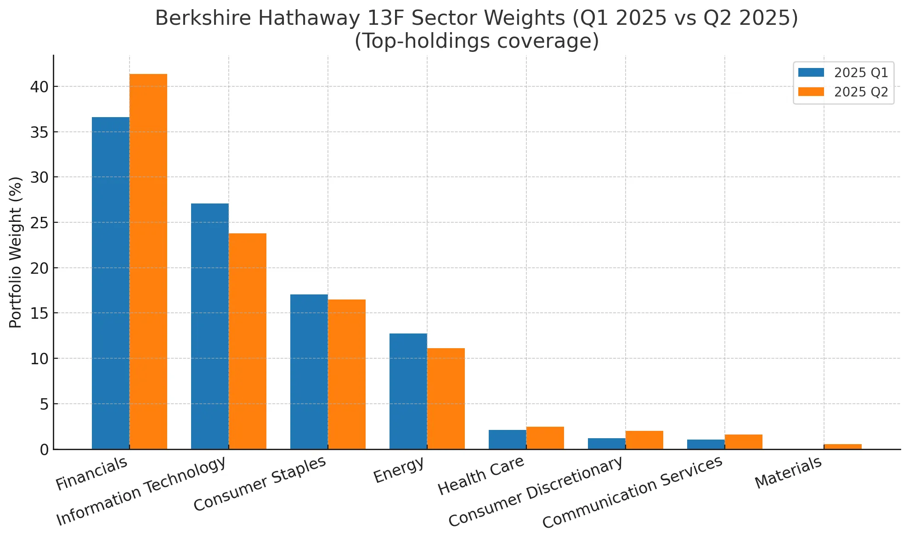

- 금융: `AXP` 비중 상승, `UNH` 신규(헬스케어)이지만 금융 비중 확대가 두드러짐
- 정보기술: `AAPL` 비중 축소 영향
- 필수소비재: `KO`, `KHC` 비중은 큰 변화 없음
- 에너지: `CVX`, `OXY` 조정
- 헬스케어: `UNH` 신규 편입
- 임의소비재: `DPZ`, `POOL` 증가 및 주택건설(`LEN`, `DHI`) 관련 포지션 영향
- 커뮤니케이션서비스: `SIRI`, `LLYVK` 보유
- 소재: `NUE`, `LPX` 추가

### 요약

2025년 2분기 버크셔 해서웨이의 포트폴리오는 집중 위험을 낮추고, 핵심 섹터의 질을 다듬으며(금융 재배치), 금리 인하를 고려해 포지션을 저정하는 것으로 보여진다. 

- `AAPL` 비중이 과도하게 큰 상태에서(여전히 최대임) 추가 축소로 단일 종목 리스크를 낮춤
- `UNH` 신규 편입은 사이버공격, 조사, 경영진 이슈 등으로 밸류에이션 조정된 우량 프랜차이즈를 기회로 본 전형적 버핏 스타일로 해석됨
- 주택건설주(`LEN`, `DHI`)와 철강(`NUE`)를 편성한 이유는 금리 인하를 고려해서 추가된 것으로 파악된다

### 참고

| **티커** | **회사명**                                          | **설명**                                                     |
| -------- | --------------------------------------------------- | ------------------------------------------------------------ |
| `DPZ`    | Domino’s Pizza, Inc.                                | 미국 및 국제적으로 운영되는 글로벌 피자 프랜차이즈. 피자 외에도 샌드위치, 치킨, 파스타 등 다양한 간편식을 판매 |
| `SIRI`   | Sirius XM Holdings Inc.                             | 위성 라디오 및 스트리밍 오디오 콘텐츠 서비스 제공. 구독자 기반 오디오 플랫폼을 운영 |
| `LLYVK`  | Liberty Media Corp. (Liberty Live Group – Series C) | Liberty Media 산하 미디어 및 엔터테인먼트 지주 회사. 스포츠, 방송, 엔터테인먼트 자산에 투자하는 Liberty Live 그룹 주식 시리즈 C |
| `NUE`    | Nucor Corporation                                   | 미국 최대 철강 제조업체 중 하나. 철강, 구조용 강재, 금속 제품 등을 생산 |
| `NPX`    | Nuveen Insured Premium Income Municipal Fund 2      | Nuveen이 운용하는 폐쇄형 펀드. 세금 면제 수입(뮤니시플 인컴)에 투자하며 안정적인 배당 수익을 목표로 함 |

## 2.2 레이 달리오 (브릿지워터)

레이 달리오의 경우에는 변경된 주식 종목 수가 많아서 요약으로만 정리한다.

### 2.2.1 2025 Q1 vs Q2 보유 Top 10 주식

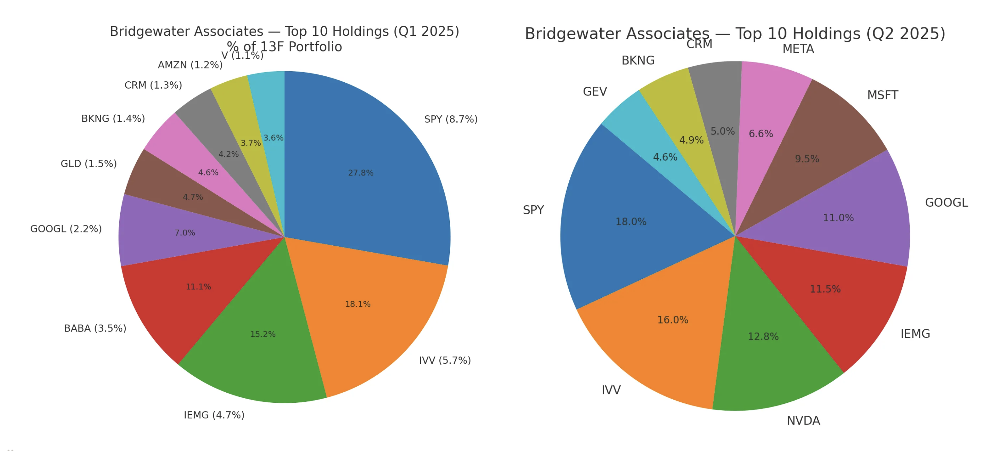

### 2.2.2 포트폴리오 섹터별 비중 분석

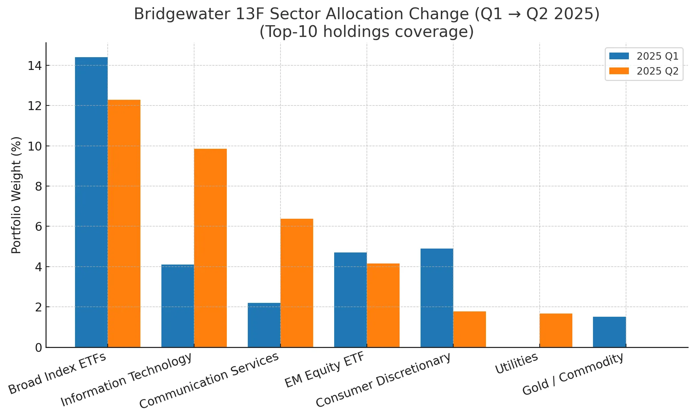

- Broad Index ETF 비중은 축소(`SPY`, `IVV`)
- IT, 커뮤니케이션 서비스 비중은 확대(`NVDA`, `MSFT`, `CRM`, `GOOGL`, `META`의 Top-10 편입 강화)
- 중국 주식은 완전 청산, 금(`GLD`) 비중도 낮춤
- 유틸리티(`GEV`)가 새롭게 Top-10에 등장했다

### 요약

레이 달리오의 2025년 2분기 포트폴리오는 단기적으로 AI 투자 사이클에 베팅하여 초과수익을 노리고, 구조적으로는 중국, 거버넌스 리스크를 디리스크하면서 미국 빅테크로 대체한 판단으로 보인다. 다만 방어의 끈은 놓지 않고 유틸리티 등 캐시플로우 가시성 높은 자산으로 균형을 맞춘듯하다.

- 넓은 베타(`SPY`, `IVV`, `IEMG`) 비중을 살짝 줄이고, 메가테크, AI 개별주(`NVDA`, `MSFT`, `GOOGL`, `META`)로 알파를 키우는 쪽으로 무게중심을 둠
- 중국 주식(알리바바, 핀둬둬, 바이두)를 완전히 청산을 했다. 과세 이슈에 대비를 해서 완전 청산으로 대응한 것으로 보인다
- 금(`GLD`)의 존재감도 낮춤
- 유틸리티(GE Vernova)가 상위권에 새로 들어오며, 집중이 커진 포트폴리오의 변동성을 완충함

### 참고

| **티커** | **상품명 / 회사명**      | **설명**                                                     |
| -------- | ------------------------ | ------------------------------------------------------------ |
| `SPY`    | SPDR S&P 500 ETF Trust   | 미국 대표 대형주 지수인 **S&P500** 지수를 추종하는 세계 최초이자 가장 대형 ETF |
| `IVV`    | iShares Core S&P 500 ETF | **S&P 500** 지수를 추종하는 대표적인 ETF로, 저비용 구조와 세금 효율성을 제공하며 장기 성장을 위한 포트폴리오의 중심(core)으로 활용되는 상품 |
| `GEV`    | GE Vernova Inc.          | **GE에서 분사된 전력·에너지 기업**. 전기 생성, 전송, 변환 및 저장 관련 제품과 서비스를 제공함 |

## 2.3 빌 애크먼 (퍼싱스퀘어)

### 2.3.1 2025 Q1 vs Q2 포트폴리오 변경사항

- 새로 추가된 종목

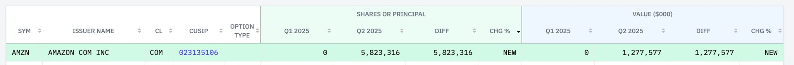

- 추가로 매수한 종목

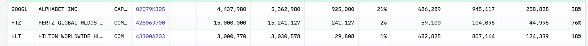

- 청산한 종목

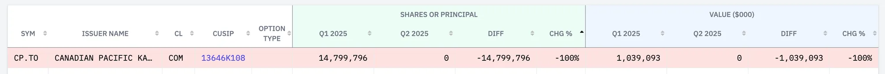

### 2.3.2 2025 Q1 vs Q2 보유 Top 10 주식

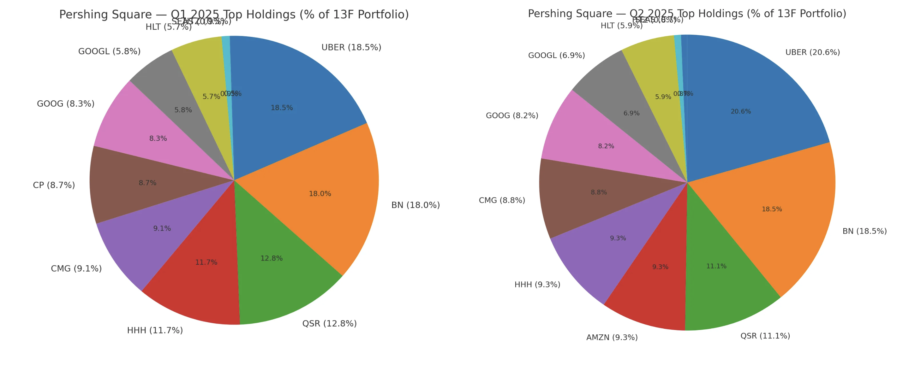

### 2.3.3 포트폴리오 섹터별 비중 분석

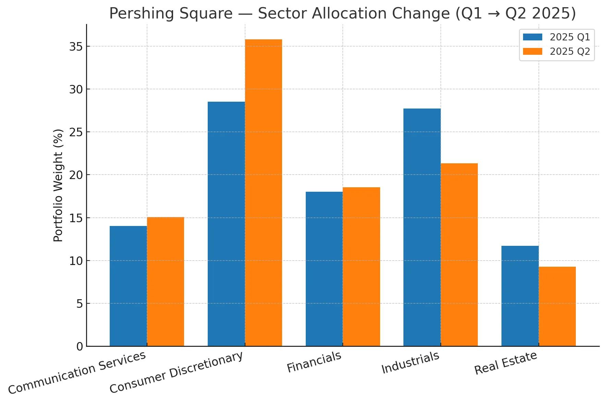

- 소비, 플랫폼 축 강화: `AMZN` 편입 + `UBER` `QSR` `CMG` `HLT` 결합 → 소비, 서비스 생태계 비중 확대
- 산업재 축소: `CP` 이탈로 경기, 금리 민감 노출 경감
- 커뮤니케이션/플랫폼 유지, 보강: `GOOGL` 비중 다듬기로 플랫폼 파워 지속 노출
- 집중도 유지: 종목 수 11개 고수—확신 종목 중심의 고집중 전략 지속

### 요약

2025년 2분기 퍼싱스퀘어의 포트폴리오는 산업재(철도) 플랫폼, 소비재 ↑로 무게중심이 또렷해졌다. Q1 상위에 있던 `CP`를 사실상 접고, `AMZN`을 상위권으로 새로 끌어올리며 우버, 브룩필드, 레스토랑브랜즈, 칩틀레, 힐튼 등 기존 코어와 함께 소비, 서비스, 플랫폼 체인을 두껍게 만들었다. 동시에 알파벳(구글) 비중을 다듬어 커뮤니케이션/광고 플랫폼 노출을 유지, 보강했고, 종목 수는 최소한으로 묶어 확신 있는 소수 종목 집중 기조를 이어갔죠.

- 소비재 비중 확대: `AMZN` 편입, `QSR`, `CMG`, `HLT` 등 기존 소비 테마와의 결합으로 소비재 축이 두터워짐
- 산업재 비중 축소: `CP` 이탈 영향
- 커뮤니케이션/플랫폼 노출 유지, 강화: 구글 비중 조정 지속

이런 리밸런싱은 경기, 금리 민감도가 높은 자본집약 산업을 줄이고, 네트워크 효과, 시장지배력, 현금창출력이 강한 사업으로 위험 대비 기대수익을 높이려는 판단으로 읽힌다. 즉, 광범위한 베타 노출보다 선택적 알파에 베팅하며, 불확실한 매크로에서도 수요 탄성, 가격결정력, 데이터/클라우드 성장이 뚜렷한 자산으로 포트폴리오의 질을 끌어올린 분기였다.

### 참고

| **티커** | 회사명                  | **설명**                                                     |
| ------ | ------------------------------------ | ------------------------------------------------------------ |
| `CP` | Canadian Pacific Kansas City Limited | 철도화물 운송 전문 기업. 캐나다, 미국, 멕시코를 잇는 철도 네트워크 운영 |
| `QSR` | Restaurant Brands International Inc. | Tim Hortons, Burger King, Popeyes, Firehouse Subs 등 패스트푸드 브랜드를 운영하는 글로벌 외식 회사 |
| `CMG` | Chipotle Mexican Grill, Inc.         | 텍스-멕스 스타일의 빠른 캐주얼 레스토랑 운영. 버리토, 타코, 샐러드 등 판매. 미국 중심으로 3,700개 이상 매장 운영 |
| `HLT` | Hilton Worldwide Holdings Inc.       | 호텔 및 리조트 체인 관리, 프랜차이즈, 소유, 임대 운영 기업 . 최근 주가는 $277.50 전후로, 52주 최고가 근처에서 거래 |
| `HTZ` | Hertz Global Holdings, Inc.          | 렌터카 사업자. Hertz, Dollar, Thrifty 등 브랜드로 미국 및 국제 렌터카 서비스 제공 |

## 2.4 켄 피셔 (피셔 투자)

### 2.4.1 2025 Q1 vs Q2 보유 Top 10 주식

### 2.4.2 포트폴리오 섹터별 비중 분석

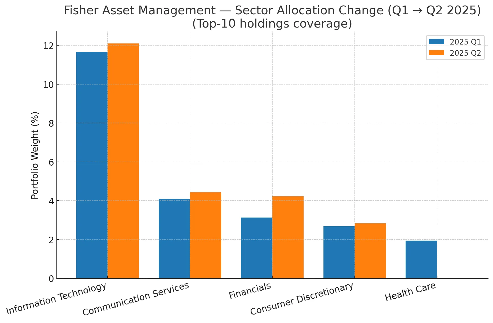

- 정보기술(IT): `MSFT`, `AAPL` 증액, `TSM`, `ASML` 확대 영향
- 커뮤니케이션 서비스: `GOOGL`, `META` 비중 상향
- 금융: `AXP` 신규 편입, `MS`, `JPM` 확대
- 임의소비재: `AMZN` 비중 증가
- 헬스케어: `LLY`가 Top10에서 이탈

### 요약

2025년 2분기 켄 피셔의 포트폴리오는 덩치를 키우면서도 방향은 더 또렷해졌다. 최대 보유가 Apple에서 Microsoft로 바뀌었고, TSMC, ASML로 대표되는 반도체 체인과 Google, Meta 같은 플랫폼 노출을 두껍게 하며 IT, 커뮤니케이션 축을 강화했다. 동시에 American Express 편입, JPM, Morgan Stanley 비중 확대로 금융 섹터 비중을 더 늘렸다. Eli Lilly 등 헬스케어는 상대적으로 후퇴했다. 요약하면, AI/반도체 수요와 플랫폼의 현금창출력에 더 큰 베팅을 걸고, 금리, 신용 사이클의 연착륙(소프트랜딩)을 가정해 금융을 늘린 리밸런싱이다. 고평가 구간의 방어형 자산 비중은 줄이고 성장, 가격결정력, 현금흐름이 확실한 자산에 자본을 재배치해 위험 대비 기대수익을 높인 선택으로 해석된다.

- `MSFT` 가 `APPL`을 제치고 최대 포지션으로 올라섰고, `TSMC`, `ASML`, `GOOGL`, `META` 비중이 둠
- `LLY`는 상위권에서 비중이 낮아짐
- `AXP`가 상위 보유로 편입되고, JPM, `MS` 비중이 커지며 금융 섹터 노출이 확대됨

## 2.5 드러켄 밀러

### 2.5.1 2025 Q1 vs Q2 보유 Top 10 주식

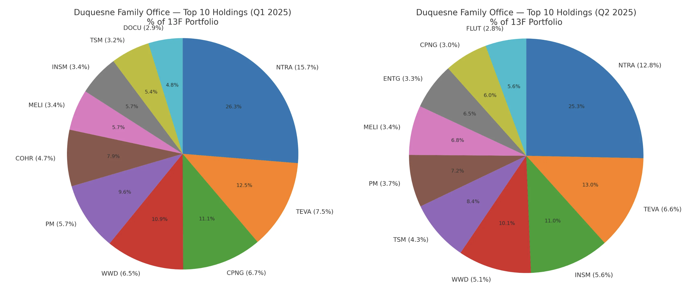

### 2.5.2 포트폴리오 섹터별 비중 분석

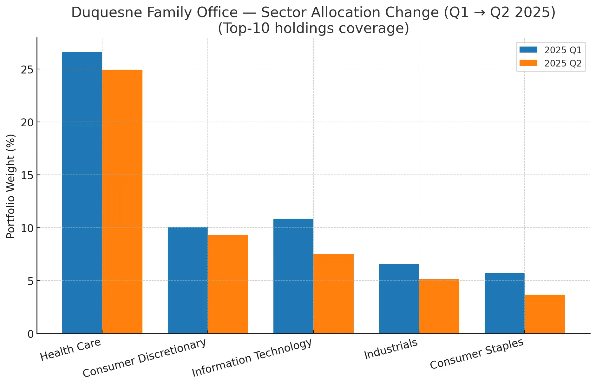

- 헬스케어: `NTRA`, `TEVA`에 `INSM`이 커지며 여전히 최대 값이지만, 전체 포트폴리오가 커지면서 비중은 소폭 낮아짐
- 임의소비재: `CPNG` 축소, `MELI`에 추가로 구성은 넓어졌지만, 총액 확대로 비중은 살짝 하락
- 정보기술: `TSM` 확대, `ENTG` 신규 편입에도 불구하고, Q1의 `COHR`, `DOCU` 비중 축소/이탈 영향으로 전체 비중 하락
- 산업재: `WWD` 비중도 축소
- 필수소비재: `PM` 비중 축소

### 요약

2025년 2분기 드러켄밀러의 포트폴리오의 핵심은 확신 있는 테마 안에서의 선택과 집중으로 요약할 수 있을 듯하다. 전체 포트폴리오의 옵셔널리티를 넓히되, 자본은 바이오 촉매, 반도체 생산능력, 지속성 있는 디지털 소비 같은 현금흐름/성장 가시성이 높은 축으로 더 모았다. 불확실한 매크로 환경에서도 집중과 분산의 균형을 통해, 단기 변동성은 줄이고 테마별 알파를 극대화하려는 리밸런싱으로 볼 수 있다.

- 바이오 ‘알파’ 강화: 임상, 규제 촉매에 민감한 `NTRA`, `INSM` 축을 키워 사건 주도형 알파를 노린 것으로 읽힘
- 반도체 체인으로의 정교한 회전: `TSMC` 확대 + `ENTG` 신규는 AI/고급공정 사이클의 안정적 스루풋(파운드리/소재, 장비)에 초점을 맞춘 선택
- 고변동 단일 이름(`COHR`) 비중은 다소 줄여 리스크, 리워드 균형을 조정한 모습임
- 소비, 디지털 레저의 재배치: `CPNG` 축소, `FLUT` 편입–MELI 유지 조합은 지역과 수익모델(커머스/게임, 스포츠베팅/라틴 플랫폼)의 분산과 선택적 강화함

### 참고

| **티커** | **회사명**                          | **설명**                                                     |
| -------- | ----------------------------------- | ------------------------------------------------------------ |
| `NTRA`   | Natera, Inc.                        | 미국 오스틴 기반의 임상 유전검사 전문 기업. 비침습적 유전자 및 암, 장기 건강 관련 cfDNA 분석 서비스를 제공. 최근 AI 기반 종양 데이터 플랫폼 출시 |
| `TEVA`   | Teva Pharmaceutical Industries Ltd. | 이스라엘 소재의 세계 최대 제네릭 의약품 제조업체. 일반의약품, 특허만료 의약품, 바이오의약품 등 다양한 제품 운영 |
| `INSM`   | Insmed Incorporated                 | 희귀 및 중증 질병 치료제 개발 글로벌 바이오제약사            |
| `MELI`   | MercadoLibre, Inc.                  | 남미 최대 전자상거래 & 핀테크 플랫폼. 브라질, 멕시코, 아르헨티나 중심으로 사업 운영. ‘남미의 아마존’으로 불림 |
| `ENTG`   | Entegris, Inc.                      | 반도체 및 첨단 기술 산업에 특화된 소재 솔루션 제공 기업. 세척, 필터링, 보호 소재 등 고급소재 제공 |
| `COHR`   | Coherent Corp                       | 레이저와 광학 기반 첨단 기술 제품을 제공하는 기업            |
| `DOCU`   | DocuSign, Inc.                      | 전자 서명 및 디지털 계약 솔루션 선도 기업. 문서 관리 및 전자서명 SaaS 제공 |
| `WWD`    | Women’s Wear Daily                  | 세계 패션업계의 권위 있는 전문지. ‘패션계의 바이블’로 불리며, 패션·뷰티·리테일 산업 트렌드 제공 |
| `FLUT`   | Flutter Entertainment plc           | 온라인 베팅 및 게임 분야 글로벌 기업. FanDuel 등 브랜드 운영 |

# 3. 마무리

올해 2분기까지 대가들의 포트폴리오의 편화는 확신이 선명한 섹터 - AI, 반도체, 글로벌 플랫폼, 탄탄한 현금흐름을 가진 소비, 서비스—에는 굵게 힘을 실었다. 동시에 불확실성이 큰 자산(규제, 정책 리스크가 큰 지역, 업종)은 과감히 줄이거나, 질이 더 좋은 대체로 갈아탔죠. 분기마다 *"잘 오른 건 조금 덜고, 확신이 커진 건 더하는"* 리밸런싱을 반복하며 쏠림을 관리한 것도 공통적이다. 무엇보다 기회가 올 때 바로 쓸 수 있도록 현금 여력을 챙기는 태도가 눈에 띤다.

- 기술주는 AI로 비중을 더 늘리는 방향
- 금리인하 기대로 인해
  - 바이오, 주택, 소재 쪽을 많이 담음
  - 완만한 금리 하락, 소프트랭딩 가정 아래 금융을 담
  - 헤지되는 금은 축소
- 과세 이슈로 리스크가 되는 중국 종목은 축소하거나 완전히 정리

>  13F 보고서는 단기 매매 아이디어라기보다, 대가들이 포트폴리오를 어떻게 다듬어 가는지 보여주는 기록입니다. 우리도 분기마다 포트폴리오를 점검할 때, 그들의 선택에서 전략적 힌트를 얻어 적용한다면 보다 체계적인 투자 습관을 만들 수 있을 것 같습니다. 

# 4. 참고

- https://www.youtube.com/watch?v=yP1U1YA24xw
- https://www.youtube.com/watch?v=XWBvLa_ummg
