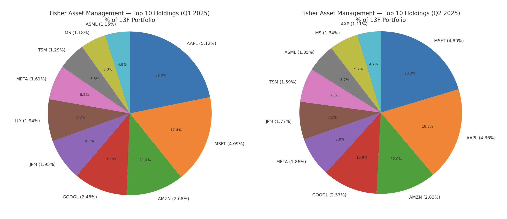

# 1. 개요

투자 대가들은 올해 2분기에는 어떤 종목들을 사고 팔았을까? 월가 대표 투자자들의 최신 13F 보고서를 바탕으로 주요 운용사와 대가들의 매수/매도 종목과 투자 전략 변화를 핵심 위주로 분석하고 소개한다.

# 2. 주식 대가들의 포트폴리오 변화

## 2.1 워렌 버핏 (버크셔 해서웨이)

### 2.1.1 2025 Q1 vs Q2 포트폴리오 변경사항

- 새로 추가된 종목

- 추가로 매수한 종목

- 비중을 줄인 종목

- 청산한 종목

### 2.1.2 2025 Q1 vs Q2 보유 Top 10 주식

### 2.1.3 포트폴리오 섹터별 비중 분석

- 금융: `AXP` 비중 상승, `UNH` 신규(헬스케어)이지만 금융 비중 확대가 두드러짐
- 정보기술: `AAPL` 비중 축소 영향
- 필수소비재: `KO`, `KHC` 비중은 큰 변화 없음
- 에너지: `CVX`, `OXY` 조정
- 헬스케어: `UNH` 신규 편입
- 임의소비재: `DPZ`, `POOL` 증가 및 주택건설(`LEN`, `DHI`) 관련 포지션 영향
- 커뮤니케이션서비스: `SIRI`, `LLYVK` 보유
- 소재: `NUE`, `LPX` 추가

### 요약

2025년 2분기 버크셔 해서웨이의 포트폴리오는 집중 위험을 낮추고, 핵심 섹터의 질을 다듬으며(금융 재배치), 금리 인하를 고려해 포지션을 저정하는 것으로 보여진다. 

- `AAPL` 비중이 과도하게 큰 상태에서(여전히 최대임) 추가 축소로 단일 종목 리스크를 낮춤
- `UNH` 신규 편입은 사이버공격, 조사, 경영진 이슈 등으로 밸류에이션 조정된 우량 프랜차이즈를 기회로 본 전형적 버핏 스타일로 해석됨
- 주택건설주(`LEN`, `DHI`)와 철강(`NUE`)를 편성한 이유는 금리 인하를 고려해서 추가된 것으로 파악된다

## 2.2 레이 달리오 (브릿지워터)

### 2.2.1 2025 Q1 vs Q2 포트폴리오 변경사항

레이 달리오의 경우에는 변경된 주식 종목 수가 많아서 요약으로만 정리한다.

### 2.2.2 2025 Q1 vs Q2 보유 Top 10 주식

### 2.2.3 포트폴리오 섹터별 비중 분석

- Broad Index ETF 비중은 축소(`SPY`, `IVV`)
- IT, 커뮤니케이션 서비스 비중은 확대(`NVDA`, `MSFT`, `CRM`, `GOOGL`, `META`의 Top-10 편입 강화)
- 중국 주식은 완전 청산
- 중국 익스포저(`BABA`)는 Top-10에서 이탈, 금(`GLD`)도 Top-10에서 사라짐
- 유틸리티(`GEV`)가 새롭게 Top-10에 등장했다

### 요약

레이 달리오의 2025년 2분기 포트폴리오는 단기적으로 AI 투자 사이클에 베팅하여 초과수익을 노리고, 구조적으로는 중국, 거버넌스 리스크를 디리스크하면서 미국 빅테크로 대체한 판단으로 보인다. 다만 방어의 끈은 놓지 않고 유틸리티 등 캐시플로우 가시성 높은 자산으로 균형을 맞춘듯하다.

- 넓은 베타(`SPY`, `IVV`, `IEMG`) 비중을 살짝 줄이고, 메가테크, AI 개별주(`NVDA`, `MSFT`, `GOOGL`, `META`)로 알파를 키우는 쪽으로 무게중심을 둠
- 중국 주식(알리바바, 핀둬둬, 바이두)를 완전히 청산을 했다. 과세 이슈에 대비를 해서 완전 청산으로 대응한 것으로 보인다
- 금(`GLD`)의 존재감도 낮춤
- 유틸리티(GE Vernova)가 상위권에 새로 들어오며, 집중이 커진 포트폴리오의 변동성을 완충함

## 2.3 빌 애크먼 (퍼싱스퀘어)

### 2.1.1 2025 Q1 vs Q2 포트폴리오 변경사항

- 새로 추가된 종목

- 추가로 매수한 종목

- 청산한 종목

### 2.1.2 2025 Q1 vs Q2 보유 Top 10 주식

### 2.1.3 포트폴리오 섹터별 비중 분석

- 소비·플랫폼 축 강화: `AMZN` 편입 + 우버 `QSR` `CMG` `HLT` 결합 → 소비·서비스 생태계 비중 확대
- 산업재 축소: 철도(`CP`) 이탈로 경기·금리 민감 노출 경감
- 커뮤니케이션/플랫폼 유지·보강: 알파벳(구글) 비중 다듬기로 플랫폼 파워 지속 노출
- 집중도 유지: 종목 수 11개 고수—확신 종목 중심의 고집중 전략 지속

### 요약

2025년 2분기 퍼싱스퀘어의 포트폴리오는 산업재(철도) 플랫폼, 소비재 ↑로 무게중심이 또렷해졌다. Q1 상위에 있던 CP(철도)를 사실상 접고, 아마존(`AMZN`)을 상위권으로 새로 끌어올리며 우버, 브룩필드, 레스토랑브랜즈, 칩틀레, 힐튼 등 기존 코어와 함께 소비, 서비스, 플랫폼 체인을 두껍게 만들었다. 동시에 알파벳(구글) 비중을 다듬어 커뮤니케이션/광고 플랫폼 노출을 유지, 보강했고, 종목 수는 최소한으로 묶어 확신 있는 소수 종목 집중 기조를 이어갔죠.

- 소비재 비중 확대: `AMZN` 편입, `QSR`, `CMG`, `HLT` 등 기존 소비 테마와의 결합으로 소비재 축이 두터워짐
- 산업재 비중 축소: 철도(`CP`) 이탈 영향
- 커뮤니케이션/플랫폼 노출 유지, 강화: 구글 비중 조정 지속

이런 리밸런싱은 경기, 금리 민감도가 높은 자본집약 산업을 줄이고, 네트워크 효과, 시장지배력, 현금창출력이 강한 사업으로 위험 대비 기대수익을 높이려는 판단으로 읽힌다. 즉, 광범위한 베타 노출보다 선택적 알파에 베팅하며, 불확실한 매크로에서도 수요 탄성, 가격결정력, 데이터/클라우드 성장이 뚜렷한 자산으로 포트폴리오의 질을 끌어올린 분기였다

## 2.4 켄 피셔 (피셔 투자)

켄 피셔의 포트폴리오 변화도 너무 많아서 변경사항은 요약본으로 작성을 한다.

### 2.1.2 2025 Q1 vs Q2 보유 Top 10 주식

### 2.1.3 포트폴리오 섹터별 비중 분석

- 정보기술(IT): `MSFT`, `AAPL` 증액, `TSM`, `ASML` 확대 영향.
- 커뮤니케이션 서비스: `GOOGL`, `META` 비중 상향.
- 금융: `AXP` 신규 편입, `MS`, `JPM` 확대.
- 임의소비재: `AMZN` 비중 증가.
- 헬스케어: `LLY`가 Top10에서 이탈.

### 요약

해석 한 줄: **빅테크/플랫폼, 금융으로 무게를 더 싣고, 헬스케어는 후퇴**성장, 소비 모멘텀과 완만한 금리 환경(소프트랜딩)에 베팅한 전술로 보인다.

2025년 2분기 켄 피셔의 포트폴리오는 덩치를 키우면서도 방향은 더 또렷해졌다. 최대 보유가 Apple에서 Microsoft로 바뀌었고, TSMC, ASML로 대표되는 반도체 체인과 Alphabet, Meta 같은 플랫폼 노출을 두껍게 하며 IT, 커뮤니케이션 축을 강화했다. 동시에 American Express 편입, JPM, Morgan Stanley 비중 확대로 금융 섹터를 재가중했고, Eli Lilly 등 헬스케어는 상대적으로 후퇴했다. 요약하면, AI/반도체 수요와 플랫폼의 현금창출력에 더 큰 베팅을 걸고, 금리, 신용 사이클의 연착륙(소프트랜딩)을 가정해 금융을 늘린 리밸런싱이다. 고평가 구간의 방어형 자산 비중은 줄이고 성장, 가격결정력, 현금흐름이 확실한 자산에 자본을 재배치해 위험 대비 기대수익을 높인 선택으로 해석된다.

- Microsoft가 `Apple`을 제치고 최대 포지션으로 올라섰고, `TSMC`, `ASML`(반도체 체인), `Alphabet`, `Meta`(플랫폼) 비중이 둠
- Eli Lilly(헬스케어)는 상위권에서 비중이 낮아짐
- American Express(`AXP`)가 상위 보유로 편입되고, JPM, Morgan Stanley 비중이 커지며 금융 섹터 노출이 확대됨

## 2.5 드러켄 밀러

드러컨 밀러의 포트폴리오 변화도 많아서 변경사항은 요약본으로 작성을 한다.

### 2.1.2 2025 Q1 vs Q2 보유 Top 10 주식

### 2.1.3 포트폴리오 섹터별 비중 분석

- 헬스케어: `NTRA`, `TEVA`에 `INSM`이 커지며 여전히 최댓값이지만, 전체 포트폴리오가 커지면서 비중은 소폭 낮아졌다
- 임의소비재: `CPNG`, `MELI`에 `FLUT` 추가로 구성은 넓어졌지만, 총액 확대로 비중은 살짝 하락
- 정보기술: `TSM` 확대, `ENTG` 신규 편입에도 불구하고, Q1의 `COHR`, `DOCU` 비중 축소/이탈 영향으로 전체 비중 하락
- 산업재: `WWD` 비중이 총액 증가 속에서 희석
- 필수소비재: `PM` 비중 축소

### 요약

2025년 2분기 드러켄밀러의 포트폴리오의 핵심은 확신 있는 테마 안에서의 선택과 집중으로 요약할 수 있을 듯하다. 전체 포트폴리오의 옵셔널리티를 넓히되, 자본은 바이오 촉매, 반도체 생산능력, 지속성 있는 디지털 소비 같은 현금흐름/성장 가시성이 높은 축으로 더 모았다. 불확실한 매크로 환경에서도 집중과 분산의 균형을 통해, 단기 변동성은 줄이고 테마별 알파를 극대화하려는 리밸런싱으로 볼 수 있다.

- 바이오 ‘알파’ 강화: 임상, 규제 촉매에 민감한 `NTRA`, `INSM` 축을 키워 사건 주도형 알파를 노린 것으로 읽힘
- 반도체 체인으로의 정교한 회전: TSMC 확대 + ENTG 신규는 AI/고급공정 사이클의 안정적 스루풋(파운드리/소재, 장비)에 초점을 맞춘 선택
- 고변동 단일 이름(`COHR`) 비중은 다소 줄여 리스크, 리워드 균형을 조정한 모습임
- 소비, 디지털 레저의 재배치: `CPNG` 축소, `FLUT` 편입–MELI 유지 조합은 지역과 수익모델(커머스/게임, 스포츠베팅/라틴 플랫폼)의 분산과 선택적 강화함

# 3. 마무리

올해 2분기까지 살펴본 대가들의 포트폴리오는 결이 놀랄 만큼 비슷했다. 기본 뼈대는 최대한 단순하게 두되(시장 전체를 담는 지수, 초대형 우량 위주), 확신이 선명한 주제—AI, 반도체, 글로벌 플랫폼, 탄탄한 현금흐름을 가진 소비, 서비스—에는 굵게 힘을 실었다. 동시에 불확실성이 큰 자산(규제, 정책 리스크가 큰 지역, 업종)은 과감히 줄이거나, 질이 더 좋은 대체로 갈아탔죠. 분기마다 "잘 오른 건 조금 덜고, 확신이 커진 건 더하는" 리밸런싱을 반복하며 쏠림을 관리한 것도 공통적이다. 무엇보다 기회가 올 때 바로 쓸 수 있도록 현금 여력을 챙기는 태도가 눈에 띤다.

구체적으로 보면 흐름은 이렇다

- **기술축 강화**: MSFT, GOOGL, META와 TSM, ASML 등 공급망까지 이어지는 기술/반도체 라인을 전반적으로 두텁게 유지, 확대
- **디리스크(갈아타기)**: 중국 ADR 등 불확실성이 큰 노출은 축소하고, 비슷한 성장 성격을 가진 미국 대형 플랫폼, 우량주로 대체
- **규율 있는 리밸런싱**: 상위 보유 비중은 높게 유지하되, 구성은 유연하게 회전—집중과 분산의 균형을 동시에 잡음

투자자가 가져갈 메시지는 간단하다. **코어는 단단하게, 위성은 선명하게**—지수, 초대형 우량으로 토대를 만들고, 확신이 분명한 테마에만 비중을 더하세요. **정기 점검**으로 쏠림을 관리하고, 꺼림칙한 자산은 비워두기보다 **더 나은 대체**로 바꾸는 습관을 들이면 된다. 마지막으로 **약간의 현금**은 수익을 포기하는 비용이 아니라, 좋은 가격에 살 수 있는 **기회 자원**이라는 점을 기억해 두면 블로그에서 다룬 대가들의 공통된 실행 원리가 자연스럽게 포트폴리오에 녹아들 것이다.

올해 2분기까지 살펴본 대가들(버핏, 달리오, 애크먼, 켄 피셔, 드러켄밀러)의 포트폴리오는, 큰 틀에서 **시장 베타 노출은 더 효율적으로 다듬고(단순화)**, **초과수익이 기대되는 축에는 더 선명하게 베팅(선명화)**했다는 공통점이 뚜렷하다.

- **코어–위성 구조가 선명**: 코어는 **초대형, 고품질 자산**(미국 빅테크/플랫폼, 지수 ETF, 블루칩 금융), 위성은 **테마/특수상황**(반도체 공급망, 바이오 촉매, 주택, 소재 등)로 운용.
- **AI/반도체 쪽 기울기**: MSFT, GOOGL, META 같은 플랫폼과 **TSM, ASML 등 공급망** 비중을 넓히는 모습이 곳곳에서 확인.
- **집중 리스크 관리 + 업그레이드**: **초대형 단일 종목, 국가 리스크를 트림**(예: 특정 초과집중 축소, 중국 ADR 축소)하고 **질 좋은 대체자산으로 교체**.
- **ETF ↔ 개별주 ‘베타/알파 믹스’ 조정**: 넓은 지수 노출을 약간 줄이고 **개별 초대형 종목으로 알파를 증폭**(특히 달리오/브리지워터).
- **리밸런싱의 규율**: 분기마다 **상위 보유 비중을 손봐** 쏠림을 관리—상위 10개 비중은 높게 유지하되 **구성은 유연하게 회전**.
- **매크로 가설에 근거한 섹터 톤**: **완만한 금리 하락, 소프트랜딩** 가정 아래 **금융, 소비, 플랫폼**을 키우고, **헤지(금 등)**는 상대적으로 후퇴한 사례가 다수.
- **현금/옵셔널리티 중시(특히 버핏)**: 공격과 수비 간 전환을 빠르게 하기 위한 **유연성 확보**에 방점.

### **투자자가 가져갈 한 줄 교훈**

- **코어는 간결하게, 위성은 선명하게**: 지수, 초대형 우량으로 토대를 만들고, 사이클/촉매가 뚜렷한 테마에 선택적으로 베팅.
- **정기 리밸런싱으로 쏠림을 관리**: “잘 오른 건 조금 덜고, 확신이 커진 건 더하고”를 분기 단위로 실행.
- **리스크는 ‘대체’로 줄인다**: 꺼림칙한 자산을 비워두기보다 **동일 테마의 더 질 좋은 대체자산**으로 스왑.
- **매크로 가설을 의사결정의 배경으로만 사용**: 최종 판단은 **개별 자산의 질(현금흐름, 지배력, 밸류에이션)**에 기초.

블로그 마무리 문장으로 쓰기 좋게 정리하면:

> “대가들은 올 2분기에도 포트폴리오의
>
> **뼈대는 단단히, 날은 더 예리하게**
>
> **질 높은 코어**
>
> **AI, 반도체, 바이오 같은 알파 축**
>
> **리스크는 대체와 리밸런싱으로 통제**
>
> **간결함과 선택의 힘**

# 4. 참고

- https://www.youtube.com/watch?v=yP1U1YA24xw
- https://www.youtube.com/watch?v=XWBvLa_ummg
