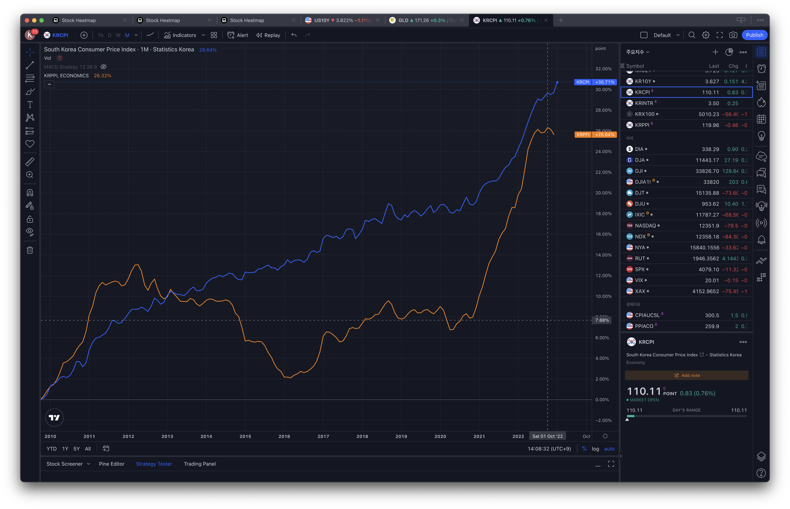

## CPI와 PPI의 차이점

물자지수는 일반적으로 소비자물가지수(`CPI`)나 생산자물가지수(`PPI`)로 측정한다. 이들 지수는 소비자와 생산자가 상품과 서비스를 구입하는 데 필요한 비용을 측정한다. 즉 물가지수가 상승하면 인플레이션의 증가를 나타내며, 상품과 서비스를 구입하는 데 더 큰 비용이 들게 된다. 이렇게 되면 소비자는 상품과 서비스를 구입하지 않게 되어 기업의 수익성에 영향을 주게 될 수 있다. 이에 따라서 기업의 수익성이 감소할 수 있으며, 주식 시장에서는 하락할 수 있게 된다. 또한 물가 상승은 기업의 생산비용이 증가할 수 있으므로, 기업의 이익에 부담이 될 수 있다. 물자지수와 주식 간의 관계를 보면 반비례하는 관계를 갖게 된다. 구체적으로 `CPI`와 `PPI`는 어떤 차이가 있는지도 알아보자.

### CPI (소비자물가지수)

- `CPI`는 소비자들이 직접 지출하는 가격을 기반으로 물가 상승률을 산출한다
    - 즉, 음식, 주거, 전력, 교통 등 소비자가 구입하는 상품과 서비스를 대상이 된다
- `CPI`는 소비자들이 실제로 지출하는 가격을 반영하므로, 소비자들이 상품과 서비스에 대해 지불하는 비용의 증감을 측정하여 물가 상승률을 산출한다

### PPI (생산자물가지수)

- `PPI`는 생산자들이 직접 지출하는 가격을 기반으로 생산자 가격 상승률을 산출한다
    - 생산자들이 상품을 생산하는 과정에서 소비하는 재료와 부품, 인건비, 운송비, 에너지비 등의 가격 변화를 측정한다
    - `PPI`는 제조업, 광업, 농업, 건설업 등의 생산자들을 대상으로 하므로, 소비자들이 직접 구매하는 상품이 아닌 생산 과정에서 사용되는 원자재 및 부재료 등의 가격 변동을 반영한다
- `PPI`는 생산자가 상품을 생산하는데 드는 비용을 측정하므로, 생산자 가격 상승률을 산출한다

## 마무리

`TradingView`를 사용하고 있다면,  `CPI`, `PPI`는 제 [Watch List](에서 `CPI`, `PPI`는https://www.tradingview.com/watchlists/96826365/)에서 확인할 수 있다.

- CPI
    - `CPIAUCSL`
    - `KRCPI`
- PPI
    - `PPIACO`
    - `KRPPI`

# 참고

- https://chat.openai.com/chat
- [인플레이션 CPI PPI 뜻과 상관관계, 주식시장에 끼치는 영향](https://binbong.tistory.com/entry/%EC%9D%B8%ED%94%8C%EB%A0%88%EC%9D%B4%EC%85%98-CPI-PPI-%EB%AC%BC%EA%B0%80%EC%A7%80%EC%88%98-%EB%9C%BB-%EC%83%81%EA%B4%80%EA%B4%80%EA%B3%84-%EC%A3%BC%EC%8B%9D%EC%8B%9C%EC%9E%A5-%EC%98%81%ED%96%A5)
