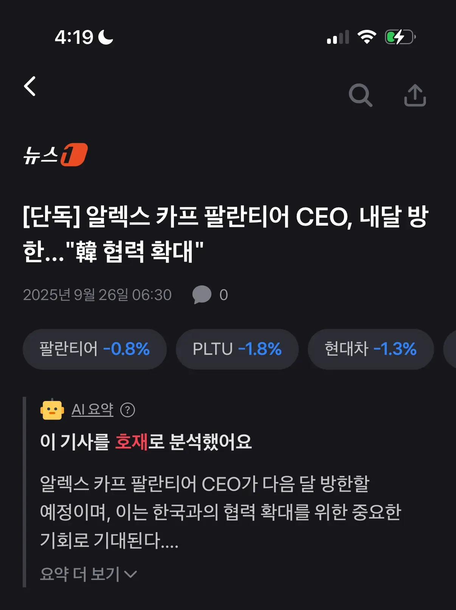
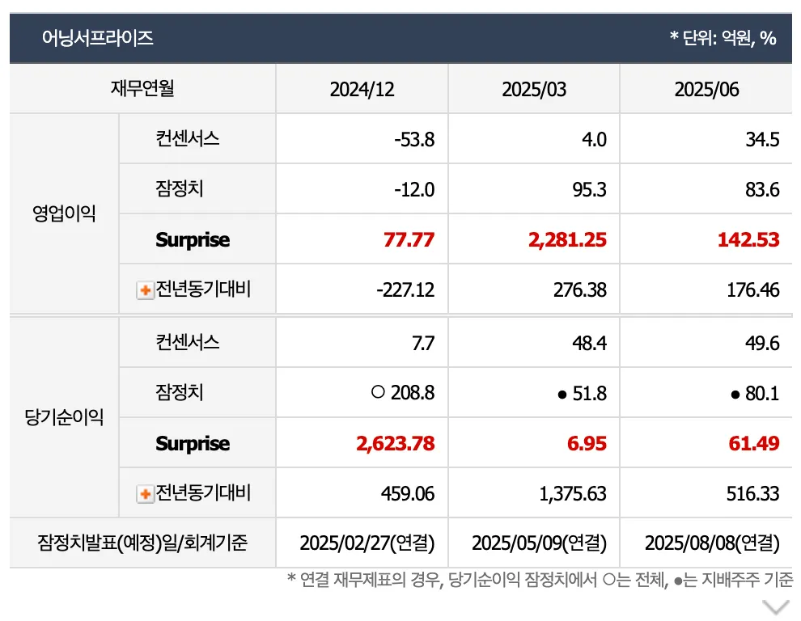

# 1. 개요

주식을 하다보면 기업 관련 뉴스가 호재인지 악재인지를 빠르게 판단하는 게 중요하다. 투자를 하다보면 자연스럽게 알게 되기도 하고 아래와 같이 투자 앱에서도 관련 뉴스가 호재인지 악재인지도 AI를 통해서 자동으로 알려주기도 한다.

주식 투자하는 입장에서 어떤 소식이 주가에 어떤 영향을 주고 있는지 미리 알고 있는게 중요하다. 이 글에서는 실제로 호재와 악재가 발생하는 시점, 증시에 미치는 영향을 예시와 함께 정리한다.

# 2. 호재인 경우

## 2.1 예상치를 뛰어넘는 재무 성과

예상 매출, 영업이익, 당기순이익이 예상보다 좋게 나오면 주가를 오른다.

애널리스트들의 추정보다 더 좋게 나오면 어닝 서프라이즈(Earning Suprise)라고해서 주가가 더 급등하기도 한다.

- [와이지엔터, 2Q 깜짝실적에 앨범판매 호조…목표가↑-하나](https://marketin.edaily.co.kr/News/ReadE?newsId=01243126635707320)

> 분기 어닝 서프라이즈의 연속성

분기 어능 서프라이즈의 경우에는 보통 연속적으로 터지는 경우가 많아서 첫 어닝 서프라이즈에 바로 들어가는게 좋다. 대부분 첫번째, 두번째에 강세를 이루지만 뒤로 갈수록 세번쨰부터는 시장에 별 반응을 얻지 못하기도 한다.

## 2.2 시장 점유율 증가

시장 점유율 증가 뉴스는 미래 성장을 자극하기 때문에 호재로 보는 경우가 많다. 한번 점유율이 높아지기 시작하면 추세적으로 계속 확장하는 경향이 있기 때문이다.

- [오라클, 美 정부에 최대 75% 할인 공세…클라우드 점유율 반격 나선다](https://zdnet.co.kr/view/?no=20250707084030)

| **기업**     | **2024년 말 점유율** | **2025년 Q2~Q3 점유율** | **변화 추이/특징**      |
| ------------ | -------------------- | ----------------------- | ----------------------- |
| AWS          | 31~32%               | 29~30%                  | 소폭 감소, 절대 1위     |
| MS Azure     | 22~24%               | 20~22%                  | 성장률 20%+로 꾸준 증가 |
| Google Cloud | 11~12%               | 12~13%                  | 완만한 성장             |
| Oracle       | 2~3%                 | 3~4%                    | 최근 AI 수주로 급증     |

오라클이 다른 클라우드 플랫폼 보다 제일 낮은 점유율를 가지고 있지만, 최근 오라클이 고성능 AI 컴퓨팅을 지원하며 엔비디아, OpenAI, xAI 까지 주요 AI 기업들의 선택을 받아 실적도 좋게 나오고 있어서 주식에도 좋은 영향을 주고 있다.

## 2.3 혁신

혁신은 기업의 미래 가치를 높이는 핵심 요소다. 신약 개발 성공, 글로벌 히트 게임, 아티스트의 빌보드 석권, 신기술 도입과 같은 사례는 단순한 이벤트를 넘어 기업의 성장성과 시장 지배력을 증명한다. 투자자 입장에서는 이런 혁신이 기업 펀더멘털을 강화하는 중요한 신호로 작용하며, 성공적인 혁신은 언제나 기업 가치를 끌어올리는 촉매제가 된다.

- [신약 파이프라인만 33개…유한양행은 글로벌로 간다](https://www.notion.so/26d46a2166e38063a632f692f786ed83?pvs=21)
- ["세븐나이츠 리버스 글로벌 흥행"넷마블 목표가↑-미래에셋증권](https://www.msn.com/ko-kr/news/other/세븐나이츠-리버스-글로벌-흥행넷마블-목표가-미래에셋증권/ar-AA1N1hbN)
- [로제 ‘아파트’ 빌보드 핫100 8위…글로벌 차트 1위 석권](https://news.kbs.co.kr/news/pc/view/view.do?ncd=8092800)

## 2.4 전략적 제휴 (MOU)

전략적 제휴(MOU) 발표는 시장의 기대감을 자극해 주가를 단기적으로 끌어올리는 경우가 많다. 특히 글로벌 대기업과의 협력이면 미래 매출 확대 가능성이 반영되면서 투자자들의 관심이 집중된다. 다만 법적 구속력이 없는 만큼 실제 성과로 이어지는지 확인하는 것이 중요하다.

- [삼성증권, 美 캔터와 MOU…"주식 중개 넘어 신사업 시너지”](https://news.einfomax.co.kr/news/articleView.html?idxno=4373577)
- [한국과 MOU, 美원전주 일제 폭등, 오클로 30%-SMR 20%(종합)](https://www.notion.so/26d46a2166e38063a632f692f786ed83?pvs=21)

## 2.4 새로운 시장 진출

기업이 새로운 시장에 진출하거나 해외에 신규 공장을 설립하는 것은 성장 잠재력을 크게 높이는 신호로 받아들여진다. 예를 들어 글로벌 시장 진출은 매출처와 고객 기반을 다변화해 안정성을 높이고, 해외 공장 설립은 생산능력을 확장하며 현지 시장 점유율 확대 기대감을 불러일으킨다. 이러한 요소들은 투자자들에게 미래 실적 개선에 대한 확신을 주어 주가에 긍정적으로 작용하는 경우가 많다.

- [LS증권, KT&G 글로벌 진출 호재···주주환원 강화에 목표가 5.7% 상향](https://www.newsway.co.kr/news/view?ud=2025092409073173062)
- [[N2 특징주\] 진매트릭스, 유럽 의료기기 인증·美 특허 호재에 '강세'…글로벌 진출 '속도' 전망](https://www.news2day.co.kr/article/20250919500129)
- [HK이노엔 ‘케이캡’, 보퀘즈나 독점권 연장…미국 진출 '호재’](https://www.bloter.net/news/articleView.html?idxno=639050)
- [현대차 신규공장에 자금 확보까지…SK온, 북미서 '퀀텀점프' 시동](https://www.yna.co.kr/view/AKR20250329028800003)

## 2.5 정부가 추진 하는 사업

정부의 규제 발표가 기업에는 악재가 될 수 있지만, 반대로 정부가 추진하는 사업은 종종 강력한 호재로 작용한다. 신재생에너지 확대, 반도체 지원, 2차전지 산업 육성, SOC(사회간접자본) 투자 확대 같은 정책은 해당 산업의 기업들에 직접적인 수혜를 준다. 특히 정부 예산과 정책 방향이 집중되는 분야는 단기적으로 수급 기대감이 높아지고, 장기적으로도 성장 기반을 다지는 효과가 있어 투자자들의 관심이 몰린다. 따라서 정부 규제와 함께 추진 사업을 균형 있게 살펴보는 것이 투자 전략에서 중요하다.

- [NAVER, 새 정부 AI 정책 수혜 기대와 기술적 우위 기반 실적 개선 기대에 주가 급등](https://www.hankyung.com/article/202509041959a)
- [건설株, 정부 주택공급 확대 추진에 급등…동신건설 20%↑](https://www.newsis.com/view/NISX20250908_0003319417)
- [LG CNS, 2주 만에 주가 2배…대형 AI사업·정부인사 상승작용](https://zdnet.co.kr/view/?no=20250624163319)

> **정권 교체와 투자 전략**

새로운 정권이 들어서면 정부의 산업 정책, 규제 방향, 세금 제도가 달라지면서 시장의 수급과 기대치도 빠르게 바뀐다. 예를 들어 트럼프 정부의 감세와 에너지 산업 지원은 관련 업종 주가를 끌어올렸으며, 한국에서도 특정 후보의 공약에 따라 부동산·금융·신재생에너지 등 섹터가 민감하게 반응할 수 있다. 따라서 정권 교체 시기에는 단순히 기존 투자 포트폴리오를 유지하기보다는, 새 정부의 핵심 공약과 정책 기조를 분석해 선제적으로 투자 전략을 재편하는 것이 필요하다.

# 3. 악재인 경우

## 3.1 예상치를 하회하는 실적

기업이 발표한 매출, 영업이익, 당기순이익이 시장 예상치에 미치지 못할 경우, 이는 즉각적으로 악재로 인식된다. 투자자 입장에서는 기업의 성장성이나 안정성에 대한 신뢰가 흔들리게 되며, 주가가 단기간에 크게 하락할 가능성이 높아진다. 특히 반복적으로 실적 부진이 이어질 경우, 단기 충격을 넘어 장기적인 투자 매력도까지 떨어질 수 있다.

- [루시드 2분기 실적: 매출·EPS 예상치 하회, 2025년 생산 목표 하향 조정](https://kr.benzinga.com/news/usa/stocks/루시드-2분기-실적-매출eps-예상치-하회-2025년-생산-목표/)
- [치폴레 2분기 실적: 매출 예상치 하회, EPS 부합, 올해 동일점포매출 보합 전망···시간외 10%↓](https://kr.benzinga.com/news/usa/stocks/치폴레-2분기-실적-매출-예상치-하회-eps-부합-올해-동일/)

## 3.2 시장 점유율 감소

시장 점유율 감소는 단순히 숫자가 줄어드는 것이 아니라 기업 경쟁력 약화 또는 산업 둔화의 신호일 수 있다. 이는 곧 ‘치열한 경쟁’이나 ‘시장 둔화’의 시작점으로 해석되며, 주가에 부정적 영향을 줄 가능성이 크다. 최근 내가 보유한 **스타벅스(Starbucks)** 와 **어도비(Adobe)** 역시 경쟁이 심화된 듯한 흐름을 보이고 있어서, 장기적으로 가져갈지 아니면 매도해야 할지 고민이 되고 있다. 결국 시장 점유율이 줄어든다는 건 단순한 단기 실적 문제가 아니라 향후 성장성에도 큰 의문을 남기게 되는 중요한 경고 신호다.

- [테슬라, 美 전기차 시장 점유율 38%로 하락…시장 지배력 약화](https://www.digitaltoday.co.kr/news/articleView.html?idxno=590488)
- [중국 TV 브랜드의 거센 추격… 삼성, 프리미엄 TV 시장서 점유율 감소](https://korea.counterpointresearch.com/global-advanced-tv-market-q1-2025/)
- ["스타벅스, 제대로 위협 느꼈다"…맨해튼 한복판 美·中 커피전쟁](https://www.joongang.co.kr/article/25357904)

## 3.3 당국의 규제 발표

정부 규제 강화 뉴스는 주식 시장에서 즉시 악재로 받아들여진다. 규제가 강화되면 기업은 추가 비용 부담과 성장 둔화 우려가 커지며 투자자들의 기대감이 줄어든다. 다만, 규제가 모든 기업에 똑같이 작용하는 것은 아니며 어떤 산업에는 악재가 되지만 다른 산업에는 반사이익이 발생할 수도 있다. 결국 투자자는 규제의 방향성과 강도를 파악해 단기 충격인지 장기 성장 둔화 신호인지를 구분하는 게 중요하다.

- [李정부 대형마트 규제 움직임···이마트·롯데쇼핑 주가 ‘급락’](https://www.sisajournal-e.com/news/articleView.html?idxno=412411)
- [게임업체 주가 급락에… 中정부, 게임 규제안 당국자 해임](https://www.segye.com/newsView/20240103514036)
- [美 "中에 저사양 AI칩도 수출금지"... 엔비디아 주가 개장 직후 7% 폭락](https://www.chosun.com/international/us/2023/10/17/25N6XM7YBJH6JLUSYKCBPWG7TA/)

## 3.4 소송 발생

기업과 관련된 소송은 그 규모나 성격과 상관없이 대부분 주가에 즉각적인 악재로 작용한다. 소송은 불확실성을 키우고, 향후 재무적 부담(벌금, 합의금, 배상금 등)이나 평판 리스크로 이어질 수 있기 때문이다. 투자자 입장에서는 기업의 성장 가능성보다 리스크 요인이 크게 보이면서 매도세가 우세해지고, 결과적으로 주가는 단기적으로 하락 압력을 받는 경우가 많다.

- [1분에 10명씩 소송 불어나는 SKT 급락…'유심 대란'에 관련주 상한가](https://www.msn.com/ko-kr/money/markets/1분에-10명씩-소송-불어나는-skt-급락-유심-대란-에-관련주-상한가/ar-AA1DJta1?apiversion=v2&noservercache=1&domshim=1&renderwebcomponents=1&wcseo=1&batchservertelemetry=1&noservertelemetry=1)
- ["'반독점 소송' 알파벳, 크롬 매각 시 주가 25% 폭락할 수도"](https://news.einfomax.co.kr/news/articleView.html?idxno=4358803)
- [TODAY테슬라\]머스크-SEC 소송 이슈 재점화…주가 2%↓](https://www.edaily.co.kr/News/Read?newsId=04306646642272240&mediaCodeNo=257)

## 3.5 유상증자 

유상증자는 기업이 새로운 자금을 조달하기 위해 기존 주주나 시장에 신주를 발행하는 방식이다. 일반적으로 발행가가 시가보다 낮게 책정되기 때문에 단기적으로는 주가 희석(가치 하락) 우려로 악재로 작용하는 경우가 많다. 하지만 조달된 자금이 확실한 성장 동력(ex. 신사업, 설비 투자, 부채 상환)에 사용된다면 중장기적으로는 호재로 재평가될 수 있다. 따라서 유상증자 뉴스는 단순히 “악재”로만 보지 말고, 자금 사용 목적과 기업 재무구조 개선 여부를 함께 살펴보는 것이 중요하다.

- [노을, 350억 주주배정 유상증자 소식에 주가 '뚝'[Why 바이오]](https://www.msn.com/ko-kr/news/other/%EB%85%B8%EC%9D%84-350%EC%96%B5-%EC%A3%BC%EC%A3%BC%EB%B0%B0%EC%A0%95-%EC%9C%A0%EC%83%81%EC%A6%9D%EC%9E%90-%EC%86%8C%EC%8B%9D%EC%97%90-%EC%A3%BC%EA%B0%80-%EB%9A%9D-why-%EB%B0%94%EC%9D%B4%EC%98%A4/ar-AA1NfiCx)
- [삼성SDI, 2조원대 유상증자 발표하자…주가 2%대 약세](https://www.msn.com/ko-kr/money/markets/%EC%82%BC%EC%84%B1sdi-2%EC%A1%B0%EC%9B%90%EB%8C%80-%EC%9C%A0%EC%83%81%EC%A6%9D%EC%9E%90-%EB%B0%9C%ED%91%9C%ED%95%98%EC%9E%90-%EC%A3%BC%EA%B0%80-2-%EB%8C%80-%EC%95%BD%EC%84%B8/ar-AA1AT31s?apiversion=v2&noservercache=1&domshim=1&renderwebcomponents=1&wcseo=1&batchservertelemetry=1&noservertelemetry=1)

# 4. 애매한 경우

## 4.1 경영권 분쟁

경영권 분쟁은 일반적으로 기업 내부 불확실성을 키우기 때문에 단기적으로는 악재로 인식된다. 대표이사와 지배주주 간의 갈등은 경영 공백이나 의사결정 지연으로 이어질 수 있어 주가에 부정적 영향을 주기 때문이다. 하지만 한국 증시에서는 특이하게도 이러한 분쟁이 매수세를 자극하며 오히려 호재로 작용하는 경우가 종종 있다. 이는 경영권을 노리는 세력이 지분을 더 확보하려는 움직임이 시장에 반영되면서, 투자자들이 주가 상승 기대감을 갖는 경우가 많기 때문이다.

- [한미, 한달새 주가 40%↑...경영권 분쟁 구원투수들 '방긋’](https://www.dailypharm.com/Users/News/NewsView.html?ID=323205)
- [오늘의 주목주\] '미완의 경영권 분쟁' 고려아연 14% 상승, 코스닥 케어젠 14%대 올라](https://www.businesspost.co.kr/BP?command=article_view&num=411798)

## 4.2 제품 리콜 사고

제품 리콜이나 사고 소식은 보통 단기적으로 기업의 이미지와 신뢰도에 타격을 주며 주가 하락을 불러온다. 하지만 자동차나 배터리 기업의 경우, 리콜 이슈는 이미 시장에서 ‘선반영’된 경우가 많아 실제 충격은 제한적이다. 오히려 일시적인 주가 조정 이후 매수 기회로 작용하기도 하며, 장기 투자자 입장에서는 기업의 본질적인 성장성과 펀더멘털이 유지되는지에 주목하는 것이 더 중요하다. 따라서 리콜 자체보다는 이후 대응 방식과 향후 기술적 보완 여부가 주가 흐름을 좌우하는 핵심 요인이 된다.

- [차이나 모빌리티\] LG와 1위 다툼 中 CATL, 배터리 리콜설에 주가 급락](https://biz.chosun.com/international/international_economy/2021/07/19/C7IW54PFNNGOJFEOOEKQM2HIYE/)
- [바슈롬, 백내장용 인공수정체 제품 자발적 리콜…주가↓](https://marketin.edaily.co.kr/News/ReadE?newsId=01200486642107912)
- [LG 에너지솔루션, 폭발 논란 후 뒤늦은 리콜... 소비자 신뢰 추락”](https://www.jeonguknews.co.kr/news/articleView.html?idxno=71982)

## 4.3 기술 개발 중단

기술 개발 중단 뉴스는 일반적으로 투자자들에게 **악재**로 받아들여져 주가에 부정적인 영향을 주기 쉽다. 특히 바이오 기업처럼 신약이나 백신 개발을 핵심 가치로 삼는 회사의 경우, 연구 중단은 미래 성장성에 대한 기대를 꺾는 요인이 된다. 그러나 반대로 시장성이 부족하거나 성공 가능성이 낮은 프로젝트를 정리하는 경우에는 불필요한 연구개발비 지출을 줄여 **효율성을 높이는 효과**가 있다. 이런 상황에서는 오히려 기업의 재무 건전성을 강화해 장기적으로는 **호재**로 작용할 수 있다는 점도 함께 고려해야 한다.

- [스텔란티스, 전기 픽업트럭 개발 중단 소식에 주가 약세](https://www.msn.com/ko-kr/news/other/美특징주-스텔란티스-전기-픽업트럭-개발-중단-소식에-주가-약세/ar-AA1MrLK6?apiversion=v2&domshim=1&noservercache=1&noservertelemetry=1&batchservertelemetry=1&renderwebcomponents=1&wcseo=1)
- ['中 물량 공세 줄어든다' 호재…공장까지 닫았는데 '신고점’](https://www.hankyung.com/article/202507036731i)
- [상장 3개월된 오름테라퓨틱, 신약 개발 중단에 주가 급감](https://mdtoday.co.kr/news/view/1065599690875985)

## 4.4 대규모 해고

대규모 해고 뉴스는 일반적으로 투자자들에게 민감하게 받아들여진다. 단기적으로는 **비용 절감 → 영업이익 개선**이라는 공식으로 해석되어 주가 상승 요인으로 작용할 수 있다. 하지만 주가가 이미 고점에 있을 때 나온 해고 뉴스는 오히려 기업의 성장 정체나 위기 신호로 받아들여져 **하락 시그널**이 될 수도 있다. 따라서 해고 뉴스는 기업의 재무 상황과 주가 위치를 함께 고려해서 해석해야 한다.

- [대량해고하면 주가는? 메타는 오르고 아마존 내리고](https://www.chosun.com/economy/stock-finance/2023/03/23/EBNE4G6NYFFILIVX5BP4XYOWBU/)
- [1만5천명 해고 소식에 인텔 주가 26% 폭락…AI시대 생존 가능할까](https://www.hani.co.kr/arti/economy/marketing/1152029.html)

## 4.5 M&A(합병 및 인수)

M&A(인수합병)는 일반적으로 시장에서 **성장 기대감**을 불러일으켜 호재로 받아들여진다. 하지만 부실기업을 인수하거나 합병 과정에서 재무적 부담이 커지면 주가에 악재로 작용할 수도 있다. 실제로는 인수 직후 단기 하락을 겪은 뒤, 시간이 지나 합병 시너지가 입증되면 다시 재평가되며 주가가 반등하는 경우가 많다. 따라서 M&A 뉴스는 **단기 등락 가능성**과 **중장기 시너지 효과**를 모두 고려해야 한다.

- [경영난 인텔, TSMC·브로드컴의 인수설에 주가 16%↑(종합)](https://www.yna.co.kr/view/AKR20250219003351091)
- [루닛, 주가 급등…”삼성도 뛰어든 의료AI” M&A 소식에 촉각](https://www.thebigdata.co.kr/view.php?ud=202412050253133460cd1e7f0bdf_23)
- [LS증권, 리파인 주당 2만7159원에 전격 인수…現주가 대비 2배 이상 상승여력](https://www.financialpost.co.kr/news/articleView.html?idxno=216894)

## 4.6 대규모 투자

대규모 투자 발표는 일반적으로 기업이 **미래 성장을 준비한다는 긍정적 신호**로 해석된다. 하지만 단기적으로는 막대한 투자 비용이 부담으로 작용해 주가가 눌리는 경우가 많다. 특히 바이오 기업의 공장 증설이나 IT 기업의 대규모 설비 투자 뉴스는 주가가 일시적으로 하락하는 사례가 흔하다. 다만, 만약 해당 투자가 실제로 기업의 매출 성장과 이익 개선으로 이어진다면 중장기적으로는 강력한 호재로 재평가될 수 있다.

- [알리바바, AI 대규모 투자 및 엔비디아와 협력소식에 주가 급등](https://www.hankyung.com/article/202509245943i)
- [현대차 주가 장중 4%대 상승, 미국 대규모 투자계획에 현대차그룹주 강세](https://www.businesspost.co.kr/BP?command=article_view&num=388362)
- [구글 알파벳, 美 최대 전력망에 '35조' 대규모 투자](https://www.theguru.co.kr/news/article.html?no=89389)

# 5. 마무리

기업 분석에서 호재와 악재, 그리고 애매한 이슈들은 언제나 반복적으로 발생한다. 중요한 것은 뉴스 자체보다 뉴스가 시장에 미치는 심리, 수급, 그리고 지속성이다.

성장주든 가치주든, 실적, 점유율, 혁신, 규제, 경영권 등 핵심 이슈와 함께 당시 관련 뉴스를 꼼꼼히 분석해 타이밍에 따라 적극적으로 대처해야 한다.

실적 발표 시즌, 신제품 출시, 신규 시장 진출, 규제나 소송 등 주요 이슈 때마다 최신 뉴스를 참고해 트레이딩 및 장기 투자 전략을 세운다면, 예측 못한 손실을 줄이고 기대 이상의 수익을 얻을 확률이 커지지 않을 까 생각이 든다.

# 6. 참고

- [유목민의 투자의 정석](https://ridibooks.com/books/606002505?_s=search&_q=투자의+정석&_rdt_sid=SearchBookListWithTab)
- [어닝서프라이즈](https://www.notion.so/26d46a2166e38063a632f692f786ed83?pvs=21)
- [유상증자는 주식에 어떤 영향을 주나](https://stock.advenoh.pe.kr/stock/how-does-rights-offering-affect-stocks)
