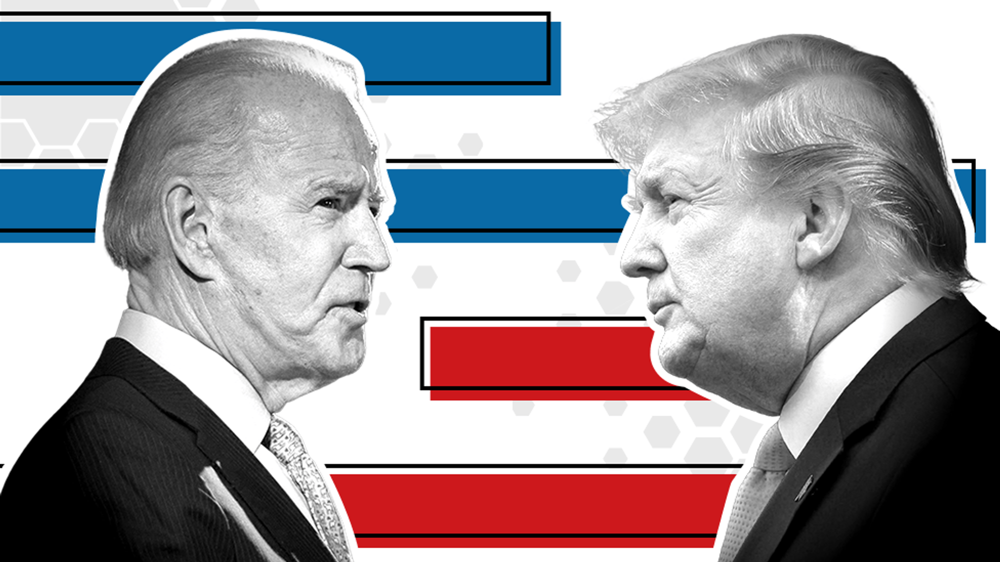
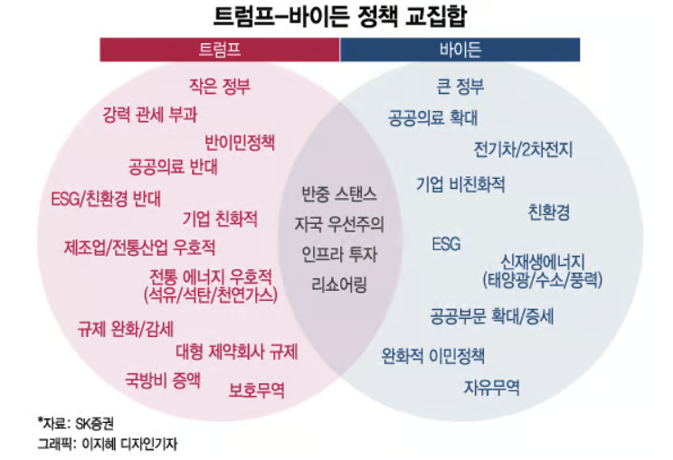
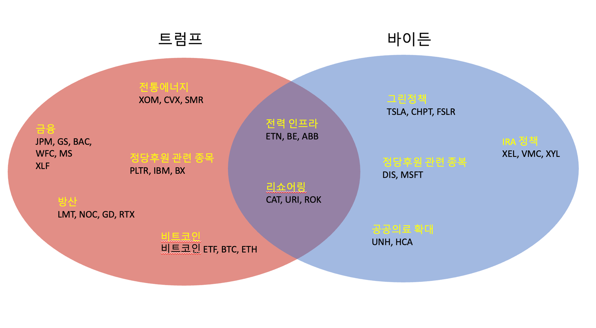

> 포스팅 어제 올리자마자 오늘 새벽에 바이든 대통령이 대선 재선 도전 사퇴 의사를 밝혔네요. 미국 대선이 또 어떤 흐름으로 갈지 더 눈여겨봐야 할 듯합니다

## 1. 개요

11월에 있을 미국 대선에 맞춰서 트럼프와 바이든 간에 어떤 정책을 밀고 있고 그것에 따라서 관심있게 봐야 하는 섹터나 주식은 어떤 것이 있는지 같이 알아보도록 하자.

도널드 트럼프와 조 바이든은 각기 다른 정치적 철학과 정책 우선순위를 가지고 있다. 여기서는 두 전임 대통령의 주요 정책을 살펴본다.

## 2. 정책의 차이

### 2.1 트럼프의 주요 정책

- 경제 및 세금
  - 2017년 감세 및 일자리 법을 통해 법인세와 개인 소득세를 크게 인하했음
  - 기업 활동을 촉진하기 위해 금융, 환경 및 기타 여러 분야에서 규제를 완화
- 무역
  - 미국 우선 주의로 무역협정 재협상 및 보호무역 정책을 추진, 중국과 무역 전쟁을 벌이고 중국 최혜국대우(MFN) 철폐함
  - 중국, 유럽 연합 등 여러 국가에 대한 관세를 인상하여 무역 적자를 줄이려 했음
- 에너지
  - 인플레이션 감축법 IRA (Inflation Reduction Act) 폐기
    - 기후 변화 대응 및 의료 보험 학대 등의 내용을 담고 있는 법
  - 전기차 정책 철회
  - 전통 에너지 강화
      - 원유 유전 개발 확대, 석유/가스 생산업체 세금 감면
      - 원자력 에너지 생산 지원
- 금융
  - 트럼프의 규제 완화와 감세 정책으로 인해 금융 섹터가 혜택을 받을 수 있음
- 이민
  - 불법 이민 단속 강화, '무관용' 정책, 일부 국가 출신 이민자의 입국 금지
  - 멕시코와의 국경에 장벽을 건설하기 위해 자금 지원을 추진
- 국방
  - 국가별 자체 방위력 증강 위한 국방비 확대
  - 한, 일에 방위비 부담금 확대
    - 방산 기업에 투자될 방위력 개선비 줄어들어 국내 방산주에 부정적일 수 있음
- 비트코인
  - 비트코인 사용 허용 계획 및 미국서 비트코인 미래 보장

### 2.2 바이든 주요 정책

- 경제 및 세금
  - 고소득자와 대기업에 대한 세율 인상, 중산층 및 저소득층에 대한 세금 감면
  - 코로나19 대응을 위한 중소기업 지원 프로그램 강화
- 무역
  - 대중국 고율관세 유지
- 에너지
  - IRA (인플레이션 감축법)
    - 전기차, 친환경에서 세제 혜택 지원
- 헬스케어
  - 오바마케어 확대: 기존 건강보험 제도의 확대 및 개선
- 교육
  - 일부 연방 학자금 대출 탕감, 커뮤니티 칼리지 학비 면제
- 이민
  - DACA 프로그램 보호, 이민자 통합 정책 추진하고 이민자 가족 분리 중단, 난민 수용 확대
- 비트코인
  - 강력 규제 : 채굴시 조세 부과로 시장 규제 강화할 것

### 2.3 공통 정책

- 미국 우선주의 및 대중국 견제
  - 수출 통제 대상 확대 - 반도체
  - 의약품 등 모든 중국산 상품에 대한 관세 확대 및 관세율 인상
- 미국 중심의 인프라 강화 - 전력, 인프라
  - 바이든 정부, 2032년 까지 인프라 투자에 1조 2천억 달러 투입 (현재 진행형)
  - 트럼프, 미국 전역에 10개 자유도시 건설 구상

트럼프는 주로 감세, 규제 완화, 미국 우선주의 무역 정책, 에너지 독립, 강경 이민 정책 등을 중시하는 정책을 기존에 펼쳤다. 반면 바이든은 기후변화 대응, 건강보험 확대, 부자 증세, 친환경 에너지 투자, 포용적 이민 정책 등을 강조한다.

## 3. 대선 수혜 종목

### 3.1 트럼프 수혜주

- 전통에너지
  - 유가: 엑스모딜(`XOM`), 세브론 (`CVX`)
  - 원자력: 뉴스케일 (`SMR` )
- 금융정책
  - 금융: 골드만 삭스 (`GS`), JP모건 체이스 (`JPM`), 뱅크 오브 아메리카 (`BAC`), 웰스 파고 (`WFC`), 모건 스탠리 (`MS`)
  - Financial Select Sector SPDR Fund (`XLF`)
- 정당 후원 관련 종목
  - IBM (`IBM`)
  - 팔란티어 테크놀로지 (`PLTR` ) : 빅데이터 분석 소프트웨어를 개발하는 회사이다
  - 블랙스톤 (`BX`) : 세계 최대의 대체 자산 관리 회사 중 하나로, 사모펀드, 부동산, 신용, 인프라 및 헤지펀드 등의 자산을 관리한다
- 건설
  - 디알 호튼 (`DHI`) : 미국의 주택 건설 회사로, 단독 주택, 타운홈 및 다세대 주택을 건설한다
  - iShares U.S. Home Construction ETF( `ITB` )
- 방산
  - 록히드 마틴 (`LMT`) : 항공우주 및 방위 산업의 글로벌 리더로, 항공기, 미사일, 우주 시스템 및 국방 시스템을 설계, 개발 및 제조한다
  - 노스럽 그러먼 (`NOC`) : 항공우주 및 방위 기술 회사로, 항공기, 미사일 방어 시스템, 레이더 시스템, 무인 시스템 및 사이버 보안 솔루션을 제공하며, 미국 국방부 및 동맹국에 중요한 방위 기술을 제공한다
  - 제너럴 다이내믹스 (`GD`) : 항공우주 및 방위 산업의 주요 기업으로, 항공기, 선박, 무기 시스템, 정보 기술 및 방위 솔루션을 제공한다
  - 레이시온 테크놀로지(`RTX`) : 항공우주 및 방위 산업의 글로벌 기업으로, 항공기 엔진, 항공 전자 장비, 미사일 시스템 및 방위 솔루션을 제공한다

### 3.2 바이든 수혜주

- 그린정책
  - 테슬라 (`TSLA`)
  - 차지포인트 (`CHPT`) : 전기차 충전 네트워크를 운영하는 회사로, 상업용, 주거용 및 공공용 충전소를 제공한다
  - 퍼스트 솔라 (`FSLR`) : 태양광 패널 및 모듈을 제조하고, 대규모 태양광 발전소를 개발하는 회사이다
- IRA 정책
  - 엑셀 에너지 (`XEL`) : 미국의 전력 및 천연가스 공급 회사로, 콜로라도, 미네소타, 미시간, 뉴멕시코 등 여러 주에서 전력과 가스를 공급한다
  - 벌컨 머티리얼스 (`VMC`) : 건설 자재를 생산하는 회사로, 주로 건축용 골재, 아스팔트 및 콘크리트를 제공한다
  - 자일럼 (`XYL`) : 수처리 및 수송 솔루션을 제공하는 글로벌 회사로, 물 관리, 수처리 시스템 및 관련 기술을 제공한다
- 정단 후원 관련 종목
  - 디즈니(`DIS`) 마이크로소프트 (`MSFT`)
- 공공의료 확대
  - 유나이티드헬스 그룹 (`UNH`) : 건강 보험 및 의료 서비스를 제공하는 회사로, 다양한 헬스케어 솔루션을 통해 전 세계 고객에게 서비스를 제공한다
  - HCA 헬스케어 (`HCA`) : 미국의 병원 운영 및 헬스케어 서비스 제공 회사로, 병원, 외래 수술 센터 및 응급 의료 시설을 운영한다

### 3.3 교집합 + 누가 되던 잘되는 섹터

- AI / 전력 인프라
  - 이튼 코퍼레이션 (`ETN`) : 전력 관리 솔루션을 제공하는 회사로, 전기, 유압, 기계 및 항공 우주 부문에서 다양한 제품을 제조한다
  - 블룸 에너지 (`BE`) : 연료전지 시스템을 개발 및 제조하는 회사로, 상업용 및 산업용 연료전지 솔루션을 제공한다
  - `ABB` : 전력 및 자동화 기술을 제공하는 글로벌 기업으로, 전력망, 산업 자동화, 로봇 공학 및 전기화 솔루션을 제공한다
- 리쇼어링
  - 중장비
      - 캐터필러(`CAT`) : 건설 및 광업 장비, 디젤 및 천연 가스 엔진, 산업용 가스 터빈, 디젤-전기 기관차 등을 제조하는 글로벌 기업이다
      - 유나이티드 렌탈(`URI`) : 미국에서 가장 큰 장비 렌탈 회사로, 건설 장비, 산업 장비 및 도로 작업 장비를 렌탈하는 서비스를 제공한다
  - 록웰 오토메이션 (`ROK`) : 산업 자동화 및 정보 기술을 제공하는 회사로, 공장 자동화 시스템, 소프트웨어 및 관련 서비스를 제공한다
- 빅테크
  - `AAPL`, `MSFT`, `NVDA`, `GOOGL`, `AMZN`, `META`
  - 대선 결과와 무관하게 주도주는 강세 - AI 산업 관련 (반도체, IT등)

## 4. 마무리

첫 TV 토론회 이후 트럼프 쪽으로 많이 기울이는 했지만, 마지막까지 누가 될지는 모르는 거라서 누가되던 상관 없는 섹터 위주로 하되 상황을 잘 판단해서 투자해야 할 듯하다.

과거 미 대선 때도 S&P500, VIX 지수 모두 높은 변동성이 있었기 때문에 9월 본격 대선 레이스 전까지는 시장 변동성이 확대될 수 있어서 주의가 필요하다는 생각이 든다. 그리고 대선 이후에는 주가지수가 반등하고 VIX 변동성 지수는 안정화를 대부분 찾게 되어 이번 미국 대선에도 비슷하지 않을까 싶다. 올해 어떤 흐름으로 흘러갈지 눈여겨보자.

## 5. 참고

- [10분 요약 정리 ㅣ 트럼프 핵심 공약과 수혜주 (경제유튜버 유사남) ㅣ 240717 굿모닝인포맥스](https://www.youtube.com/watch?v=-K0-TYd3LJ0)
- [트럼프 압승 예상하는 월가, 증시 대혼란에 대비해야 할까](https://www.youtube.com/watch?v=XkDSnyA8S6A)
- [미국 대선: 트럼프와 바이든 중 누가 앞서고 있나?](https://www.bbc.com/korean/international-53676434)
- [이슈 캐치업 - 미국 대선 후보 '바이든 vs 트럼프' 대격돌, 수혜 업종 미리 찾기!](https://www.youtube.com/watch?v=Rlmjs-5yh8I)
- [트럼프 대통령 시즌2 열리나?…떨고 있는 '자동차·2차전지주'](https://news.mt.co.kr/mtview.php?no=2023101808491331077)
