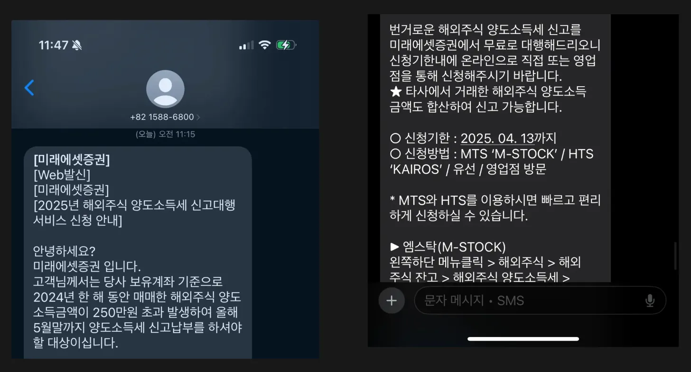
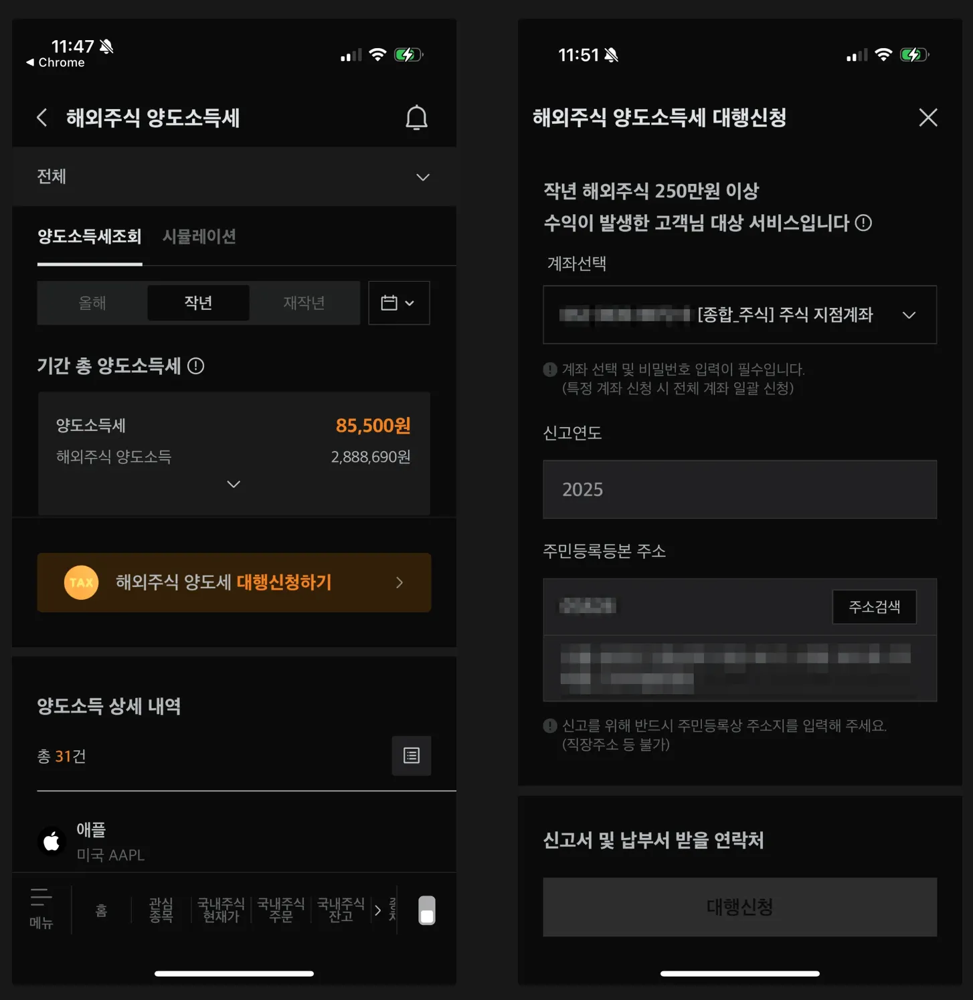
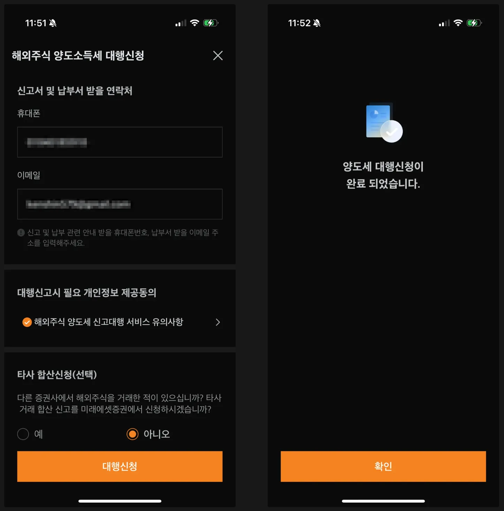

## 1. 개요

해외주식을 거래하는 투자자라면 **양도소득세 신고**를 해야 한다는 사실, 알고 계신가요?

해외주식 거래로 발생한 양도소득은 직접 신고해야 하지만, 다행히도 증권사에서 신고 대행 서비스를 제공하고 있다. 오늘은 미래에셋증권에서 해외주식 양도소득세 신고 대행을 신청하는 방법을 자세히 알아본다.

### 양도소득세 신고 대행이란?

해외주식 양도소득세는 매년 1월~12월 동안 발생한 해외주식의 매매 차익에 대해 익년 5월에 신고 및 납부해야 하는 세금이다.

📌 납부 기준

- 양도 차익이 250만 원을 초과하는 경우, 초과분에 대해 양도소득세(22%)를 납부해야 한다
- 예를 들어, 한 해 동안 해외주식 매매 차익이 270만 원 발생했다면, 250만 원을 제외한 나머지 20만 원에 대해 세금이 부과된다

즉, 해외주식 매매로 250만 원 이상의 수익이 발생한 투자자는 반드시 신고해야 한다.

### 미래에셋증권에서 안내 문자

미래에셋증권에서는 신고 대상자의 경우 양도소득세 신고 대행 안내 문자를 발송해주고 있다.

## 2. 해외주식 양도소득세 신고대행 서비스 신청 방법

미래에셋증권 MTS 앱에서 신고 대행 서비스 신청하는 방법은 매우 간단하다. 미래에셋증권 앱을 실행하고 메뉴 검색락 > 양도소득세 입력 > 검색 목록에서 해외주식 양도소득세를 선택한다.

중간에 해외주식 양도 대행신청하기를 클릭해서 대행신청을 진행한다.

- 대행신청 화면에서는 신고할 계좌를 선택한다
- 타사 합산 신청 (선택사항)
  - 다른 증권사에서도 해외주식을 거래했다면, 타사 합산 신청을 통해 한 번에 신고할 수 있다
  - 다른 증권사의 거래 내역을 함께 신고하고 싶다면, 이 옵션을 선택한다

대행신청 버튼을 클릭해서 신청을 완료한다.

📌 신청 후 유의사항

- 미래에셋증권에서 국세청에 신고를 대행해주지만, 납부는 직접 진행해야 한다
- 신고 기간(5월)이 되면, 홈택스에서 납부 고지서를 확인하고 세금을 납부하면 된다

## 3. 마무리

해외주식 거래를 하다 보면 양도소득세 신고가 번거롭게 느껴질 수 있지만, 증권사의 신고 대행 서비스를 이용하면 훨씬 간편하게 처리할 수 있다. 특히, 미래에셋증권 MTS를 이용하면 몇 번의 클릭만으로도 쉽게 신청 가능하니, 해외주식 거래를 하시는 분들은 꼭 활용해 보세요. 😊

>  추가 TIP
- 직접 신고를 원한다면 국세청 홈택스를 통해 신고 가능
- 신고 및 납부 기한을 놓치지 않도록 5월까지 반드시 신청 및 납부
- 타사 합산 신청을 통해 한 번에 신고 가능

## 4. 참고

- [해외주식 양도소득세 신고대행 서비스 안내](https://securities.miraeasset.com/bbs/board/message/view.do?categoryId=66&messageCategoryId=0&messageId=2319569)
- [해외주식 양도소득세 | 미국 주식 세금 언제 얼마나 내야 할까?](https://kbthink.com/main/asset-management/wealth-manage-tip/kbthink-original/202409/foreignstocktax.html)

