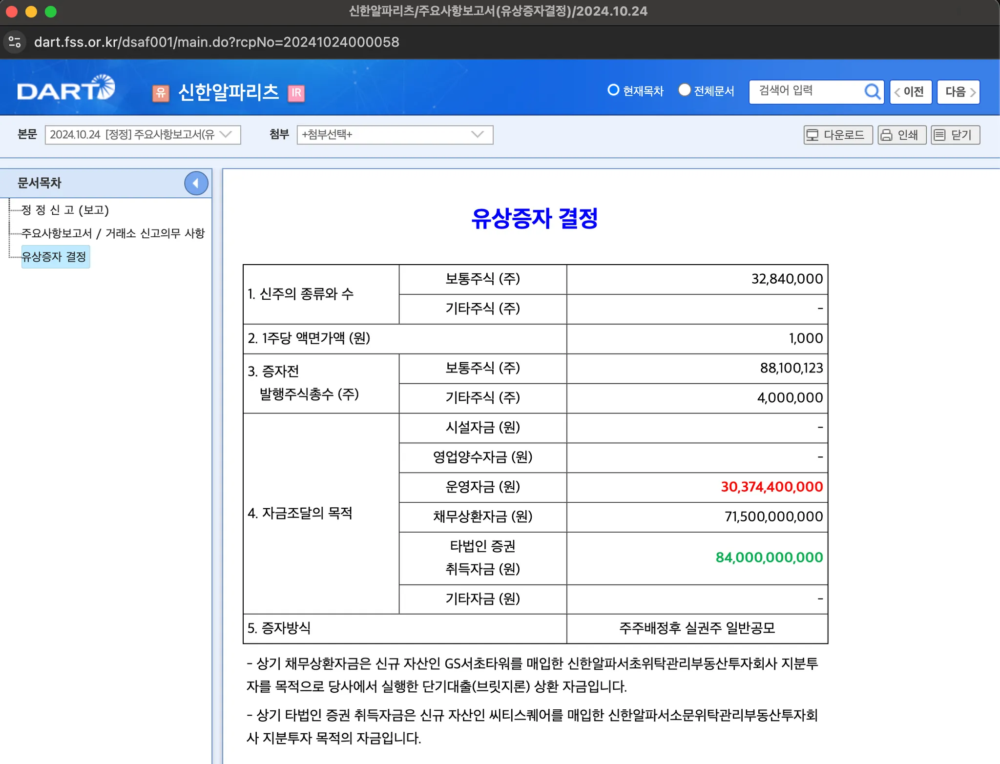
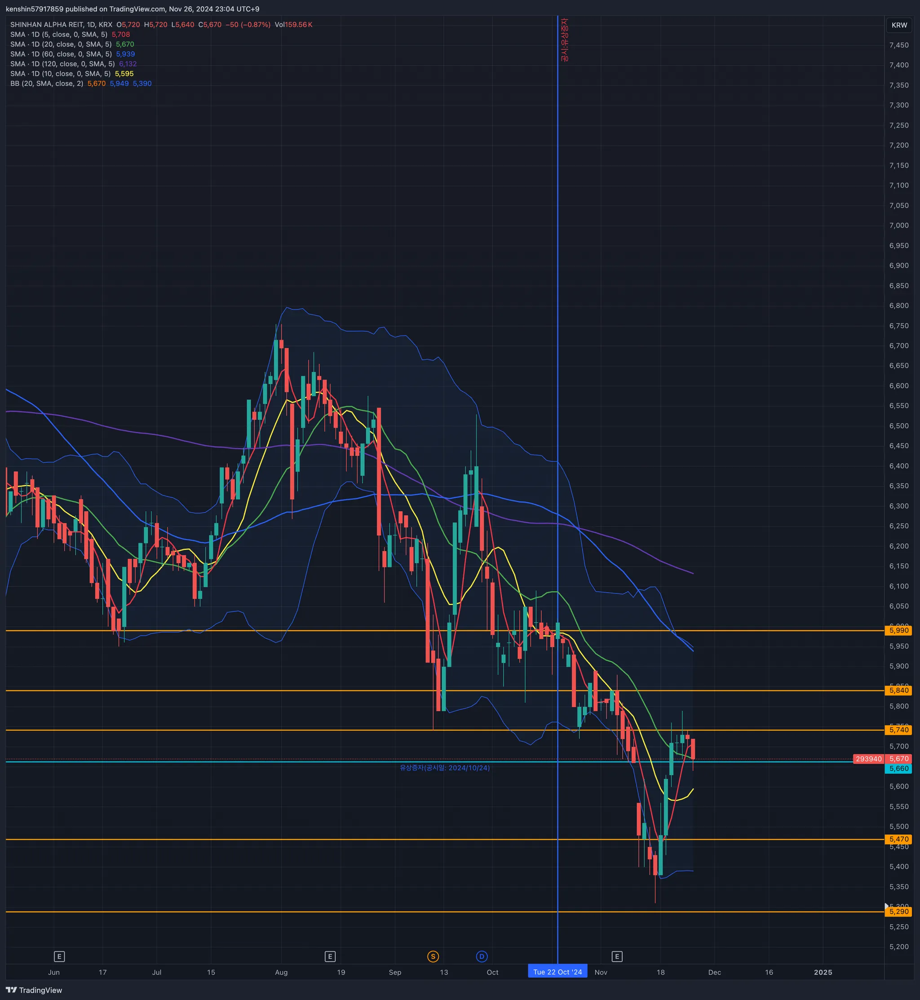
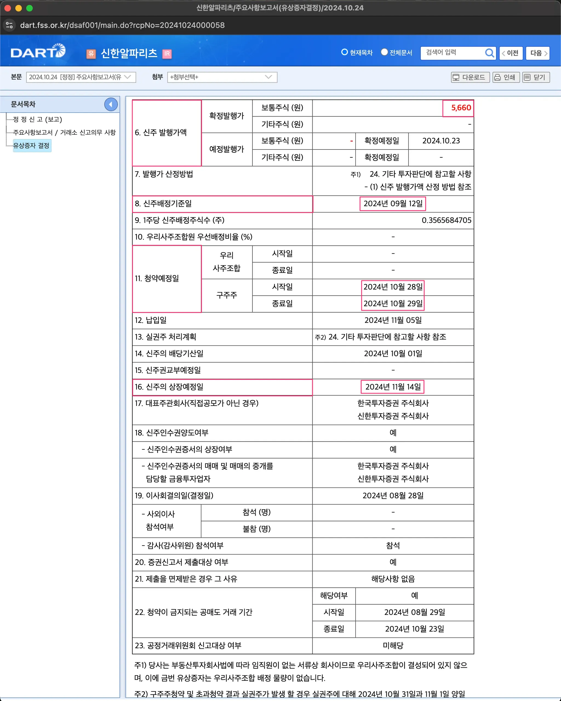
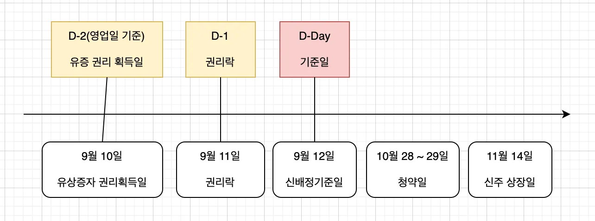

## 1. 개요

기업이 주식시장에 상장하는 주된 목적은 자금을 확보하기 위함이다. 충분한 자본은 기업이 연구개발을 수행하고, 생산시설을 확장하며, 제품을 제작하는 데 필수적이다. 또한, 과도한 부채를 안고 있는 경우에는 차입금을 상환하기 위한 용도로 자금을 마련하기도 한다.

기업이 자금을 조달하는 방법으로는 크게 3 가지가 있다.

| **방법**          | 설명                                                     | **장점**                              | **단점**                                | 주가 영향   |
| ----------------- | -------------------------------------------------------- | ------------------------------------- | --------------------------------------- | ----------- |
| **금융기관 차입** | 은행 등 금융기관에서 대출을 받는 방식                    | 절차가 간단, 빠른 자금 조달 가능      | 이자 및 단기 상환 부담이 있음           |             |
| 재무 부담 증가    | 일부 악영향                                              |                                       |                                         |             |
| **채권 발행**     | 기업이 채권을 발행하여 투자자로부터 자금을 조달하는 방식 | 낮은 금리로 대규모 자금 조달 가능     | 이자, 상환 의무 있음, 신용등급에 민감   | 제한        |
| **`유상증자`**    | 부채증가 없이 단기 자금 조달이 가능                      | 대규모 자금 조달 가능, 상환 의무 없음 | 주식수 증가로 단기적으로 주가 하락 가능 | 단기 악영향 |

> 위 3가지 방식외에도 자금을 조달하는 방법은 메자닌, 기업공개(IPO) 방식도 있다.

이 중 `유상증자`는 기업이 새로운 주식을 발행해 투자자들에게 판매함으로써 필요한 자금을 확보하는 방식이다. 이는 특히 대규모 자금이 요구될 때 주로 활용되는 방법이다. 투자자 입장에서는 어떤 방식이 주가에 긍정적이거나 부정적으로 작용할지 판단하는 것이 중요하다. 이에 따라, `유상증자`가 주가에 미치는 영향을 더 자세히 알아볼 필요가 있다.

## 2. `유상증자`란?

자금을 조달하는 방법에 대해서 간단하게 살펴보았고 이 중에 `유상증자`는 주가에 가장 큰 영향을 끼치기 때문에 주식투자자는 필수로 알아두어야 한다.

### 2.1 `유상증자` vs 무상증자

증자하는 방식에는 2가지 방식이 있다.

- `유상증자`
  - 기업이 주식을 추가로 발행하고 발행된 주식을 투자자들에게 돈을 받고 주는 것이다
  - 기업 입장에서는 부채가 아니라 주식수만 증가하기 때문에 재무구조를 개선시킬 수 있어 유리하다
  - 주식수가 늘어나기 때문에 주식가치가 하락하는 단점이 있다
    - 기존에 주식을 들고 있던 사람에게는 좋지 않다
    - `유상증자`를 해도 더 투자할 계획이라면, 청약을 신청하는게 좋다
- 무상증자
  - 기업이 주주들에게 무료로 신주를 배정하는 것으로, 주주에게 추가적인 자금 부담이 없다

> 무상증자에 대한 내용을 별도 포스팅에서 더 자세히 다룰 예정이다

## 3. `유상증자`가 주가에 미치는 영향

`유상증자`는 단기적으로 주가에 부정적인 영향을 미칠 가능성이 있습니다. 이는 신주 발행으로 인해 기존 주식의 가치가 희석되기 때문입니다. 하지만, 조달된 자금이 기업의 성장성과 수익성을 높이는 데 성공적으로 활용된다면 장기적으로는 긍정적인 영향을 미칠 수도 있습니다.

### 3.1  투자자들이 `유상증자` 공시에서 확인해야 할 점

`유상증자` 공시는 투자자에게 중요한 정보를 제공하고 투자자 입장에서 꼭 확인해야 하는 항목은 다음과 같다.

#### 3.1.1 발행 주식 수

새로운 주식 발행으로 인해 기존 주식의 가치가 얼마나 희석될지 판단할 수 있다. 전체 주식수 대비 몇 %가 발행되는지 확인한다. 보통 `유상증자`는 발행 주식수의 30% 이상인 경우가 많다. 30%의 주식이 추가로 발행이 되기 때문에 주당가치는 당연히 30% 하락하게 되어 있다.

예로. [신한알파리츠](https://finance.naver.com/item/dart.naver?code=293940) 올해 10월달에 전자공시에 올라온 `유상증자` 신주발생 안내 공시를 봐보자.

증가전 상장주식수는 88,100,123 이고 유사증자로 추가되는 주식수는 32,840,000 이라서 37.3% 정도 증가되는 것을 볼 수 있다. 이 의미는 현재 주가가 32% 정도 더 빠진 다는 예기라서 기존에 주식을 들고 있는 투자자의 경우에는 좋지 못한 소식이다.

#### 3.1.2 자금 조달 목적

`유상증자`면 항상 악재로 작용하는 것은 아니라서 `유상증자`를 하는 목적도 알아야 한다.

- 시설자금 ← 호재
  - 설비 확충과 같은 성장을 위한 투자 자금으로, 이는 기업의 중장기적인 성장을 도모하는 데 긍정적으로 작용한다. 단기적으로는 주식 발행으로 인해 주가가 하락할 수 있으나, 투자 목적이 기업의 성장에 초점이 맞춰져 있기 때문에 시간이 지나면 주가가 회복되거나 상승세로 전환되기도 한다
- 영업양수자금
  - M&A를 위한 자금이다
- 운용자금 ← 악재
  - 기업이 운용하는데 필요한 자금이다
- 채무상환자금 ← 악재
  - 빚을 갚는데 필요한 자금이다

운용자금과 채무상환자금은 기업이 당장의 자금 부족을 해결하기 위해 `유상증자`를 진행하는 경우가 많다. 이러한 이유로 인해 투자자들에게는 재정적 압박의 신호로 받아들여져 단기적으로는 물론 중기적으로도 주가에 부정적인 영향을 미치는 경우가 많다.

예. [신한알파리츠](https://finance.naver.com/item/dart.naver?code=293940) 의 `유상증자`의 목적을 보면 운영자금, 채무상환자금을 목적으로 `유상증자`를 하는 거라서 주가가 많아 빠진 것을 볼 수 있다.

#### 3.1.3 증자 방식

증자 방식도 확인을 해야 한다. 방식에 따라서 주식에 악재, 호재일 수가 있다.

- 주주배정 방식
  - 기존 주주들에게 신주를 배정한다
  - 주가가 급락을 해도 주주들은 더 낮은 가격에 신주를 받을 수 있어 손실을 일부 만회할 수 있다
- 제3자 배정 방식
  - 주주가 아닌 특정 관계인 이나 다른 투자자를 대상으로 하는 방식이다
  - 대주주가 참여하는 경우가 많고, 1년간 신주가 보호예수되어 매각이 제한되기 때문에 유통주식수가 증가하지 않아 주가에 긍적적인 경우가 많다
  - 기존 주주가 아닌 특정 관계자나 외부 투자자들에게 신주를 배정하는 방식이다
  - 대주주가 참여하는 사례가 흔하며, 신주가 발행 후 보통 1년간 보호예수되어 매각이 제한된다
    - 이로 인해 유통 주식 수 증가에 따른 희석 효과가 발생하지 않아 주가에 긍정적인 영향을 미치는 경우가 종종 있다
- 일반공모 방식
  - 특별한 제한없이 모든 투자자들을 대상으로 하는 방식이다
  - 기존 주주에게 부여되는 혜택이 없어 주가에 악재로 작용하는 경우가 많다

#### 3.1.4 신주 발생가액

신주 발행가액도 꼭 확인해야 한다. `유상증자`에 참여하는 투자자들이 받게 되는 주식의 가격으로 현재 주가보다 보통 30% 이상 할인된다. 발생가액이 낮아야 증자에 참여하는 투자자들이 나중에 신주를 받았을 때 수익을 낼 수 있고 그래야 투자자들이 `유상증자`에 참여할 수 있기 때문이다.

> 기업에서 `유상증자`를 하고 이 기업에 더 투자할 계획이라면 신주발행하는 주가 금액이 더 싼 금액으로 나오기 때문에 청약을 통해서 더 싼 가격으로 매수하는 것도 고려해볼 만한 투자이다

#### 3.1.5 신주 배정 기준일

`유상증자`에 참여하려면 기준일로부터 영업일 기준 2일 전까지 해당 주식을 보유하고 있어야 참여 권리를 얻게 된다. 권리락이란, `유상증자` 참여 권리가 소멸하는 날로, 이 날에는 증가한 주식 수를 반영해 주가가 조정된다. 예를 들어, 현재 주가가 1만 원이고 `유상증자`로 인해 주식 수가 약 30% 증가한다면, 권리락 발생일에 주가는 약 30% 하락한 7,000원으로 조정될 수 있다.

청약 예정일은 `유상증자`에 참여하려는 투자자들이 청약 신청을 할 수 있는 날짜를 의미한다. 납입일은 청약 신청이 완료된 후 투자자들이 약정한 금액을 입금해야 하는 날이다. 신주상장 예정일은 `유상증자`의 모든 절차가 완료되고, `유상증자`에 참여한 투자자들에게 신주가 지급되어 해당 신주가 거래소에서 매매 가능해지는 날을 뜻한다. 이 날부터 `유상증자` 참가자들은 받은 신주를 자유롭게 매도할 수 있다.

## 4. 마무리

`유상증자`는 기업이 자금을 조달하는 중요한 방법 중 하나이다. 그러나 투자자 입장에서는 단기적인 주가 하락 가능성과 장기적인 성장 가능성을 모두 고려하여 신중히 판단해야 한다. 공시 내용을 면밀히 분석하고 기업의 계획을 평가하는 것이 성공적인 투자로 이어질 수 있다.

`유상증자`는 특히 대규모 자금이 필요한 기업에게 중요한 선택지이며, 투자자에게는 자본을 활용할 새로운 기회를 제공한다다. 이러한 정보를 바탕으로 `유상증자`에 대한 올바른 판단을 내릴 수 있기를 바란다.

## 5. 참고

- [주린이가 가장 알고 싶은 최다질문 TOP 77](https://ridibooks.com/books/236000504?_s=search&_q=주린이가&_rdt_sid=SearchBookList)
