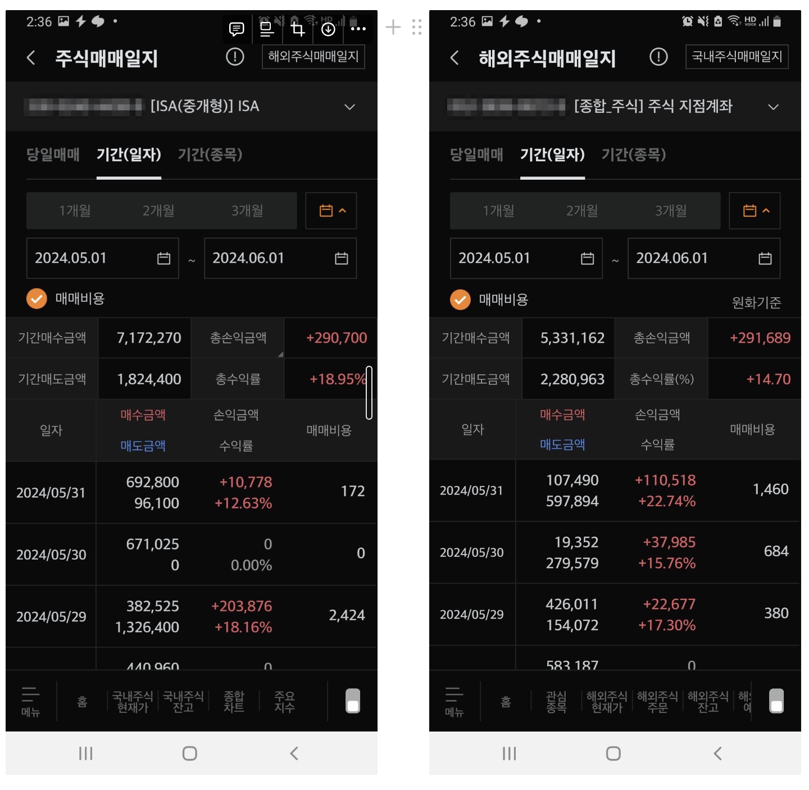
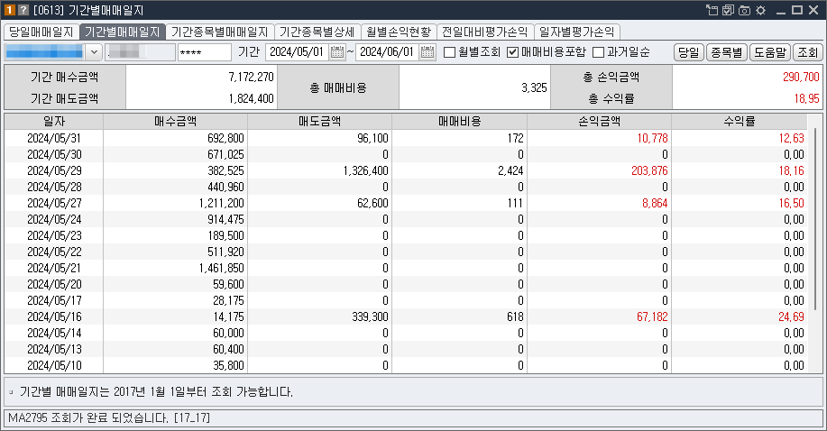
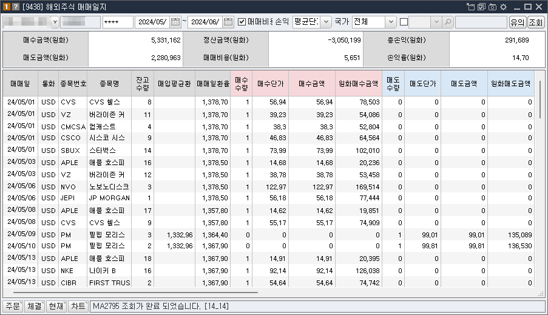

## 개요

주식 투자를 하면서 내가 실제로 얼마나 수익을 내고 있는지 궁금하게 된다. 저의 주 증권사인 미래에셋 기준으로 알아봅니다.

### 매매수익률 조회하는 방법

MTS 에서나 HTS에서 확인할 수 있다.

#### 1. MTS (Mobile Trading System)

검색란에`매매일지` 입력하고 검색 결과 중에 한국 주식은`주식 매매일지` 선택하고 해외 주식은 `해외 매매일지`를 선택한다.

계좌 선택하고 기간(일자)로 원하는 날짜를 정한다.

기간 동안 얼마를 매매했고 매도했는지 확인할 수 있고 총손익 금액, 수익률을 확인할 수 있다.

#### 2. HTS (Home Trading System)

수익률을 모바일에서도 확인할 수 있지만, HTS에서도 아래와 같이 쉽게 확인이 가능하다.

## 마무리

관심 종목을 꾸준히 관리하면서 모니터링하고 괜찮은 주식이라고 생각이 들면, 조금 더 적극적으로 투자를 해볼 필요가 있는 듯하다. 아직 초보라서 그런지 정찰병 주식 사고 나서 더 매수하기보다는 내가 산 금액보다 더 싸면 조금씩 매수를 하다 보니 많은 수익을 내지 못하는 듯하다.

## 참고

- [미래에셋 수익률 조회하는 방법](https://mixingk.tistory.com/120)
