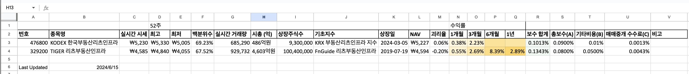
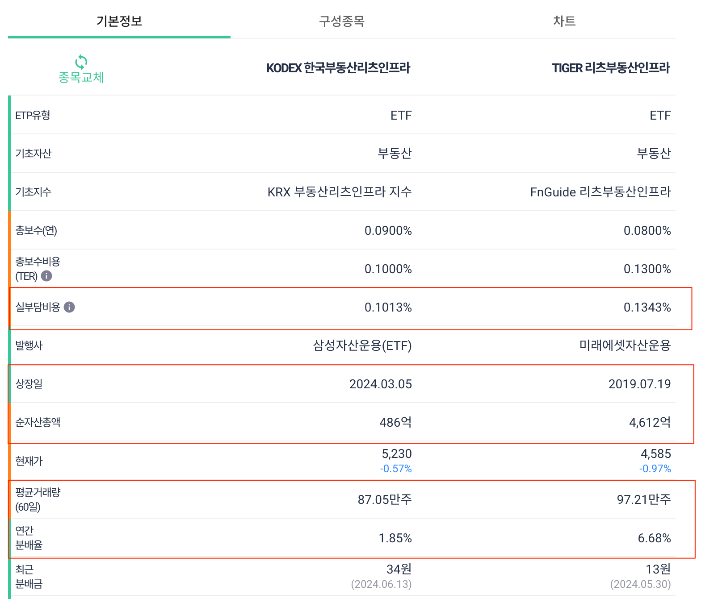
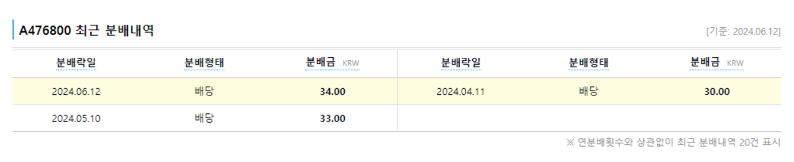
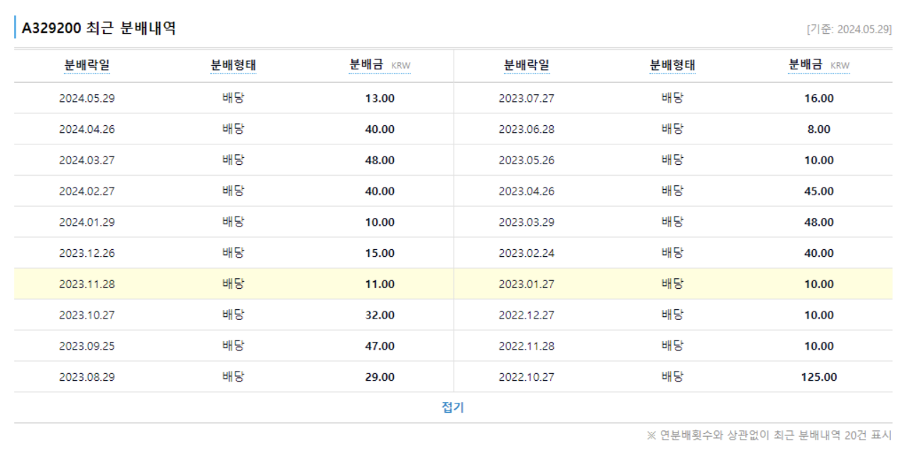
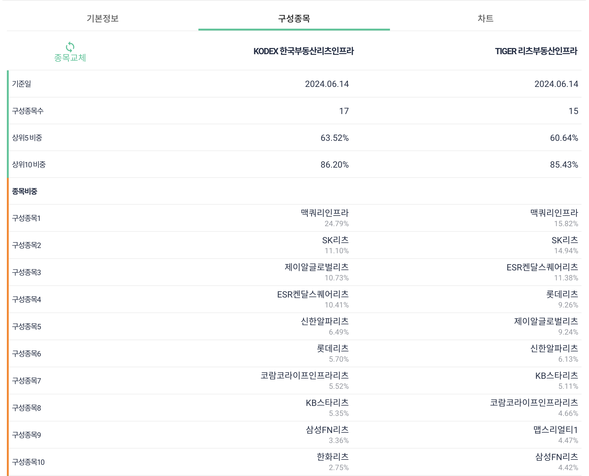
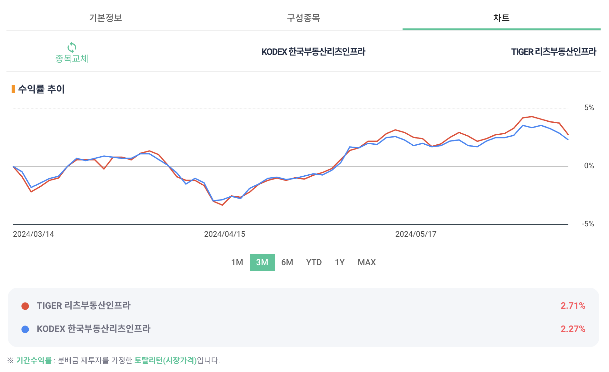

## 1. 개요

[리치노마드](https://www.youtube.com/watch?v=qu9mhDmZ1SA) 유튜브에서 언급한 아이디어가 좋아서 저도 개인적으로 검토를 해보았다. 한국 리츠 부동산 ETF 종목 중에 2가지를 비교하는 내용이다.

- 476800	[KODEX 한국부동산리츠인프라](https://finance.naver.com/item/main.naver?code=476800)
- 329200	[TIGER 리츠부동산인프라](https://finance.naver.com/item/main.naver?code=329200)

## 2. 리츠 ETF 2종목

### 2.1 상장일자, 규모, 운용보수

개인적으로 ETF 종목도 [구글 시트](https://docs.google.com/spreadsheets/d/11kbUc6UClddhaStg6biPkQhFeC8ssGRITeYg1ZDxu8s/edit?gid=2061047286#gid=2061047286)로 정리를 하는데요. 이번에 리치노마드에서 ETF 비교하는 사이트를 보고 검색을 해보니 [ETF Check](https://www.etfcheck.co.kr/mobile/etpitem/476800/compare?compCode[]=329200)이라는 사이트를 알게 되어서 ETF 비교할 때 유용하게 잘 사용할 수 있을 듯하다.

> ETF Check에서는 실제 총운용보수 금액도 확인할 수 있어서 좋다. 네이버 금융의 경우에는 추가 비용 없는 운용보수 금액만 보여주고 있어서 금융투자협회 사이트에 들어가서 매번 확인해야 했는데, 이제는 ETF Check 사이트에서 확인하면 될 듯하다. 
> 참고: [국내 미국다우존스 ETF 중에서 어떤 것을 선택하면 좋을까?](https://stock.advenoh.pe.kr/국내-미국다우존스-etf중에서-어떤-것을-선택하면-좋을까/)

- `KODEX 한국부동산리츠인프라`
  - 이번에 처음 알게 된 ETF이다. 상장 일자도 올해 2024/3월에 상장을 했고 규모 크기도 486억이라서 TIGER 증권사보다 훨씬 적은 편이다
  - 개인적으로 1,000억 이하는 ETF 투자는 하지 않고 있다. 이걸 살지는 고민을 해 봐야겠다
  - 운용보수는 큰 차이는 나지 않지만, 이 ETF가 조금 더 낮다.
- `TIGER 리츠부동산인프라`
  - 리츠 부동산 투자를 고민한다면 이 ETF를 선택하는 게 좋을 듯하다

#### 2.1.1 리츠 ETF 비교 - [구글 시트](https://docs.google.com/spreadsheets/d/11kbUc6UClddhaStg6biPkQhFeC8ssGRITeYg1ZDxu8s/edit?gid=2061047286#gid=2061047286)

#### 2.1.2 리츠 ETF 비교 - ETF Check

### 2.2 연간 배당율, 배당일자

- `KODEX 한국부동산리츠인프라`
  - 올해 상장을 해서 연간 분배율이 최종적으로 어떻게 나올지는 알 수 없지만, 경쟁사인 TIGER와 비슷한 수준으로 나오지 않을까 싶다
  - 매달 중간에 배당금이 지급된다
- `TIGER 리츠부동산인프라`
  - 매달 말에 배당금이 지급된다

배당 일자 보고 이미 케치하신 분도 계시겠지만, 이 ETF 2종목을 매수를 하면 2주마다 배당금을 받을 수 있다. KODEX도 TIGER와 비슷한 연간 배당률로 배당금을 지급받는다고 하면, 현재 은행 이자 (ex. 3~4%)와 비교해 봐도 리츠 부동산 ETF를 매수하는 게 더 이득이 될 수 있다. (손실이 발생하지 않는다고 가정을 하고 배당금만 비교한다면)

#### 2.2.1 KODEX 한국부동산리츠인프라 배당일자

#### 2.2.2 TIGER 리츠부동산인프라 배당일자

### 2.4 구성 종목

둘 다 `맥쿼리인프라` 비중이 제일 높지만, KODEX는 `맥쿼리인프라` 비중이 24.79%로 더 높은 비중을 가지고 있다. 다른 리츠는 비슷하게 구성되어 있다.

### 2.5 수익률

KODEX는 올해 상장이 되어서 최근 3개월까지만 수익률을 볼 수 있다. 지금은 비슷한 수준의 수익률을 보여주고 있고 한 1년이 지나 봐야 TIGER와 비교할 수 있을 듯하다. KODEX의 경우에는 `맥쿼리인프라` 비중이 높아서 이 주식만 큰 이슈가 없다면 수익률도 괜찮지 않을까 싶다.

## 3. 마무리

한국 리츠 부동산 종목 ETF를 비교해 보았다. 아래 두 종목을 매수하면 결과적으로 2주마다 배당금을 받을 수가 있다. TIGER의 경우에는 연간 6% 이상의 배당률로 배당금을 지급하고 있어서 은행 적금보다는 조금 더 매력 포인트가 있다는 생각이 든다. 배당금을 받기 때문에 절세효과를 받기 위해서는 ISA, 연금저축, IRP 계좌를 활용할 필요가 있다.

올해 상장을 한 `KODEX 한국부동산리츠인프라`의 경우에는 아직 규모가 489억이라서 작은 편이라고 생각이 든다. 상장폐지가 될 수도 있지 않을까 걱정이 된다. 개인적으로 국내 ETF 투자할 때는 최소 1,000억 이상이 되어야 고려를 한다. 이 ETF를 매수를 할지는 조금 더 고민해볼 예정이다.

- 476800	[KODEX 한국부동산리츠인프라](https://finance.naver.com/item/main.naver?code=476800)
- 329200	[TIGER 리츠부동산인프라](https://finance.naver.com/item/main.naver?code=329200)

> 이 글을 작성하면서 [ETF가 상장폐지가 되면 어떻게 되나?](https://stock.advenoh.pe.kr/etf-상장폐지가-되면-어떻게-되나/) 궁금해서 다음 포스팅에서 커버해보도록 하겠습니다
