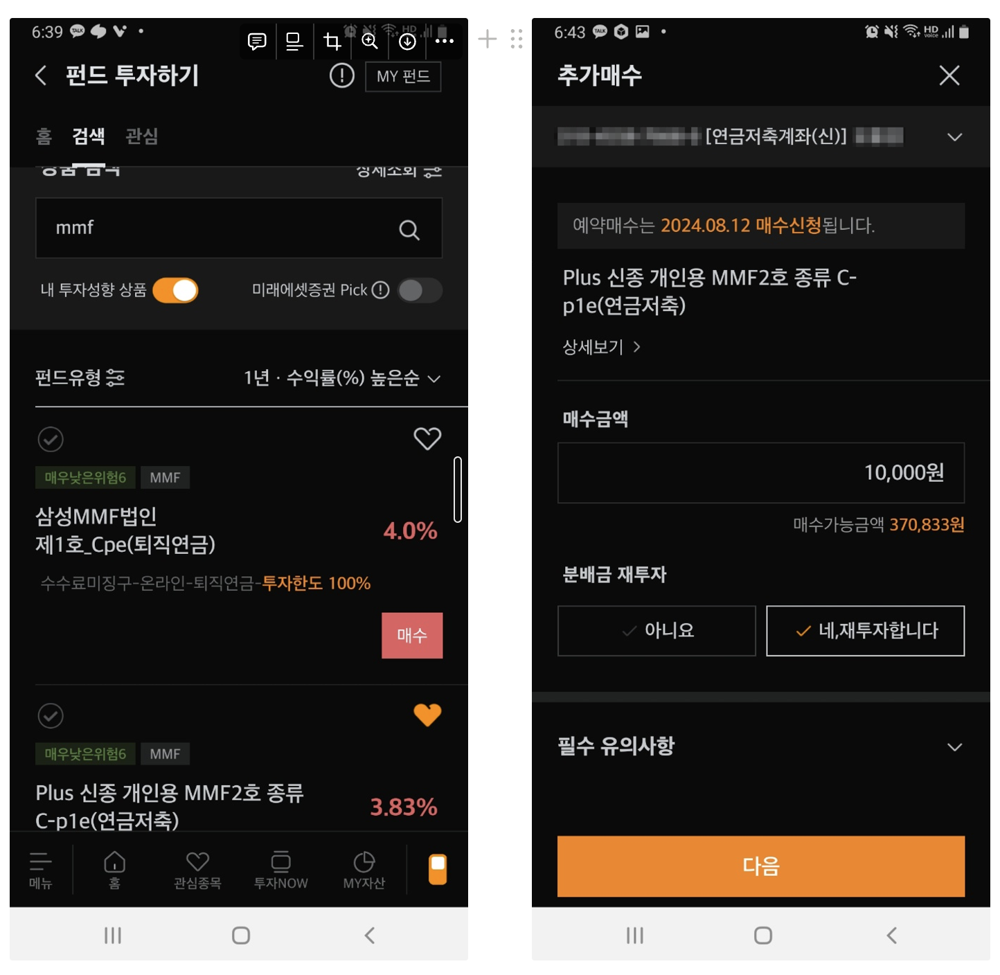
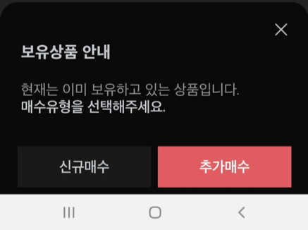
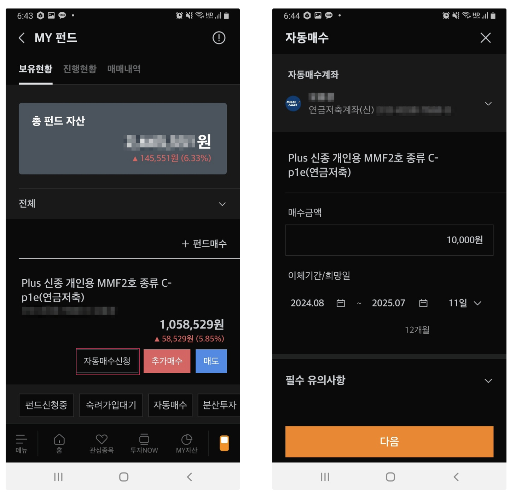

## 1. 개요

연말 정산 세제 공제를 위해 매달 연금 계좌로 50만 원씩 이체하고 있다. 이체하고 적립식으로 성장주 ETF와 채권 ETF를 사 모으고 있다. 안전자산으로 채권형 ETF를 매수할 수 있지만, 다른 대인인 MMF(Money Market Fund, 머니마켓펀드) 펀드도 매수할 수 있다.

`MMF`는 원금 손실 가능성이 상대적으로 낮고, 언제든지 현금화할 수 있는 장점이 있어 연금저축 계좌 내에서 보수적인 투자자들이 선호하는 상품 중 하나이다.

### 1.1 `MMF`란?

`MMF`는 투자자들의 자금을 모아 단기 금융상품(예: 국채, 기업어음(CP), 양도성예금증서(CD) 등)에 투자하는 펀드이다. 이러한 금융상품은 대체로 만기가 짧고 신용도가 높은 자산으로 구성되기 때문에, 시장 변동성에 비교적 덜 영향을 받는다.

> `MMF`의 장단점

#### 장점

- **안정성**: 단기 금융상품에 투자하기 때문에 원금 손실 위험이 상대적으로 낮다
- **유동성**: 언제든지 현금화할 수 있는 높은 유동성을 자랑한다
- **손쉬운 접근**: 연금저축 계좌 내에서 쉽게 투자할 수 있다

#### 단점

- **낮은 수익률**: 안정성을 강조하다 보니, 장기적으로 봤을 때 주식이나 채권 등 다른 투자 상품에 비해 수익률이 낮을 수 있다
- **물가 상승 위험**: 인플레이션이 발생할 경우, MMF의 수익률이 물가 상승률을 따라가지 못해 실질적인 구매력이 감소할 수 있다

## 2. 연금저축에서 `MMF` 매매하기

개인적으로 미래에셋 증권사를 통해서 투자하고 있어서 미래에셋 기준으로 설명한다. 연금저축에서 MMF를 매수하는 방법은 다음과 같다.

- `MMF` 검색하고 매수한다
- 매수하는 방법은 신규 매수나 재매수(같은 MMF가 있는 경우)를 할 수 있다
- 자동매수도 가능하다

### 2.1 `MMF` 검색후 매수하기

`홈` > `연금상품` > `펀드` > `My 펀드` > `검색` Tab을 클릭한다. 상품 검색 란에 `MMF`를 입력하면 검색 목록을 확인할 수 있다.

`MMF` 검색 목록을 보면 퇴직연금, 개인연금에 추가가 가능한 `MMF`를 볼 수 있다. 본 포스팅에서는 연금저축에서 매수를 할 거라서 `Plus 신종 개인용 MMF2호 종류 C-p1e`를 선택하고 `매수` 버튼을 클릭한다. 퇴직연금(`IRP`)에서도 `MMF`를 매수하고 싶은 경우에는 목록에서 퇴직연금이 가능한 `MMF`를 선택하면 된다.

이미 같은 상품을 보유하고 있는 경우에는 신규 매수, 추가매수 옵션으로 매수 선택권을 준다. 여기서는 기존 상품에 추가로 매수하기 위해 추가매수 버튼을 클릭한다. 추가매수 창에서 매수할 금액을 클릭하고 다음으로 진행해서 최종 매수할 때까지 여러 옵션을 선택하면 된다.

### 2.2 `MMF` 자동매수하기

수동으로 매수할 수도 있지만, 자동 매수 기능도 제공을 하고 있어서 신경 쓰지 않고 매달 적립식으로 `MMF` 펀드를 구매할 수 있다.

`MMF`를 자동매수하려면, `MY 펀드` 목록에서 매수한 `MMF` 상품에서 `자동매수신청` 버튼을 클릭하면 된다. 매수할 금액과 이체기간 및 희망일을 설정하면 된다.

## 3. 마무리

`MMF`는 무엇이고 연금저축에서 어떻게 매수를 할 수 있는지 알아보았다. 연금저축에서 안전자산으로 채권형 ETF를 매수할 수도 있지만, `MMF`의 경우에는 원금 손실의 위험이 상대적으로 낮기 때문에 `MMF`를 고려해 볼 만하다는 생각이 든다. 또한 `MMF` 상품의 경우 자동 매수 기능도 있어서 신경 쓰지 않고 매월 적립식으로 안전자산을 모아갈 수 있다.

## 4. 참고

- [증권사 계좌 '노는 돈'…RP·MMF에 넣으니 수익 짭짤하네](https://www.hankyung.com/article/2023061118121)
- [MMF, CMA MMF형, 단기금융상품 정확하게 구분하기](https://topin.co.kr/contents_terms_5)
