## 1. 개요

### 카이로스 `HTS`를 사용해야 하는 이유

스마트폰 `MTS`를 사용하면 여러 계좌의 주식 차트, 뉴스, 매매 정보를 확인하기 위해 여러 번 클릭해야 하므로 신속한 정보 확인과 매매가 어렵다. 하지만 **카이로스 HTS**를 사용하면 큰 모니터 화면에서 다양한 정보를 동시에 확인하며 빠르게 대응할 수 있다.

> `카이로스`란?
> `카이로스`는 미래에셋증권에서 제공하는 `HTS`(홈 트레이딩 시스템)로, 주식, 선물·옵션, 펀드, ELW, 신탁, 해외주식 등 다양한 자산을 편리하게 관리할 수 있는 통합 플랫폼이다.
>
> `MTS`는 스마트폰에서 사용하는 모바일 앱이고, `HTS`는 데스크톱에서 사용하는 프로그램이라고 이해하면 된다.
>
> `카이로스`에서는 특정 주식을 클릭하면 이미 열려 있는 창의 정보가 자동으로 변경되어 차트와 기업 정보를 빠르게 확인할 수 있다는 장점이 있다.

## 2. `HTS` 자주 사용하는 설정

### 2.1 `HTS` 활용법

데스크톱을 용도별로 구분해서 사용하면 보다 효율적으로 주식을 매매할 수 있다. 개인적으로는 아래와 같이 활용하고 있다.

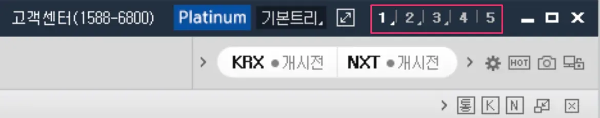

- **Desktop 1**: 한국 주식
- **Desktop 2**: 미국 주식
- **Desktop 3**: 금 현물 및 기타 자산

> 참고로, `HTS`는 큰 모니터에서 사용할 때 가장 효율적이다.

### 2.2 Desktop 1 - 국내주식

**Desktop 1**에서는 국내 상장된 주식 및 ETF를 매매할 때 사용하며, 실제로 아래와 같이 화면을 배치해 활용하고 있다.

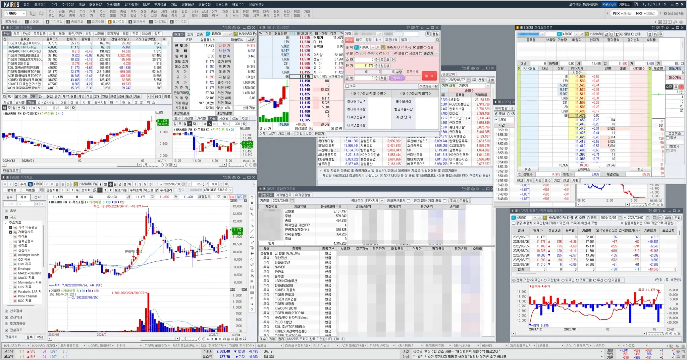

#### 2.2.1 금일 국내 현황 확인

시장이 오픈하자마자 바로 매매를 시작하기보다는 먼저 아래 화면들을 보며 지수를 확인하고 현재 시장 상황을 파악한다. 또한, 개인·외국인·기관의 매매 동향을 살펴 어느 투자자가 매수 또는 매도를 주도하는지 체크하는 편이다.

#### [0200] 시장종합

국내 및 해외 시장의 지수를 한눈에 확인할 수 있는 화면이다.

![[0200] 시장종합](image-20250313234108622.png)

#### [0255] 투자자 실시간 순매매현황

이 화면에서는 투자자별 실시간 순매매 현황을 확인할 수 있다. 아래 그림을 보면, 개인 투자자는 장 초반 꾸준히 매수하다가 점심 이후 매도를 시작한 반면, 외국인과 기관은 개인이 매도할 때 매수하는 패턴을 보이고 있다.

개인적으로 외국인과 기관이 매수세를 보일 때 함께 매수하는 전략을 선호한다.

![[0255] 투자자 실시간 순매매현황](image-20250313234120655.png)

#### [0228] 외국인/기관 주요매매종목

이 화면은 실시간 매매 종목을 보여주지는 않지만, 외국인과 기관이 과거에 주로 매매한 종목을 확인할 수 있다.

나는 이 화면을 활용해 매수된 종목을 확인한 후 관련 섹터 `ETF`를 매수하거나, 관심 종목으로 등록해 모니터링하는 용도로 사용한다.

![[0228] 외국인/기관 주요매매종목](image-20250313234134806.png)

#### 2.2.2 보유중인 주식 / ETF 매매시 주로 보는 화면

보유 중인 주식과 `ETF`를 계좌별로 돌면서 차트(분·일·주 단위)와 외국인·기관 매매 추이를 빠르게 확인한 후 매매를 진행한다.

#### [0621] 종합잔고조회

현재 보유 중인 자산을 종합적으로 조회할 수 있는 화면이다.

IRP, 금 현물 계좌를 제외한 보유 예수금, 주식, `ETF`를 한눈에 확인할 수 있으며, 특정 종목을 선택하면 열려 있는 다른 화면들도 자동으로 해당 종목 정보로 변경되므로 빠르게 상황을 파악할 수 있다.

![[0621] 종합잔고조회](image-20250313234144358.png)

#### [0100] 주식종합

이 화면에서는 주로 분·일 단위 차트 확인을 위해 사용한다.

![[0100] 주식종합](image-20250313234154559.png)

#### [9580] 주식차트

주식 종합 화면에서는 분 단위 차트를 주로 확인하는 반면, 이 화면에서는 일·주 단위 차트 및 추가 지표 분석을 함께 진행한다.

개인적으로 거래량, `MACD`, `RSI` 지표를 활성화해 활용하고 있다.

![[9580] 주식차트](image-20250313234204464.png)

#### [0262] 외국인/기관 매매추이Q

이 화면에서는 외국인과 기관의 매매 동향을 실시간으로 확인할 수 있다.

특정 종목을 선택하면 이 화면도 자동으로 변경되므로, 외국인·기관의 매매 흐름을 빠르게 파악한 후 매매 여부를 결정하는 데 유용하다.

![[0262] 외국인/기관 매매추이Q](image-20250313234214029.png)

#### [0605] 주식호가주문

이 화면에서는 매수·매도를 원하는 가격에서 더블 클릭하면 자동으로 1주 주문이 들어간다. 빠르게 주문을 넣을 때 유용하며, 특정한 수량을 주문할 때는 다른 주문 화면을 함께 사용한다.

![[0605] 주식호가주문](image-20250313234224107.png)

#### [0611] 주식주문

주식 호가 주문에서는 더블 클릭 시 1주씩 빠르게 주문할 수 있지만, 여러 수량을 한 번에 주문할 때는 이 화면을 활용한다.

![[0611] 주식주문](image-20250313234234284.png)

#### 2.2.3 새로운 주식 / ETF 매매시 주로 사용하는 화면

앞서 소개한 화면들은 보유 중인 주식 / `ETF`를 매매할 때 활용하는 화면들이었다면, 이번에는 새로운 주식 / `ETF`를 매매할 때 사용하는 화면들을 정리했다.

#### [0100] 주식종합

이 화면에서는 관심 종목을 등록할 수 있다.`등록` 버튼을 클릭하면 관심 목록을 생성할 수 있으니 활용해 보자.

![[0100] 주식종합](image-20250313234243984.png)

> 관심 종목 등록 방법

- `새그룹` 버튼을 클릭해 그룹을 생성한다
- `등록대상 종목` 목록에 원하는 종목을 입력한다
- `종목 추가` 버튼을 클릭해 종목을 추가한다

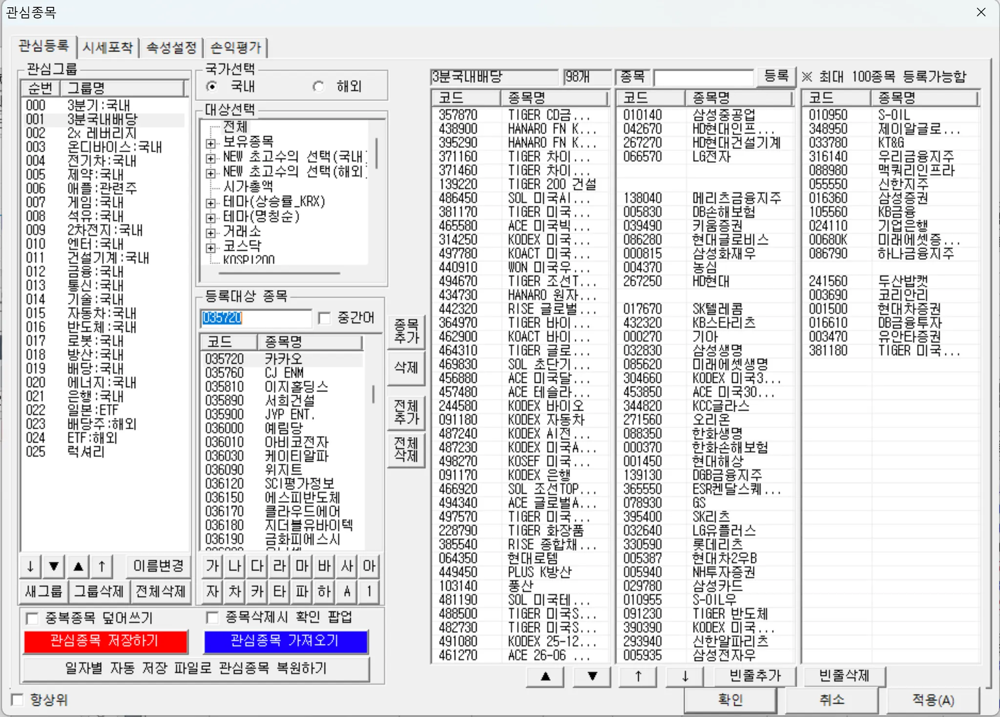

> 주식종합 화면에서 등록한 종목을 선택하면 아래 화면들도 자동으로 변경이 되어서 관련 뉴스, 기업정보, 차트를 빠르게 훌터볼 수 있어 매매할지에 대한 판단도 쉽게 가능해진다.

> **💡 TIP** 주식종합 화면에서 등록한 종목을 선택하면 아래 화면들도 자동으로 변경된다. 덕분에 관련 뉴스, 기업 정보, 차트를 한 번에 확인 할 수 있어 매매할지 여부를 빠르게 판단하는 데 도움이 된다.

#### [0501] 종합시황

해당 종목과 관련된 최신 뉴스를 확인할 수 있는 화면이다.

![[0501] 종합시황](image-20250313234319439.png)

#### [0512] 기업정보(FnGuide)

기업 정보 화면에서는 해당 기업에 대한 다양한 정보를 상세하게 확인할 수 있다. 웹사이트에서도 제공되는 정보이지만, `HTS`에서 한곳에서 바로 확인 가능하다는 점이 편리하다.

![[0512] 기업정보(FnGuide)](image-20250313234328184.png)

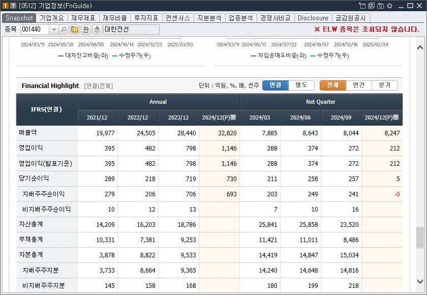

참고로 기업정보(FnGuide) 화면은 종목에서 우 클릭해서도 실행할 수 있다.

> 📌 참고 기업 정보 (FnGuide) 화면은 종목에서 우클릭 하여 실행할 수도 있다.

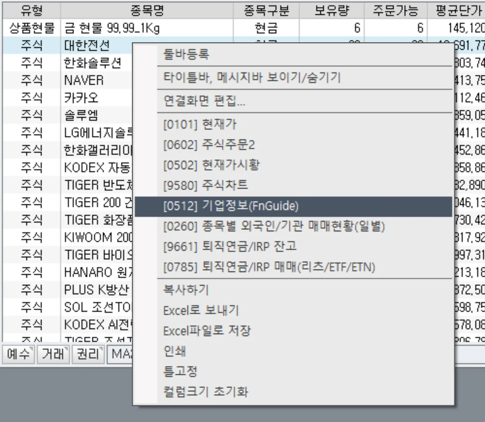

### 2.3 Desktop 2 - 미국 주식

Desktop 2는 미국 주식 / `ETF`를 매매할 때 사용하는 곳으로 지정해서 사용하고 있다.

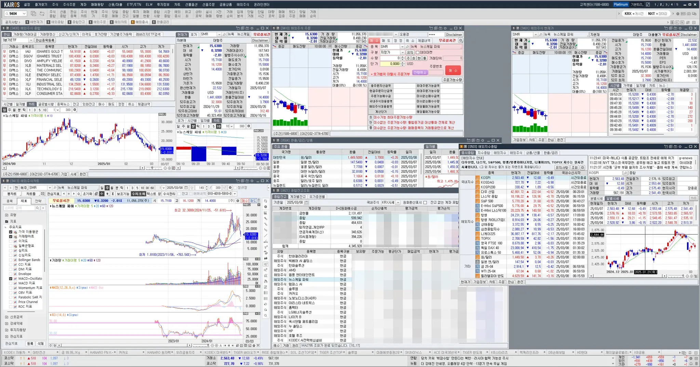

#### 2.3.1 금일 미국 시장 현황 확인

매매를 하기 전에 미국 증시 전반적인 흐름을 먼저 확인한다. 특히, 나스닥·S&P 500 지수를 중심으로 살펴보며, 미국 주식을 매매하는 만큼 환율도 매일 체크하는 편이다.

#### [0503] 해외지수종합

해외 주요 지수의 종합 정보를 제공한다. 현재 보유 중인 주식과 관련된 지수를 보는 편이다.

- 미국 나스닥, 다우, S&P 500
- 중국 항생

![[0503] 해외지수종합](image-20250313234405330.png)

#### [0504] 환율/금리/상품

미국 주식을 거래하려면 환율 체크는 필수다. 환율이 괜찮을 때 주기적으로 달러를 매입하는 전략을 사용하고 있다.

![[0504] 환율/금리/상품](image-20250313234414887.png)

#### 2.3.2 보유중인 주식 / ETF 매매시 주로 보는 화면

국내 주식과 동일하게, 미국 주식도 `[0621] 종합잔고조회` 화면에서 보유 종목을 클릭하며 차트 등 다양한 화면에서 정보를 확인한 후 매매를 결정한다.

#### [0621] 종합잔고조회

이곳에서 보유 중인 미국 주식도 확인할 수 있다. 개인적으로 수익률로 정렬을 해서 전체 목록을 하나씩 확인하는 편이다.

![[0621] 종합잔고조회](image-20250313234425310.png)

#### [9400] 해외주식 종합

해외 주식의 일·분 단위 차트를 확인하는 용도로 활용한다.

![[9400] 해외주식 종합](image-20250313234432916.png)

#### [9413] 해외주식차트

해외 주식의 일·주 단위 차트를 확인하는 화면이다. 또한, 거래량·`MACD`·`RSI` 지표를 함께 분석하는 용도로도 사용한다.

![[9413] 해외주식차트](image-20250313234442301.png)

#### [9410] 해외주식 주문

매매 결정을 내렸다면 이 화면에서 매수·매도 주문을 넣는다.

![[9410] 해외주식 주문](image-20250313234450263.png)

#### 2.3.3 새로운 주식 / ETF 매매시 주로 보는 화면

여기서는 보유 중인 종목이 아닌 새로운 주식 / `ETF`를 매매할 때 주로 활용하는 화면을 소개한다.

#### [9400] 해외주식 종합

관심 있는 종목을 각 화면마다 직접 티커를 입력하여 확인하는 방법도 있지만, 미리 관심 있는 주식 / `ETF`를 그룹으로 등록한 후 하나씩 클릭하는 방식이 더 편리하다. 이렇게 하면 다른 화면도 함께 변경되므로 더욱 효율적으로 종목을 분석할 수 있다.

📌 **해외 관심 종목 등록 방법**

- `관심종목등록` 버튼 클릭한다
- `새그룹` 버튼 클릭 후 그룹 생성한다
- `등록대상 종목` 입력 후 `종목 추가` 버튼 클릭한다

✅ 참고: 국내·해외 관심 종목은 공유되지 않음

![[9400] 해외주식 종합](image-20250313234459541.png)

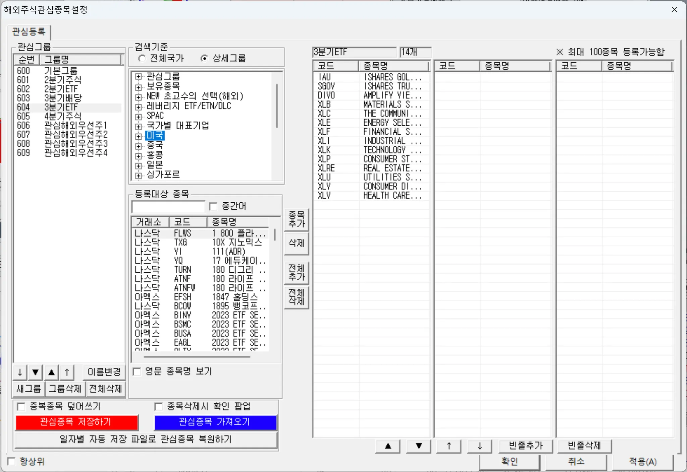

#### [9450] 해외기업정보(FnGuide)

이 화면에서는 주식 투자에 필요한 다양한 정보를 한곳에서 확인할 수 있다.

- `PER`, `EPS`, 배당수익률, 기업 정보, 영업이익 등

![[9450] 해외기업정보(FnGuide)](image-20250313234521396.png)

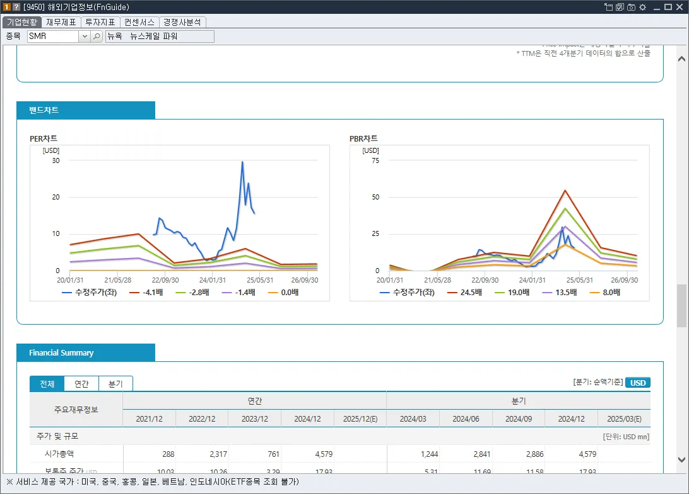

#### [9490] 글로벌 ETF 정보 (FnGuide)

`ETF` 관령 정보는 `[9490]` 화면을 사용하면 된다.

![[9490] 글로벌 ETF 정보 (FnGuide)](image-20250313234546156.png)

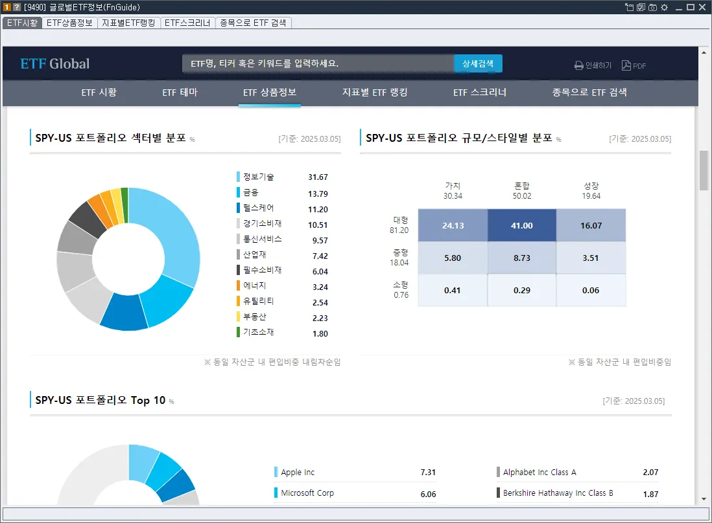

#### [9735] 기업분석 (해외)

전문가의 기업 분석 보고서를 보고 싶을 때는 `[9735]` 화면을 활용한다.

![[9735] 기업분석 (해외)](image-20250313234603778.png)

요약된 내용도 게시글에서 확인할 수 있지만, 첨부된 원본 파일도 다운로드해서 볼 수 있다.

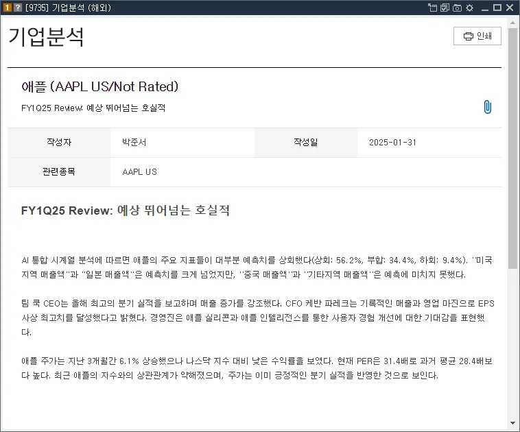

### 2.3 Desktop 3 - 기타

**Desktop 3**는 국내·미국 주식 외 기타 작업을 할 때 주로 사용하는 공간이다.

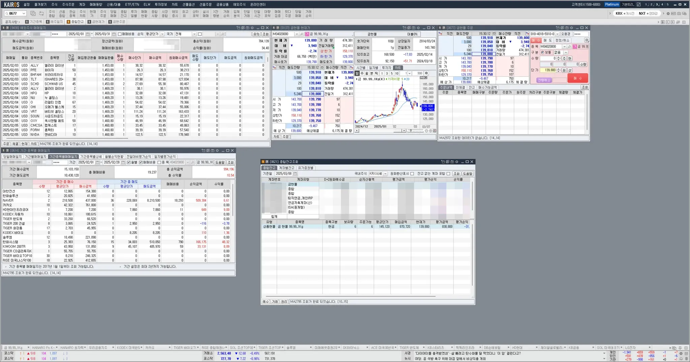

#### [0137] 금현물 현재가

분산 투자를 위해 정기적으로 금 현물을 매입하고 있다. Desktop 3에 항상 오픈된 상태로 두고, 차트를 보고 매수할 경우 아래 주문 창에서 바로 주문을 넣는다.

![[0137] 금현물 현재가](image-20250313234640967.png)

#### [0677] 금현물 주문

금 현물 매매 주문을 실행하는 화면이다.

![[0677] 금현물 주문](image-20250313234649691.png)

#### [9438] 해외주식 매매일지

개인적으로 구글 시트에 매매 내역을 정리하고 있으며, 매달·분기별 목표와 수익률을 확인하며 회고하는 편이다.

[미래에셋에서 매매수익률 확인하는 방법](https://stock.advenoh.pe.kr/미래에셋에서-매매수익률-확인하는-방법/) 포스팅에서 다룬 내용인데, 매달 수익률을 확인해서 사용하고 있는 화면들이다.

`[9438]` 화면에서는 해외 주식 손익금액을 확인한다.

![[9438] 해외주식 매매일지](image-20250313234658888.png)

#### [0614] 기간 종목별 매매일지

이 화면에서는 국내 손익금액을 확인하는 용도로 사용한다.

![[0614] 기간 종목별 매매일지](image-20250313234710898.png)

## 3. HTS 사용 패턴

위에서 HTS 사용 패턴을 정리하며 설명했지만, 전체적인 흐름을 다시 정리하면 다음과 같다.

### 3.1 보유 주식/ETF 매매 시

#### 1. 오늘 주식 시장 현황 확인

시장 분위기를 파악하기 위해 다음 화면을 확인한다.

- `[0200] 시장 종합`
- `[0255] 투자자 실시간 순매매 현황`
- `[0228] 외국인/기관 주요 매매 종목`

#### 2. 보유 종목 분석

`[0621] 종합잔고조회`에서 보유 종목을 클릭하면, 다른 창들이 **해당 종목에 맞게 자동 변경**되어 빠르게 분석 가능하다.

- `[0262] 외국인/기관 매매 추이Q` → 외국인·기관 매매 추이 확인
- `[0100] 주식 종합` → 일/분 단위 차트 확인
- `[9580] 주식 차트` → 일/주/월 단위 차트, RSI, MACD, 거래량 확인

#### 3. 매매 실행

매매 결정을 내린 후 주문 실행한다.

- `[0605] 주식호가 주문`
- `[0611] 주식 주문`

### 3.2 새로운 주식/ETF 매매 시

#### 1. 관심 종목 정리

관심 있는 종목을 구글 시트 등에 정리한 후, HTS에서 매매 여부를 판단하기 위해 해당 종목을 확인한다.

- 삼프로TV, 뉴스 등에서 언급된 종목을 미리 등록해두는 편이다.

#### 2. 종목 분석

`[0100] 주식 종합`에서 관심 있는 주식/ETF를 등록한 후, 클릭하여 관련 정보를 확인한다.

- `[0512] 기업정보 (FnGuide)` → 국내 기업 정보 확인
- `[9450] 해외기업정보 (FnGuide)` → 해외 기업 정보 확인

## 4. 마무리

MTS(모바일 트레이딩 시스템)로도 주식 확인 및 주문이 가능하지만, HTS(홈 트레이딩 시스템)를 사용하면 훨씬 시간을 절약 할 수 있다. 전문가만 사용하는 것이 아니라 누구나 쉽게 활용 가능하므로 강력 추천한다.

## 5. 참고

- [HTS 카이로스(Kairos)의 기본구성, 메인기능 안내](https://blog.naver.com/how2invest/221496669420)
- [미래에셋증권 카이로 HTS세팅 박세익 전무처럼 설정하기](https://www.youtube.com/watch?v=3rw9_gxYPMo)
- [미래에셋증권(HTS)](https://securities.miraeasset.com/imf/200/imf101.do)
- [카이오스 온라인 도움말](https://securities.miraeasset.com/oms/omsclient.do?n=K001)
- [카이오스 HTS Manual](https://securities.miraeasset.com/oms/omsclient.do?n=K001)
