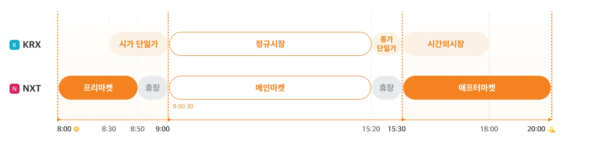
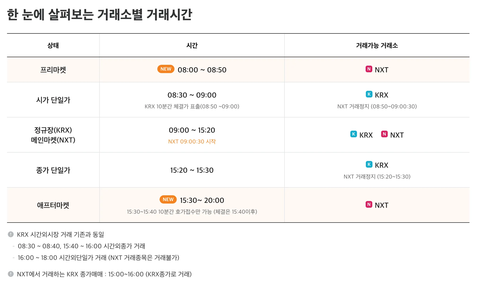
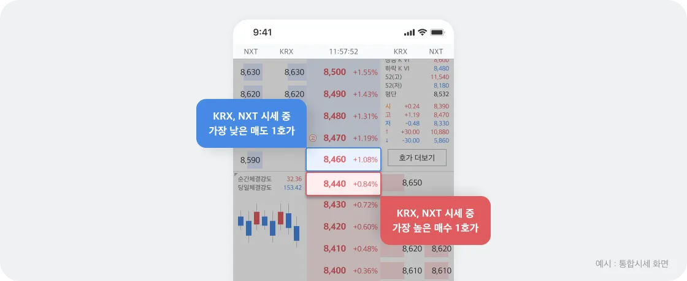
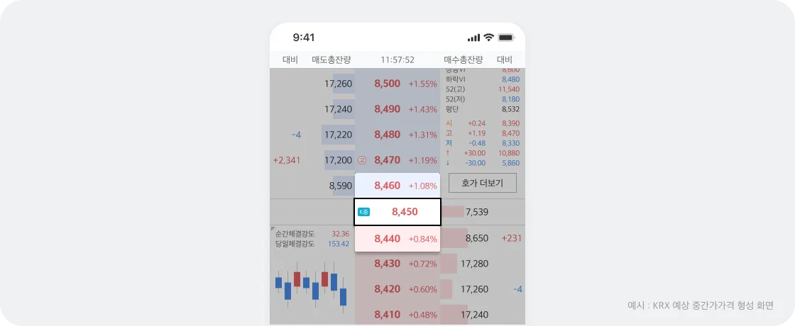
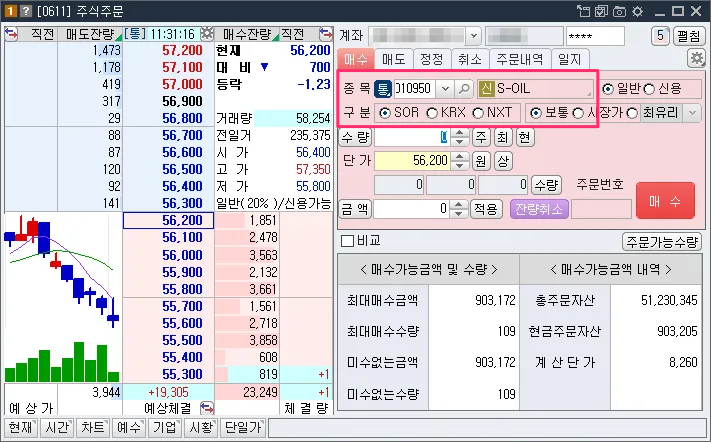
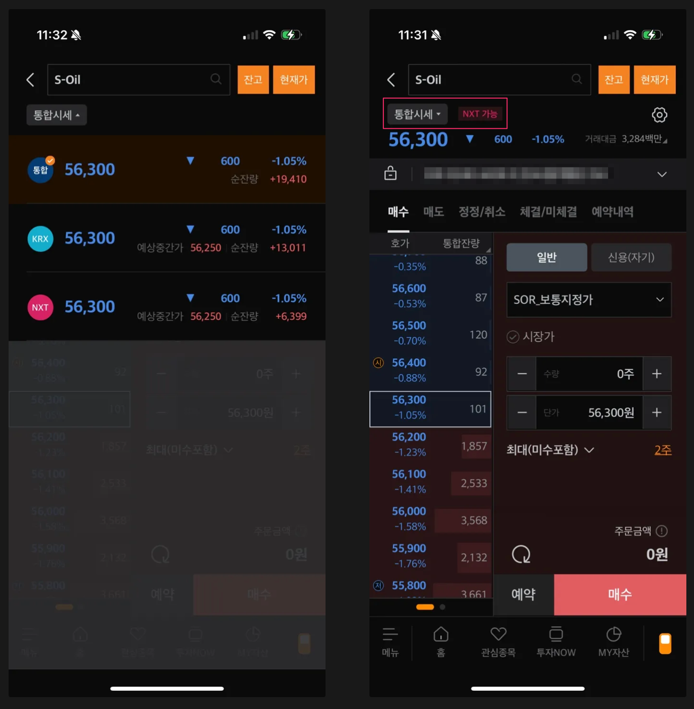

## 1. 개요

2025년 3월 4일, 한국 주식시장에 새로운 변화가 찾아온다. 바로 한국거래소(`KRX`) 외에 대체거래소인 넥스트레이드(`NXT`)가 공식 출범하게 되는 것이다. 이번 블로그에서는 `NXT`의 주요 특징과 투자자들에게 미치는 영향을 살펴본다.

## 2. 주요 특징

### 2.1 복수 거래소 체제

`NXT`의 출범으로 한국 주식시장은 복수의 거래소 체제로 전환된다. 초기에는 일부 종목에 한해 `KRX`와 `NXT` 두 개의 거래소에서 주식 거래가 가능해진다.

3월 4일에는 10종목으로 시작하여 약 1개월간 800종목까지 순차적으로 늘어날 예정이다.

- 롯데쇼핑, 제일기획, S-OIL, 동국제약, 컴투스, LG유플러스, 코오롱인더스트리, 골프존, 에프에프에이, 와이지엔터테인먼트

### 2.2 거래시간 확대

`NXT`는 기존 `KRX`보다 확장된 거래시간을 제공하여 투자자들은 아침 8시부터 저녁 8시까지 총 12시간 동안 주식 거래가 가능해진다.

### 2.3 편리한 통합시세 등장

`NXT`의 도입으로 `KRX`와 `NXT` 거래소를 합친 통합시세가 제공된다. 이를 통해 투자자들은 두 거래소의 시세를 한눈에 확인할 수 있어 거래 편의성이 향상됩니다.

### 2.4 SOR (Smart Order Routing) 주문

`SOR` (스마트 주문 시스템)은 투자자에게 더 유리한 거래소를 자동으로 선택하여 주문을 처리해주는 기능이다.

투자자가 주문화면에서 최선주문집행 기준을 적용한 SOR로 주문할 수 있으며 직접 KRX와 NXT를 지정 후 주문도 가능하다. 투자자 입장에서는 크게 신경쓸 부분이 없다고 보면 될 듯하다.

### 2.5 신규호가 도입

NXT는 기존 한국거래소에서 제공하는 호가 유형 외에 중간가호가와 스톱지정가호가 2개의 신규 호가 유형을 도입한다.

#### 2.5.1 중간가호가

> (매도1호가 + 매수1호가 ) / 2 = 중간가호가

중간가호가는 최우선매수, 최우선매도호가의 중간 값이 자동으로 산출되어 해당 가격 우선으로 거래가 체결된다.

중간가 호가 주문은 투자자가 별도로 가격을 지정하지 않고 주문을 제출하는 방식이며, 자동으로 중간 가격에 주문이 체결된다. 이를 통해 매도 1호가보다 낮은 가격에 매수하거나, 매수 1호가보다 높은 가격에 매도할 수 있어 거래 효율성을 높일 수 있다.

#### 2.5.2. 스톱지정가호가

스톱가격 및 주문단가를 설정하고 현재가 스톱가격, Stop Price에 도달하면 미리 설정한 지정가 주문이 자동으로 발동되는 주문방식이다.

ex. 스톱 지정가 매수 예시

- 현재 주가: `90,000`원
- 스톱 가격: `100,00`0원
- 지정가: `101,000`원 → 주가가 100,000원에 도달하면, `101,000`원에 매수하는 지정가 주문이 자동으로 실행된다

급격한 가격 변동을 대비해 원하는 가격에서 주문을 실행할 때 사용하면 좋다.

## 3. 마무리

`NXT`의 출범으로 한국 주식시장은 새로운 국면을 맞이하게 되었다. 투자자들은 확대된 거래시간과 다양한 주문 방식을 활용하여 더욱 유연하고 효율적인 투자가 가능해질 것으로 기대된다. 새로운 거래 환경에 대한 충분한 이해와 준비를 통해 성공적인 투자를 이어가시길 바란다.

>  실제 적용된 화면

## 4. 참고

- [복수 거래소 시대 1. 개요 및 핵심사항소개](https://www.youtube.com/watch?v=cJ_TMRKdJz0)
- [대체거래소(NXT) FAQ](https://trading.securities.miraeasset.com/bbs/board/message/list.do?categoryId=1979&searchType=2&searchStartYear=2024&searchStartMonth=02&searchStartDay=27&searchEndYear=2025&searchEndMonth=02&searchEndDay=26&listType=1&startId=zzzzz~&startPage=1&curPage=2&direction=1)
- [대체거래소란?](https://securities.miraeasset.com/mw/event_ats/main.html)
- [주요특징을 자세히 알아볼까요?](https://securities.miraeasset.com/mw/event_ats/main.html)
