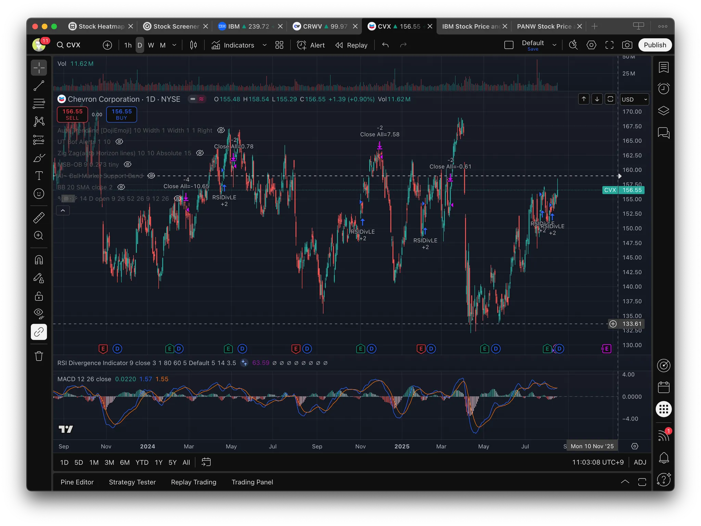

# 1. 개요

주식이나 암호화폐, 선물 트레이딩을 하다 보면 차트 분석은 필수적인 과정입니다. 하지만 차트만 바라본다고 해서 답이 보이는 것은 아니죠. 이때 도움을 주는 것이 바로 보조지표(Indicator) 입니다.

``TradingView``는 전 세계 트레이더들이 가장 많이 활용하는 차트 플랫폼으로, 기본 제공되는 보조지표뿐 아니라 사용자들이 직접 만든 다양한 스크립트를 무료 혹은 유료로 사용할 수 있다는 점에서 특히 인기가 높습니다. 초보자들은 기본 지표만으로도 충분히 매매 전략을 세울 수 있고, 숙련된 트레이더는 자신만의 전략을 녹여낸 커스텀 지표를 조합해 더 정교한 분석을 할 수 있습니다.

이 글에서는 많은 투자자들이 실제로 활용하는 대표적인 `TradingView` Indicator 들을 소개하고, 각각이 어떤 상황에서 유용한지, 그리고 서로 어떻게 조합해서 활용할 수 있는지에 대해 정리해보겠습니다.

# 2. Best TradingView Indicator 모음

`TradingView`에서 메뉴에서 Indicators를 클릭하면 아래와 같이 Indicator, Metric, Strategy 를 검색할 수 있는 창이 뜬다. 여기서 검색하면서 주로 많이 Indicator를 찾을 수 있다. `{ }` 를 클릭하면 실제 소스 코드도 확인이 가능해서 Community에서는 취향에 맞게 직접 소스코드를 수정해서 공유하기도 한다. 아래 이미지에서도 다양한 `MACD`가 있는 것을 볼 수 있다.

## 2.1 RSI - 과매수와 과매도를 알려주는 대표 모멘텀 지표

[RSI](https://www.tradingview.com/script/qSLcZSyw-RSI-Divergence-Indicator-strategy/) (Relative Strength Index)는 차트 분석을 조금이라도 해본 사람이라면 한 번쯤은 들어봤을 지표입니다. 주가가 단기간에 과도하게 오르거나 내렸는지를 `0~100` 사이 값으로 보여주며, 일반적으로 `70` 이상이면 과매수, `30` 이하이면 과매도로 해석합니다.

배당주나 우량주 투자자에게는 `RSI` 가 큰 의미가 없을 수도 있지만, **단기 매매자나 스윙 트레이더**에게는 매우 중요한 지표입니다. 단순히 숫자만 보는 것이 아니라, `RSI` 가 과매도 구간에서 반등을 시작하는지, 혹은 과매수 구간에서 하락 반전이 나타나는지를 관찰하면 매수·매도 타이밍을 잡는 데 도움이 됩니다.

- 과매수, 과매도 구간을 알려주는 대표 모멘텀 지표
- 단기 매매 타이밍 포착에 강력
- 활용법
  - `70` 이상 → 과매수 (조정 가능성)
  - `30` 이하 → 과매도 (반등 가능성)

## 2.2 MACD – 추세 전환을 읽는 나침반

[MACD](https://www.tradingview.com/support/solutions/43000502344/) (Moving Average Convergence Divergence)는 이동평균선을 응용한 추세 지표로, 단기선과 장기선의 관계를 통해 **추세의 강도와 전환 시점**을 보여줍니다. `MACD` 선이 시그널선을 상향 돌파하면 매수, 하향 돌파하면 매도 신호로 보는 경우가 많습니다.

`MACD` 는 아래 세가지 요소로 이루어져 있다.

1. `MACD` Line (파란색)
   - 단기 이동평균(`EMA` 12) – 장기 이동평균(`EMA` 26)
   - 주가의 단기 흐름과 장기 흐름의 차이를 나타냄 → 단기 추세 vs 장기 추세
2. Singal Line (주황색)
   - `MACD` Line을 일정 기간(보통 9일) 다시 평균낸 선
   - 매매 시그널 역할
3. 히스토그램 (빨간/초록 막대)
   - `MACD` Line – Signal Line의 차이
   - 두 선이 얼마나 벌어져 있는지(추세 강도)를 시각적으로 보여줌

`MACD`의 장점은 단순히 현재 추세가 상승인지 하락인지를 보여줄 뿐만 아니라, **추세가 바뀌는 타이밍**을 미리 포착할 수 있다는 점입니다. 단, 신호가 다소 늦게 나오는 특성이 있어 `RSI`나 거래량 지표와 함께 확인하면 더 효과적입니다.

- 의미 : 이동평균선 기반 추세 및 모멘텀 파악 지표
- 활용법
  - 매수 신호 (골드 크로스)
    - `MACD` Line(파란선)이 Signal Line(주황선)을 아래에서 위로 돌파할 때
    - 추세가 상승 전환되는 초기 신호
  - 매도 신호 (데드 크로스)
    - `MACD` Line이 Signal Line을 위에서 아래로 돌파할 때
    - 추세가 하락 전환되는 신호
- **장점 :** 추세 전환 시점을 미리 포착 가능

## 2.3 Auto Trendline – 차트를 깔끔하게 정리해주는 자동 추세선

많은 트레이더들이 차트에 추세선을 직접 긋지만, 기준에 따라 조금씩 차이가 나곤 합니다. [Auto Trendline](https://www.tradingview.com/script/xYaiqwD8-Auto-Trendline-Indicator-based-on-fractals/) Indicator는 이 과정을 자동화해 주요 고점과 저점을 연결한 **상승, 하락 추세선**을 그려줍니다.

특히 초보자에게 유용한 이유는, 지지와 저항 구간을 직관적으로 확인할 수 있다는 점입니다. 이 구간이 뚫리면 큰 추세 전환이 나오겠구나라는 시각적 힌트를 주기 때문에, 다른 지표와 조합할 때 큰 힘을 발휘합니다.

- 의미: 자동으로 주요 추세선을 그려주는 도구
- 활용법
  - 상승 추세선·하락 추세선을 자동으로 표시해 지지/저항 파악
- 장점: 손으로 일일이 추세선 긋는 수고를 덜어줌

## 2.4 Zig Zag (Auto Horizontal Lines) – 복잡한 차트를 단순하게

[TradingView 공식 문서](https://kr.tradingview.com/support/solutions/43000591664/)나 [Market Structure ZigZag](https://www.tradingview.com/script/NXgQEbZi-Market-Structure-ZigZag-Break-of-Structure-Order-Blocks/) 지표를 보면 알 수 있듯, [Zig Zag](https://www.tradingview.com/script/uvXdNmXg/)은 가격의 미세한 변동은 제거하고 큰 흐름만 보여줍니다.

실제 차트를 보다 보면 너무 많은 노이즈 때문에 방향성을 파악하기 어려울 때가 많습니다. 이때 Zig Zag은 변곡점을 기준으로 단순화해, 현재 시장이 상승 추세인지 하락 추세인지를 명확하게 보여줍니다. 또한 자동으로 수평 지지도 표시해주고 있어 저항선도 빠르게 파악할 수 있다.

- 의미: 가격 파동을 단순화해 주요 변곡점을 보여주는 지표
- 활용법
  - 큰 추세의 전환점 식별
  - 박스권(지지/저항 구간) 자동 표시
- 장점: 복잡한 차트를 단순하게 정리해줌

## 2.5 UT Bot Alerts – 자동 매매 신호

[UT Bot Alerts](https://www.tradingview.com/script/n8ss8BID-UT-Bot-Alerts/)는 트레이더들 사이에서 입소문이 많이 난 지표 중 하나입니다. 차트에 **Buy / Sell** 신호를 직접 띄워주기 때문에 초보자도 직관적으로 매매 타이밍을 잡을 수 있습니다.

물론 “신호 뜨면 무조건 따라 산다”는 식으로 접근하면 위험합니다. 하지만 `RSI`나 `MACD` 같은 전통적인 지표와 함께 보면 **추가적인 확신을 주는 보조 신호**로 매우 유용합니다.

- 의미: 자동으로 매수/매도 신호를 알려주는 인기 Indicator
- 활용법
  - 차트에 `Buy` / `Sell` 표시 확인
  - 단기 트레이딩 시 참고용으로 유용
- 장점: 초보자도 쉽게 이해 가능

## 2.6 MSB-OB – 시장 구조와 오더 블록

[MSB-OB](https://www.tradingview.com/script/DkE7UniD/) 지표는 조금 더 전문적인 개념을 다룹니다. `MSB`(Market Structure Break)와 `OB`(Order Block)을 시각화하여, 주식 세력이 매수, 매도를 집중적으로 한 흔적을 보여줍니다.

스마트머니 개념을 공부해본 분들이라면 이 지표가 얼마나 강력한지 알 수 있습니다. 단순히 추세만 보는 것이 아니라, **어디서 큰 손이 개입했는지**를 파악할 수 있기 때문에, 추세 전환 지점을 예측하는 데 도움이 됩니다.

- 의미: 시장 구조 전환 `MSB`과 `OB`을 표시
- 활용법
  - 주요 매물대·기관 매수/매도 흔적 파악
  - 추세 전환 구간에서 진입/청산 타이밍 포착
- 장점: 스마트머니 개념을 차트에 바로 적용 가능

개인적으로 매도, 매수 시점을 정할 때 이 지표를 많이 사용하는 편이다.

# 4. 마무리

이번 글에서는 `TradingView`에서 꼭 써봐야 할 대표적인 인디케이터들을 소개했습니다. `RSI`와 `MACD` 같은 전통적인 지표부터, Auto Trendline, Zig Zag, UT Bot Alerts, MSB-OB와 같은 커스텀 스크립트까지, 각 지표마다 장단점과 활용법이 다릅니다.

중요한 것은 **지표는 보조일 뿐**이라는 점입니다. 지표를 맹신하기보다는, 시장 흐름을 이해하는 데 참고 자료로 사용하고, 반드시 **자신만의 원칙과 리스크 관리**를 병행해야 합니다.

`TradingView`의 장점은 다양한 지표를 손쉽게 적용하고 비교해볼 수 있다는 점입니다. 여러 지표를 직접 적용해보면서 본인만의 투자 스타일에 맞는 조합을 찾는 것이 가장 현명한 활용 방법일 것입니다.

# 5. 참고

- [2025년 최고의 TradingView 지표(+특수 설정)](https://www.youtube.com/watch?v=AzHP74SywjY)

- [This Indicator Finds PERFECT Entries](https://www.youtube.com/shorts/it87nQiUjSA)
