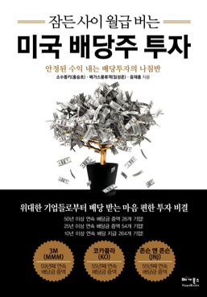
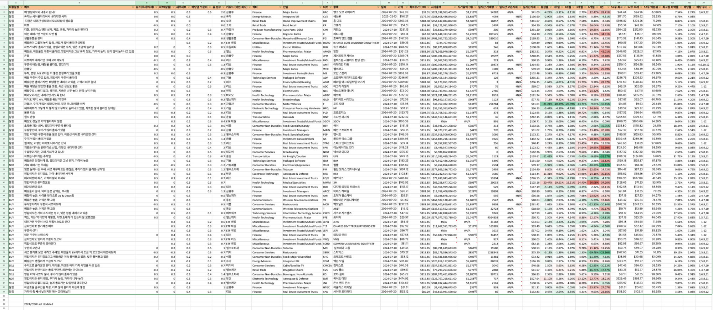
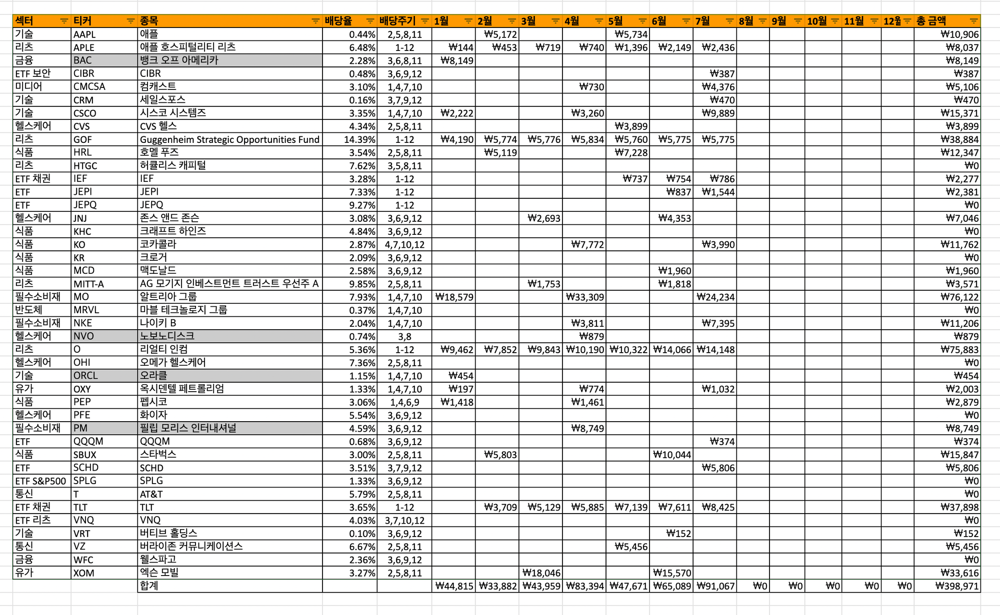

## 1.개요

[국내 3분기 배당주 정리](https://stock.advenoh.pe.kr/3분기-국내-배당주-정리/#31-배당주-선택-기준)를 한 내용에 이어서 미국 배당주도 정리해본다.

## 2. 미국 배당주 찾는 방법

국내 배당주는 [네이버 증권](https://finance.naver.com/) 사이트와 같이 잘 정리가 되어 있는 곳들이 있어서 편하게 검색이 가능한데, 미국 배당주는 잘 정리되어 있는 곳을 찾지는 못해서 개인적으로 유튜브나 삼프로에서 접하게 배당주 위주로 매매하고 있다.

### 2.1 유튜브 채널

유튜브 채널만 봐도 쉽게 미국 배당주 정보도 얻을 수 있어서 자기 기준이 생기기 전까지는 그래도 소수 규모로 투자하면서 조금씩 알아가는 것도 괜찮은 듯하다. 개인적으로도 다른 사람의 포트폴리오를 보면서 배당주에 대해서도 알게 되었고 조금씩 비중을 늘려가고 있다.

- [삼프로](https://www.youtube.com/@3protv)
- [수페TV](https://www.youtube.com/@supe-tv)
- [소수몽키](https://www.youtube.com/@sosumonkey)
  - [소몽 라운지](https://cafe.naver.com/sosumonkey) 카페에서도 배당금/포트 기록방에서 다른 분들은 어떻게 배당 투자를 하고 있는지도 확인할 수 있다

### 2.2 검색

구글에서 미국 배당주 검색을 해도 참조할 만한 여러 곳이 있어서 검색으로도 쉽게 찾을 수 있다.

- [미국 배당주 순위, 배당킹 투자 추천](https://www.notion.so/2024-3-IT-Blog-675df29a889f4402af35250de79bbf35?pvs=21)
- [미국주식 고배당 주 순위 67개 총정리](https://blog.naver.com/hermebook/223226941657)

### 2.3 도서

배당주 관련해서 여러 책도 많이 있어서 굳이 여러 책을 읽기보다는 한 권이면 충분한 것 같고 다 읽지 않아도 바로 시작해도 괜찮지 않을까 싶다. 100% 다 이해를 못해도 1주라도 매매해 보면서 빠르게 접하는 걸 추천한다.

[미국 배당주 투자지도](https://ridibooks.com/books/754026095?_s=search&_q=미국배당주&_rdt_sid=search&_rdt_idx=2)

- 우선주, 배당성장주, 고배당주에 전체적으로 알 수 있는 책이다

[나는 배당투자로 매일 스타벅스 커피를 공짜로 마신다](https://ridibooks.com/books/222003168?_s=search&_q=배당투자로&_rdt_sid=search&_rdt_idx=0)

- 저자는 유튜버 수페TV로 배당투자에 대한 기초 지식과 리츠, 배당 ETF에 대해서도 잘 설명한 책이다

[잠든 사이 월급 버는 미국 배당주 투자](https://ridibooks.com/books/1314000053?_s=search&_q=배당주&_rdt_sid=search&_rdt_idx=1)

- 저자는 유튜버 소수몽키로 미국 배당주 입문 책으로 추천한다
- 미국 투자에 관심이 있으면 [소수몽키의  한 권으로 끝내는 미국주식](https://ridibooks.com/books/754031015?_rdt_sid=author_books&_rdt_idx=1)도 추천한다

## 3. 미국 배당주 최종 정리

미국 배당주 선택 기준도 [국내 배당주 선택 기준](https://stock.advenoh.pe.kr/3분기-국내-배당주-정리/#31-배당주-선택-기준)과 동일한 과정을 통해서 진행해서 여기서는 추가로 설명은 하지 않는다.

- 기본 정보 기반으로 필터링이후 세부 분석 진행하고 최종 결론 (ex. `정찰병`, `BUY`, `알람`)으로 마무리함

### 3.1 3분기 최종 선정 목록

3분기 때 관심을 가지면 좋을 것 같은 미국 배당주를 정리해 보았다. 지금 많이 오른 주식은 바로 매수하기는 좀 그럴 수 있어서 `알람`을 TradingView에 걸어두었고 바로 확인하고 싶은 주식은 `정찰병`으로 표시를 해서 이번 주에 1주 정도를 사서 더 매수를 할지 확인하려고 한다. 개인적으로 정한 결론이라서 참고만 해주시면 좋을 것 같아요.

- [구글 시트 - 미국 배당주 종목 선정](https://docs.google.com/spreadsheets/d/17NwN-VOAXvpVX_dyiJs2LH6nuYWtgX-3SDTGUyzpHco/edit?usp=sharing)

### 3.2 2024년 올해 배당금 수익표

다른 카페에서도 종종 배당금 수익표를 공유하는데, 저도 올해 받은 미국 배당금을 정리해 보았다. 아직은 작은 금액이지만, 꾸준히 모아갈 예정이다. 미국 시장은 국내 시장보다는 장기 투자하기 좋아서 꾸준히 모아가는 재미를 톡톡히 볼 수 있지 않을까 싶다.

> 회색으로 칠해진 주식은 많이 오르기도 해서 전체 매도한 주식이다. 기회를 봐서 다시 매수할 예정이다.
