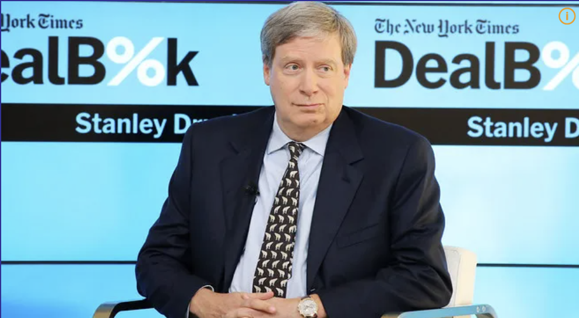

> `스탠리 드러켄밀러`(Stanley Druckenmiller)는 1992년에 조지 소로스와 함께 파운드 매도 트레이딩으로 10억 달러를 번 헤지펀드 매니저이다.

 

주식 투자할 때 고민해볼만한 조언이라서 블로그에 적어둔다.

## 드러캔밀러의 투자 조언
 

1. 기업(시장) 상황이 지금으로부터 18개월 뒤에 어떻게 변해있을 지 시각화 할 수 있어야 합니다. 그리고 그게 무엇이든 간에 거기에 가격이 있지, 현재에 있지 않습니다. 사람들이 18~24개월 뒤에 어떻게 생각이 바뀔지, 그리고 그들이 어떻게 생각하는지 알려주세요
     

2. 어닝은 시장을 움직이지 않습니다. FED가 움직이죠. 중앙은행들의 유동성 움직임을 주시하세요. 많은 투자자들은 어닝과 기존 지표를 봅니다
     

3. 나는 편더멘탈을 보는 대신에 그 당시에 주식을 움식이는 가장 큰 요소를 분석하는데 집중합니다
     

4. 지금 관리의 핵심은 이겁니다. 맞았을 때 많은 돈을 벌고, 틀렸을 때 최소한의 돈을 잃는 겁니다
     

5. 높은 지능이 아니라, 투자 규칙이 있는 투자자가 성공한다고 믿습니다
     

6. 나는 강한 확신을 가지고 자금을 관리할 때 많은 걸 생각하고, 많이 틀리기도 한다. 배팅을 했는데 조건이 바뀐다면, 항상 바뀌어야 합니다. 그게 제가 돈을 관리하는 방식입니다

## 참고

- https://m.blog.naver.com/economakase0/223027473343
- https://www.youtube.com/watch?v=l_LWmNKr_Xg
