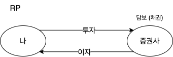
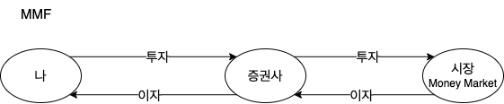
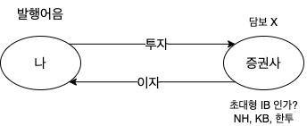
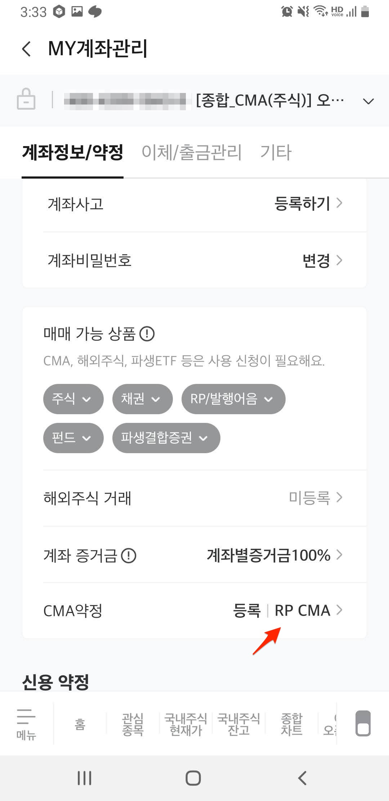
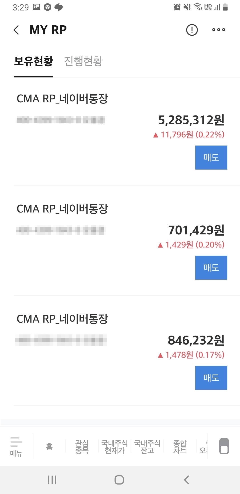

## CMA란?

`CMA`는 Cash Management Account의 약자로 `종합자산관리계좌`라는 뜻을 가지고 있고 증권사에서 만들고 수시입출금통장으로 채권이나 주식, 펀드을 관리해 종합적인 자산 관리가 가능한 계좌이다. 카드 사용과 스마트폰 뱅킹 모두 가능하며 자동이체 계좌도 사용할 수 있어 불편함을 느낄 수 없는 통장이다. 일반적으로 `CMA` 계좌로 이체하여 현금을 모아두었다가 다른 계좌(ex. 신탁)로 이체하여 투자를 시작한다.

### CMA 계좌의 특징

- 다양한 금용서비스 제공
    - 신용/체크카드 발급 가능
    - 자유로운 입출금이 가능한다
- 자산관리
    - 일반적으로 펀드, 신탁, 채권, ELS 등에 투자하기전에 `CMA` 계좌로 현금을 이체하고 매수를 결정하면 다른 계좌(ex. 신탁, 연금저축)으로 이체하여 투자를 시작한다
- 자동투자
    - 계좌에 입금만 해도 별도 매수 주문할 필요 없이 자동으로 투자가 된다
    - `발행어음`, `RP`, `MMF` 등 상품 중에 원하는 투자를 선택할 수 있다

## CMA 종류

증권사마다 제공하는 투자상품은 조금씩 다를 수 있지만, 아래와 같은 상품을 제공한다. 증권사가 투자자(우리)로부터 예탁금을 받아 안정성이 높은 국공채나 회사채등의 금융상품을 운용하여 수익을 낸다. 즉, 은행과 같이 다른 곳에 돈을 빌려주고 수익을 내는 것이다. 어떤 상품이 있는지 알아보자. 대부분 `CMA` 에서 제공하는 상품은 예금자 보호 대상이 아니다.

### `RP`형 (환매조건부 채권)

- 증권사가 자신들이 보유한 국공채, 지방채, 회사채를 담보로 고객에게 RP을 발행하여 언제든지 원금과 이자를 돌려주는 준다
    - 우리가 증권사에 돈을 넣으면 증권사가 그 돈을 빌려가는 방식이다
- 사용한 기간만큼 이자를 넣어준다
- 이자는 한번 가입하면 고정이다
- 별도의 수수료 없다
    - 환매도 및 재투자시점에 발생 이자에 대한 과세는 있다

### `MMF`형 (Money Market Fund)

- `MMF`라고 하는 시장, 단기금융시장이라고 짧게 돈을 서로 빌려대는 시장
- 시장에 내돈이 갔다가 하루만에 이자가 불어난 채로 다시 돌아오는 걸 증권사가 도와주기만하는 형태이다
- 금리가 정해져 있지 않고 운영 결과에 따라서 수익이 결정이 되어 이자는 가변적이다
- 발행어음형 `CMA` 다음으로 금리가 높다
    - `MMF`형은 담보가 없고 자산운용사의 과거 운용 실적을 믿고 거래하는 상품이기 때문에 다른 유형의 상품에 비해 원금 보장에 대한 불확실성이 존재한다

### `Wrap`/MMW 형 (한국증권금융 예수금)

- 증권사의 예금으로 하루동안 갔다온는 걸 증권사가 도와주는 형태의 상품이다
- 랩보수(ex. 미래에셋 연 0.05%)가 존재를 한다

###  `CP`형 (`발행어음`형)

- 증권사의 신용을 믿고 거래되는 방식이라 발행어음형은 큰 증권사 발급이 가능하도록 되어 있다
    - 미래에셋증권, 한국투자증권, NH투자증권, KB증권이 발행어음 사업 인가를 받았다
- `RP` vs `발행어음`
    - `RP`의 경우 돈을 가져가면 담보로 `채권`을 준다 (증권사가 사라져도 채권을 다시 팔수가 있다)
    - 즉 증권사가 망하면 돈을 돌려받지 못할 수도 있다. 하지만, 이런 경우는 거의 없다고 봐도 될 듯하다
- 환매도 및 재투자시점에 발생 이자에 대한 과세는 있다

## My CMA 계좌

현재 미래에셋을 사용하고 있어서 현재 어떤 상품으로 선택되어 있는지 확인할 수 있다.

### 1. 현재 내 CMA 계좌에서 투자 형태 알아보기

메뉴 > 관리하기 > MY 계좌 선택 > MY자산에서 CMA 계좌에서 ... 선택 > MY계좌 pop-up 메뉴에서 > MY 계좌관리 선택

아래와 같이 내 CMA 계좌가 어떤 형태의 상품으로 투자되는지 알수 있다. 내 계좌의 경우에는 현재 RP로 선택이 되어 있다.

### 2. RP 보유현황 확인

메뉴 > 투자하기 > 금유상품 서택 > 왼쪽 메뉴에서 CMA/RP 선택 > My RP 선택 하면 현재 어떻게 RP로 투자되고 있지 확인할 수 있다.

## 마무리

|          | RP                            | MMF           | 발행어음                      |
| -------- | ----------------------------- | ------------- | ----------------------------- |
| 금리     | 확정                          | 변동          | 확정 (금리가 조금 더 높음)    |
| 안전장치 | 담보: 채권                    | 내돈이 시장에 | 초대형 IB인가 승인된 증권사만 |
| 기간     | 수시형, 약정형                | 수시형        | 수시형, 약정형                |
| 활용법   | CMA, 위탁, ISA, IRP, 현금매수 | 연금저축매수  | 한투, KB, NH                  |

## 참고

- https://m.blog.naver.com/bomison/221932028634
- https://bomitv.tistory.com/38
- https://www.banksalad.com/contents/1%EB%B6%84%EB%A7%8C%EC%97%90-%EC%A0%95%EB%A6%AC%ED%95%98%EB%8A%94-CMA-febc
- https://securities.miraeasset.com/hks/hks4113/n02.do
- https://chat.openai.com/chat
- https://www.dailypop.kr/news/articleView.html?idxno=49200
- https://www.youtube.com/watch?v=4v8m0NOvAic
- https://m.blog.naver.com/how2invest/222004994187
- https://namu.wiki/w/CMA
- https://www.kbsec.com/go.able?linkcd=m01030000
- https://www.youtube.com/watch?v=iEZM8Lcl6Nk&list=PLF2nEKwWVaxu_aEc3gtVK1Y_jtA5gqqpP&index=2
