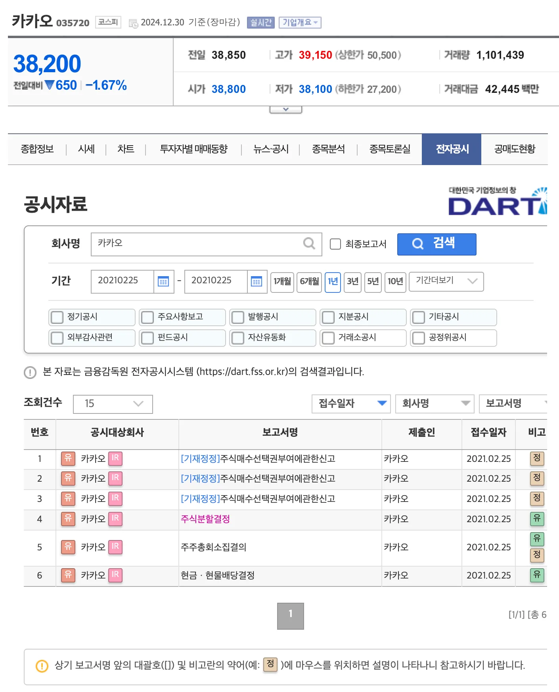
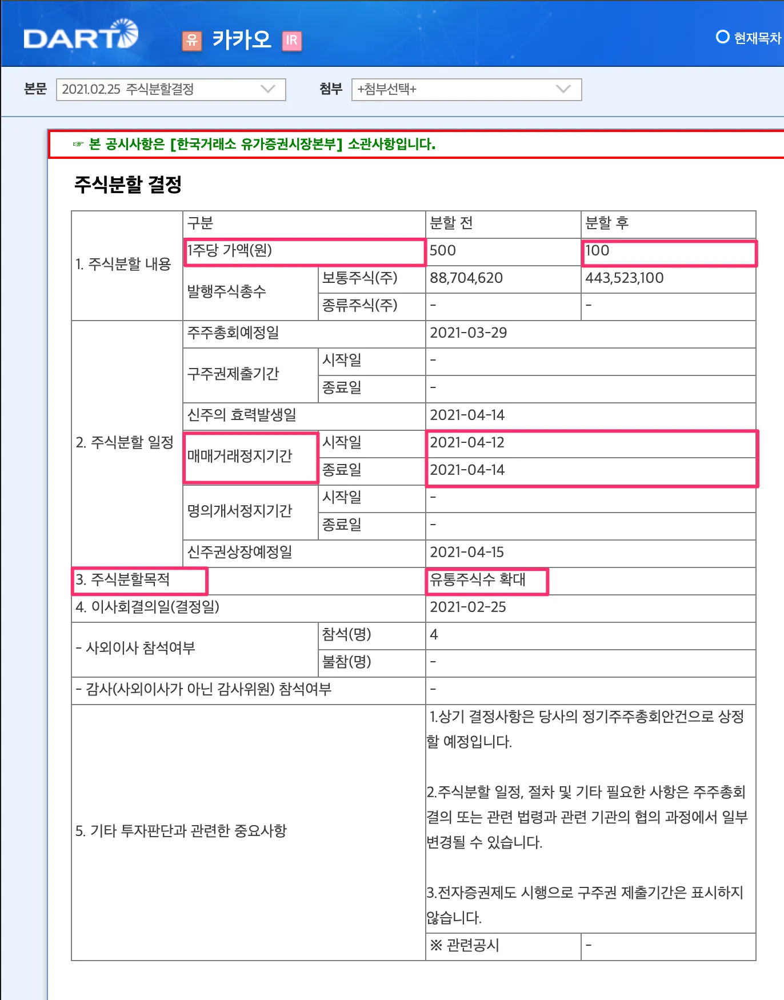
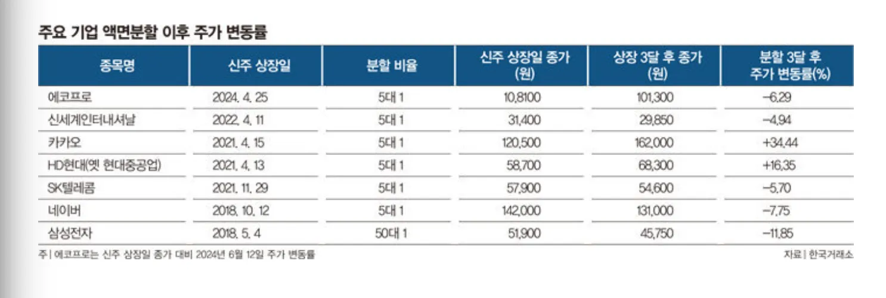

## 1. 개요

`액면분할`은 주식시장 참여자들에게 한 번쯤 들어봤을 법한 개념이다. 올해 미국 반도체 기업인 엔비디아은 2024년 6월에 10:1 `액면분할`을 실시해 $1208.88 → $120.88로 조정이 되었다. 국내주시 시장의 경우 카카오는2021년 4월 코로나19 팬데믹 특수로 주가가 급등했었는데, 5:1 비율로 `액면분할`을 진행했다. 이로 인해 주가 당시 558,000원 → 111,600원으로 조정이 되었고 `액면분할` 후 투자자들의 관심이 더욱 집중이 되었다. 이러한 상승세 속에서 카카오는 같은 해 6월 주가가 173,000원을 기록하기도 했다. 주가가 낮은 가격으로 조정되면서 소액 투자자들에게 투자 문턱이 낮춰졌다.

그렇다면, `액면분할`은 무엇이며, 주가에 어떤 영향을 미칠까요? 이번 포스팅에서는 `액면분할`은 무엇이고 왜 하는지 국내, 미국 시장에서는 어떤지 같이 살펴보자.

## 2. `액면분할`(Stock Split) 이란?

### 2.1 `액면분할`

`액면분할`은 주식의 액면가액을 일정한 비율로 나눔으로써 주식의 총 발행 수를 증가시키는 것을 말한다. 이 과정에서 기업의 시가총액은 변하지 않지만, 주당 가격이 낮아지는 효과를 가져오고 액면가를 감소한 만큼 주식수는 증가하게 된다.

- 예. 삼성전자는 50:1로 `액면분할`을 단행하면 주당 가격이 250만원 → 5만 원으로 조정되고 주식 수는 50배 증가하게 된다.

> 액면가? 회사 설립 시 주당 가격으로 설정된 금액으로, 회계적 측면에서 기초적인 기준을 제공한다. 보통 액면가는 5,000원이 일반적이지만, 최근에는 100원, 500원, 1,000원 등으로 낮춰지는 사례가 점차 늘어나고 있다. 이는 투자자들이 보다 쉽게 접근할 수 있도록 유도하려는 기업들의 전략적인 움직임으로 볼 수 있다.

### 2.2 `액면분할`을 하는 이유

이미 짐작했겠지만, `액면분할`로 인해 주가가 낮아지면서 이전에는 가격이 너무 높아 접근하기 어려웠던 주식을 보다 많은 투자자들이 구매할 수 있게 되는 장점이 생기고 거래 활성화가 되는 긍정적인 효과를 가져오기도 한다.

- 소액 투자자 유치
  - 주가가 지나치게 높으면 일반 투자자들에게 투자 진입 장벽이 될 수 있다. `액면분할`을 통해 주가를 낮춰 더 많은 소액 투자자가 접근할 수 있도록 한다.
- 거래 활성화
  - 낮아진 주가로 인해 거래가 활발해질 수 있고 이는 시장 유동성을 높이는 데 기여하게 된다
- 심리적 효
  - 주당 가격이 낮아지면 투자자들에게 심리적으로 “저렴하다"는 인식을 주어 매수세를 유도할 수 있다

### 2.3 전자공시 - 카카오 액면 분할

카카오는 2021년 4월 5:1 액면분활을 통해 대중 투자자의 접근성을 높이고 거래량을 활성화 시켰다.

### 2.4 반대 개념: 역액면병합

`액면분할`과 반대되는 개념은 역액면병합(Reverse Stock Split)도 있다. 액면가를 증가시켜 주식수를 감소시키고 주가는 비율만큼 상승시키는 방법이다. 이 또한 기업가치 변화는 전혀 없지만, 저가주가 액면병합을 통해 고가주로 전환되면, 투자자들 사이에서 부실주로 간주되는 이미지를 개선할 수 있는 효과를 기대할 수 있다.

### 2.5 투자시 주의사항

미국의 주요 기술 기업들(ex. 엔비디아)은 액면분활 후 주가가 상승하는 경향을 보였지만, 국내 기업의 경우 `액면분할`을 단행했지만, 그 효과는 제한적이었다. 카카오와 HD현대를 제외한 5개 기업은 `액면분할` 후 3개월 동안 주가가 감소한 것으로 집계되었다. 이는 국내에서 `액면분할`이 기대한 만큼의 효과를 보지 못한 사례들이다.

투자자 접근성 높이는 `액면분할`은 대표적인 주주친화정책이다. 하지만, 전문가들은 실적이 뒷받침되지 않는 종목이 `액면분할`로 유통 주식 수가 갑자기 늘어날 경우 오히려 대량 매도를 유발해 주가가 약세로 전환될 수 있다고 지적한다.

## 4. 마무리

`액면분할`은 기업이 투자자 접근성을 높이고 거래를 활성화하기 위한 유용한 수단이다. 하지만, 단순히 주가를 낮춘다고 해서 기업 가치가 증가하는 것은 아니며, 장기적인 기업 성장 가능성을 함께 고려해야 한다.

`액면분할` 이벤트가 발생한 기업들의 숨겨진 가치가 시장에서 재평가될 가능성이 있으니, 투자자 입장에서는 이러한 이벤트를 주목하는 것이 중요하다. 배경 지식을 활용하여 투자 전략에 참고한다면, 더 나은 투자 결정을 내릴 수 있을 것이다. 😊

> 주식 가격이 너무 높은 경우 소수점 투자도 좋은 투자 대인이 될 수 있을 것 같아요. 개인적으로 올해 하반기 부터 시작을 했는데, 수익률이 괜찮다고 생각이 듭니다. 한번 소수점 투자를 활룡해보세요.
>
> [토스 증권에서 주식 모으기](https://stock.advenoh.pe.kr/토스-증권에서-주식-모으기/)

## 5. 참고

- [주린이가 가장 알고 싶은 최다질문 TOP77](https://ridibooks.com/books/236000504?_s=search&_q=주린이가&_rdt_sid=SearchBookList)
- [https://namu.wiki/w/액면분할](https://namu.wiki/w/액면분할)
- [주식 투자 시 꼭 알아둬야 하는 액면분할](https://blog.naver.com/samsung_fn/223547747414?trackingCode=rss)
- [국내에선 잘 안 통하는 액면분할 효과](https://www.donga.com/news/Economy/article/all/20240615/125444635/1)
