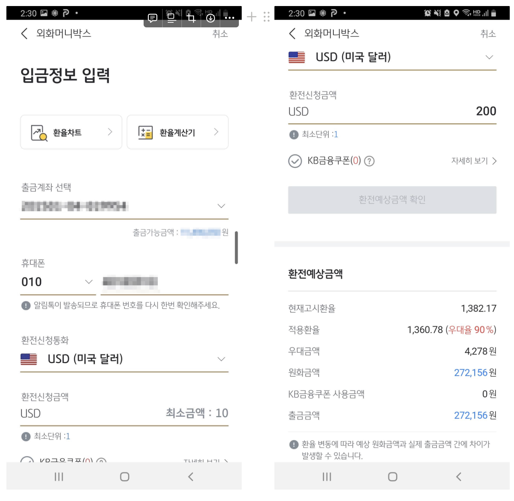
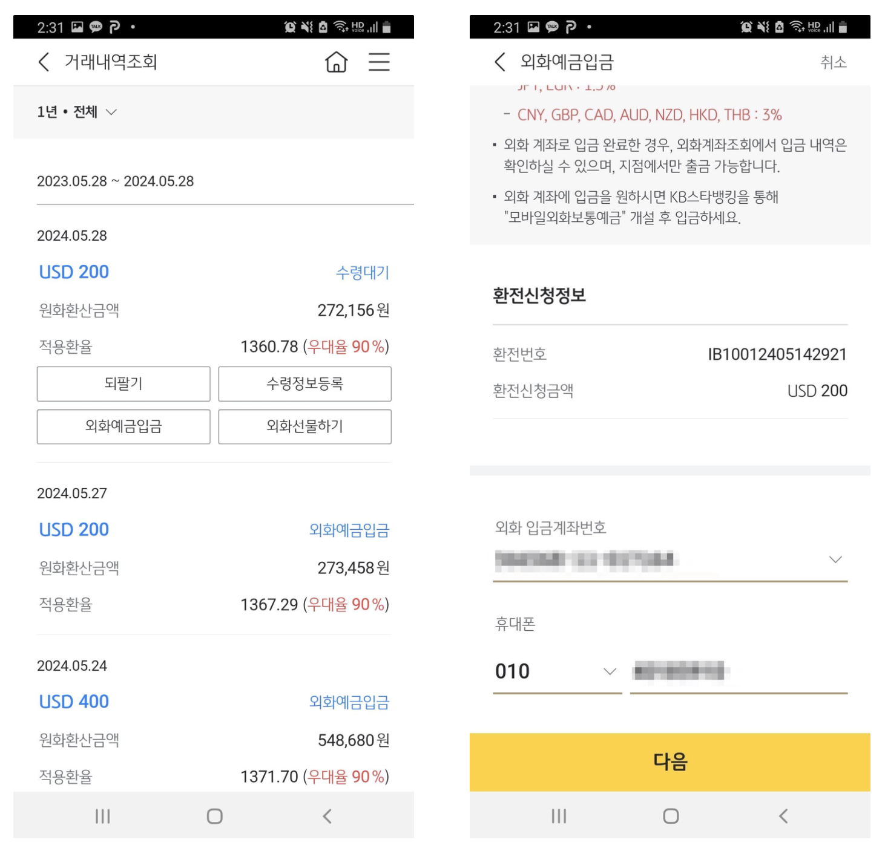
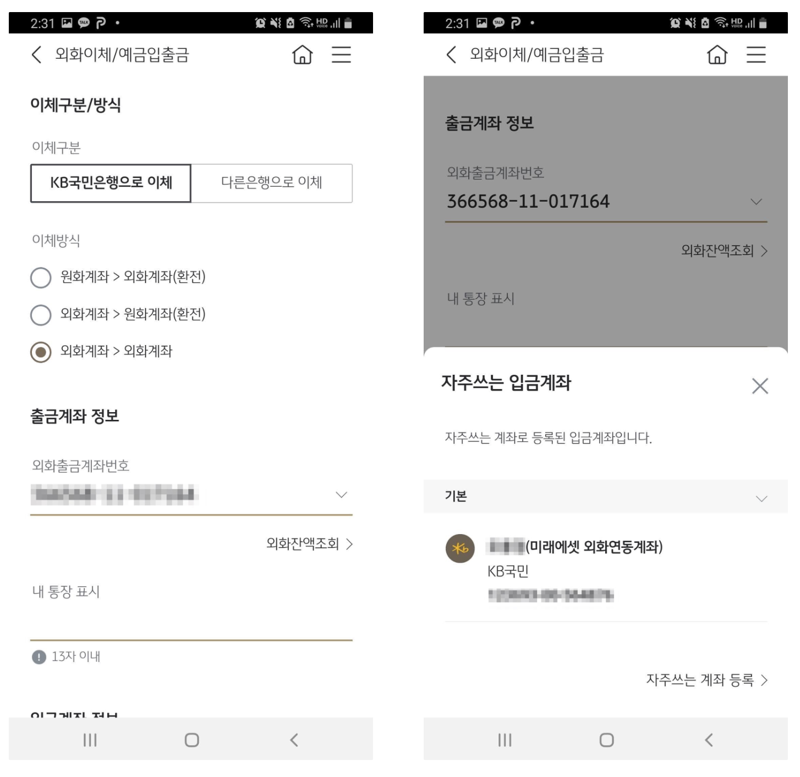
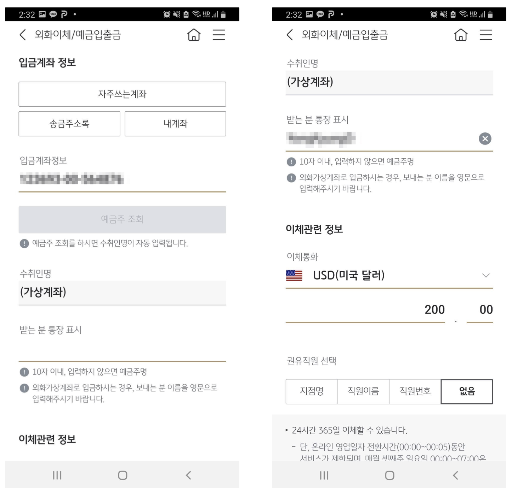
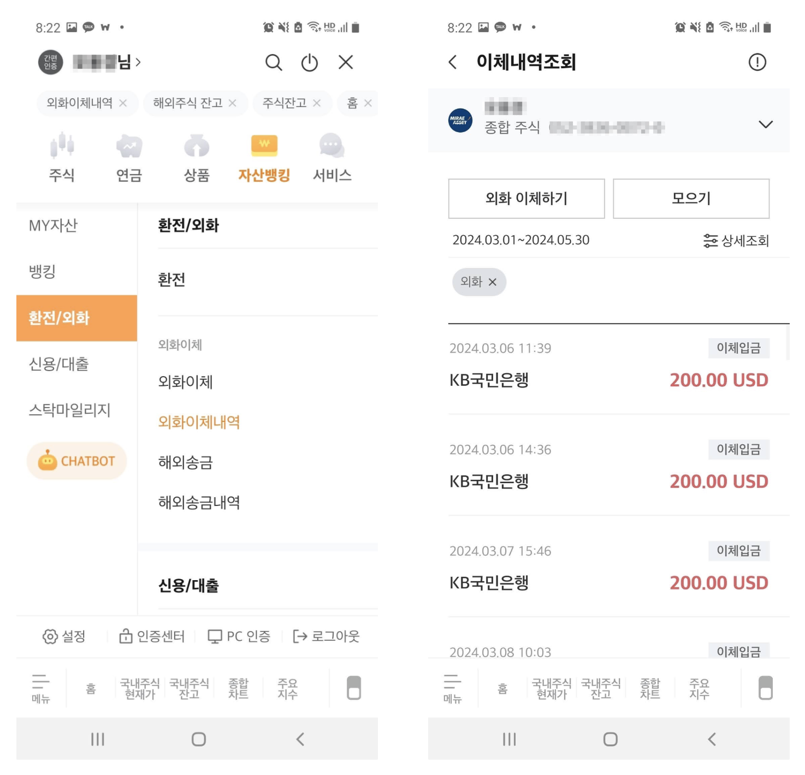

## 1. 개요

한국 증권사에서 미국 주식을 사려면, 일반적으로 먼저 달러를 가지고 있어야 한다. 달러를 사려면, 은행이나 증권사에서 달러를 사서 미국 주식을 사면 된다.

- 은행 달러 환전 → 증권사로 이체 (수수료 발생할 수 있음) → 증권 계좌에서 미국 주식 매수
- (or) 증권사에서 달러 환전 → 증권 계좌에서 미국 주식 매수

### 1.1 환전 수수료, 환전 우대율

달러를 사고팔 때는 환전 수수료(환율 스프레드)가 붙게 된다. 은행, 증권사마다 환전 수수료를 할인해 주는 우대율이 조금씩 다르다. 용어 정리를 위해 환전 수수료와 우대율에 대해서 알아보자.

예.

- 매매기준율 : 1070.00원, 현찰 살 때 환율 : 1088.73원
- 환전수수료: 1% → 18.73원 (은행이 가져가는 수익)
- 환율 우대율: 90%
    - 환율 우대시 적용환율: 1086.85원
    - 18.73 x 0.9 = 16.857원 만큼의 수수료 할인을 받아 실제로 18.73원 대신 1.873원을 은행에서 가져간다

### 용어

- 환전 수수료
    - 은행 자체적으로 정한 매매 기준율과 외국환 중개소에서 계산한 매매 기준율의 차이로 은행이 고객들에게 달러를 사고팔면서 얻는 이익이다. 즉, 은행에서 가져가는 수익이다
- 환율 우대율
    - 은행이 원래 가지려 했던 환전 수수료를 90% 할인해 주고 10%만 가져가겠다는 의미이다

## 1.2 은행 vs 증권사 우대율

우리 입장에서는 최고로 우대율이 높은 곳을 선택해서 환전하는 게 좋다. 은행별로 환전 수수료는 [은행별 주요통화 인터넷환전 수수료 우대율 비교](https://exchange.kfb.or.kr/page/on_commission.php) 사이트에서 확인할 수 있고 개인마다 주거래 은행인지, 또 은행 앱을 사용해서 환전하는지에 따라서 우대율이 달라진다. 잘 고려하면 최대로 높은 수수료 우대율을 받을 수 있는 곳에서 환전하면 된다.

은행뿐만이 아니라 환전은 증권사에서도 가능하다. 은행 vs 증권사 중에서 환전 적율은 다음과 같다. 개인마다 은행, 증권사에서 얻을 수 있는 우대율이 다를 수 있으니 확인하고 환전할 필요가 있다.

- 미래에셋 증권: 1,384.60원
- 한국투자 증권: 1,372.47원
- 국민은행: 1,368.29원 ← 나의 경우에는 이게 제일 좋음
- 신한은행: 1,368.39원
- 우리은행: 1,370.40원

> (2024.5.25 업데이트)
> 모든 증권사, 은행에 대한 환전율을 확인하기 어려워서 제가 가지고 있는 계정 위주로 확인해 보았습니다.

적용 환율을 보면 증권사보다는 은행에서 달러 환전을 하는 게 좋고 저의 경우 국민은행에서 환전하는 게 제일 베스트 선택이다.

달러는 은행에서 증권사로 이체하는 경우에는 수수료가 붙을 수 있는데, 다행히 미래에셋에서는 연결된 은행 (ex. 하나, 국민은행 지원) 등록하면 수수료 없이 은행 → 증권사로 달러 이체가 가능하다.

그래서 저는 국민은행에서 달러 환전해서 미래에셋으로 이체해서 미국 주식을 사고 있다.

## 2. 국민은행에서 환전해서 미래에셋으로 달러 이체하기

국민은행에서 달러 환전해서 미래에셋에서 어떻게 달러를 이체할 수 있는지 알아보자.

### 2.1 미래에셋에서 은행계좌 연결하기

은행 계좌 등록은 여기를 참고해주세요. [[M-STOCK 이용가이드\] 외화연계계좌 등록](https://www.youtube.com/watch?v=d-jL4kAfklA)

- 검색: `외화연계계좌` > `외화연계계좌` 등록/해지 선택 > 미국 주식을 하는 계좌 선택 > 금융기관 선택 (ex. 국민은행) > 등록 버튼 클릭
- 등록후 외화연계계좌번호 확인 ← 은행에서 이 계좌로 이체할거라서 화면으로 챕쳐를 하던지 계좌번호를 적어두자

### 2.2 국민은행 → 미래에셋으로 이체하기

이제 국민 은행에서 어떻게 미래에셋으로 달러를 이체할 수 있는지 알아보자. 큰 틀에서 보면 아래와 같은 절차로 이체를 하면 된다.

- 국민은행
    - 외화머니박스에 달러 환전
    - 외화머니박스 → 외화통장으로 이체하기
    - 외화이체로 국민은행 → 미래에셋 가상계좌로 이체를 하면 된다
- 미래에셋 주식 계좌에서 예수금 확인하면 된다

#### 2.2.1 외화머니박스로 달러 환전하기

- 메뉴에서 `외환`  > `환전` > `환전신청` 클릭하고 `외화머니박스에 입금하기` 를 선택한다
- 환전하려는 달러를 입력하고 `환전예상금액 확인` 버튼을 클릭해서 환전예상 금액을 확인하고 `다음` 버튼을 클릭한다

#### 2.2.2 외화통장으로 이체하기

환전 신청이 완료되면 거래내역조회에서 `수령 대기` 중인 달러를 확인할 수 있다. `외화예금입금` 버튼을 클릭해서 예금계좌로 입금을 한다.

#### 2.2.3 외화계좌 (국민은행)  → 외화계좌 (미래에셋)으로 이체하기

마지막 단계로 메뉴에서 `외환` > `국내외화이체/예금입출금` > `외화이체/예금입출금` 선택해서 미래에셋 증권사로 달러를 보내보자.

이체구분에서 `KB국민은행 이체`로 선택하고 이체방식은 `외화계좌 > 외화계좌` 선택한다

입금계좌 정보에서 `자주 쓰는 계좌` 클릭해서 미래에셋 연동한 가상계좌를 등록 후 등록한 계좌를 선택한다.

`받는 분 통장 표시`에는 영문으로 이름을 입력, 이체할 달러도 입력하고 이체 완료 메시지가 나 올때까지 다음 버튼을 클릭한다.

### 2.3 미래에셋에서 이체한 달러금액 확인하기

MTS 메뉴에서 `자산뱅킹` > `환전/외화` > `외화이체내역`을 클릭하면 이체한 금액을 확인할 수 있다.

## 3. 마무리

여행 갈 때만 달러로 환전을 해봤는데, 미국 주식을 시작하면서 환전 달인?이 되어가는 듯하다. 딱 한 번만 환전 방식을 구축해 두면 미국 주식도 쉽게 쉽게 매매할 수가 있다. 달러 환전한 것도 증권사에서 높은 이자율을 가진 RP나 채권으로도 예금처럼 돈을 굴릴 수도 있다. 이건 다음 시간에 알아보자.

## 참고

- [100% 환전수수료 우대 받는 방법 알아보기](https://post.naver.com/viewer/postView.naver?memberNo=27889218&volumeNo=35988356)
- [증권사 환전 수수료 비교](https://simpleinvest.co.kr/증권사-환전수수료-비교/)
- [은행에 있는 달러, 증권계좌로 이체하기](https://blog.naver.com/how2invest/221859904929)
- [환전할 때 100% 환율우대가 무슨 뜻인가요?](https://www.tossbank.com/articles/exchange-rate)
