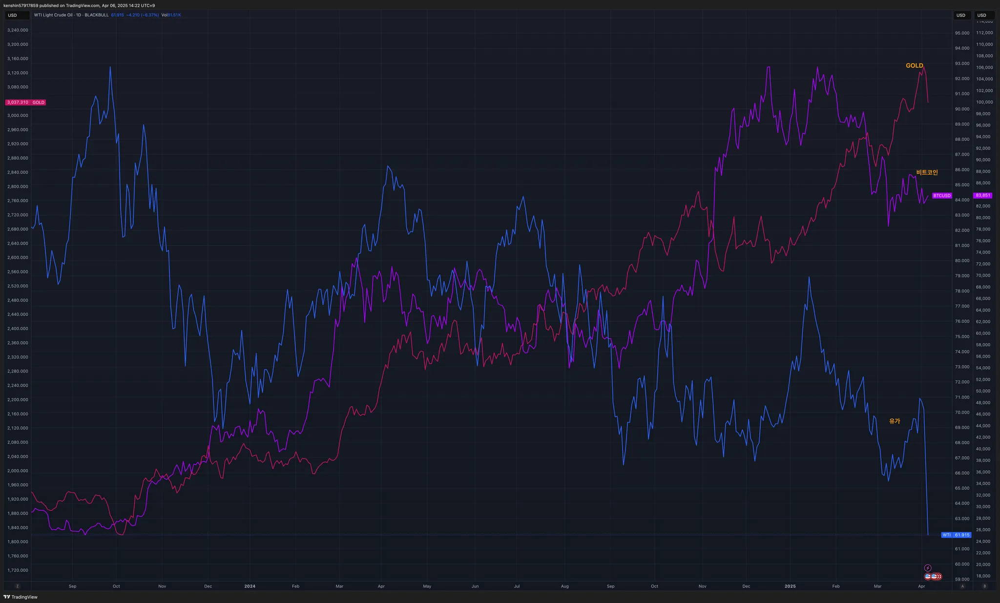

## 섹터별 수익률

> ETF 수익률을 기준으로 섹터별 수익률을 정렬하고 시간이 지남에 따라 현재 시장에서 주목받는 섹터가 무엇인지 파악하기 위해 아래와 같이 수익률을 정리해보았다.
>
> 단순히 수익률 기준으로 정렬을 하고 있어서 해당 섹터가 시장에서 가장 주목 받고 있다고 단정하기는 어렵지만, 투자하는 데 참고 지표로 사용하면 될 것 같다.

## 1. 국내 ETF

### 섹터별 ETF 종목

| **섹터** | **종목**               | **섹터**      | **종목**              |
| ---------- | ---------------------- | ----------------- | ---------------------- |
| 🔫방산      | PLUS K방산             | ☕️필수소비재       | KODEX 필수소비재       |
| ☢️원자력    | HANARO 원자력iSelect   | 🎮게임             | KBSTAR 게임테마        |
| ⚱️금        | ACE KRX금현물          | 🏠리츠부동산인프라 | TIGER 리츠부동산인프라 |
| 🏥헬스케어  | TIGER 헬스케어         | 💾소프트웨어       | TIGER 소프트웨어       |
| 🚢조선      | HANARO Fn조선해운      | 🍕K-푸드           | HANARO Fn K-푸드       |
| 🤖로봇      | KODEX K-로봇액티브     | ✈️여행             | TIGER 여행레저         |
| 👩‍🎤엔터주   | HANARO Fn K-POP&미디어 | 🇨🇳중국소비테마    | TIGER 중국소비테마     |
| ➗고배당주  | PLUS 고배당주          | 🚘자동차           | KODEX 자동차           |
| 💵은행      | KODEX 은행             | 반도체            | KODEX 반도체           |
| 🚧건설      | TIGER 200 건설         | 💄화장품           | TIGER 화장품           |
| 🧬바이오    | KODEX 바이오           | 🎭웹툰&드라마      | KODEX Fn웹툰&드라마    |
| 🪫2차전지   | TIGER 2차전지테마      | 🤖AI 반도체        | TIGER AI반도체핵심공정 |
|            |                        | 🧪화학             | KODEX 에너지화학       |

## 2. 미국 ETF

### 섹터별 ETF

| 섹터         | **티커** | **섹터**      | **티커** |
| ------------ | -------- | ------------- | -------- |
| 🤖로봇        | BOTZ     | 핀테크        | FINX     |
| 🌧️클라우드    | CLOU     | 소비순환재    | XLY      |
| 🏥헬스케어    | XLV      | 🧬바이오섹터   | IBB      |
| ⚱️금          | GLD      | ⌹SCHD         | SCHD     |
| 🏭산업재      | XLI      | 🏦금융         | XLF      |
| ⚡️에너지      | XLE      | S&P500        | VOO      |
| 러셀2000     | IWM      | ☕️경기방어주   | XLP      |
| 🔌구리        | COPX     | 🔐사이버 보안  | CIBR     |
| 🌉미국 인프라 | PAVE     | ☕️소재         | XLB      |
| 🏠리츠        | XLRE     | 반도체        | SOXX     |
| 🛢️WTI유       | CL       | 🖥️정보기술     | XLK      |
| 🛠️유틸리티    | XLU      | 나스닥100     | QQQ      |
| 📄장기채      | TLT      | ☎커뮤니케이션 | XLC      |
| ➗배당        | DIA      | 🪫2차전지      | LIT      |

## 3. 주요 지표

### 3.1 환율, 채권, VIX

- 미국 상호관세 우려 불안감으로 공포지수도 최근 최고치를 경신하고 있다
  - 공포일 때 지금은 기회이라서 매수를 하고 있지만, 언제까지 계속 이어질지는 모르기 때문에 현금 보유율을 잘 관리하면서 매수할 필요가 있다

### 3.2 S&P500, US10, WTI유가

- 금요일이후 S&P500 급락이 더 심해진 상태이다

### 3.3 BTC, GOLD, WTI

- S&P500 급락으로 안전자산인 금은 계속 오르는 추세로 전환되었다

## 4. 주요 트렌드 정리

### 주요 일정 (4/7 ~ 4/11)

|      | 월                                 | 화          | 수                                                           | 목                                                           | 금                                          |
| ---- | ---------------------------------- | ----------- | ------------------------------------------------------------ | ------------------------------------------------------------ | ------------------------------------------- |
| 일정 | 🇺🇸 관세 시행 관련 트럼프 정부 대응 |             | 🇺🇸 FOMC 의사록 공개 🇺🇸 미국채 10년물 입찰 🇺🇸 미국 국가별 상호관세 부과 🇺🇸 아마존 인터넷위성 발사 🇺🇸 구글 클라우드넥스트(~11) | 🇺🇸 소비자물가지수 CPI 🇺🇸 신규 실업수당 청구건수 🇨🇳 미국에 34% 관세 추가 | 🇺🇸 생상자물가지수 PPI 🇺🇸 소비자심리지수 |
| 실적 | 🇰🇷 LG전자                          | 🇰🇷 삼성전자 |                                                              | 🇺🇸 TSMC                                                      | 🇺🇸 JPM 🇺🇸 WFC 🇺🇸 MS 🇺🇸 BLK      |

지난주

- 🇰🇷 한덕수 상법개정안 거부권 행사
- 🇰🇷 윤대통령 현재 판결 - 파면
  - 대통령 탄핵선고로 정치적 불확실성 해소에도 상호관세 우려 불안감 가중으로 외인 1.8조 매도
- 🇨🇳 중국 보복 10일부터 미국에 34% 추가 관세 부과 통보
- 🇺🇸 금요일 트럼프 관세정책에 시장 대혼란
  - 파월 매파 스탠스에 미장 폭락

이번주

- 🇰🇷 미국 상호관세 우려에 하락 예상

## 5. 참고

- [증시일정](https://securities.miraeasset.com/hkr/hkr1003/n13.do)
- [한국 결제캘린더](https://kr.investing.com/economic-calendar/)
- [기화가거 주간일정 정리](https://contents.premium.naver.com/vrally/vrally55/contents/250406231637979tc)
- [수익의 신 채널 주간 정리](https://contents.premium.naver.com/season/god/contents/250405164338801fh)
