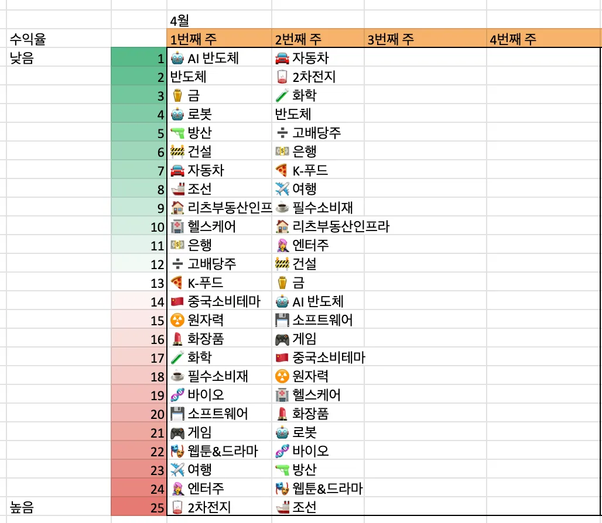
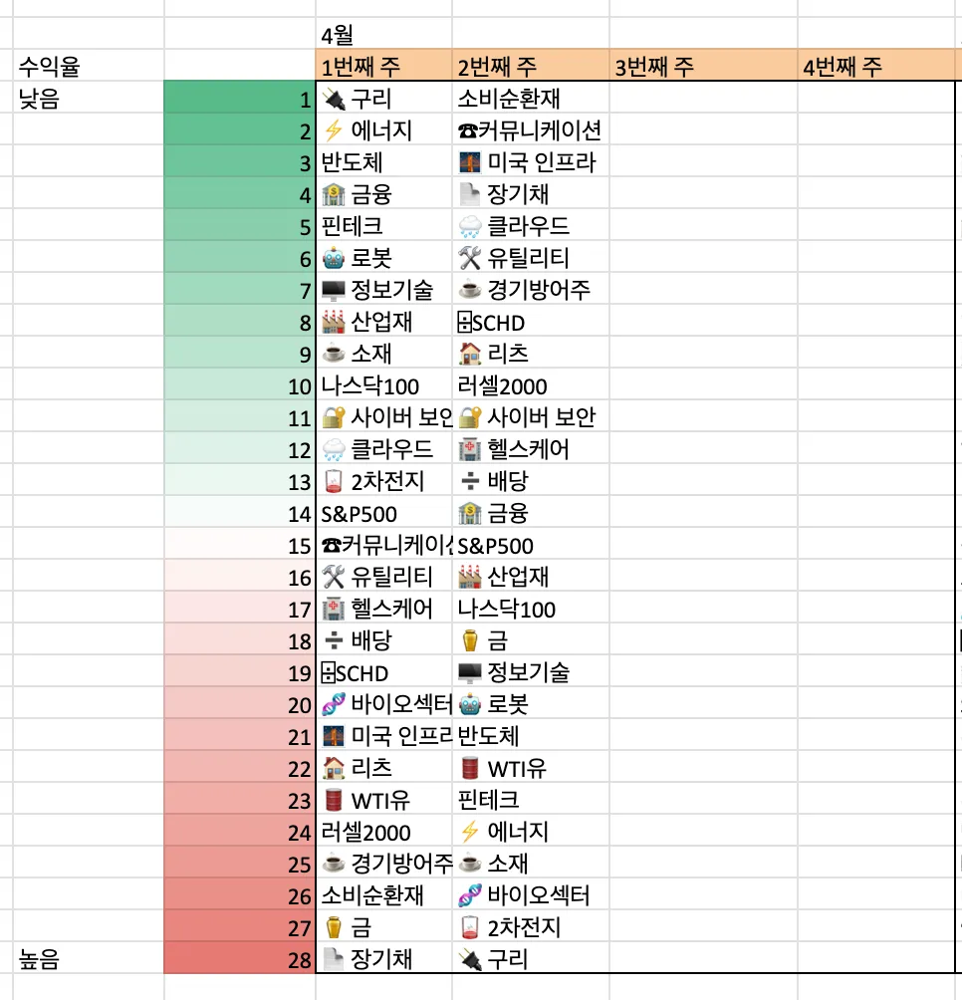
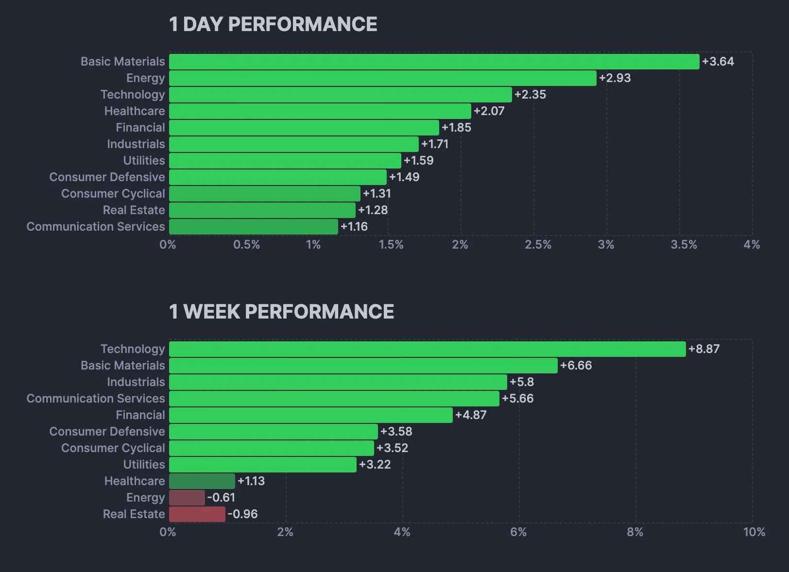
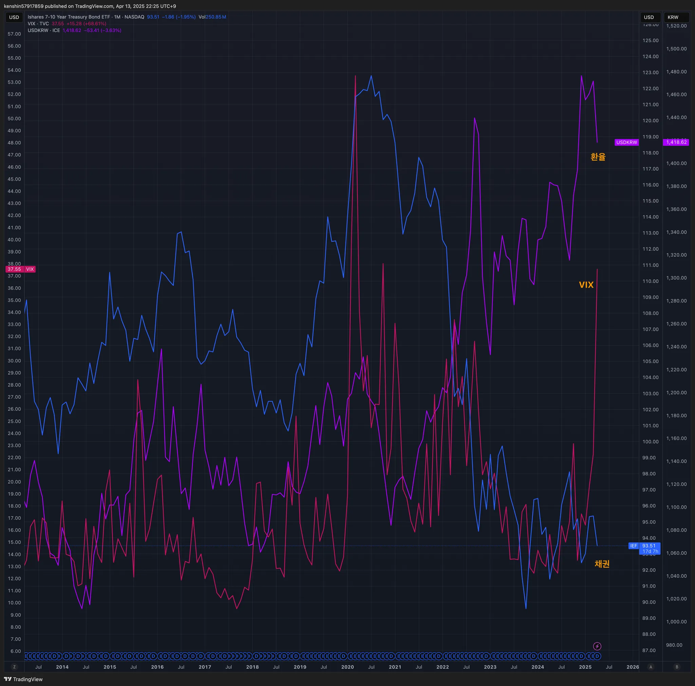
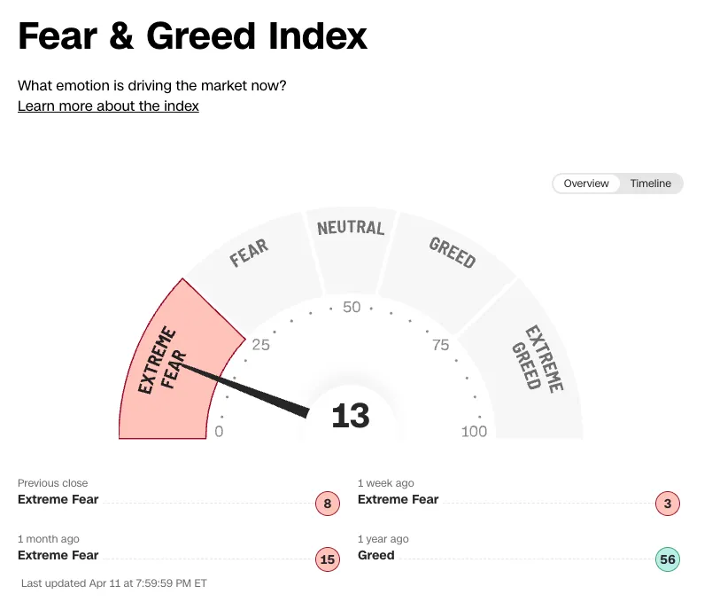
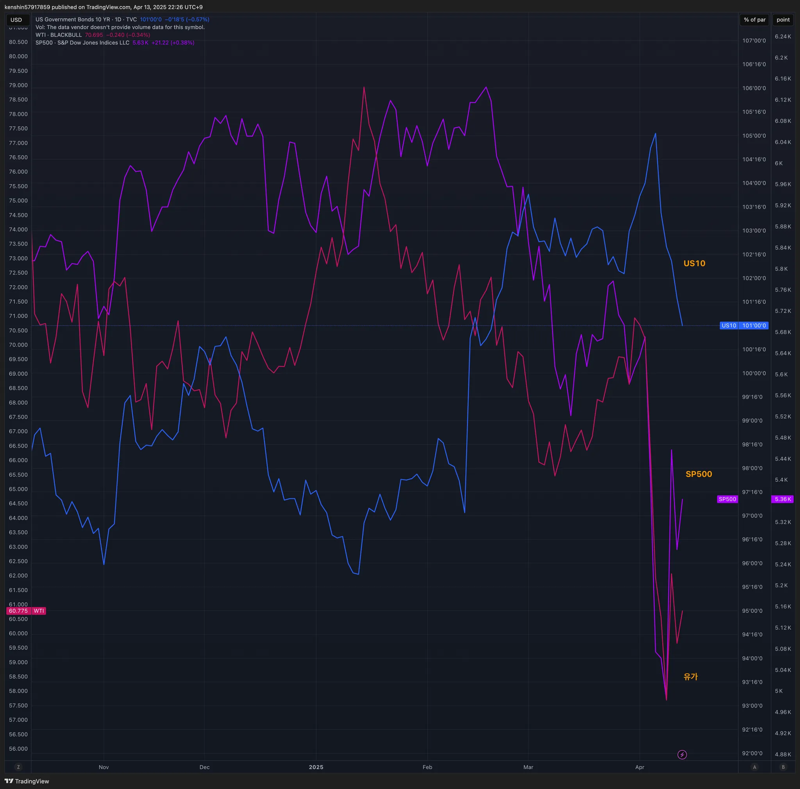
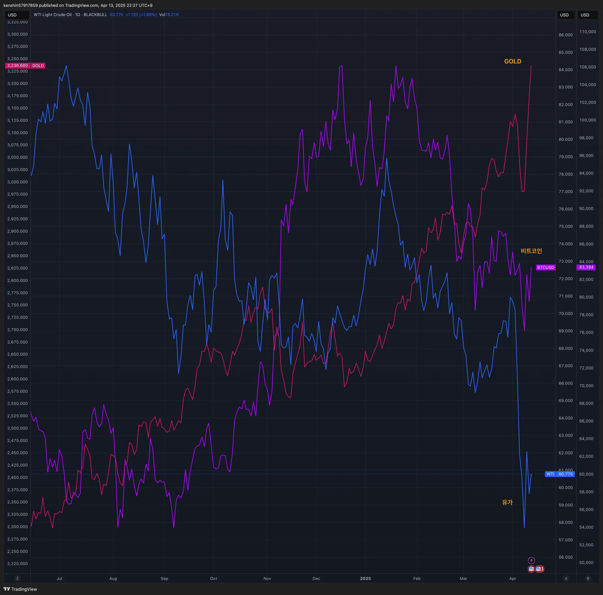

## 섹터별 수익률

> ETF 수익률을 기준으로 섹터별 수익률을 정렬하고 시간이 지남에 따라 현재 시장에서 주목받는 섹터가 무엇인지 파악하기 위해 아래와 같이 수익률을 정리해보았다.
>
> 단순히 수익률 기준으로 정렬을 하고 있어서 해당 섹터가 시장에서 가장 주목 받고 있다고 단정하기는 어렵지만, 투자하는 데 참고 지표로 사용하면 될 것 같다.

## 1. 국내 ETF

### 섹터별 ETF 종목

| **섹터** | **종목**               | **섹터**      | **종목**              |
| ---------- | ---------------------- | ----------------- | ---------------------- |
| 🔫방산      | PLUS K방산             | ☕️필수소비재       | KODEX 필수소비재       |
| ☢️원자력    | HANARO 원자력iSelect   | 🎮게임             | KBSTAR 게임테마        |
| ⚱️금        | ACE KRX금현물          | 🏠리츠부동산인프라 | TIGER 리츠부동산인프라 |
| 🏥헬스케어  | TIGER 헬스케어         | 💾소프트웨어       | TIGER 소프트웨어       |
| 🚢조선      | HANARO Fn조선해운      | 🍕K-푸드           | HANARO Fn K-푸드       |
| 🤖로봇      | KODEX K-로봇액티브     | ✈️여행             | TIGER 여행레저         |
| 👩‍🎤엔터주   | HANARO Fn K-POP&미디어 | 🇨🇳중국소비테마    | TIGER 중국소비테마     |
| ➗고배당주  | PLUS 고배당주          | 🚘자동차           | KODEX 자동차           |
| 💵은행      | KODEX 은행             | 반도체            | KODEX 반도체           |
| 🚧건설      | TIGER 200 건설         | 💄화장품           | TIGER 화장품           |
| 🧬바이오    | KODEX 바이오           | 🎭웹툰&드라마      | KODEX Fn웹툰&드라마    |
| 🪫2차전지   | TIGER 2차전지테마      | 🤖AI 반도체        | TIGER AI반도체핵심공정 |
|            |                        | 🧪화학             | KODEX 에너지화학       |

## 2. 미국 ETF

### 섹터별 ETF

| 섹터         | **티커** | **섹터**      | **티커** |
| ------------ | -------- | ------------- | -------- |
| 🤖로봇        | BOTZ     | 핀테크        | FINX     |
| 🌧️클라우드    | CLOU     | 소비순환재    | XLY      |
| 🏥헬스케어    | XLV      | 🧬바이오섹터   | IBB      |
| ⚱️금          | GLD      | ⌹SCHD         | SCHD     |
| 🏭산업재      | XLI      | 🏦금융         | XLF      |
| ⚡️에너지      | XLE      | S&P500        | VOO      |
| 러셀2000     | IWM      | ☕️경기방어주   | XLP      |
| 🔌구리        | COPX     | 🔐사이버 보안  | CIBR     |
| 🌉미국 인프라 | PAVE     | ☕️소재         | XLB      |
| 🏠리츠        | XLRE     | 반도체        | SOXX     |
| 🛢️WTI유       | CL       | 🖥️정보기술     | XLK      |
| 🛠️유틸리티    | XLU      | 나스닥100     | QQQ      |
| 📄장기채      | TLT      | ☎커뮤니케이션 | XLC      |
| ➗배당        | DIA      | 🪫2차전지      | LIT      |

## 3. 주요 지표

### 3.1 환율, 채권, VIX

- 이번 한주는 관세 부과 발표로 공포 지수가 최악으로 치솟다가 관세 유예로 조금 수그러든 상태이다
- 미국 관세전쟁의 여파로 달러화 가치도 많이 떨어지고 있는 상태이다

### 3.2 S&P500, US10, WTI유가

- S&P500 급락했다가 관세 유예로 다시 올라오고 있는 상태이다
  - 관세 이슈는 바로 해결이 안될 거라서 보수적으로 매매를 할 필요가 있다

### 3.3 BTC, GOLD, WTI

- 달러 가치는 많이 떨어진 반면, 골드는 최고치를 경신하고 있다
  - 달러가 떨어졌을 때 그래도 많이 달러로 환전을 해두는게 좋을 것 같다

- 비트코인은 다소 다시 회복하는 그림을 그리는 듯하다
- 반명 유가는 계속 하락을 하고 있는 추세이다
  - 이것도 관세전쟁으로 인하 여파로 무역전쟁이 지속되면 일반적으로 전 세계 경제 둔화를 초래하게 되고 에너지 수출에 대한 수요도 줄어둘 수 있다고 보고 있다

## 4. 주요 트렌드 정리

### 주요 일정 (4/14~ 4/18)

|      | 월    | 화                | 수                            | 목                                                           | 금      |
| ---- | ----- | ----------------- | ----------------------------- | ------------------------------------------------------------ | ------- |
| 일정 |       |                   | 🇺🇸 소매판매                   | 🇺🇸 신규 실업수당 청구건수 🇺🇸 파우엘 연설 🇰🇷 기준금리 |         |
| 실적 | 🇺🇸 GS | 🇺🇸 JNJ 🇺🇸 BAC | 🇺🇸 UNG 🇺🇸 AXP 🇳🇱 ASML | 🇹🇼 TSMC 🇰🇷 한미반도체                                    | 🇺🇸 NFLX |

### 저번주

  - 🇰🇷 4/7 코스피 매도 사이드카 발동
    - 도널드 트럼프 미국 행정부와 상호관계 부과 발표로 전세계 증시가 급락하는 가운데 코스피지수가 4% 급락하면서 이날 오전 호가 일시효력정지(사이드카)가 발동됐다
  - 🇰🇷 4/10 코스피 매수 사이드카 발동
    - 미국 도널드 트럼프 대통령 관세 유예 발표 영향등으로 4/10일 장초반 코스피200선물 지수가 6% 가까이 급등하면 매수 사이드카가 발동됐다
  - 🇨🇳 4/9 중국도 보복 관세 10일부터 모든 미국산 수입품 추가관세 34→84%
  - 🇺🇸 4/11 美 대중관세 145% 발표에…의류·콘텐츠·항공주 직격탄
  - 🇺🇸 4/12 '90일 유예'에 관세 리스크 완화
  - 🇺🇸 4/12 한발 또 물러선 트럼프, 휴대폰·컴퓨터·반도체 ‘상호관세’서 제외”

### 이번주

  - 🇰🇷 4/14(월) 전 윤 대통령 내란혐의 형사재판 시작
  - 🇨🇳 4/14 ~ 18일 시진핑 국가주석, 베트남, 말레이시아, 캄보디아 동남아 3국 방문
  - 🇰🇷 팔도, 라면 음료 가격 인상할 예정
  - 🇰🇷 갤럭시 S25엣지 출시

## 5. 참고

  - [증시일정](https://securities.miraeasset.com/hkr/hkr1003/n13.do)
  - [한국 결제캘린더](https://kr.investing.com/economic-calendar/)
  - [기화가거 주간일정 정리](https://contents.premium.naver.com/vrally/vrally55/contents/250406231637979tc)
  - [수익의 신 채널 주간 정리](https://contents.premium.naver.com/season/god/contents/250413145516046zd)
  - [가도넷 주간 정리](https://contents.premium.naver.com/0301/gadonet/contents/250413100155370rr)
