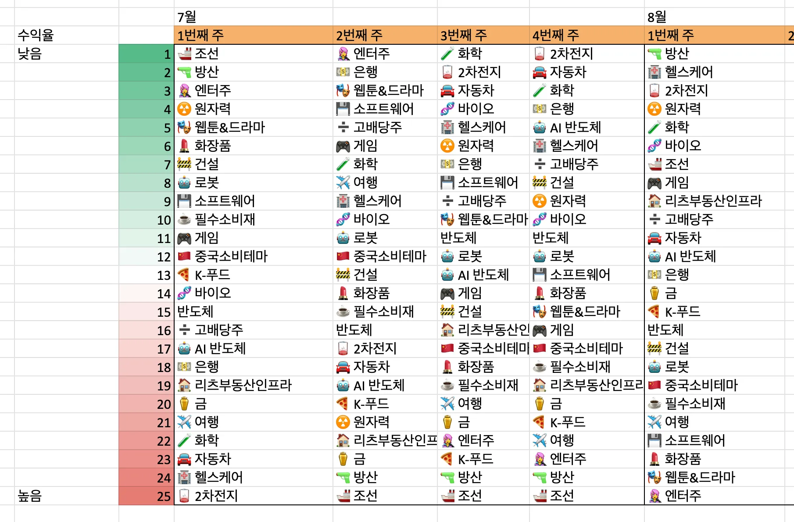
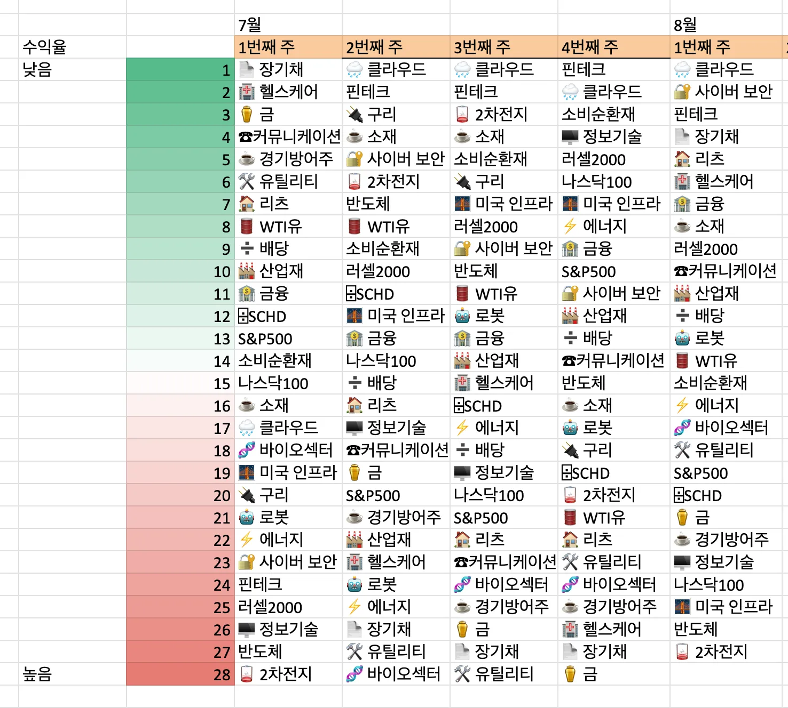
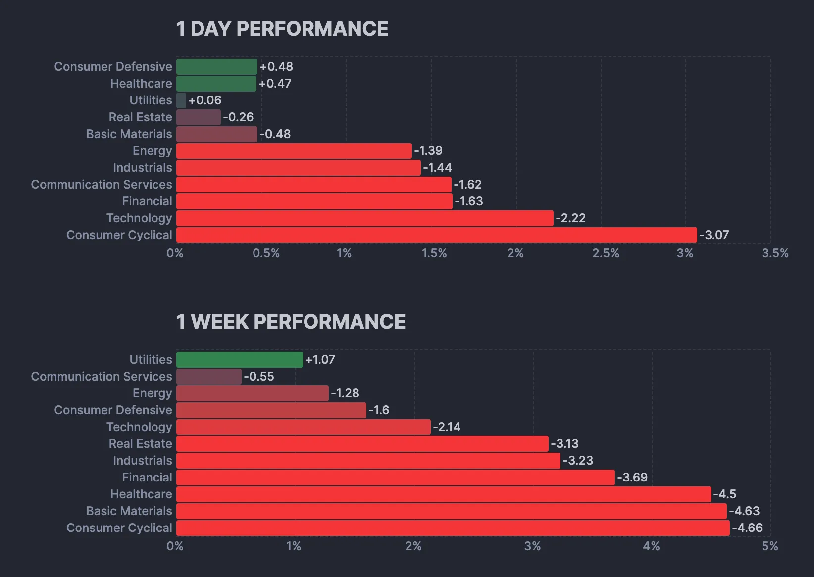
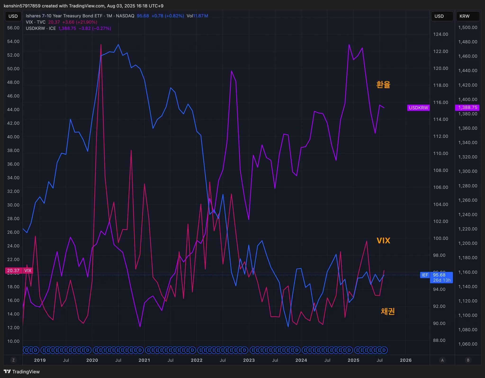
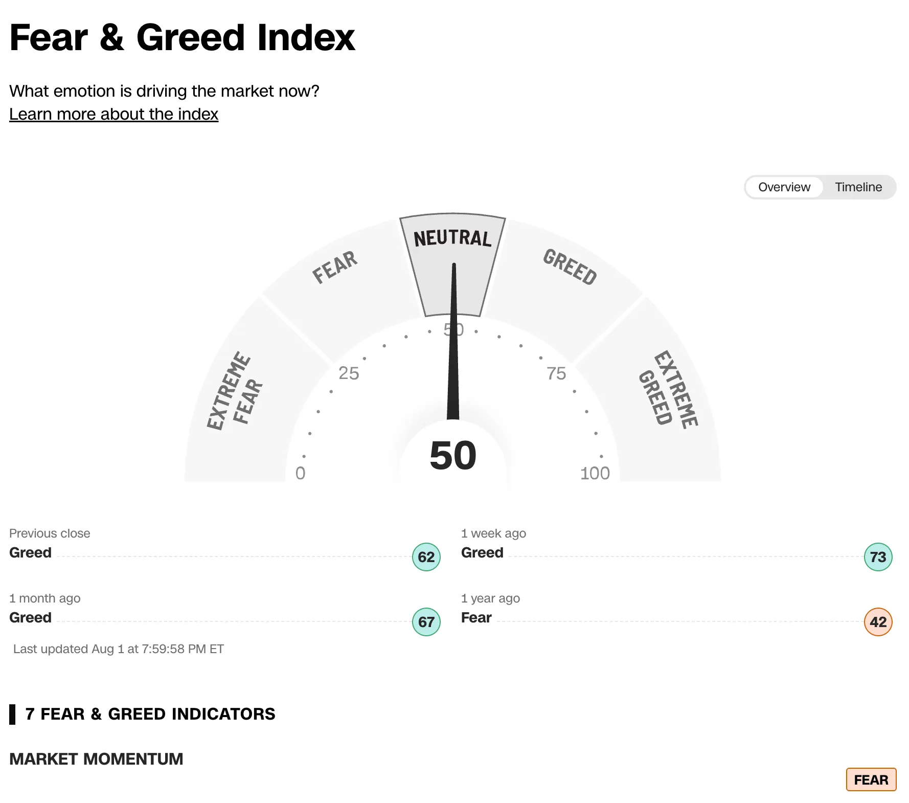
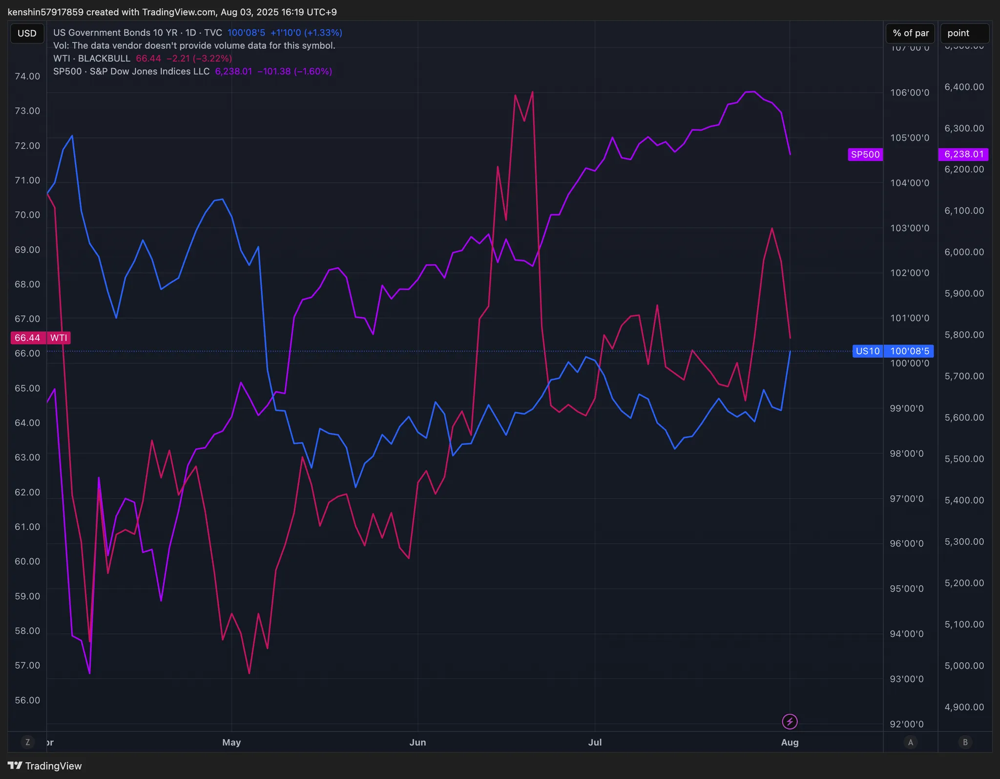
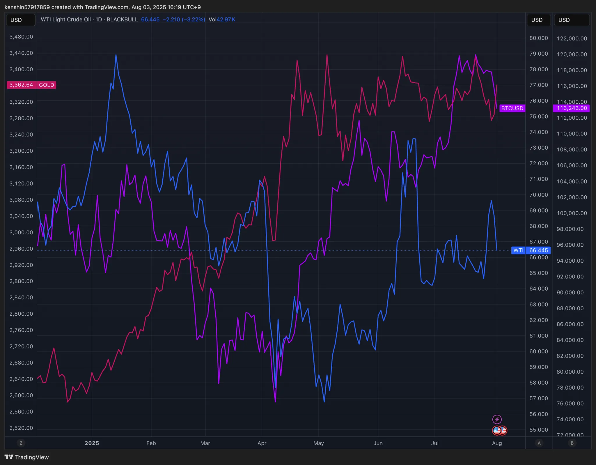

## 섹터별 수익률

> ETF 수익률을 기준으로 섹터별 수익률을 정렬하고 시간이 지남에 따라 현재 시장에서 주목받는 섹터가 무엇인지 파악하기 위해 아래와 같이 수익률을 정리해보았다.
>
> 단순히 수익률 기준으로 정렬을 하고 있어서 해당 섹터가 시장에서 가장 주목 받고 있다고 단정하기는 어렵지만, 투자하는 데 참고 지표로 사용하면 될 것 같다.

## 1. 국내 ETF

### 섹터별 ETF 종목

| **섹터** | **종목**               | **섹터**      | **종목**              |
| ---------- | ---------------------- | ----------------- | ---------------------- |
| 🔫방산      | PLUS K방산             | ☕️필수소비재       | KODEX 필수소비재       |
| ☢️원자력    | HANARO 원자력iSelect   | 🎮게임             | KBSTAR 게임테마        |
| ⚱️금        | ACE KRX금현물          | 🏠리츠부동산인프라 | TIGER 리츠부동산인프라 |
| 🏥헬스케어  | TIGER 헬스케어         | 💾소프트웨어       | TIGER 소프트웨어       |
| 🚢조선      | HANARO Fn조선해운      | 🍕K-푸드           | HANARO Fn K-푸드       |
| 🤖로봇      | KODEX K-로봇액티브     | ✈️여행             | TIGER 여행레저         |
| 👩‍🎤엔터주   | HANARO Fn K-POP&미디어 | 🇨🇳중국소비테마    | TIGER 중국소비테마     |
| ➗고배당주  | PLUS 고배당주          | 🚘자동차           | KODEX 자동차           |
| 💵은행      | KODEX 은행             | 반도체            | KODEX 반도체           |
| 🚧건설      | TIGER 200 건설         | 💄화장품           | TIGER 화장품           |
| 🧬바이오    | KODEX 바이오           | 🎭웹툰&드라마      | KODEX Fn웹툰&드라마    |
| 🪫2차전지   | TIGER 2차전지테마      | 🤖AI 반도체        | TIGER AI반도체핵심공정 |
|            |                        | 🧪화학             | KODEX 에너지화학       |

## 2. 미국 ETF

- 이번주는 거의 모든 섹터가 플러스로 전환하기 사직했다

### 섹터별 ETF

| 섹터         | **티커** | **섹터**      | **티커** |
| ------------ | -------- | ------------- | -------- |
| 🤖로봇        | BOTZ     | 핀테크        | FINX     |
| 🌧️클라우드    | CLOU     | 소비순환재    | XLY      |
| 🏥헬스케어    | XLV      | 🧬바이오섹터   | IBB      |
| ⚱️금          | GLD      | ⌹SCHD         | SCHD     |
| 🏭산업재      | XLI      | 🏦금융         | XLF      |
| ⚡️에너지      | XLE      | S&P500        | VOO      |
| 러셀2000     | IWM      | ☕️경기방어주   | XLP      |
| 🔌구리        | COPX     | 🔐사이버 보안  | CIBR     |
| 🌉미국 인프라 | PAVE     | ☕️소재         | XLB      |
| 🏠리츠        | XLRE     | 반도체        | SOXX     |
| 🛢️WTI유       | CL       | 🖥️정보기술     | XLK      |
| 🛠️유틸리티    | XLU      | 나스닥100     | QQQ      |
| 📄장기채      | TLT      | ☎커뮤니케이션 | XLC      |
| ➗배당        | DIA      | 🪫2차전지      | LIT      |

## 3. 주요 지표

### 3.1 환율, 채권, VIX

- 채권**·**환율: 원환율이 1400원까지 급등을 하였다
  - 트럼프 대통령이 향후 강경한 무역 정책 기조를 시사하면서 통상정책 관련 불확실성이 고조되어 달러 강세가 나타나면서 원화에도 약세 압력이 우위를 보인 것으로 본다

- VIX: 공포지수는 낮았지만, 최근 미 지표가 좋지 않으면서 공포지수가 조금 올라간 상태이다

### 3.2 S&P500, US10, WTI유가

- S&P 500: S&P500, 나스닥은 경이 우려, 차익실현 매물 동반으로 급락을 하였다

### 3.3 BTC, GOLD, WTI

- 금: 미국 경제지표 악화, 관세협상 등 불확실성으로 안전자산 선호심리가 커져 금값이 강세를 보였다
- 비트코인: 미국 내 암호화폐 ETF·법제도 통과 기대감이 함께 반영되며, 단기 조정 후 재차 강세 유지를 하고 있다

## 4. 주요 트렌드 정리

### 주요 일정 (8/4 ~ 8/8)

|      | 월   | 화                                                       | 수                                                           | 목                                                           | 금                                                           |
| ---- | ---- | -------------------------------------------------------- | ------------------------------------------------------------ | ------------------------------------------------------------ | ------------------------------------------------------------ |
| 일정 |      | 🇺🇸 ISM 서비스업 구매관리자지수                           |                                                              | 🇺🇸 신규 실업수당 청구건수                                    | 🇺🇸 실업률, 비농업 고용수 🇺🇸 첫 암호화폐 서밋 🇺🇸 파월 연설 🇨🇳 무역수지 |
| 실적 |      | 🇺🇸 PLTR 🇺🇸 PFE 🇰🇷 에코프로비엠 🇰🇷 카카오페이 | 🇺🇸 CPNG 🇺🇸 LCID 🇺🇸 RIVN 🇺🇸 AMD 🇺🇸 DIS 🇺🇸 MCD 🇺🇸 U 🇰🇷 에코프로 🇰🇷 카카오뱅크 | 🇺🇸 ABNB 🇺🇸 O 🇺🇸 IONQ 🇺🇸 JOBY 🇰🇷 카카오 🇰🇷 넷마블 | 🇺🇸 SOUN 🇰🇷 씨에스윈드                                    |

### 이번주

  - 🇰🇷 관세협상 타결…상호관세 15% 3500억 달러 대미 투자
- 🇰🇷 배당소득 분리과세 실망감에 지주·증권주 급락
- 🇰🇷 원 달러 환율 다시 1400원대로..
- 🇮🇳 트럼프 대통령 “인도에 25%의 관세와 벌칙을 부과하겠다”
  - 인도, 트럼프의 관세 위협에도 러 석유 구매 계속
  - 트럼프 “러시아 무기 사는 인도에 25% 관세”…인도 “최종 결론 아냐”
- 🇺🇸뉴욕증시, 고용·제조업·관세 ‘퍼퍽트스톰’에 급락
- 🇺🇸미 경기 우려 급부상, 약달러로 유턴에 무게
- 🇺🇸실적 실망, 코인베이스 주가 17% 폭락
  - 이는 최근 들어 암호화폐가 약세를 보이면서 코인베이스의 거래량이 크게 줄어듬

## 5. 참고

- [증시일정](https://securities.miraeasset.com/hkr/hkr1003/n13.do)
- [한국 결제캘린더](https://kr.investing.com/economic-calendar/)
- [주부엉의 주식레시피](https://contents.premium.naver.com/owlstock/owlrecipe/contents/250427192358200fr)
- [YH 시장분석소](https://yhw5285.tistory.com/457)
