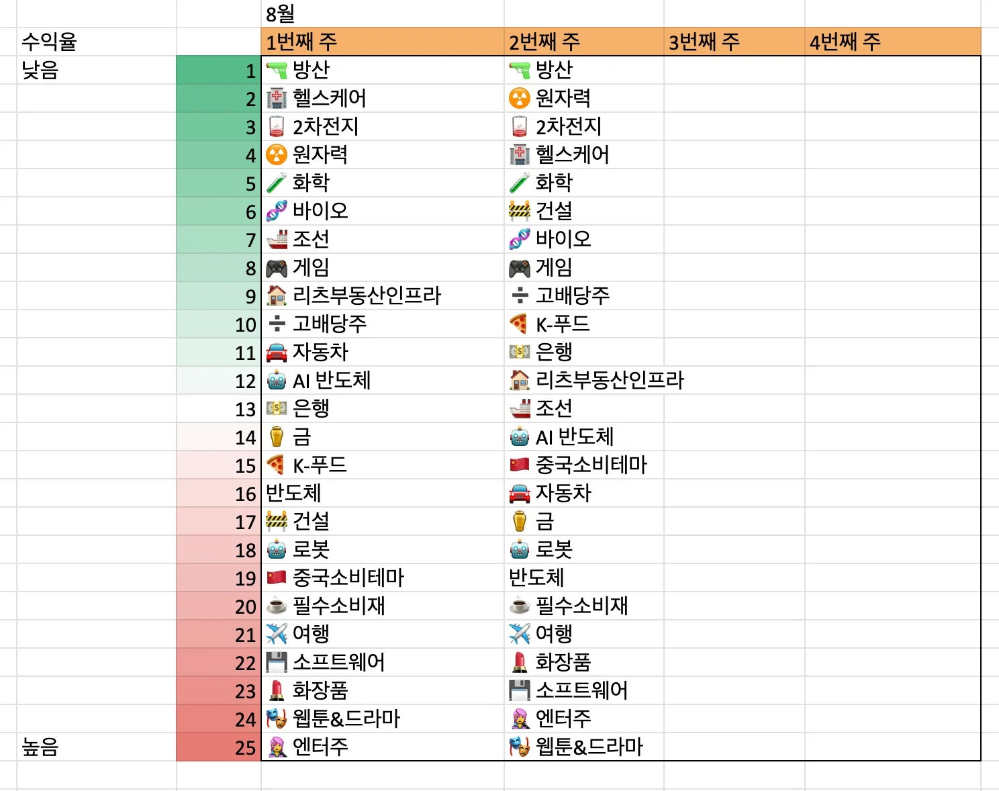
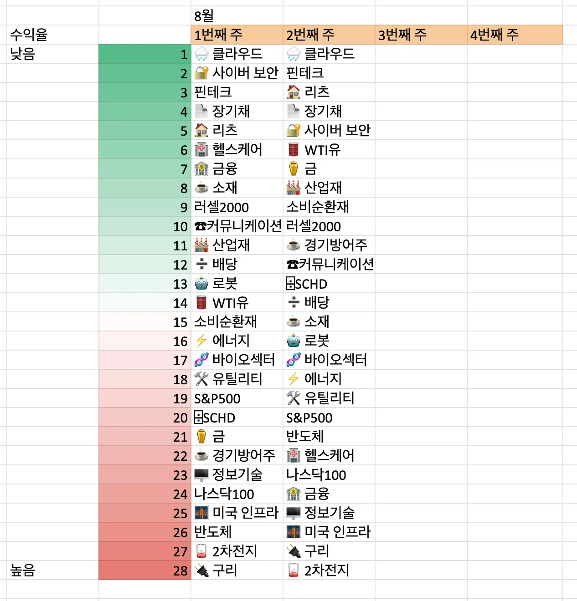
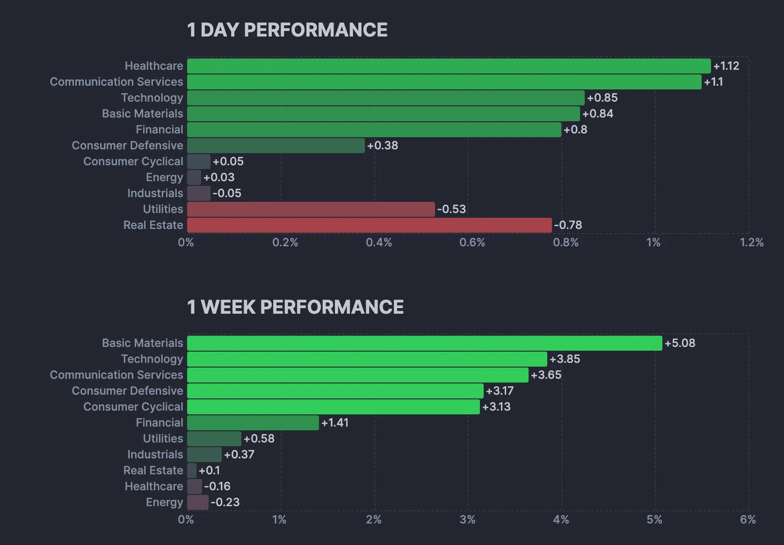
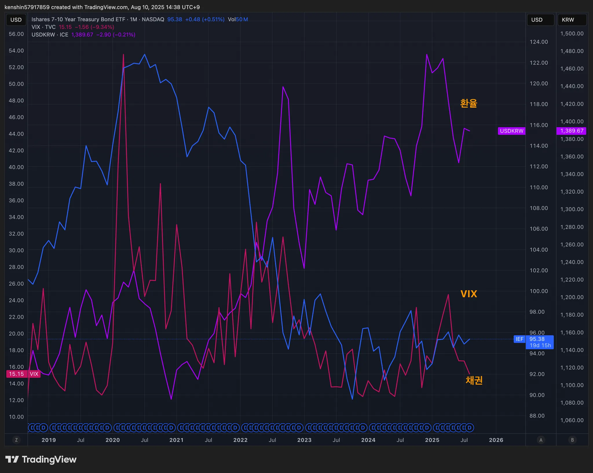
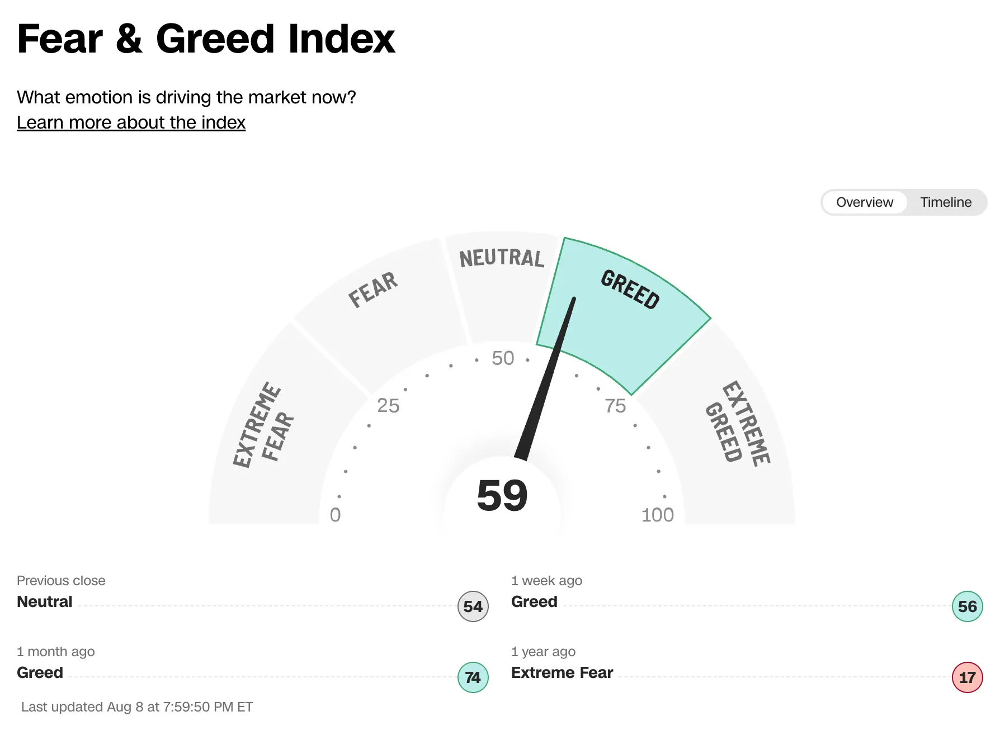
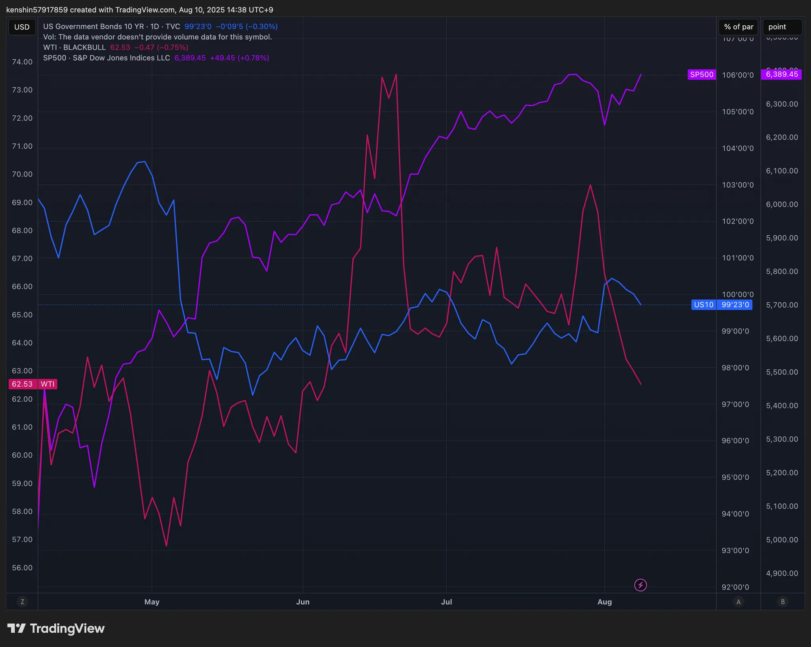
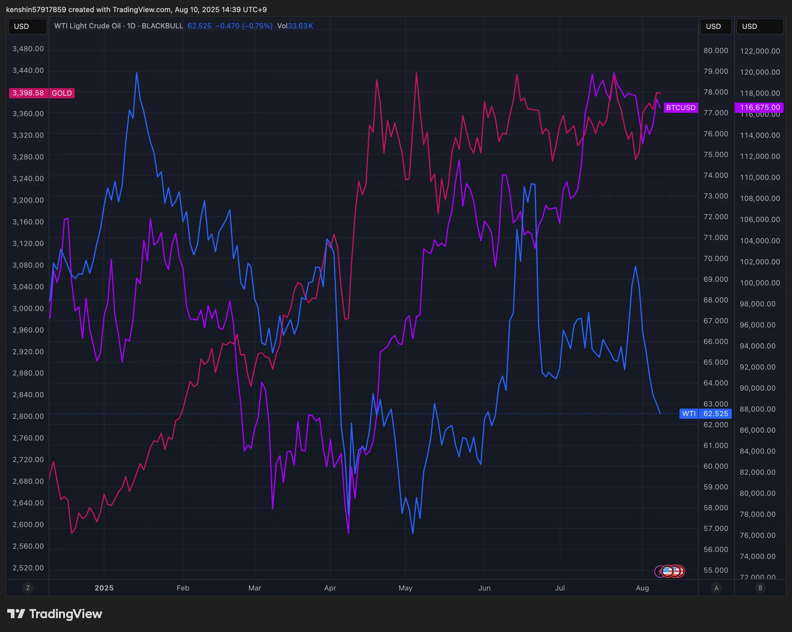

## 섹터별 수익률

> ETF 수익률을 기준으로 섹터별 수익률을 정렬하고 시간이 지남에 따라 현재 시장에서 주목받는 섹터가 무엇인지 파악하기 위해 아래와 같이 수익률을 정리해보았다.
>
> 단순히 수익률 기준으로 정렬을 하고 있어서 해당 섹터가 시장에서 가장 주목 받고 있다고 단정하기는 어렵지만, 투자하는 데 참고 지표로 사용하면 될 것 같다.

## 1. 국내 ETF

### 섹터별 ETF 종목

| **섹터** | **종목**               | **섹터**      | **종목**              |
| ---------- | ---------------------- | ----------------- | ---------------------- |
| 🔫방산      | PLUS K방산             | ☕️필수소비재       | KODEX 필수소비재       |
| ☢️원자력    | HANARO 원자력iSelect   | 🎮게임             | KBSTAR 게임테마        |
| ⚱️금        | ACE KRX금현물          | 🏠리츠부동산인프라 | TIGER 리츠부동산인프라 |
| 🏥헬스케어  | TIGER 헬스케어         | 💾소프트웨어       | TIGER 소프트웨어       |
| 🚢조선      | HANARO Fn조선해운      | 🍕K-푸드           | HANARO Fn K-푸드       |
| 🤖로봇      | KODEX K-로봇액티브     | ✈️여행             | TIGER 여행레저         |
| 👩‍🎤엔터주   | HANARO Fn K-POP&미디어 | 🇨🇳중국소비테마    | TIGER 중국소비테마     |
| ➗고배당주  | PLUS 고배당주          | 🚘자동차           | KODEX 자동차           |
| 💵은행      | KODEX 은행             | 반도체            | KODEX 반도체           |
| 🚧건설      | TIGER 200 건설         | 💄화장품           | TIGER 화장품           |
| 🧬바이오    | KODEX 바이오           | 🎭웹툰&드라마      | KODEX Fn웹툰&드라마    |
| 🪫2차전지   | TIGER 2차전지테마      | 🤖AI 반도체        | TIGER AI반도체핵심공정 |
|            |                        | 🧪화학             | KODEX 에너지화학       |

## 2. 미국 ETF

- 이번주는 거의 모든 섹터가 플러스로 전환하기 사직했다

### 섹터별 ETF

| 섹터         | **티커** | **섹터**      | **티커** |
| ------------ | -------- | ------------- | -------- |
| 🤖로봇        | BOTZ     | 핀테크        | FINX     |
| 🌧️클라우드    | CLOU     | 소비순환재    | XLY      |
| 🏥헬스케어    | XLV      | 🧬바이오섹터   | IBB      |
| ⚱️금          | GLD      | ⌹SCHD         | SCHD     |
| 🏭산업재      | XLI      | 🏦금융         | XLF      |
| ⚡️에너지      | XLE      | S&P500        | VOO      |
| 러셀2000     | IWM      | ☕️경기방어주   | XLP      |
| 🔌구리        | COPX     | 🔐사이버 보안  | CIBR     |
| 🌉미국 인프라 | PAVE     | ☕️소재         | XLB      |
| 🏠리츠        | XLRE     | 반도체        | SOXX     |
| 🛢️WTI유       | CL       | 🖥️정보기술     | XLK      |
| 🛠️유틸리티    | XLU      | 나스닥100     | QQQ      |
| 📄장기채      | TLT      | ☎커뮤니케이션 | XLC      |
| ➗배당        | DIA      | 🪫2차전지      | LIT      |

## 3. 주요 지표

### 3.1 환율, 채권, VIX

- 원달러 환율: 소폭 상승 (원화 약세), 주중 달러 강세 추세이다

- 채권: 금리 소폭 상승, 전체 트렌드는 약한 금리 상승 추세이다
- VIX: 큰 폭 하락으로 투자 심리 안정하로 Greed 인 상태이다

### 3.2 S&P500, US10, WTI유가

- S&P500: 지수는 좋은 추세를 이어가고 있다
- WTI: 원유는 약세 지속인 상태이다
  - 유가 관련해서 헤지용도로 ETF를 들고 있는 것도 괜찮지 않을 까 싶다

### 3.3 BTC, GOLD, WTI

- BTC: 소폭 등락한 상태이다
  - 비트코인은 대체로 안정적 우상향중이지만, 중장기 수요 반영 및 큰 뉴스는 없는 상태이다
  - 이더리움은 디파이 등 네트워크 가치 상승 기대와 랠리, 기술 업그레이드 이슈 등으로 인해 더 높은 상승률과 단기 변동성을 보인다
- GLD: 안전자산 수요와 더불어 사상 최고 수준까지 랠리중
  - 헤지용으로 GOLD는 꾸준히 분산투자를 위해서 담는게 베스트인 듯하다

## 4. 주요 트렌드 정리

### 주요 일정 (8/11 ~ 8/15)

|      | 월   | 화                                                   | 수   | 목                                                   | 금                                                  |
| ---- | ---- | ---------------------------------------------------- | ---- | ---------------------------------------------------- | --------------------------------------------------- |
| 일정 |      | 🇺🇸 소비자물가지수(CPI)                               |      | 🇺🇸 생산자물가지수(PPI) 🇺🇸 신규 실업수당 청구건수 | 🇰🇷 대체공휴일(광복절) 🇺🇸 소매판매 🇺🇸 소비자심리지수 |
| 실적 |      | 🇰🇷 CJ제일제당 🇰🇷 한국전력 🇺🇸 AMC 🇺🇸 BBAI |      | 🇰🇷 LG                                                | 🇺🇸 NU                                               |

- 🇰🇷[주간증시전망] 한 고비 넘겼지만… 트럼프發 변동성 주의보
  - 트럼프 대통령은 미국 밖에서 생산된 반도체에 100% 관세를 부과하겠다면서도, 미국에 반도체 제조 공장을 건설했거나, 건설 중인 기업이라면 예외로 두겠다는 취지로 발표했다
  - 반도체·의약품 세부 품목별 관세 내용이 공개될 예정으로 단기 변동성이 예상된다
- 🇰🇷엔터주 반등 신호?... 기관, 코스닥서 ‘줍줍’ 나섰다
- 🇺🇸美 백악관 가상화폐 자문위원회 사무국장 보 하인스 사임
- 🇺🇸리플, 스테이블코인 결제 기업 2억달러에 인수…RLUSD 강화 포석
- 🇺🇸트럼프 대통령이 퇴직연금(401K)으로 가상자산 투자를 허용하는 행정명령에 서명
- 🇺🇸'파월 압박' 트럼프, 차기 의장 후보 확대... 연준 위원들은 금리인하 압박
- 🇺🇸 나스닥 지수가 사상 최고치를 경신하는 등 뉴욕증시가 상승세
  - 애플은 6일 미국에 1000억 달러(약 140조원) 규모의 대규모 투자 계획을 발표하자 당일 5.09% 급등
  - 미국과 러시아가 우크라이나 전쟁 종식을 위한 휴전 합의에 접근하고 있다는 기대감도 투자심리를 지지했다
- 🇺🇸[국제유가]트럼프-푸틴 정상회담 기다리며 관망...1주일 동안 5% 안팎 급락

## 5. 참고

- [증시일정](https://securities.miraeasset.com/hkr/hkr1003/n13.do)
- [한국 결제캘린더](https://kr.investing.com/economic-calendar/)
- [주부엉의 주식레시피](https://contents.premium.naver.com/owlstock/owlrecipe/contents/250427192358200fr)
- [YH 시장분석소](https://yhw5285.tistory.com/457)
