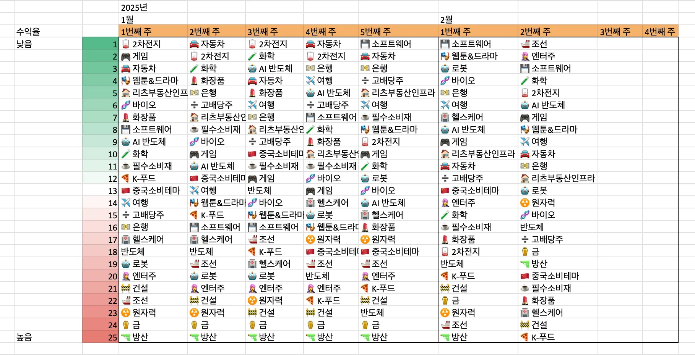
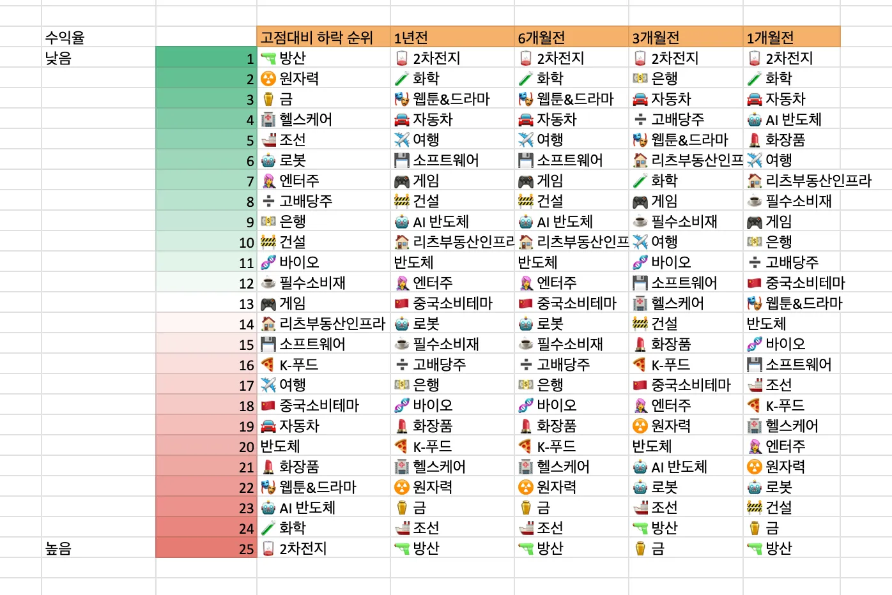
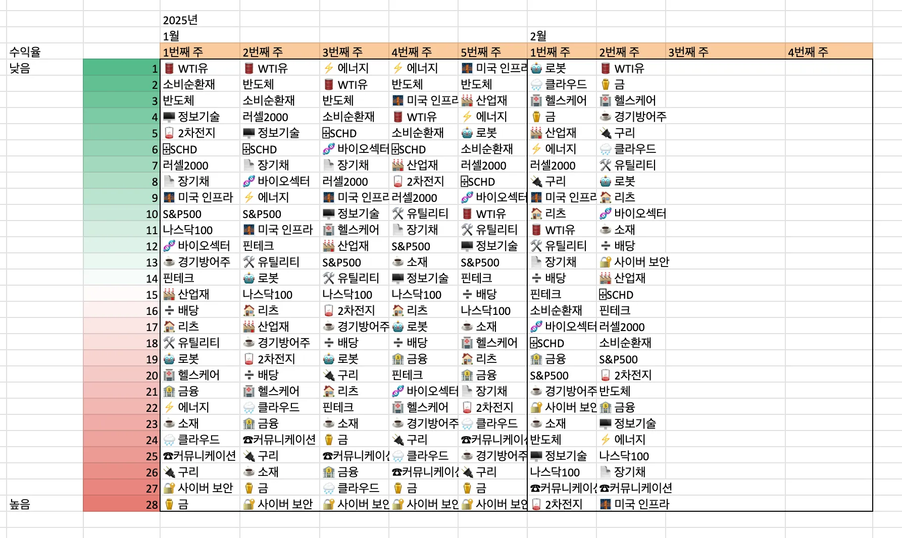
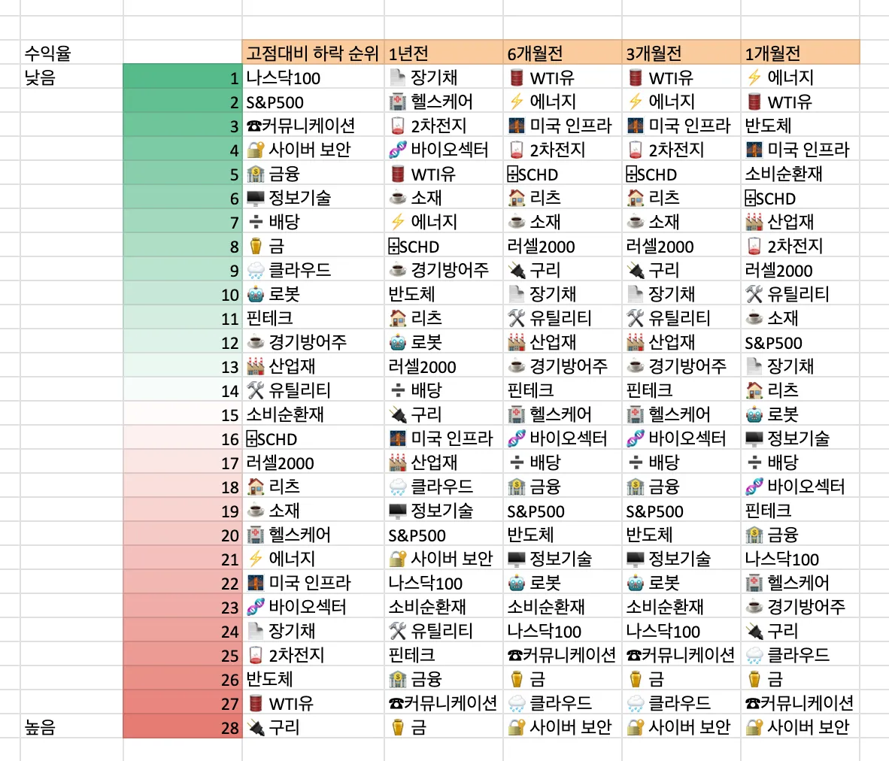
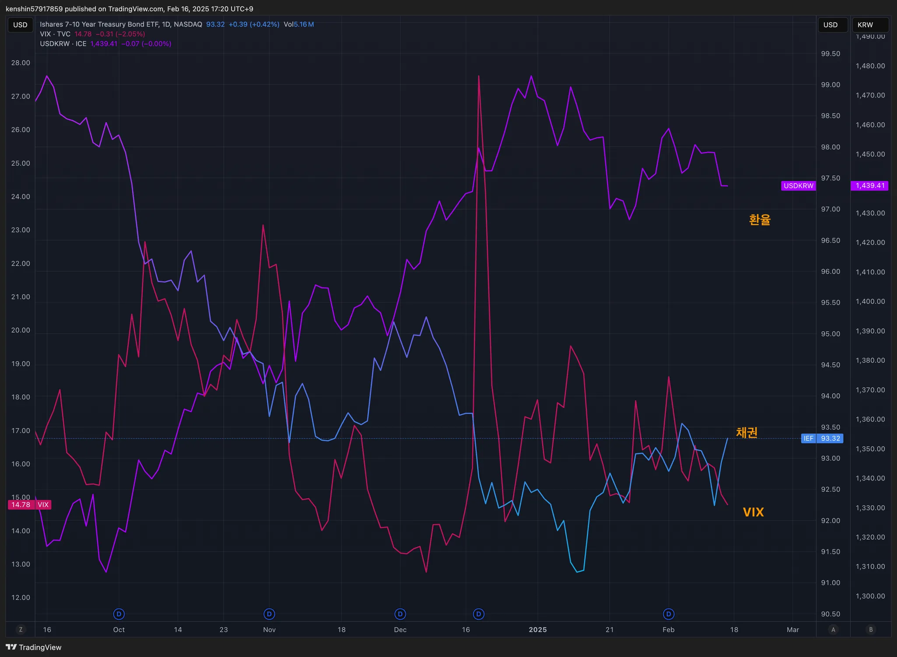
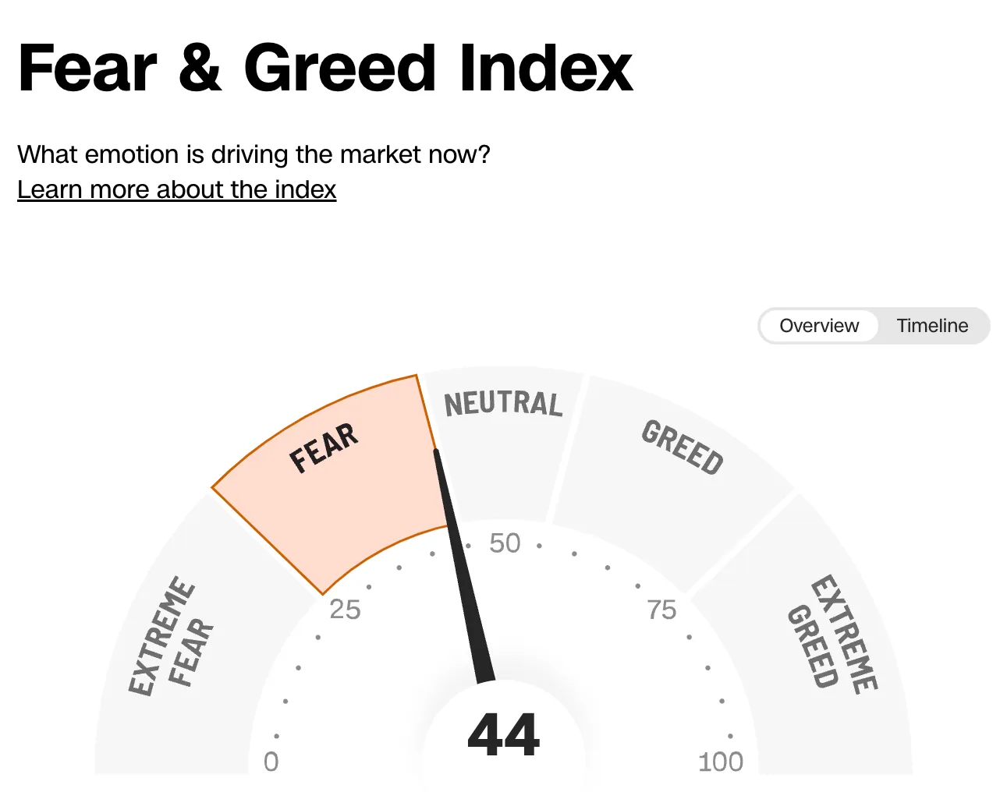
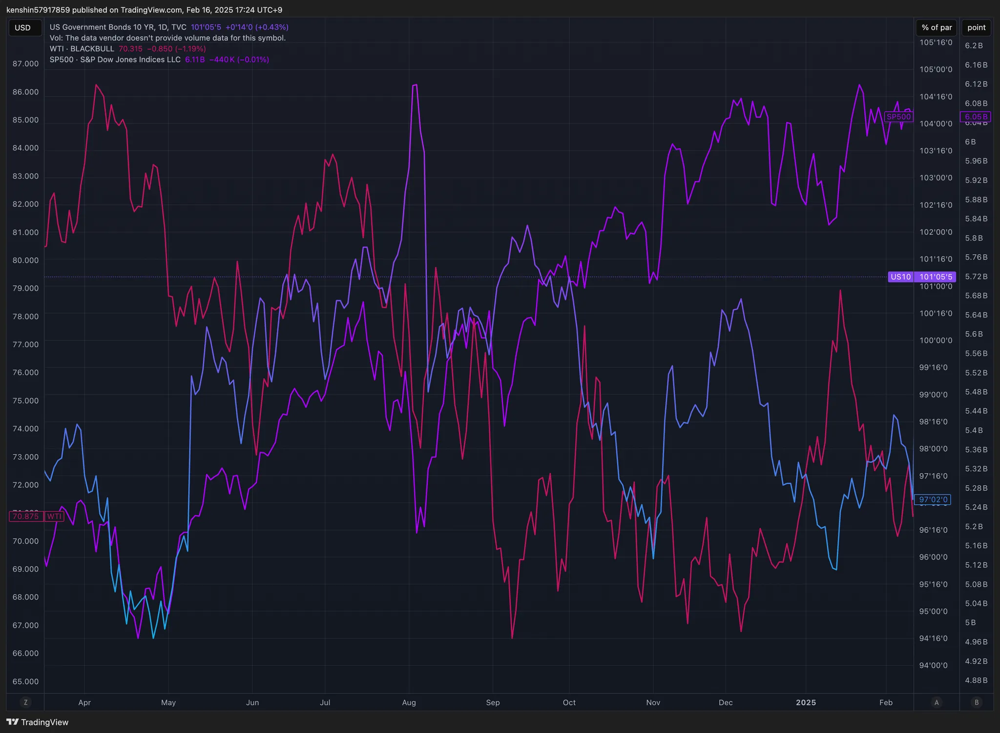
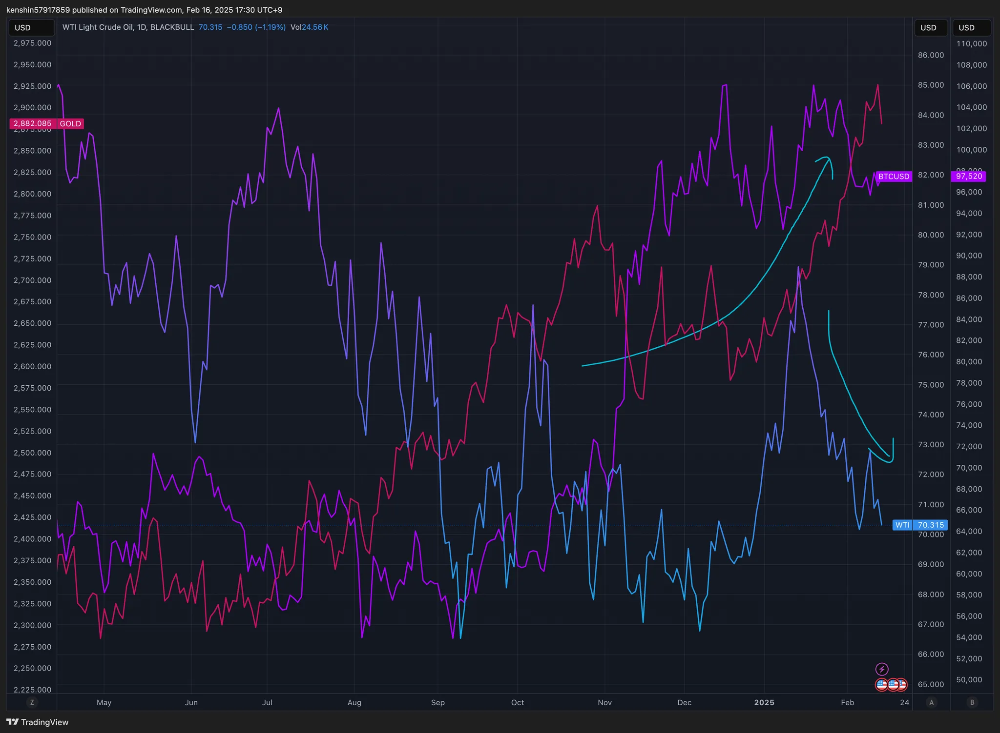

## 섹터별 수익률

> ETF 수익률을 기준으로 섹터별 수익률을 정렬하고 시간이 지남에 따라 현재 시장에서 주목받는 섹터가 무엇인지 파악하기 위해 아래와 같이 수익률을 정리해보았다.
>
> 단순히 수익률 기준으로 정렬을 하고 있어서 해당 섹터가 시장에서 가장 주목 받고 있다고 단정하기는 어렵지만, 투자하는 데 참고 지표로 사용하면 될 것 같다.

## 1. 국내 ETF

### 섹터별 ETF 종목

| **섹터** | **종목**               | **섹터**      | **종목**              |
| ---------- | ---------------------- | ----------------- | ---------------------- |
| 🔫방산      | PLUS K방산             | ☕️필수소비재       | KODEX 필수소비재       |
| ☢️원자력    | HANARO 원자력iSelect   | 🎮게임             | KBSTAR 게임테마        |
| ⚱️금        | ACE KRX금현물          | 🏠리츠부동산인프라 | TIGER 리츠부동산인프라 |
| 🏥헬스케어  | TIGER 헬스케어         | 💾소프트웨어       | TIGER 소프트웨어       |
| 🚢조선      | HANARO Fn조선해운      | 🍕K-푸드           | HANARO Fn K-푸드       |
| 🤖로봇      | KODEX K-로봇액티브     | ✈️여행             | TIGER 여행레저         |
| 👩‍🎤엔터주   | HANARO Fn K-POP&미디어 | 🇨🇳중국소비테마    | TIGER 중국소비테마     |
| ➗고배당주  | PLUS 고배당주          | 🚘자동차           | KODEX 자동차           |
| 💵은행      | KODEX 은행             | 반도체            | KODEX 반도체           |
| 🚧건설      | TIGER 200 건설         | 💄화장품           | TIGER 화장품           |
| 🧬바이오    | KODEX 바이오           | 🎭웹툰&드라마      | KODEX Fn웹툰&드라마    |
| 🪫2차전지   | TIGER 2차전지테마      | 🤖AI 반도체        | TIGER AI반도체핵심공정 |
|            |                        | 🧪화학             | KODEX 에너지화학       |

## 2. 미국 ETF

### 섹터별 ETF

| 섹터         | **티커** | **섹터**      | **티커** |
| ------------ | -------- | ------------- | -------- |
| 🤖로봇        | BOTZ     | 핀테크        | FINX     |
| 🌧️클라우드    | CLOU     | 소비순환재    | XLY      |
| 🏥헬스케어    | XLV      | 🧬바이오섹터   | IBB      |
| ⚱️금          | GLD      | ⌹SCHD         | SCHD     |
| 🏭산업재      | XLI      | 🏦금융         | XLF      |
| ⚡️에너지      | XLE      | S&P500        | VOO      |
| 러셀2000     | IWM      | ☕️경기방어주   | XLP      |
| 🔌구리        | COPX     | 🔐사이버 보안  | CIBR     |
| 🌉미국 인프라 | PAVE     | ☕️소재         | XLB      |
| 🏠리츠        | XLRE     | 반도체        | SOXX     |
| 🛢️WTI유       | CL       | 🖥️정보기술     | XLK      |
| 🛠️유틸리티    | XLU      | 나스닥100     | QQQ      |
| 📄장기채      | TLT      | ☎커뮤니케이션 | XLC      |
| ➗배당        | DIA      | 🪫2차전지      | LIT      |

## 3. 주요 지표

### 3.1 환율, 채권, VIX

- 공표 지수, 환율, 채권도 내려가고 있어서 안정적인 추세로 봐도 될 듯하다

### 3.2 S&P500, US10, WTI유가

- 유가, US10년 금리가 내려가고 있어서 매크로 환경은 나쁘지 않다

### 3.3 BTC, GOLD, WTI

- `비트코인과` `GOLD`는 계속 올라가는 추세이고 유가는 내려가고 있어서 긍정적으로 봐도 괜찮을 듯하다
  - 유크라이나 전쟁이 끝나면 금 가격은 내려갈 수도 있다

## 4. 주요 트렌드 정리

## 주요 일정 (2/17 ~ 2/21)

|      | 월                                                           | 화                                            | 수               | 목                                                           | 금                                      |
| ---- | ------------------------------------------------------------ | --------------------------------------------- | ---------------- | ------------------------------------------------------------ | --------------------------------------- |
| 일정 | 🇺🇸대통령의 날 (휴장)                                         |                                               | 🇺🇸FOMC 회의록    |                                                              |                                         |
| 실적 | 🇰🇷기업은행 🇰🇷KT&G 🇰🇷맥쿼리인프라 🇰🇷NH투자증권 🇰🇷두산에너빌리티 | 🇺🇸ANET 🇺🇸MDT 🇺🇸OXY 🇰🇷미래에셋생명 | 🇰🇷메리츠금융지주 | 🇺🇸WMT 🇺🇸LNG 🇰🇷삼성생명 🇰🇷DB손해보험 🇰🇷한화생명 | 🇺🇸CEG 🇰🇷현대해상 🇰🇷한화손해보험 |

### 금주

- 🇺🇸 미국 증시는 트럼프의 관세 정책 발표로 인플레이션 우려가 다시 부각됨
- 🇺🇸 CPI 발표 이후 국채 금리 급등으로 증시가 하락했으나, 우크라이나 종전 협상과 관세 조치가 단순 협상 전략으로 해석되면서 반등
- 🇺🇸 PPI 예상보다 높았으나, 시장이 중요하게 여기는 PCE에 미치는 영향이 제한적이라 비교적 차분한 반응
- 🇨🇳 중국 증시는 긍정적인 투자 심리가 지속되며, AI 모멘텀이 반영된 미디어 및 소프트웨어 업종이 강세
- 테슬라 (`TSLA`): 오픈AI 인수 검토 소식으로 주가가 하락했으나, 5거래일 만에 반등에 성공

### 다음 주

- 🇺🇸 수요일 FOMC 회의 시장 변동성을 키울 핵심 이벤트로 주목할 필요
- 🇺🇸 최근 증시 상승: 기업 실적보다는 기대감에 기반한 흐름으로, 변동성 확대 가능성에 유의해야 함
- 🇺🇸 트럼프 관세 정책: 불확실성이 남아 있지만, 단기적으로는 투자 심리에 긍정적으로 작용할 가능성이 큼
- 🇺🇸🇨🇳 알리바바 & 애플 협력: 애플이 중국에서 판매하는 아이폰에 알리바바의 AI 기술을 적용할 것이 공식 발표됨
- 🇨🇳 중국 AI 산업: 신규 대형 언어 모델(LLM) 공개 등으로 AI 관련 업종의 성장 기대감이 확대되는 분위기

## 5. 참고

- [증시일정](https://securities.miraeasset.com/hkr/hkr1003/n13.do)
- [한국 결제캘린더](https://kr.investing.com/economic-calendar/)
- https://bbn.kiwoom.com/rfCA256
- [주말브리핑 - 금리, 중국, 금](https://contents.premium.naver.com/hsacademy/hsacademy1/contents/250216155810859os)
